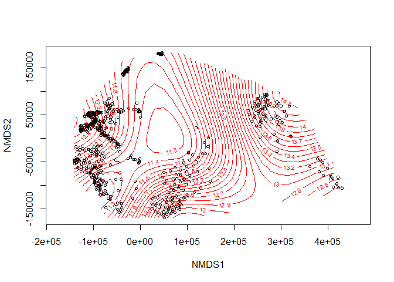

# **Análisis descriptivos**

## Importar base de datos ##


```r
datos <- read.csv("datos.csv", header = T, dec = ".", sep = ",")
```

<div style="border: 1px solid #ddd; padding: 0px; overflow-y: scroll; height:300px; overflow-x: scroll; width:900px; "><table class="table table-striped table-hover table-condensed" style="width: auto !important; margin-left: auto; margin-right: auto;">
 <thead>
  <tr>
   <th style="text-align:center;position: sticky; top:0; background-color: #FFFFFF;"> Estacion_Id </th>
   <th style="text-align:center;position: sticky; top:0; background-color: #FFFFFF;"> Pfb_Fecha </th>
   <th style="text-align:center;position: sticky; top:0; background-color: #FFFFFF;"> Lod_Latitud_F5 </th>
   <th style="text-align:center;position: sticky; top:0; background-color: #FFFFFF;"> Lod_Longitud_F5 </th>
   <th style="text-align:center;position: sticky; top:0; background-color: #FFFFFF;"> Lod_Cota </th>
   <th style="text-align:center;position: sticky; top:0; background-color: #FFFFFF;"> Conductividad </th>
   <th style="text-align:center;position: sticky; top:0; background-color: #FFFFFF;"> X18O </th>
   <th style="text-align:center;position: sticky; top:0; background-color: #FFFFFF;"> X2H </th>
   <th style="text-align:center;position: sticky; top:0; background-color: #FFFFFF;"> d.excess </th>
  </tr>
 </thead>
<tbody>
  <tr>
   <td style="text-align:center;"> G001 </td>
   <td style="text-align:center;"> 01-sep-05 </td>
   <td style="text-align:center;"> 5782169 </td>
   <td style="text-align:center;"> 5609931 </td>
   <td style="text-align:center;"> 90.878379 </td>
   <td style="text-align:center;"> 877.00 </td>
   <td style="text-align:center;"> -5.40 </td>
   <td style="text-align:center;"> -36.00 </td>
   <td style="text-align:center;"> 7.20 </td>
  </tr>
  <tr>
   <td style="text-align:center;"> G008 </td>
   <td style="text-align:center;"> 22-feb-10 </td>
   <td style="text-align:center;"> 5769784 </td>
   <td style="text-align:center;"> 5581365 </td>
   <td style="text-align:center;"> 96.326945 </td>
   <td style="text-align:center;"> 1027.00 </td>
   <td style="text-align:center;"> -5.47 </td>
   <td style="text-align:center;"> -30.39 </td>
   <td style="text-align:center;"> 13.36 </td>
  </tr>
  <tr>
   <td style="text-align:center;"> G009 </td>
   <td style="text-align:center;"> 23-feb-10 </td>
   <td style="text-align:center;"> 5804182 </td>
   <td style="text-align:center;"> 5595763 </td>
   <td style="text-align:center;"> 160.647698 </td>
   <td style="text-align:center;"> NA </td>
   <td style="text-align:center;"> -5.00 </td>
   <td style="text-align:center;"> -28.64 </td>
   <td style="text-align:center;"> 11.35 </td>
  </tr>
  <tr>
   <td style="text-align:center;"> G010 </td>
   <td style="text-align:center;"> 22-feb-10 </td>
   <td style="text-align:center;"> 5773260 </td>
   <td style="text-align:center;"> 5584640 </td>
   <td style="text-align:center;"> 91.855299 </td>
   <td style="text-align:center;"> 1179.00 </td>
   <td style="text-align:center;"> -5.38 </td>
   <td style="text-align:center;"> -28.45 </td>
   <td style="text-align:center;"> 14.61 </td>
  </tr>
  <tr>
   <td style="text-align:center;"> G014 </td>
   <td style="text-align:center;"> 15-dic-11 </td>
   <td style="text-align:center;"> 5753988 </td>
   <td style="text-align:center;"> 5613800 </td>
   <td style="text-align:center;"> 42.308251 </td>
   <td style="text-align:center;"> 1175.00 </td>
   <td style="text-align:center;"> -5.34 </td>
   <td style="text-align:center;"> -28.33 </td>
   <td style="text-align:center;"> 14.38 </td>
  </tr>
  <tr>
   <td style="text-align:center;"> G020 </td>
   <td style="text-align:center;"> 16-dic-11 </td>
   <td style="text-align:center;"> 5774059 </td>
   <td style="text-align:center;"> 5570203 </td>
   <td style="text-align:center;"> 97.699233 </td>
   <td style="text-align:center;"> 3150.00 </td>
   <td style="text-align:center;"> -5.15 </td>
   <td style="text-align:center;"> -28.65 </td>
   <td style="text-align:center;"> 12.51 </td>
  </tr>
  <tr>
   <td style="text-align:center;"> G020 </td>
   <td style="text-align:center;"> 23-feb-05 </td>
   <td style="text-align:center;"> 5774059 </td>
   <td style="text-align:center;"> 5570203 </td>
   <td style="text-align:center;"> 97.699233 </td>
   <td style="text-align:center;"> 2710.00 </td>
   <td style="text-align:center;"> -5.00 </td>
   <td style="text-align:center;"> -37.00 </td>
   <td style="text-align:center;"> 3.00 </td>
  </tr>
  <tr>
   <td style="text-align:center;"> G020 </td>
   <td style="text-align:center;"> 28-sep-06 </td>
   <td style="text-align:center;"> 5774059 </td>
   <td style="text-align:center;"> 5570203 </td>
   <td style="text-align:center;"> 97.699233 </td>
   <td style="text-align:center;"> 2001.00 </td>
   <td style="text-align:center;"> -5.00 </td>
   <td style="text-align:center;"> -34.00 </td>
   <td style="text-align:center;"> 6.00 </td>
  </tr>
  <tr>
   <td style="text-align:center;"> G020 </td>
   <td style="text-align:center;"> 28-ene-08 </td>
   <td style="text-align:center;"> 5774059 </td>
   <td style="text-align:center;"> 5570203 </td>
   <td style="text-align:center;"> 97.699233 </td>
   <td style="text-align:center;"> 2792.00 </td>
   <td style="text-align:center;"> -4.80 </td>
   <td style="text-align:center;"> -30.80 </td>
   <td style="text-align:center;"> 7.60 </td>
  </tr>
  <tr>
   <td style="text-align:center;"> G020 </td>
   <td style="text-align:center;"> 18-nov-10 </td>
   <td style="text-align:center;"> 5774059 </td>
   <td style="text-align:center;"> 5570203 </td>
   <td style="text-align:center;"> 97.699233 </td>
   <td style="text-align:center;"> NA </td>
   <td style="text-align:center;"> -4.79 </td>
   <td style="text-align:center;"> -28.66 </td>
   <td style="text-align:center;"> 9.63 </td>
  </tr>
  <tr>
   <td style="text-align:center;"> G020 </td>
   <td style="text-align:center;"> 07-jun-06 </td>
   <td style="text-align:center;"> 5774059 </td>
   <td style="text-align:center;"> 5570203 </td>
   <td style="text-align:center;"> 97.699233 </td>
   <td style="text-align:center;"> 3040.00 </td>
   <td style="text-align:center;"> -4.70 </td>
   <td style="text-align:center;"> -32.00 </td>
   <td style="text-align:center;"> 5.60 </td>
  </tr>
  <tr>
   <td style="text-align:center;"> G020 </td>
   <td style="text-align:center;"> 04-ago-05 </td>
   <td style="text-align:center;"> 5774059 </td>
   <td style="text-align:center;"> 5570203 </td>
   <td style="text-align:center;"> 97.699233 </td>
   <td style="text-align:center;"> 2120.00 </td>
   <td style="text-align:center;"> -4.50 </td>
   <td style="text-align:center;"> -34.00 </td>
   <td style="text-align:center;"> 2.00 </td>
  </tr>
  <tr>
   <td style="text-align:center;"> G020 </td>
   <td style="text-align:center;"> 05-ago-05 </td>
   <td style="text-align:center;"> 5774059 </td>
   <td style="text-align:center;"> 5570203 </td>
   <td style="text-align:center;"> 97.699233 </td>
   <td style="text-align:center;"> NA </td>
   <td style="text-align:center;"> -4.50 </td>
   <td style="text-align:center;"> -34.00 </td>
   <td style="text-align:center;"> 2.00 </td>
  </tr>
  <tr>
   <td style="text-align:center;"> G023 </td>
   <td style="text-align:center;"> 29-oct-09 </td>
   <td style="text-align:center;"> 5761234 </td>
   <td style="text-align:center;"> 5580677 </td>
   <td style="text-align:center;"> 92.647650 </td>
   <td style="text-align:center;"> NA </td>
   <td style="text-align:center;"> -5.16 </td>
   <td style="text-align:center;"> -27.93 </td>
   <td style="text-align:center;"> 13.37 </td>
  </tr>
  <tr>
   <td style="text-align:center;"> G026 </td>
   <td style="text-align:center;"> 17-ago-06 </td>
   <td style="text-align:center;"> 5741497 </td>
   <td style="text-align:center;"> 5603169 </td>
   <td style="text-align:center;"> 30.014739 </td>
   <td style="text-align:center;"> 780.00 </td>
   <td style="text-align:center;"> -5.30 </td>
   <td style="text-align:center;"> -30.00 </td>
   <td style="text-align:center;"> 12.40 </td>
  </tr>
  <tr>
   <td style="text-align:center;"> G026 </td>
   <td style="text-align:center;"> 23-feb-05 </td>
   <td style="text-align:center;"> 5741497 </td>
   <td style="text-align:center;"> 5603169 </td>
   <td style="text-align:center;"> 30.014739 </td>
   <td style="text-align:center;"> 789.00 </td>
   <td style="text-align:center;"> -5.10 </td>
   <td style="text-align:center;"> -35.00 </td>
   <td style="text-align:center;"> 5.80 </td>
  </tr>
  <tr>
   <td style="text-align:center;"> G026 </td>
   <td style="text-align:center;"> 23-mar-06 </td>
   <td style="text-align:center;"> 5741497 </td>
   <td style="text-align:center;"> 5603169 </td>
   <td style="text-align:center;"> 30.014739 </td>
   <td style="text-align:center;"> 775.00 </td>
   <td style="text-align:center;"> -5.10 </td>
   <td style="text-align:center;"> -32.00 </td>
   <td style="text-align:center;"> 8.80 </td>
  </tr>
  <tr>
   <td style="text-align:center;"> G026 </td>
   <td style="text-align:center;"> 04-ago-05 </td>
   <td style="text-align:center;"> 5741497 </td>
   <td style="text-align:center;"> 5603169 </td>
   <td style="text-align:center;"> 30.014739 </td>
   <td style="text-align:center;"> 747.00 </td>
   <td style="text-align:center;"> -4.80 </td>
   <td style="text-align:center;"> -36.00 </td>
   <td style="text-align:center;"> 2.40 </td>
  </tr>
  <tr>
   <td style="text-align:center;"> G044 </td>
   <td style="text-align:center;"> 23-feb-05 </td>
   <td style="text-align:center;"> 5804904 </td>
   <td style="text-align:center;"> 5539172 </td>
   <td style="text-align:center;"> 168.153877 </td>
   <td style="text-align:center;"> NA </td>
   <td style="text-align:center;"> -5.40 </td>
   <td style="text-align:center;"> -38.00 </td>
   <td style="text-align:center;"> 5.20 </td>
  </tr>
  <tr>
   <td style="text-align:center;"> G044 </td>
   <td style="text-align:center;"> 25-feb-05 </td>
   <td style="text-align:center;"> 5804904 </td>
   <td style="text-align:center;"> 5539172 </td>
   <td style="text-align:center;"> 168.153877 </td>
   <td style="text-align:center;"> 1255.00 </td>
   <td style="text-align:center;"> -5.40 </td>
   <td style="text-align:center;"> -38.00 </td>
   <td style="text-align:center;"> 5.20 </td>
  </tr>
  <tr>
   <td style="text-align:center;"> G044 </td>
   <td style="text-align:center;"> 04-ago-05 </td>
   <td style="text-align:center;"> 5804904 </td>
   <td style="text-align:center;"> 5539172 </td>
   <td style="text-align:center;"> 168.153877 </td>
   <td style="text-align:center;"> 1215.00 </td>
   <td style="text-align:center;"> -5.20 </td>
   <td style="text-align:center;"> -35.00 </td>
   <td style="text-align:center;"> 6.60 </td>
  </tr>
  <tr>
   <td style="text-align:center;"> G071 </td>
   <td style="text-align:center;"> 06-dic-05 </td>
   <td style="text-align:center;"> 5817610 </td>
   <td style="text-align:center;"> 5602689 </td>
   <td style="text-align:center;"> 175.512570 </td>
   <td style="text-align:center;"> 720.00 </td>
   <td style="text-align:center;"> -5.90 </td>
   <td style="text-align:center;"> -35.00 </td>
   <td style="text-align:center;"> 12.20 </td>
  </tr>
  <tr>
   <td style="text-align:center;"> G071 </td>
   <td style="text-align:center;"> 07-jun-06 </td>
   <td style="text-align:center;"> 5817610 </td>
   <td style="text-align:center;"> 5602689 </td>
   <td style="text-align:center;"> 175.512570 </td>
   <td style="text-align:center;"> 882.00 </td>
   <td style="text-align:center;"> -5.90 </td>
   <td style="text-align:center;"> -34.00 </td>
   <td style="text-align:center;"> 13.20 </td>
  </tr>
  <tr>
   <td style="text-align:center;"> G071 </td>
   <td style="text-align:center;"> 17-ago-06 </td>
   <td style="text-align:center;"> 5817610 </td>
   <td style="text-align:center;"> 5602689 </td>
   <td style="text-align:center;"> 175.512570 </td>
   <td style="text-align:center;"> 870.00 </td>
   <td style="text-align:center;"> -5.70 </td>
   <td style="text-align:center;"> -35.00 </td>
   <td style="text-align:center;"> 10.60 </td>
  </tr>
  <tr>
   <td style="text-align:center;"> G071 </td>
   <td style="text-align:center;"> 23-feb-05 </td>
   <td style="text-align:center;"> 5817610 </td>
   <td style="text-align:center;"> 5602689 </td>
   <td style="text-align:center;"> 175.512570 </td>
   <td style="text-align:center;"> NA </td>
   <td style="text-align:center;"> -5.40 </td>
   <td style="text-align:center;"> -36.00 </td>
   <td style="text-align:center;"> 7.20 </td>
  </tr>
  <tr>
   <td style="text-align:center;"> G071 </td>
   <td style="text-align:center;"> 25-feb-05 </td>
   <td style="text-align:center;"> 5817610 </td>
   <td style="text-align:center;"> 5602689 </td>
   <td style="text-align:center;"> 175.512570 </td>
   <td style="text-align:center;"> 753.00 </td>
   <td style="text-align:center;"> -5.40 </td>
   <td style="text-align:center;"> -36.00 </td>
   <td style="text-align:center;"> 7.20 </td>
  </tr>
  <tr>
   <td style="text-align:center;"> G071 </td>
   <td style="text-align:center;"> 01-sep-05 </td>
   <td style="text-align:center;"> 5817610 </td>
   <td style="text-align:center;"> 5602689 </td>
   <td style="text-align:center;"> 175.512570 </td>
   <td style="text-align:center;"> 778.00 </td>
   <td style="text-align:center;"> -5.30 </td>
   <td style="text-align:center;"> -36.00 </td>
   <td style="text-align:center;"> 6.40 </td>
  </tr>
  <tr>
   <td style="text-align:center;"> G072 </td>
   <td style="text-align:center;"> 25-feb-10 </td>
   <td style="text-align:center;"> 5768073 </td>
   <td style="text-align:center;"> 5576701 </td>
   <td style="text-align:center;"> 78.330276 </td>
   <td style="text-align:center;"> 975.00 </td>
   <td style="text-align:center;"> -5.65 </td>
   <td style="text-align:center;"> -31.30 </td>
   <td style="text-align:center;"> 13.88 </td>
  </tr>
  <tr>
   <td style="text-align:center;"> G072 </td>
   <td style="text-align:center;"> 14-abr-05 </td>
   <td style="text-align:center;"> 5768073 </td>
   <td style="text-align:center;"> 5576701 </td>
   <td style="text-align:center;"> 78.330276 </td>
   <td style="text-align:center;"> 791.00 </td>
   <td style="text-align:center;"> -5.50 </td>
   <td style="text-align:center;"> -37.00 </td>
   <td style="text-align:center;"> 7.00 </td>
  </tr>
  <tr>
   <td style="text-align:center;"> G072 </td>
   <td style="text-align:center;"> 25-ene-07 </td>
   <td style="text-align:center;"> 5768073 </td>
   <td style="text-align:center;"> 5576701 </td>
   <td style="text-align:center;"> 78.330276 </td>
   <td style="text-align:center;"> NA </td>
   <td style="text-align:center;"> -5.40 </td>
   <td style="text-align:center;"> -33.00 </td>
   <td style="text-align:center;"> 10.20 </td>
  </tr>
  <tr>
   <td style="text-align:center;"> G072 </td>
   <td style="text-align:center;"> 04-ago-05 </td>
   <td style="text-align:center;"> 5768073 </td>
   <td style="text-align:center;"> 5576701 </td>
   <td style="text-align:center;"> 78.330276 </td>
   <td style="text-align:center;"> 823.00 </td>
   <td style="text-align:center;"> -5.30 </td>
   <td style="text-align:center;"> -37.00 </td>
   <td style="text-align:center;"> 5.40 </td>
  </tr>
  <tr>
   <td style="text-align:center;"> G073 </td>
   <td style="text-align:center;"> 17-ago-06 </td>
   <td style="text-align:center;"> 5742922 </td>
   <td style="text-align:center;"> 5608201 </td>
   <td style="text-align:center;"> 16.318094 </td>
   <td style="text-align:center;"> 1180.00 </td>
   <td style="text-align:center;"> -5.70 </td>
   <td style="text-align:center;"> -35.00 </td>
   <td style="text-align:center;"> 10.60 </td>
  </tr>
  <tr>
   <td style="text-align:center;"> G073 </td>
   <td style="text-align:center;"> 22-mar-06 </td>
   <td style="text-align:center;"> 5742922 </td>
   <td style="text-align:center;"> 5608201 </td>
   <td style="text-align:center;"> 16.318094 </td>
   <td style="text-align:center;"> 980.00 </td>
   <td style="text-align:center;"> -5.40 </td>
   <td style="text-align:center;"> -33.00 </td>
   <td style="text-align:center;"> 10.20 </td>
  </tr>
  <tr>
   <td style="text-align:center;"> G073 </td>
   <td style="text-align:center;"> 14-sep-06 </td>
   <td style="text-align:center;"> 5742922 </td>
   <td style="text-align:center;"> 5608201 </td>
   <td style="text-align:center;"> 16.318094 </td>
   <td style="text-align:center;"> 1125.00 </td>
   <td style="text-align:center;"> -5.40 </td>
   <td style="text-align:center;"> -37.00 </td>
   <td style="text-align:center;"> 6.20 </td>
  </tr>
  <tr>
   <td style="text-align:center;"> G073 </td>
   <td style="text-align:center;"> 19-oct-06 </td>
   <td style="text-align:center;"> 5742922 </td>
   <td style="text-align:center;"> 5608201 </td>
   <td style="text-align:center;"> 16.318094 </td>
   <td style="text-align:center;"> 1290.00 </td>
   <td style="text-align:center;"> -5.30 </td>
   <td style="text-align:center;"> -33.00 </td>
   <td style="text-align:center;"> 9.40 </td>
  </tr>
  <tr>
   <td style="text-align:center;"> G073 </td>
   <td style="text-align:center;"> 29-oct-03 </td>
   <td style="text-align:center;"> 5742922 </td>
   <td style="text-align:center;"> 5608201 </td>
   <td style="text-align:center;"> 16.318094 </td>
   <td style="text-align:center;"> NA </td>
   <td style="text-align:center;"> -5.26 </td>
   <td style="text-align:center;"> -30.71 </td>
   <td style="text-align:center;"> 11.41 </td>
  </tr>
  <tr>
   <td style="text-align:center;"> G073 </td>
   <td style="text-align:center;"> 07-mar-07 </td>
   <td style="text-align:center;"> 5742922 </td>
   <td style="text-align:center;"> 5608201 </td>
   <td style="text-align:center;"> 16.318094 </td>
   <td style="text-align:center;"> 1282.00 </td>
   <td style="text-align:center;"> -5.20 </td>
   <td style="text-align:center;"> -30.00 </td>
   <td style="text-align:center;"> 11.60 </td>
  </tr>
  <tr>
   <td style="text-align:center;"> G073 </td>
   <td style="text-align:center;"> 03-jul-07 </td>
   <td style="text-align:center;"> 5742922 </td>
   <td style="text-align:center;"> 5608201 </td>
   <td style="text-align:center;"> 16.318094 </td>
   <td style="text-align:center;"> NA </td>
   <td style="text-align:center;"> -5.20 </td>
   <td style="text-align:center;"> -30.00 </td>
   <td style="text-align:center;"> 11.60 </td>
  </tr>
  <tr>
   <td style="text-align:center;"> G073 </td>
   <td style="text-align:center;"> 28-ene-08 </td>
   <td style="text-align:center;"> 5742922 </td>
   <td style="text-align:center;"> 5608201 </td>
   <td style="text-align:center;"> 16.318094 </td>
   <td style="text-align:center;"> 1342.00 </td>
   <td style="text-align:center;"> -5.19 </td>
   <td style="text-align:center;"> -30.43 </td>
   <td style="text-align:center;"> 11.12 </td>
  </tr>
  <tr>
   <td style="text-align:center;"> G073 </td>
   <td style="text-align:center;"> 25-ene-07 </td>
   <td style="text-align:center;"> 5742922 </td>
   <td style="text-align:center;"> 5608201 </td>
   <td style="text-align:center;"> 16.318094 </td>
   <td style="text-align:center;"> 1180.00 </td>
   <td style="text-align:center;"> -5.10 </td>
   <td style="text-align:center;"> -32.00 </td>
   <td style="text-align:center;"> 8.80 </td>
  </tr>
  <tr>
   <td style="text-align:center;"> G073 </td>
   <td style="text-align:center;"> 11-sep-06 </td>
   <td style="text-align:center;"> 5742922 </td>
   <td style="text-align:center;"> 5608201 </td>
   <td style="text-align:center;"> 16.318094 </td>
   <td style="text-align:center;"> NA </td>
   <td style="text-align:center;"> -5.00 </td>
   <td style="text-align:center;"> -33.00 </td>
   <td style="text-align:center;"> 7.00 </td>
  </tr>
  <tr>
   <td style="text-align:center;"> G073 </td>
   <td style="text-align:center;"> 09-nov-06 </td>
   <td style="text-align:center;"> 5742922 </td>
   <td style="text-align:center;"> 5608201 </td>
   <td style="text-align:center;"> 16.318094 </td>
   <td style="text-align:center;"> 1160.00 </td>
   <td style="text-align:center;"> -5.00 </td>
   <td style="text-align:center;"> -33.00 </td>
   <td style="text-align:center;"> 7.00 </td>
  </tr>
  <tr>
   <td style="text-align:center;"> G073 </td>
   <td style="text-align:center;"> 04-ago-05 </td>
   <td style="text-align:center;"> 5742922 </td>
   <td style="text-align:center;"> 5608201 </td>
   <td style="text-align:center;"> 16.318094 </td>
   <td style="text-align:center;"> 1117.00 </td>
   <td style="text-align:center;"> -4.90 </td>
   <td style="text-align:center;"> -34.00 </td>
   <td style="text-align:center;"> 5.20 </td>
  </tr>
  <tr>
   <td style="text-align:center;"> G074 </td>
   <td style="text-align:center;"> 14-abr-05 </td>
   <td style="text-align:center;"> 5817581 </td>
   <td style="text-align:center;"> 5560390 </td>
   <td style="text-align:center;"> 183.178958 </td>
   <td style="text-align:center;"> 724.00 </td>
   <td style="text-align:center;"> -5.40 </td>
   <td style="text-align:center;"> -35.00 </td>
   <td style="text-align:center;"> 8.20 </td>
  </tr>
  <tr>
   <td style="text-align:center;"> G074 </td>
   <td style="text-align:center;"> 04-ago-05 </td>
   <td style="text-align:center;"> 5817581 </td>
   <td style="text-align:center;"> 5560390 </td>
   <td style="text-align:center;"> 183.178958 </td>
   <td style="text-align:center;"> 721.00 </td>
   <td style="text-align:center;"> -5.20 </td>
   <td style="text-align:center;"> -36.00 </td>
   <td style="text-align:center;"> 5.60 </td>
  </tr>
  <tr>
   <td style="text-align:center;"> G075 </td>
   <td style="text-align:center;"> 04-ago-05 </td>
   <td style="text-align:center;"> 5807345 </td>
   <td style="text-align:center;"> 5562751 </td>
   <td style="text-align:center;"> 157.936906 </td>
   <td style="text-align:center;"> 952.00 </td>
   <td style="text-align:center;"> -5.30 </td>
   <td style="text-align:center;"> -36.00 </td>
   <td style="text-align:center;"> 6.40 </td>
  </tr>
  <tr>
   <td style="text-align:center;"> G075 </td>
   <td style="text-align:center;"> 05-ago-05 </td>
   <td style="text-align:center;"> 5807345 </td>
   <td style="text-align:center;"> 5562751 </td>
   <td style="text-align:center;"> 157.936906 </td>
   <td style="text-align:center;"> NA </td>
   <td style="text-align:center;"> -5.30 </td>
   <td style="text-align:center;"> -36.00 </td>
   <td style="text-align:center;"> 6.40 </td>
  </tr>
  <tr>
   <td style="text-align:center;"> G075 </td>
   <td style="text-align:center;"> 14-abr-05 </td>
   <td style="text-align:center;"> 5807345 </td>
   <td style="text-align:center;"> 5562751 </td>
   <td style="text-align:center;"> 157.936906 </td>
   <td style="text-align:center;"> 1115.00 </td>
   <td style="text-align:center;"> -5.20 </td>
   <td style="text-align:center;"> -38.00 </td>
   <td style="text-align:center;"> 3.60 </td>
  </tr>
  <tr>
   <td style="text-align:center;"> G076 </td>
   <td style="text-align:center;"> 28-oct-09 </td>
   <td style="text-align:center;"> 5781796 </td>
   <td style="text-align:center;"> 5599066 </td>
   <td style="text-align:center;"> 91.882056 </td>
   <td style="text-align:center;"> 1080.00 </td>
   <td style="text-align:center;"> -5.02 </td>
   <td style="text-align:center;"> -27.39 </td>
   <td style="text-align:center;"> 12.79 </td>
  </tr>
  <tr>
   <td style="text-align:center;"> G076 </td>
   <td style="text-align:center;"> 15-dic-11 </td>
   <td style="text-align:center;"> 5781796 </td>
   <td style="text-align:center;"> 5599066 </td>
   <td style="text-align:center;"> 91.882056 </td>
   <td style="text-align:center;"> 1091.00 </td>
   <td style="text-align:center;"> -4.91 </td>
   <td style="text-align:center;"> -27.09 </td>
   <td style="text-align:center;"> 12.16 </td>
  </tr>
  <tr>
   <td style="text-align:center;"> G077 </td>
   <td style="text-align:center;"> 28-oct-09 </td>
   <td style="text-align:center;"> 5782184 </td>
   <td style="text-align:center;"> 5589553 </td>
   <td style="text-align:center;"> 100.500863 </td>
   <td style="text-align:center;"> 865.00 </td>
   <td style="text-align:center;"> -5.47 </td>
   <td style="text-align:center;"> -29.27 </td>
   <td style="text-align:center;"> 14.52 </td>
  </tr>
  <tr>
   <td style="text-align:center;"> G077 </td>
   <td style="text-align:center;"> 19-may-09 </td>
   <td style="text-align:center;"> 5782184 </td>
   <td style="text-align:center;"> 5589553 </td>
   <td style="text-align:center;"> 100.500863 </td>
   <td style="text-align:center;"> NA </td>
   <td style="text-align:center;"> -5.08 </td>
   <td style="text-align:center;"> -28.83 </td>
   <td style="text-align:center;"> 11.85 </td>
  </tr>
  <tr>
   <td style="text-align:center;"> G078 </td>
   <td style="text-align:center;"> 28-oct-09 </td>
   <td style="text-align:center;"> 5780216 </td>
   <td style="text-align:center;"> 5586455 </td>
   <td style="text-align:center;"> 99.108377 </td>
   <td style="text-align:center;"> 917.00 </td>
   <td style="text-align:center;"> -5.16 </td>
   <td style="text-align:center;"> -28.11 </td>
   <td style="text-align:center;"> 13.18 </td>
  </tr>
  <tr>
   <td style="text-align:center;"> G079 </td>
   <td style="text-align:center;"> 28-oct-09 </td>
   <td style="text-align:center;"> 5783847 </td>
   <td style="text-align:center;"> 5583371 </td>
   <td style="text-align:center;"> 109.323693 </td>
   <td style="text-align:center;"> 719.00 </td>
   <td style="text-align:center;"> -5.07 </td>
   <td style="text-align:center;"> -29.50 </td>
   <td style="text-align:center;"> 11.09 </td>
  </tr>
  <tr>
   <td style="text-align:center;"> G080 </td>
   <td style="text-align:center;"> 29-oct-09 </td>
   <td style="text-align:center;"> 5770370 </td>
   <td style="text-align:center;"> 5560138 </td>
   <td style="text-align:center;"> 124.753100 </td>
   <td style="text-align:center;"> 682.00 </td>
   <td style="text-align:center;"> -5.31 </td>
   <td style="text-align:center;"> -30.14 </td>
   <td style="text-align:center;"> 12.37 </td>
  </tr>
  <tr>
   <td style="text-align:center;"> G081 </td>
   <td style="text-align:center;"> 29-oct-09 </td>
   <td style="text-align:center;"> 5771208 </td>
   <td style="text-align:center;"> 5560261 </td>
   <td style="text-align:center;"> 121.881944 </td>
   <td style="text-align:center;"> 838.00 </td>
   <td style="text-align:center;"> -6.06 </td>
   <td style="text-align:center;"> -33.93 </td>
   <td style="text-align:center;"> 14.54 </td>
  </tr>
  <tr>
   <td style="text-align:center;"> G083 </td>
   <td style="text-align:center;"> 29-oct-09 </td>
   <td style="text-align:center;"> 5780559 </td>
   <td style="text-align:center;"> 5568561 </td>
   <td style="text-align:center;"> 115.417679 </td>
   <td style="text-align:center;"> 1041.00 </td>
   <td style="text-align:center;"> -5.26 </td>
   <td style="text-align:center;"> -32.40 </td>
   <td style="text-align:center;"> 9.66 </td>
  </tr>
  <tr>
   <td style="text-align:center;"> G084 </td>
   <td style="text-align:center;"> 16-dic-11 </td>
   <td style="text-align:center;"> 5757531 </td>
   <td style="text-align:center;"> 5589371 </td>
   <td style="text-align:center;"> 65.000000 </td>
   <td style="text-align:center;"> 923.00 </td>
   <td style="text-align:center;"> -5.07 </td>
   <td style="text-align:center;"> -28.83 </td>
   <td style="text-align:center;"> 11.70 </td>
  </tr>
  <tr>
   <td style="text-align:center;"> G084 </td>
   <td style="text-align:center;"> 29-oct-09 </td>
   <td style="text-align:center;"> 5757531 </td>
   <td style="text-align:center;"> 5589371 </td>
   <td style="text-align:center;"> 65.000000 </td>
   <td style="text-align:center;"> 891.00 </td>
   <td style="text-align:center;"> -4.57 </td>
   <td style="text-align:center;"> -26.32 </td>
   <td style="text-align:center;"> 10.25 </td>
  </tr>
  <tr>
   <td style="text-align:center;"> G085 </td>
   <td style="text-align:center;"> 29-oct-09 </td>
   <td style="text-align:center;"> 5758607 </td>
   <td style="text-align:center;"> 5590450 </td>
   <td style="text-align:center;"> 85.302787 </td>
   <td style="text-align:center;"> 793.00 </td>
   <td style="text-align:center;"> -4.81 </td>
   <td style="text-align:center;"> -30.16 </td>
   <td style="text-align:center;"> 8.33 </td>
  </tr>
  <tr>
   <td style="text-align:center;"> G087 </td>
   <td style="text-align:center;"> 29-oct-09 </td>
   <td style="text-align:center;"> 5759050 </td>
   <td style="text-align:center;"> 5592479 </td>
   <td style="text-align:center;"> 79.627400 </td>
   <td style="text-align:center;"> 859.00 </td>
   <td style="text-align:center;"> -5.42 </td>
   <td style="text-align:center;"> -31.43 </td>
   <td style="text-align:center;"> 11.95 </td>
  </tr>
  <tr>
   <td style="text-align:center;"> G088 </td>
   <td style="text-align:center;"> 23-feb-10 </td>
   <td style="text-align:center;"> 5777219 </td>
   <td style="text-align:center;"> 5593988 </td>
   <td style="text-align:center;"> 88.663037 </td>
   <td style="text-align:center;"> NA </td>
   <td style="text-align:center;"> -4.90 </td>
   <td style="text-align:center;"> -28.42 </td>
   <td style="text-align:center;"> 10.77 </td>
  </tr>
  <tr>
   <td style="text-align:center;"> G089 </td>
   <td style="text-align:center;"> 23-feb-10 </td>
   <td style="text-align:center;"> 5737070 </td>
   <td style="text-align:center;"> 5607335 </td>
   <td style="text-align:center;"> 21.084198 </td>
   <td style="text-align:center;"> 1112.00 </td>
   <td style="text-align:center;"> -5.32 </td>
   <td style="text-align:center;"> -29.56 </td>
   <td style="text-align:center;"> 12.97 </td>
  </tr>
  <tr>
   <td style="text-align:center;"> G090 </td>
   <td style="text-align:center;"> 23-feb-10 </td>
   <td style="text-align:center;"> 5773370 </td>
   <td style="text-align:center;"> 5603371 </td>
   <td style="text-align:center;"> 77.599437 </td>
   <td style="text-align:center;"> 969.00 </td>
   <td style="text-align:center;"> -5.29 </td>
   <td style="text-align:center;"> -29.19 </td>
   <td style="text-align:center;"> 13.11 </td>
  </tr>
  <tr>
   <td style="text-align:center;"> G092 </td>
   <td style="text-align:center;"> 23-feb-10 </td>
   <td style="text-align:center;"> 5770912 </td>
   <td style="text-align:center;"> 5603617 </td>
   <td style="text-align:center;"> 73.799541 </td>
   <td style="text-align:center;"> 993.00 </td>
   <td style="text-align:center;"> -4.84 </td>
   <td style="text-align:center;"> -27.73 </td>
   <td style="text-align:center;"> 11.02 </td>
  </tr>
  <tr>
   <td style="text-align:center;"> G093 </td>
   <td style="text-align:center;"> 15-dic-11 </td>
   <td style="text-align:center;"> 5773117 </td>
   <td style="text-align:center;"> 5598909 </td>
   <td style="text-align:center;"> 80.827827 </td>
   <td style="text-align:center;"> 946.00 </td>
   <td style="text-align:center;"> -5.36 </td>
   <td style="text-align:center;"> -26.91 </td>
   <td style="text-align:center;"> 15.93 </td>
  </tr>
  <tr>
   <td style="text-align:center;"> G093 </td>
   <td style="text-align:center;"> 24-feb-10 </td>
   <td style="text-align:center;"> 5773117 </td>
   <td style="text-align:center;"> 5598909 </td>
   <td style="text-align:center;"> 80.827827 </td>
   <td style="text-align:center;"> 940.00 </td>
   <td style="text-align:center;"> -5.21 </td>
   <td style="text-align:center;"> -28.50 </td>
   <td style="text-align:center;"> 13.20 </td>
  </tr>
  <tr>
   <td style="text-align:center;"> G094 </td>
   <td style="text-align:center;"> 27-feb-10 </td>
   <td style="text-align:center;"> 5771428 </td>
   <td style="text-align:center;"> 5600589 </td>
   <td style="text-align:center;"> 79.026422 </td>
   <td style="text-align:center;"> NA </td>
   <td style="text-align:center;"> -5.19 </td>
   <td style="text-align:center;"> -29.24 </td>
   <td style="text-align:center;"> 12.28 </td>
  </tr>
  <tr>
   <td style="text-align:center;"> G095 </td>
   <td style="text-align:center;"> 24-feb-10 </td>
   <td style="text-align:center;"> 5768883 </td>
   <td style="text-align:center;"> 5600370 </td>
   <td style="text-align:center;"> 72.462182 </td>
   <td style="text-align:center;"> 1181.00 </td>
   <td style="text-align:center;"> -5.32 </td>
   <td style="text-align:center;"> -30.56 </td>
   <td style="text-align:center;"> 12.04 </td>
  </tr>
  <tr>
   <td style="text-align:center;"> G096 </td>
   <td style="text-align:center;"> 24-feb-10 </td>
   <td style="text-align:center;"> 5764550 </td>
   <td style="text-align:center;"> 5599152 </td>
   <td style="text-align:center;"> 69.792967 </td>
   <td style="text-align:center;"> 736.00 </td>
   <td style="text-align:center;"> -5.66 </td>
   <td style="text-align:center;"> -30.77 </td>
   <td style="text-align:center;"> 14.49 </td>
  </tr>
  <tr>
   <td style="text-align:center;"> G097 </td>
   <td style="text-align:center;"> 24-feb-10 </td>
   <td style="text-align:center;"> 5763874 </td>
   <td style="text-align:center;"> 5597629 </td>
   <td style="text-align:center;"> 64.262812 </td>
   <td style="text-align:center;"> 870.00 </td>
   <td style="text-align:center;"> -5.71 </td>
   <td style="text-align:center;"> -31.17 </td>
   <td style="text-align:center;"> 14.48 </td>
  </tr>
  <tr>
   <td style="text-align:center;"> G098 </td>
   <td style="text-align:center;"> 24-feb-10 </td>
   <td style="text-align:center;"> 5768203 </td>
   <td style="text-align:center;"> 5604393 </td>
   <td style="text-align:center;"> 64.824975 </td>
   <td style="text-align:center;"> 1014.00 </td>
   <td style="text-align:center;"> -4.30 </td>
   <td style="text-align:center;"> -23.41 </td>
   <td style="text-align:center;"> 11.02 </td>
  </tr>
  <tr>
   <td style="text-align:center;"> G099 </td>
   <td style="text-align:center;"> 24-feb-10 </td>
   <td style="text-align:center;"> 5759022 </td>
   <td style="text-align:center;"> 5603944 </td>
   <td style="text-align:center;"> 55.000000 </td>
   <td style="text-align:center;"> 1059.00 </td>
   <td style="text-align:center;"> -5.14 </td>
   <td style="text-align:center;"> -29.04 </td>
   <td style="text-align:center;"> 12.06 </td>
  </tr>
  <tr>
   <td style="text-align:center;"> G100 </td>
   <td style="text-align:center;"> 08-mar-11 </td>
   <td style="text-align:center;"> 5774038 </td>
   <td style="text-align:center;"> 5596980 </td>
   <td style="text-align:center;"> 82.377072 </td>
   <td style="text-align:center;"> NA </td>
   <td style="text-align:center;"> -5.10 </td>
   <td style="text-align:center;"> -29.07 </td>
   <td style="text-align:center;"> 11.70 </td>
  </tr>
  <tr>
   <td style="text-align:center;"> G101 </td>
   <td style="text-align:center;"> 29-abr-05 </td>
   <td style="text-align:center;"> 5733439 </td>
   <td style="text-align:center;"> 5622970 </td>
   <td style="text-align:center;"> 33.735039 </td>
   <td style="text-align:center;"> 572.00 </td>
   <td style="text-align:center;"> -5.00 </td>
   <td style="text-align:center;"> -35.00 </td>
   <td style="text-align:center;"> 5.00 </td>
  </tr>
  <tr>
   <td style="text-align:center;"> G101 </td>
   <td style="text-align:center;"> 01-may-10 </td>
   <td style="text-align:center;"> 5733439 </td>
   <td style="text-align:center;"> 5622970 </td>
   <td style="text-align:center;"> 33.735039 </td>
   <td style="text-align:center;"> NA </td>
   <td style="text-align:center;"> -4.36 </td>
   <td style="text-align:center;"> -26.88 </td>
   <td style="text-align:center;"> 8.00 </td>
  </tr>
  <tr>
   <td style="text-align:center;"> G102 </td>
   <td style="text-align:center;"> 01-sep-05 </td>
   <td style="text-align:center;"> 5789350 </td>
   <td style="text-align:center;"> 5610414 </td>
   <td style="text-align:center;"> 101.993277 </td>
   <td style="text-align:center;"> 1025.00 </td>
   <td style="text-align:center;"> -4.80 </td>
   <td style="text-align:center;"> -33.00 </td>
   <td style="text-align:center;"> 5.40 </td>
  </tr>
  <tr>
   <td style="text-align:center;"> G102 </td>
   <td style="text-align:center;"> 01-may-10 </td>
   <td style="text-align:center;"> 5789350 </td>
   <td style="text-align:center;"> 5610414 </td>
   <td style="text-align:center;"> 101.993277 </td>
   <td style="text-align:center;"> NA </td>
   <td style="text-align:center;"> -4.23 </td>
   <td style="text-align:center;"> -25.44 </td>
   <td style="text-align:center;"> 8.39 </td>
  </tr>
  <tr>
   <td style="text-align:center;"> G103 </td>
   <td style="text-align:center;"> 08-mar-11 </td>
   <td style="text-align:center;"> 5777070 </td>
   <td style="text-align:center;"> 5610956 </td>
   <td style="text-align:center;"> 81.378564 </td>
   <td style="text-align:center;"> NA </td>
   <td style="text-align:center;"> -5.50 </td>
   <td style="text-align:center;"> -28.93 </td>
   <td style="text-align:center;"> 15.09 </td>
  </tr>
  <tr>
   <td style="text-align:center;"> G104 </td>
   <td style="text-align:center;"> 11-abr-12 </td>
   <td style="text-align:center;"> 5777073 </td>
   <td style="text-align:center;"> 5610963 </td>
   <td style="text-align:center;"> 81.299756 </td>
   <td style="text-align:center;"> NA </td>
   <td style="text-align:center;"> -5.58 </td>
   <td style="text-align:center;"> -29.95 </td>
   <td style="text-align:center;"> 14.65 </td>
  </tr>
  <tr>
   <td style="text-align:center;"> G1101 </td>
   <td style="text-align:center;"> 21-oct-17 </td>
   <td style="text-align:center;"> 5752521 </td>
   <td style="text-align:center;"> 5650167 </td>
   <td style="text-align:center;"> 25.159829 </td>
   <td style="text-align:center;"> NA </td>
   <td style="text-align:center;"> -5.76 </td>
   <td style="text-align:center;"> -33.20 </td>
   <td style="text-align:center;"> 12.88 </td>
  </tr>
  <tr>
   <td style="text-align:center;"> G1102 </td>
   <td style="text-align:center;"> 12-may-16 </td>
   <td style="text-align:center;"> 5749836 </td>
   <td style="text-align:center;"> 5653164 </td>
   <td style="text-align:center;"> 22.927335 </td>
   <td style="text-align:center;"> 1260.00 </td>
   <td style="text-align:center;"> 3.05 </td>
   <td style="text-align:center;"> -10.50 </td>
   <td style="text-align:center;"> -34.90 </td>
  </tr>
  <tr>
   <td style="text-align:center;"> G1104 </td>
   <td style="text-align:center;"> 12-may-16 </td>
   <td style="text-align:center;"> 5744488 </td>
   <td style="text-align:center;"> 5653121 </td>
   <td style="text-align:center;"> 15.461759 </td>
   <td style="text-align:center;"> 1215.00 </td>
   <td style="text-align:center;"> -4.98 </td>
   <td style="text-align:center;"> -29.50 </td>
   <td style="text-align:center;"> 10.34 </td>
  </tr>
  <tr>
   <td style="text-align:center;"> G1108 </td>
   <td style="text-align:center;"> 13-may-16 </td>
   <td style="text-align:center;"> 5781187 </td>
   <td style="text-align:center;"> 5690100 </td>
   <td style="text-align:center;"> 70.086223 </td>
   <td style="text-align:center;"> 868.00 </td>
   <td style="text-align:center;"> -5.96 </td>
   <td style="text-align:center;"> -34.10 </td>
   <td style="text-align:center;"> 13.58 </td>
  </tr>
  <tr>
   <td style="text-align:center;"> G1112 </td>
   <td style="text-align:center;"> 24-ago-18 </td>
   <td style="text-align:center;"> 5772919 </td>
   <td style="text-align:center;"> 5691804 </td>
   <td style="text-align:center;"> 32.707619 </td>
   <td style="text-align:center;"> 880.00 </td>
   <td style="text-align:center;"> -5.67 </td>
   <td style="text-align:center;"> -31.90 </td>
   <td style="text-align:center;"> 13.46 </td>
  </tr>
  <tr>
   <td style="text-align:center;"> G1112 </td>
   <td style="text-align:center;"> 07-mar-18 </td>
   <td style="text-align:center;"> 5772919 </td>
   <td style="text-align:center;"> 5691804 </td>
   <td style="text-align:center;"> 32.707619 </td>
   <td style="text-align:center;"> 1120.00 </td>
   <td style="text-align:center;"> -5.53 </td>
   <td style="text-align:center;"> -32.10 </td>
   <td style="text-align:center;"> 12.14 </td>
  </tr>
  <tr>
   <td style="text-align:center;"> G1112 </td>
   <td style="text-align:center;"> 18-may-18 </td>
   <td style="text-align:center;"> 5772919 </td>
   <td style="text-align:center;"> 5691804 </td>
   <td style="text-align:center;"> 32.707619 </td>
   <td style="text-align:center;"> 1172.00 </td>
   <td style="text-align:center;"> -5.30 </td>
   <td style="text-align:center;"> -32.10 </td>
   <td style="text-align:center;"> 10.30 </td>
  </tr>
  <tr>
   <td style="text-align:center;"> G1112 </td>
   <td style="text-align:center;"> 13-dic-18 </td>
   <td style="text-align:center;"> 5772919 </td>
   <td style="text-align:center;"> 5691804 </td>
   <td style="text-align:center;"> 32.707619 </td>
   <td style="text-align:center;"> 1187.00 </td>
   <td style="text-align:center;"> -5.15 </td>
   <td style="text-align:center;"> -30.80 </td>
   <td style="text-align:center;"> 10.40 </td>
  </tr>
  <tr>
   <td style="text-align:center;"> G1112 </td>
   <td style="text-align:center;"> 13-may-16 </td>
   <td style="text-align:center;"> 5772919 </td>
   <td style="text-align:center;"> 5691804 </td>
   <td style="text-align:center;"> 32.707619 </td>
   <td style="text-align:center;"> 1055.00 </td>
   <td style="text-align:center;"> -5.09 </td>
   <td style="text-align:center;"> -31.30 </td>
   <td style="text-align:center;"> 9.42 </td>
  </tr>
  <tr>
   <td style="text-align:center;"> G1113 </td>
   <td style="text-align:center;"> 13-may-16 </td>
   <td style="text-align:center;"> 5778584 </td>
   <td style="text-align:center;"> 5692091 </td>
   <td style="text-align:center;"> 42.380976 </td>
   <td style="text-align:center;"> 869.00 </td>
   <td style="text-align:center;"> -5.60 </td>
   <td style="text-align:center;"> -31.50 </td>
   <td style="text-align:center;"> 13.30 </td>
  </tr>
  <tr>
   <td style="text-align:center;"> G1114 </td>
   <td style="text-align:center;"> 13-may-16 </td>
   <td style="text-align:center;"> 5778836 </td>
   <td style="text-align:center;"> 5692862 </td>
   <td style="text-align:center;"> 42.771594 </td>
   <td style="text-align:center;"> 908.00 </td>
   <td style="text-align:center;"> -5.90 </td>
   <td style="text-align:center;"> -33.10 </td>
   <td style="text-align:center;"> 14.10 </td>
  </tr>
  <tr>
   <td style="text-align:center;"> G1115 </td>
   <td style="text-align:center;"> 17-may-16 </td>
   <td style="text-align:center;"> 5781363 </td>
   <td style="text-align:center;"> 5632582 </td>
   <td style="text-align:center;"> 83.366046 </td>
   <td style="text-align:center;"> 1204.00 </td>
   <td style="text-align:center;"> -5.65 </td>
   <td style="text-align:center;"> -33.70 </td>
   <td style="text-align:center;"> 11.50 </td>
  </tr>
  <tr>
   <td style="text-align:center;"> G1116 </td>
   <td style="text-align:center;"> 07-mar-18 </td>
   <td style="text-align:center;"> 5781645 </td>
   <td style="text-align:center;"> 5631356 </td>
   <td style="text-align:center;"> 84.000000 </td>
   <td style="text-align:center;"> NA </td>
   <td style="text-align:center;"> -6.00 </td>
   <td style="text-align:center;"> -34.40 </td>
   <td style="text-align:center;"> 13.60 </td>
  </tr>
  <tr>
   <td style="text-align:center;"> G1116 </td>
   <td style="text-align:center;"> 17-may-16 </td>
   <td style="text-align:center;"> 5781645 </td>
   <td style="text-align:center;"> 5631356 </td>
   <td style="text-align:center;"> 84.000000 </td>
   <td style="text-align:center;"> 1269.00 </td>
   <td style="text-align:center;"> -5.21 </td>
   <td style="text-align:center;"> -32.40 </td>
   <td style="text-align:center;"> 9.28 </td>
  </tr>
  <tr>
   <td style="text-align:center;"> G1117 </td>
   <td style="text-align:center;"> 17-may-16 </td>
   <td style="text-align:center;"> 5782792 </td>
   <td style="text-align:center;"> 5630034 </td>
   <td style="text-align:center;"> 85.509124 </td>
   <td style="text-align:center;"> 1205.00 </td>
   <td style="text-align:center;"> -5.52 </td>
   <td style="text-align:center;"> -33.20 </td>
   <td style="text-align:center;"> 10.96 </td>
  </tr>
  <tr>
   <td style="text-align:center;"> G1118 </td>
   <td style="text-align:center;"> 17-may-16 </td>
   <td style="text-align:center;"> 5786206 </td>
   <td style="text-align:center;"> 5629859 </td>
   <td style="text-align:center;"> 101.067315 </td>
   <td style="text-align:center;"> 1017.00 </td>
   <td style="text-align:center;"> -5.39 </td>
   <td style="text-align:center;"> -31.70 </td>
   <td style="text-align:center;"> 11.42 </td>
  </tr>
  <tr>
   <td style="text-align:center;"> G1119 </td>
   <td style="text-align:center;"> 17-may-16 </td>
   <td style="text-align:center;"> 5788792 </td>
   <td style="text-align:center;"> 5623625 </td>
   <td style="text-align:center;"> 103.827636 </td>
   <td style="text-align:center;"> 1010.00 </td>
   <td style="text-align:center;"> -5.40 </td>
   <td style="text-align:center;"> -33.00 </td>
   <td style="text-align:center;"> 10.20 </td>
  </tr>
  <tr>
   <td style="text-align:center;"> G1120 </td>
   <td style="text-align:center;"> 07-jul-16 </td>
   <td style="text-align:center;"> 5786392 </td>
   <td style="text-align:center;"> 5690968 </td>
   <td style="text-align:center;"> 99.011550 </td>
   <td style="text-align:center;"> NA </td>
   <td style="text-align:center;"> -5.22 </td>
   <td style="text-align:center;"> -31.80 </td>
   <td style="text-align:center;"> 9.96 </td>
  </tr>
  <tr>
   <td style="text-align:center;"> G1120 </td>
   <td style="text-align:center;"> 06-jul-16 </td>
   <td style="text-align:center;"> 5786392 </td>
   <td style="text-align:center;"> 5690968 </td>
   <td style="text-align:center;"> 99.011550 </td>
   <td style="text-align:center;"> 1058.00 </td>
   <td style="text-align:center;"> -5.11 </td>
   <td style="text-align:center;"> -30.60 </td>
   <td style="text-align:center;"> 10.28 </td>
  </tr>
  <tr>
   <td style="text-align:center;"> G1121 </td>
   <td style="text-align:center;"> 06-jul-16 </td>
   <td style="text-align:center;"> 5782201 </td>
   <td style="text-align:center;"> 5684867 </td>
   <td style="text-align:center;"> 64.260429 </td>
   <td style="text-align:center;"> 1036.00 </td>
   <td style="text-align:center;"> -5.57 </td>
   <td style="text-align:center;"> -32.70 </td>
   <td style="text-align:center;"> 11.86 </td>
  </tr>
  <tr>
   <td style="text-align:center;"> G1122 </td>
   <td style="text-align:center;"> 06-jul-16 </td>
   <td style="text-align:center;"> 5781069 </td>
   <td style="text-align:center;"> 5689805 </td>
   <td style="text-align:center;"> 69.532808 </td>
   <td style="text-align:center;"> 813.00 </td>
   <td style="text-align:center;"> -5.53 </td>
   <td style="text-align:center;"> -32.60 </td>
   <td style="text-align:center;"> 11.64 </td>
  </tr>
  <tr>
   <td style="text-align:center;"> G1123 </td>
   <td style="text-align:center;"> 06-jul-16 </td>
   <td style="text-align:center;"> 5780014 </td>
   <td style="text-align:center;"> 5690058 </td>
   <td style="text-align:center;"> 57.794869 </td>
   <td style="text-align:center;"> 1114.00 </td>
   <td style="text-align:center;"> -5.54 </td>
   <td style="text-align:center;"> -31.80 </td>
   <td style="text-align:center;"> 12.52 </td>
  </tr>
  <tr>
   <td style="text-align:center;"> G1124 </td>
   <td style="text-align:center;"> 06-jul-16 </td>
   <td style="text-align:center;"> 5779736 </td>
   <td style="text-align:center;"> 5688352 </td>
   <td style="text-align:center;"> 58.878398 </td>
   <td style="text-align:center;"> 858.00 </td>
   <td style="text-align:center;"> -5.34 </td>
   <td style="text-align:center;"> -32.60 </td>
   <td style="text-align:center;"> 10.12 </td>
  </tr>
  <tr>
   <td style="text-align:center;"> G1124 </td>
   <td style="text-align:center;"> 24-oct-17 </td>
   <td style="text-align:center;"> 5779736 </td>
   <td style="text-align:center;"> 5688352 </td>
   <td style="text-align:center;"> 58.878398 </td>
   <td style="text-align:center;"> NA </td>
   <td style="text-align:center;"> -5.27 </td>
   <td style="text-align:center;"> -31.80 </td>
   <td style="text-align:center;"> 10.36 </td>
  </tr>
  <tr>
   <td style="text-align:center;"> G1125 </td>
   <td style="text-align:center;"> 06-jul-16 </td>
   <td style="text-align:center;"> 5778936 </td>
   <td style="text-align:center;"> 5688407 </td>
   <td style="text-align:center;"> 52.533111 </td>
   <td style="text-align:center;"> 826.00 </td>
   <td style="text-align:center;"> -6.16 </td>
   <td style="text-align:center;"> -32.30 </td>
   <td style="text-align:center;"> 16.98 </td>
  </tr>
  <tr>
   <td style="text-align:center;"> G1126 </td>
   <td style="text-align:center;"> 07-jul-16 </td>
   <td style="text-align:center;"> 5781637 </td>
   <td style="text-align:center;"> 5689923 </td>
   <td style="text-align:center;"> 70.551640 </td>
   <td style="text-align:center;"> 983.00 </td>
   <td style="text-align:center;"> -6.07 </td>
   <td style="text-align:center;"> -33.50 </td>
   <td style="text-align:center;"> 15.06 </td>
  </tr>
  <tr>
   <td style="text-align:center;"> G1126 </td>
   <td style="text-align:center;"> 20-oct-17 </td>
   <td style="text-align:center;"> 5781637 </td>
   <td style="text-align:center;"> 5689923 </td>
   <td style="text-align:center;"> 70.551640 </td>
   <td style="text-align:center;"> NA </td>
   <td style="text-align:center;"> -5.63 </td>
   <td style="text-align:center;"> -33.20 </td>
   <td style="text-align:center;"> 11.84 </td>
  </tr>
  <tr>
   <td style="text-align:center;"> G1127 </td>
   <td style="text-align:center;"> 07-jul-16 </td>
   <td style="text-align:center;"> 5781303 </td>
   <td style="text-align:center;"> 5688642 </td>
   <td style="text-align:center;"> 68.700155 </td>
   <td style="text-align:center;"> 927.00 </td>
   <td style="text-align:center;"> -5.68 </td>
   <td style="text-align:center;"> -33.10 </td>
   <td style="text-align:center;"> 12.34 </td>
  </tr>
  <tr>
   <td style="text-align:center;"> G1129 </td>
   <td style="text-align:center;"> 07-jul-16 </td>
   <td style="text-align:center;"> 5777485 </td>
   <td style="text-align:center;"> 5687913 </td>
   <td style="text-align:center;"> 44.200312 </td>
   <td style="text-align:center;"> 744.00 </td>
   <td style="text-align:center;"> -5.02 </td>
   <td style="text-align:center;"> -30.40 </td>
   <td style="text-align:center;"> 9.76 </td>
  </tr>
  <tr>
   <td style="text-align:center;"> G1130 </td>
   <td style="text-align:center;"> 24-feb-18 </td>
   <td style="text-align:center;"> 5779832 </td>
   <td style="text-align:center;"> 5710765 </td>
   <td style="text-align:center;"> 28.000000 </td>
   <td style="text-align:center;"> 1370.00 </td>
   <td style="text-align:center;"> -5.33 </td>
   <td style="text-align:center;"> -31.50 </td>
   <td style="text-align:center;"> 11.14 </td>
  </tr>
  <tr>
   <td style="text-align:center;"> G1131 </td>
   <td style="text-align:center;"> 22-ago-16 </td>
   <td style="text-align:center;"> 5788857 </td>
   <td style="text-align:center;"> 5690059 </td>
   <td style="text-align:center;"> 96.430554 </td>
   <td style="text-align:center;"> 593.00 </td>
   <td style="text-align:center;"> -5.85 </td>
   <td style="text-align:center;"> -35.00 </td>
   <td style="text-align:center;"> 11.80 </td>
  </tr>
  <tr>
   <td style="text-align:center;"> G1132 </td>
   <td style="text-align:center;"> 22-ago-16 </td>
   <td style="text-align:center;"> 5790104 </td>
   <td style="text-align:center;"> 5688717 </td>
   <td style="text-align:center;"> 89.800624 </td>
   <td style="text-align:center;"> 767.00 </td>
   <td style="text-align:center;"> -5.49 </td>
   <td style="text-align:center;"> -33.20 </td>
   <td style="text-align:center;"> 10.72 </td>
  </tr>
  <tr>
   <td style="text-align:center;"> G1133 </td>
   <td style="text-align:center;"> 24-ago-18 </td>
   <td style="text-align:center;"> 5774352 </td>
   <td style="text-align:center;"> 5688347 </td>
   <td style="text-align:center;"> 45.556054 </td>
   <td style="text-align:center;"> 1042.00 </td>
   <td style="text-align:center;"> -5.75 </td>
   <td style="text-align:center;"> -32.90 </td>
   <td style="text-align:center;"> 13.10 </td>
  </tr>
  <tr>
   <td style="text-align:center;"> G1133 </td>
   <td style="text-align:center;"> 22-ago-16 </td>
   <td style="text-align:center;"> 5774352 </td>
   <td style="text-align:center;"> 5688347 </td>
   <td style="text-align:center;"> 45.556054 </td>
   <td style="text-align:center;"> 924.00 </td>
   <td style="text-align:center;"> -5.45 </td>
   <td style="text-align:center;"> -31.40 </td>
   <td style="text-align:center;"> 12.20 </td>
  </tr>
  <tr>
   <td style="text-align:center;"> G1133 </td>
   <td style="text-align:center;"> 10-mar-20 </td>
   <td style="text-align:center;"> 5774352 </td>
   <td style="text-align:center;"> 5688347 </td>
   <td style="text-align:center;"> 45.556054 </td>
   <td style="text-align:center;"> NA </td>
   <td style="text-align:center;"> -5.36 </td>
   <td style="text-align:center;"> -31.40 </td>
   <td style="text-align:center;"> 11.48 </td>
  </tr>
  <tr>
   <td style="text-align:center;"> G1133 </td>
   <td style="text-align:center;"> 18-may-18 </td>
   <td style="text-align:center;"> 5774352 </td>
   <td style="text-align:center;"> 5688347 </td>
   <td style="text-align:center;"> 45.556054 </td>
   <td style="text-align:center;"> 1065.00 </td>
   <td style="text-align:center;"> -5.24 </td>
   <td style="text-align:center;"> -31.20 </td>
   <td style="text-align:center;"> 10.72 </td>
  </tr>
  <tr>
   <td style="text-align:center;"> G1133 </td>
   <td style="text-align:center;"> 13-dic-18 </td>
   <td style="text-align:center;"> 5774352 </td>
   <td style="text-align:center;"> 5688347 </td>
   <td style="text-align:center;"> 45.556054 </td>
   <td style="text-align:center;"> 7.81 </td>
   <td style="text-align:center;"> -4.78 </td>
   <td style="text-align:center;"> -29.60 </td>
   <td style="text-align:center;"> 8.64 </td>
  </tr>
  <tr>
   <td style="text-align:center;"> G1133 </td>
   <td style="text-align:center;"> 10-mar-21 </td>
   <td style="text-align:center;"> 5774352 </td>
   <td style="text-align:center;"> 5688347 </td>
   <td style="text-align:center;"> 45.556054 </td>
   <td style="text-align:center;"> NA </td>
   <td style="text-align:center;"> -3.22 </td>
   <td style="text-align:center;"> -25.00 </td>
   <td style="text-align:center;"> 0.76 </td>
  </tr>
  <tr>
   <td style="text-align:center;"> G1135 </td>
   <td style="text-align:center;"> 24-ago-18 </td>
   <td style="text-align:center;"> 5783029 </td>
   <td style="text-align:center;"> 5681332 </td>
   <td style="text-align:center;"> 67.913140 </td>
   <td style="text-align:center;"> 1109.00 </td>
   <td style="text-align:center;"> -5.84 </td>
   <td style="text-align:center;"> -33.10 </td>
   <td style="text-align:center;"> 13.62 </td>
  </tr>
  <tr>
   <td style="text-align:center;"> G1135 </td>
   <td style="text-align:center;"> 19-sep-20 </td>
   <td style="text-align:center;"> 5783029 </td>
   <td style="text-align:center;"> 5681332 </td>
   <td style="text-align:center;"> 67.913140 </td>
   <td style="text-align:center;"> NA </td>
   <td style="text-align:center;"> -5.76 </td>
   <td style="text-align:center;"> -32.30 </td>
   <td style="text-align:center;"> 13.78 </td>
  </tr>
  <tr>
   <td style="text-align:center;"> G1135 </td>
   <td style="text-align:center;"> 03-dic-19 </td>
   <td style="text-align:center;"> 5783029 </td>
   <td style="text-align:center;"> 5681332 </td>
   <td style="text-align:center;"> 67.913140 </td>
   <td style="text-align:center;"> 7.52 </td>
   <td style="text-align:center;"> -5.75 </td>
   <td style="text-align:center;"> -32.70 </td>
   <td style="text-align:center;"> 13.30 </td>
  </tr>
  <tr>
   <td style="text-align:center;"> G1135 </td>
   <td style="text-align:center;"> 02-sep-16 </td>
   <td style="text-align:center;"> 5783029 </td>
   <td style="text-align:center;"> 5681332 </td>
   <td style="text-align:center;"> 67.913140 </td>
   <td style="text-align:center;"> 1001.00 </td>
   <td style="text-align:center;"> -5.37 </td>
   <td style="text-align:center;"> -32.10 </td>
   <td style="text-align:center;"> 10.86 </td>
  </tr>
  <tr>
   <td style="text-align:center;"> G1135 </td>
   <td style="text-align:center;"> 13-dic-18 </td>
   <td style="text-align:center;"> 5783029 </td>
   <td style="text-align:center;"> 5681332 </td>
   <td style="text-align:center;"> 67.913140 </td>
   <td style="text-align:center;"> 7.74 </td>
   <td style="text-align:center;"> -4.08 </td>
   <td style="text-align:center;"> -28.50 </td>
   <td style="text-align:center;"> 4.14 </td>
  </tr>
  <tr>
   <td style="text-align:center;"> G1136 </td>
   <td style="text-align:center;"> 02-sep-16 </td>
   <td style="text-align:center;"> 5782287 </td>
   <td style="text-align:center;"> 5681374 </td>
   <td style="text-align:center;"> 69.565456 </td>
   <td style="text-align:center;"> 784.00 </td>
   <td style="text-align:center;"> -6.54 </td>
   <td style="text-align:center;"> -37.80 </td>
   <td style="text-align:center;"> 14.52 </td>
  </tr>
  <tr>
   <td style="text-align:center;"> G1136 </td>
   <td style="text-align:center;"> 07-mar-18 </td>
   <td style="text-align:center;"> 5782287 </td>
   <td style="text-align:center;"> 5681374 </td>
   <td style="text-align:center;"> 69.565456 </td>
   <td style="text-align:center;"> 632.00 </td>
   <td style="text-align:center;"> -4.42 </td>
   <td style="text-align:center;"> -19.40 </td>
   <td style="text-align:center;"> 15.96 </td>
  </tr>
  <tr>
   <td style="text-align:center;"> G1136 </td>
   <td style="text-align:center;"> 18-may-18 </td>
   <td style="text-align:center;"> 5782287 </td>
   <td style="text-align:center;"> 5681374 </td>
   <td style="text-align:center;"> 69.565456 </td>
   <td style="text-align:center;"> 240.00 </td>
   <td style="text-align:center;"> -3.79 </td>
   <td style="text-align:center;"> -19.30 </td>
   <td style="text-align:center;"> 11.02 </td>
  </tr>
  <tr>
   <td style="text-align:center;"> G1137 </td>
   <td style="text-align:center;"> 07-mar-18 </td>
   <td style="text-align:center;"> 5767891 </td>
   <td style="text-align:center;"> 5689831 </td>
   <td style="text-align:center;"> 23.404047 </td>
   <td style="text-align:center;"> 1264.00 </td>
   <td style="text-align:center;"> -5.39 </td>
   <td style="text-align:center;"> -29.10 </td>
   <td style="text-align:center;"> 14.02 </td>
  </tr>
  <tr>
   <td style="text-align:center;"> G1137 </td>
   <td style="text-align:center;"> 24-ago-18 </td>
   <td style="text-align:center;"> 5767891 </td>
   <td style="text-align:center;"> 5689831 </td>
   <td style="text-align:center;"> 23.404047 </td>
   <td style="text-align:center;"> 810.00 </td>
   <td style="text-align:center;"> -5.36 </td>
   <td style="text-align:center;"> -30.60 </td>
   <td style="text-align:center;"> 12.28 </td>
  </tr>
  <tr>
   <td style="text-align:center;"> G1137 </td>
   <td style="text-align:center;"> 02-sep-16 </td>
   <td style="text-align:center;"> 5767891 </td>
   <td style="text-align:center;"> 5689831 </td>
   <td style="text-align:center;"> 23.404047 </td>
   <td style="text-align:center;"> 1107.00 </td>
   <td style="text-align:center;"> -5.23 </td>
   <td style="text-align:center;"> -30.40 </td>
   <td style="text-align:center;"> 11.44 </td>
  </tr>
  <tr>
   <td style="text-align:center;"> G1137 </td>
   <td style="text-align:center;"> 18-may-18 </td>
   <td style="text-align:center;"> 5767891 </td>
   <td style="text-align:center;"> 5689831 </td>
   <td style="text-align:center;"> 23.404047 </td>
   <td style="text-align:center;"> 1227.00 </td>
   <td style="text-align:center;"> -5.18 </td>
   <td style="text-align:center;"> -30.40 </td>
   <td style="text-align:center;"> 11.04 </td>
  </tr>
  <tr>
   <td style="text-align:center;"> G1137 </td>
   <td style="text-align:center;"> 13-dic-18 </td>
   <td style="text-align:center;"> 5767891 </td>
   <td style="text-align:center;"> 5689831 </td>
   <td style="text-align:center;"> 23.404047 </td>
   <td style="text-align:center;"> 7.48 </td>
   <td style="text-align:center;"> -2.02 </td>
   <td style="text-align:center;"> -21.90 </td>
   <td style="text-align:center;"> -5.74 </td>
  </tr>
  <tr>
   <td style="text-align:center;"> G1138 </td>
   <td style="text-align:center;"> 19-oct-16 </td>
   <td style="text-align:center;"> 5774946 </td>
   <td style="text-align:center;"> 5679562 </td>
   <td style="text-align:center;"> 49.000000 </td>
   <td style="text-align:center;"> 1005.00 </td>
   <td style="text-align:center;"> -5.51 </td>
   <td style="text-align:center;"> -33.50 </td>
   <td style="text-align:center;"> 10.58 </td>
  </tr>
  <tr>
   <td style="text-align:center;"> G1139 </td>
   <td style="text-align:center;"> 16-oct-16 </td>
   <td style="text-align:center;"> 5772890 </td>
   <td style="text-align:center;"> 5681840 </td>
   <td style="text-align:center;"> 47.000000 </td>
   <td style="text-align:center;"> NA </td>
   <td style="text-align:center;"> -5.94 </td>
   <td style="text-align:center;"> -32.30 </td>
   <td style="text-align:center;"> 15.22 </td>
  </tr>
  <tr>
   <td style="text-align:center;"> G114 </td>
   <td style="text-align:center;"> 19-nov-10 </td>
   <td style="text-align:center;"> 5746022 </td>
   <td style="text-align:center;"> 5634592 </td>
   <td style="text-align:center;"> 24.274388 </td>
   <td style="text-align:center;"> NA </td>
   <td style="text-align:center;"> -5.33 </td>
   <td style="text-align:center;"> -28.08 </td>
   <td style="text-align:center;"> 14.58 </td>
  </tr>
  <tr>
   <td style="text-align:center;"> G114 </td>
   <td style="text-align:center;"> 06-abr-18 </td>
   <td style="text-align:center;"> 5746022 </td>
   <td style="text-align:center;"> 5634592 </td>
   <td style="text-align:center;"> 24.274388 </td>
   <td style="text-align:center;"> 2060.00 </td>
   <td style="text-align:center;"> -5.16 </td>
   <td style="text-align:center;"> -31.70 </td>
   <td style="text-align:center;"> 9.58 </td>
  </tr>
  <tr>
   <td style="text-align:center;"> G114 </td>
   <td style="text-align:center;"> 29-may-09 </td>
   <td style="text-align:center;"> 5746022 </td>
   <td style="text-align:center;"> 5634592 </td>
   <td style="text-align:center;"> 24.274388 </td>
   <td style="text-align:center;"> NA </td>
   <td style="text-align:center;"> -4.52 </td>
   <td style="text-align:center;"> -25.91 </td>
   <td style="text-align:center;"> 10.25 </td>
  </tr>
  <tr>
   <td style="text-align:center;"> G114 </td>
   <td style="text-align:center;"> 29-ene-08 </td>
   <td style="text-align:center;"> 5746022 </td>
   <td style="text-align:center;"> 5634592 </td>
   <td style="text-align:center;"> 24.274388 </td>
   <td style="text-align:center;"> 909.00 </td>
   <td style="text-align:center;"> -4.35 </td>
   <td style="text-align:center;"> -22.46 </td>
   <td style="text-align:center;"> 12.31 </td>
  </tr>
  <tr>
   <td style="text-align:center;"> G1140 </td>
   <td style="text-align:center;"> 19-oct-16 </td>
   <td style="text-align:center;"> 5772008 </td>
   <td style="text-align:center;"> 5682894 </td>
   <td style="text-align:center;"> 43.000000 </td>
   <td style="text-align:center;"> 1162.00 </td>
   <td style="text-align:center;"> -5.48 </td>
   <td style="text-align:center;"> -31.50 </td>
   <td style="text-align:center;"> 12.34 </td>
  </tr>
  <tr>
   <td style="text-align:center;"> G1141 </td>
   <td style="text-align:center;"> 18-may-18 </td>
   <td style="text-align:center;"> 5769446 </td>
   <td style="text-align:center;"> 5684316 </td>
   <td style="text-align:center;"> 34.000000 </td>
   <td style="text-align:center;"> 1326.00 </td>
   <td style="text-align:center;"> -5.73 </td>
   <td style="text-align:center;"> -32.00 </td>
   <td style="text-align:center;"> 13.84 </td>
  </tr>
  <tr>
   <td style="text-align:center;"> G1141 </td>
   <td style="text-align:center;"> 24-ago-18 </td>
   <td style="text-align:center;"> 5769446 </td>
   <td style="text-align:center;"> 5684316 </td>
   <td style="text-align:center;"> 34.000000 </td>
   <td style="text-align:center;"> 1293.00 </td>
   <td style="text-align:center;"> -5.73 </td>
   <td style="text-align:center;"> -32.60 </td>
   <td style="text-align:center;"> 13.24 </td>
  </tr>
  <tr>
   <td style="text-align:center;"> G1141 </td>
   <td style="text-align:center;"> 07-mar-18 </td>
   <td style="text-align:center;"> 5769446 </td>
   <td style="text-align:center;"> 5684316 </td>
   <td style="text-align:center;"> 34.000000 </td>
   <td style="text-align:center;"> 1348.00 </td>
   <td style="text-align:center;"> -5.65 </td>
   <td style="text-align:center;"> -32.00 </td>
   <td style="text-align:center;"> 13.20 </td>
  </tr>
  <tr>
   <td style="text-align:center;"> G1141 </td>
   <td style="text-align:center;"> 19-oct-16 </td>
   <td style="text-align:center;"> 5769446 </td>
   <td style="text-align:center;"> 5684316 </td>
   <td style="text-align:center;"> 34.000000 </td>
   <td style="text-align:center;"> 1260.00 </td>
   <td style="text-align:center;"> -5.16 </td>
   <td style="text-align:center;"> -30.60 </td>
   <td style="text-align:center;"> 10.68 </td>
  </tr>
  <tr>
   <td style="text-align:center;"> G1141 </td>
   <td style="text-align:center;"> 13-dic-18 </td>
   <td style="text-align:center;"> 5769446 </td>
   <td style="text-align:center;"> 5684316 </td>
   <td style="text-align:center;"> 34.000000 </td>
   <td style="text-align:center;"> 7.59 </td>
   <td style="text-align:center;"> -4.11 </td>
   <td style="text-align:center;"> -28.40 </td>
   <td style="text-align:center;"> 4.48 </td>
  </tr>
  <tr>
   <td style="text-align:center;"> G1143 </td>
   <td style="text-align:center;"> 19-oct-16 </td>
   <td style="text-align:center;"> 5768358 </td>
   <td style="text-align:center;"> 5686051 </td>
   <td style="text-align:center;"> 25.000000 </td>
   <td style="text-align:center;"> 1024.00 </td>
   <td style="text-align:center;"> -5.51 </td>
   <td style="text-align:center;"> -30.70 </td>
   <td style="text-align:center;"> 13.38 </td>
  </tr>
  <tr>
   <td style="text-align:center;"> G1144 </td>
   <td style="text-align:center;"> 19-oct-16 </td>
   <td style="text-align:center;"> 5766442 </td>
   <td style="text-align:center;"> 5688546 </td>
   <td style="text-align:center;"> 13.000000 </td>
   <td style="text-align:center;"> 997.00 </td>
   <td style="text-align:center;"> -5.50 </td>
   <td style="text-align:center;"> -30.80 </td>
   <td style="text-align:center;"> 13.20 </td>
  </tr>
  <tr>
   <td style="text-align:center;"> G1145 </td>
   <td style="text-align:center;"> 22-dic-16 </td>
   <td style="text-align:center;"> 5781692 </td>
   <td style="text-align:center;"> 5689920 </td>
   <td style="text-align:center;"> 68.185569 </td>
   <td style="text-align:center;"> NA </td>
   <td style="text-align:center;"> -5.34 </td>
   <td style="text-align:center;"> -33.60 </td>
   <td style="text-align:center;"> 9.12 </td>
  </tr>
  <tr>
   <td style="text-align:center;"> G1146 </td>
   <td style="text-align:center;"> 22-dic-16 </td>
   <td style="text-align:center;"> 5778493 </td>
   <td style="text-align:center;"> 5692015 </td>
   <td style="text-align:center;"> 44.268963 </td>
   <td style="text-align:center;"> NA </td>
   <td style="text-align:center;"> -5.84 </td>
   <td style="text-align:center;"> -30.10 </td>
   <td style="text-align:center;"> 16.62 </td>
  </tr>
  <tr>
   <td style="text-align:center;"> G1147 </td>
   <td style="text-align:center;"> 16-may-17 </td>
   <td style="text-align:center;"> 5767368 </td>
   <td style="text-align:center;"> 5693297 </td>
   <td style="text-align:center;"> 28.000000 </td>
   <td style="text-align:center;"> 1280.00 </td>
   <td style="text-align:center;"> -5.48 </td>
   <td style="text-align:center;"> -33.20 </td>
   <td style="text-align:center;"> 10.64 </td>
  </tr>
  <tr>
   <td style="text-align:center;"> G1148 </td>
   <td style="text-align:center;"> 24-ago-18 </td>
   <td style="text-align:center;"> 5766784 </td>
   <td style="text-align:center;"> 5693692 </td>
   <td style="text-align:center;"> 16.000000 </td>
   <td style="text-align:center;"> 1548.00 </td>
   <td style="text-align:center;"> -5.91 </td>
   <td style="text-align:center;"> -32.90 </td>
   <td style="text-align:center;"> 14.38 </td>
  </tr>
  <tr>
   <td style="text-align:center;"> G1148 </td>
   <td style="text-align:center;"> 18-may-18 </td>
   <td style="text-align:center;"> 5766784 </td>
   <td style="text-align:center;"> 5693692 </td>
   <td style="text-align:center;"> 16.000000 </td>
   <td style="text-align:center;"> 1513.00 </td>
   <td style="text-align:center;"> -5.67 </td>
   <td style="text-align:center;"> -33.00 </td>
   <td style="text-align:center;"> 12.36 </td>
  </tr>
  <tr>
   <td style="text-align:center;"> G1148 </td>
   <td style="text-align:center;"> 07-mar-18 </td>
   <td style="text-align:center;"> 5766784 </td>
   <td style="text-align:center;"> 5693692 </td>
   <td style="text-align:center;"> 16.000000 </td>
   <td style="text-align:center;"> 1570.00 </td>
   <td style="text-align:center;"> -5.62 </td>
   <td style="text-align:center;"> -32.70 </td>
   <td style="text-align:center;"> 12.26 </td>
  </tr>
  <tr>
   <td style="text-align:center;"> G1148 </td>
   <td style="text-align:center;"> 16-may-17 </td>
   <td style="text-align:center;"> 5766784 </td>
   <td style="text-align:center;"> 5693692 </td>
   <td style="text-align:center;"> 16.000000 </td>
   <td style="text-align:center;"> 1260.00 </td>
   <td style="text-align:center;"> -5.30 </td>
   <td style="text-align:center;"> -32.40 </td>
   <td style="text-align:center;"> 10.00 </td>
  </tr>
  <tr>
   <td style="text-align:center;"> G1148 </td>
   <td style="text-align:center;"> 13-dic-18 </td>
   <td style="text-align:center;"> 5766784 </td>
   <td style="text-align:center;"> 5693692 </td>
   <td style="text-align:center;"> 16.000000 </td>
   <td style="text-align:center;"> 7.75 </td>
   <td style="text-align:center;"> -0.59 </td>
   <td style="text-align:center;"> -18.60 </td>
   <td style="text-align:center;"> -13.88 </td>
  </tr>
  <tr>
   <td style="text-align:center;"> G1149 </td>
   <td style="text-align:center;"> 16-may-17 </td>
   <td style="text-align:center;"> 5765099 </td>
   <td style="text-align:center;"> 5693187 </td>
   <td style="text-align:center;"> 11.000000 </td>
   <td style="text-align:center;"> 1450.00 </td>
   <td style="text-align:center;"> -5.29 </td>
   <td style="text-align:center;"> -32.30 </td>
   <td style="text-align:center;"> 10.02 </td>
  </tr>
  <tr>
   <td style="text-align:center;"> G1150 </td>
   <td style="text-align:center;"> 16-may-17 </td>
   <td style="text-align:center;"> 5765385 </td>
   <td style="text-align:center;"> 5692423 </td>
   <td style="text-align:center;"> 19.000000 </td>
   <td style="text-align:center;"> 1260.00 </td>
   <td style="text-align:center;"> -5.34 </td>
   <td style="text-align:center;"> -32.80 </td>
   <td style="text-align:center;"> 9.92 </td>
  </tr>
  <tr>
   <td style="text-align:center;"> G1153 </td>
   <td style="text-align:center;"> 16-may-17 </td>
   <td style="text-align:center;"> 5764132 </td>
   <td style="text-align:center;"> 5691407 </td>
   <td style="text-align:center;"> 11.000000 </td>
   <td style="text-align:center;"> NA </td>
   <td style="text-align:center;"> -5.08 </td>
   <td style="text-align:center;"> -30.70 </td>
   <td style="text-align:center;"> 9.94 </td>
  </tr>
  <tr>
   <td style="text-align:center;"> G1154 </td>
   <td style="text-align:center;"> 16-may-17 </td>
   <td style="text-align:center;"> 5763893 </td>
   <td style="text-align:center;"> 5692000 </td>
   <td style="text-align:center;"> 15.000000 </td>
   <td style="text-align:center;"> 1340.00 </td>
   <td style="text-align:center;"> -5.29 </td>
   <td style="text-align:center;"> -31.90 </td>
   <td style="text-align:center;"> 10.42 </td>
  </tr>
  <tr>
   <td style="text-align:center;"> G1161 </td>
   <td style="text-align:center;"> 07-mar-18 </td>
   <td style="text-align:center;"> 5780008 </td>
   <td style="text-align:center;"> 5688428 </td>
   <td style="text-align:center;"> 58.798826 </td>
   <td style="text-align:center;"> 980.00 </td>
   <td style="text-align:center;"> -6.00 </td>
   <td style="text-align:center;"> -34.40 </td>
   <td style="text-align:center;"> 13.60 </td>
  </tr>
  <tr>
   <td style="text-align:center;"> G1161 </td>
   <td style="text-align:center;"> 24-ago-18 </td>
   <td style="text-align:center;"> 5780008 </td>
   <td style="text-align:center;"> 5688428 </td>
   <td style="text-align:center;"> 58.798826 </td>
   <td style="text-align:center;"> 970.00 </td>
   <td style="text-align:center;"> -5.97 </td>
   <td style="text-align:center;"> -34.10 </td>
   <td style="text-align:center;"> 13.66 </td>
  </tr>
  <tr>
   <td style="text-align:center;"> G1161 </td>
   <td style="text-align:center;"> 18-may-18 </td>
   <td style="text-align:center;"> 5780008 </td>
   <td style="text-align:center;"> 5688428 </td>
   <td style="text-align:center;"> 58.798826 </td>
   <td style="text-align:center;"> 981.00 </td>
   <td style="text-align:center;"> -5.88 </td>
   <td style="text-align:center;"> -33.40 </td>
   <td style="text-align:center;"> 13.64 </td>
  </tr>
  <tr>
   <td style="text-align:center;"> G1161 </td>
   <td style="text-align:center;"> 13-dic-18 </td>
   <td style="text-align:center;"> 5780008 </td>
   <td style="text-align:center;"> 5688428 </td>
   <td style="text-align:center;"> 58.798826 </td>
   <td style="text-align:center;"> 8.11 </td>
   <td style="text-align:center;"> -5.61 </td>
   <td style="text-align:center;"> -32.80 </td>
   <td style="text-align:center;"> 12.08 </td>
  </tr>
  <tr>
   <td style="text-align:center;"> G1161 </td>
   <td style="text-align:center;"> 20-oct-17 </td>
   <td style="text-align:center;"> 5780008 </td>
   <td style="text-align:center;"> 5688428 </td>
   <td style="text-align:center;"> 58.798826 </td>
   <td style="text-align:center;"> NA </td>
   <td style="text-align:center;"> -5.52 </td>
   <td style="text-align:center;"> -33.20 </td>
   <td style="text-align:center;"> 10.96 </td>
  </tr>
  <tr>
   <td style="text-align:center;"> G1162 </td>
   <td style="text-align:center;"> 21-oct-17 </td>
   <td style="text-align:center;"> 5787112 </td>
   <td style="text-align:center;"> 5691546 </td>
   <td style="text-align:center;"> 89.217468 </td>
   <td style="text-align:center;"> NA </td>
   <td style="text-align:center;"> -5.99 </td>
   <td style="text-align:center;"> -35.40 </td>
   <td style="text-align:center;"> 12.52 </td>
  </tr>
  <tr>
   <td style="text-align:center;"> G1163 </td>
   <td style="text-align:center;"> 07-mar-18 </td>
   <td style="text-align:center;"> 5773462 </td>
   <td style="text-align:center;"> 5688412 </td>
   <td style="text-align:center;"> 44.000000 </td>
   <td style="text-align:center;"> 762.00 </td>
   <td style="text-align:center;"> -6.21 </td>
   <td style="text-align:center;"> -36.40 </td>
   <td style="text-align:center;"> 13.28 </td>
  </tr>
  <tr>
   <td style="text-align:center;"> G1164 </td>
   <td style="text-align:center;"> 24-ago-18 </td>
   <td style="text-align:center;"> 5788348 </td>
   <td style="text-align:center;"> 5688474 </td>
   <td style="text-align:center;"> 91.000000 </td>
   <td style="text-align:center;"> 1152.00 </td>
   <td style="text-align:center;"> -6.03 </td>
   <td style="text-align:center;"> -34.10 </td>
   <td style="text-align:center;"> 14.14 </td>
  </tr>
  <tr>
   <td style="text-align:center;"> G1164 </td>
   <td style="text-align:center;"> 07-mar-18 </td>
   <td style="text-align:center;"> 5788348 </td>
   <td style="text-align:center;"> 5688474 </td>
   <td style="text-align:center;"> 91.000000 </td>
   <td style="text-align:center;"> 1234.00 </td>
   <td style="text-align:center;"> -5.73 </td>
   <td style="text-align:center;"> -33.50 </td>
   <td style="text-align:center;"> 12.34 </td>
  </tr>
  <tr>
   <td style="text-align:center;"> G1164 </td>
   <td style="text-align:center;"> 13-dic-18 </td>
   <td style="text-align:center;"> 5788348 </td>
   <td style="text-align:center;"> 5688474 </td>
   <td style="text-align:center;"> 91.000000 </td>
   <td style="text-align:center;"> 7.20 </td>
   <td style="text-align:center;"> -5.57 </td>
   <td style="text-align:center;"> -34.90 </td>
   <td style="text-align:center;"> 9.66 </td>
  </tr>
  <tr>
   <td style="text-align:center;"> G1164 </td>
   <td style="text-align:center;"> 18-may-18 </td>
   <td style="text-align:center;"> 5788348 </td>
   <td style="text-align:center;"> 5688474 </td>
   <td style="text-align:center;"> 91.000000 </td>
   <td style="text-align:center;"> 1139.00 </td>
   <td style="text-align:center;"> -5.28 </td>
   <td style="text-align:center;"> -33.50 </td>
   <td style="text-align:center;"> 8.74 </td>
  </tr>
  <tr>
   <td style="text-align:center;"> G1167 </td>
   <td style="text-align:center;"> 07-mar-18 </td>
   <td style="text-align:center;"> 5789316 </td>
   <td style="text-align:center;"> 5691115 </td>
   <td style="text-align:center;"> 84.960000 </td>
   <td style="text-align:center;"> NA </td>
   <td style="text-align:center;"> -5.73 </td>
   <td style="text-align:center;"> -33.50 </td>
   <td style="text-align:center;"> 12.34 </td>
  </tr>
  <tr>
   <td style="text-align:center;"> G1167 </td>
   <td style="text-align:center;"> 03-dic-19 </td>
   <td style="text-align:center;"> 5789316 </td>
   <td style="text-align:center;"> 5691115 </td>
   <td style="text-align:center;"> 84.960000 </td>
   <td style="text-align:center;"> NA </td>
   <td style="text-align:center;"> -5.57 </td>
   <td style="text-align:center;"> -30.60 </td>
   <td style="text-align:center;"> 13.96 </td>
  </tr>
  <tr>
   <td style="text-align:center;"> G1169 </td>
   <td style="text-align:center;"> 03-dic-19 </td>
   <td style="text-align:center;"> 5777522 </td>
   <td style="text-align:center;"> 5693255 </td>
   <td style="text-align:center;"> 58.500000 </td>
   <td style="text-align:center;"> 8.12 </td>
   <td style="text-align:center;"> -5.86 </td>
   <td style="text-align:center;"> -32.70 </td>
   <td style="text-align:center;"> 14.18 </td>
  </tr>
  <tr>
   <td style="text-align:center;"> G117 </td>
   <td style="text-align:center;"> 29-ene-08 </td>
   <td style="text-align:center;"> 5780346 </td>
   <td style="text-align:center;"> 5622375 </td>
   <td style="text-align:center;"> 82.134035 </td>
   <td style="text-align:center;"> NA </td>
   <td style="text-align:center;"> -4.88 </td>
   <td style="text-align:center;"> -27.63 </td>
   <td style="text-align:center;"> 11.41 </td>
  </tr>
  <tr>
   <td style="text-align:center;"> G117 </td>
   <td style="text-align:center;"> 16-nov-10 </td>
   <td style="text-align:center;"> 5780346 </td>
   <td style="text-align:center;"> 5622375 </td>
   <td style="text-align:center;"> 82.134035 </td>
   <td style="text-align:center;"> NA </td>
   <td style="text-align:center;"> -4.81 </td>
   <td style="text-align:center;"> -28.33 </td>
   <td style="text-align:center;"> 10.15 </td>
  </tr>
  <tr>
   <td style="text-align:center;"> G117 </td>
   <td style="text-align:center;"> 06-may-08 </td>
   <td style="text-align:center;"> 5780346 </td>
   <td style="text-align:center;"> 5622375 </td>
   <td style="text-align:center;"> 82.134035 </td>
   <td style="text-align:center;"> 1063.00 </td>
   <td style="text-align:center;"> -4.60 </td>
   <td style="text-align:center;"> -31.00 </td>
   <td style="text-align:center;"> 5.80 </td>
  </tr>
  <tr>
   <td style="text-align:center;"> G1170 </td>
   <td style="text-align:center;"> 03-dic-19 </td>
   <td style="text-align:center;"> 5778745 </td>
   <td style="text-align:center;"> 5690522 </td>
   <td style="text-align:center;"> 47.700000 </td>
   <td style="text-align:center;"> 8.23 </td>
   <td style="text-align:center;"> -5.98 </td>
   <td style="text-align:center;"> -33.50 </td>
   <td style="text-align:center;"> 14.34 </td>
  </tr>
  <tr>
   <td style="text-align:center;"> G1171 </td>
   <td style="text-align:center;"> 10-mar-20 </td>
   <td style="text-align:center;"> 5776766 </td>
   <td style="text-align:center;"> 5686424 </td>
   <td style="text-align:center;"> 50.250000 </td>
   <td style="text-align:center;"> NA </td>
   <td style="text-align:center;"> -6.01 </td>
   <td style="text-align:center;"> -33.90 </td>
   <td style="text-align:center;"> 14.18 </td>
  </tr>
  <tr>
   <td style="text-align:center;"> G1171 </td>
   <td style="text-align:center;"> 03-dic-19 </td>
   <td style="text-align:center;"> 5776766 </td>
   <td style="text-align:center;"> 5686424 </td>
   <td style="text-align:center;"> 50.250000 </td>
   <td style="text-align:center;"> 7.85 </td>
   <td style="text-align:center;"> -5.73 </td>
   <td style="text-align:center;"> -32.80 </td>
   <td style="text-align:center;"> 13.04 </td>
  </tr>
  <tr>
   <td style="text-align:center;"> G1171 </td>
   <td style="text-align:center;"> 10-mar-21 </td>
   <td style="text-align:center;"> 5776766 </td>
   <td style="text-align:center;"> 5686424 </td>
   <td style="text-align:center;"> 50.250000 </td>
   <td style="text-align:center;"> NA </td>
   <td style="text-align:center;"> -5.68 </td>
   <td style="text-align:center;"> -33.40 </td>
   <td style="text-align:center;"> 12.04 </td>
  </tr>
  <tr>
   <td style="text-align:center;"> G1171 </td>
   <td style="text-align:center;"> 19-sep-20 </td>
   <td style="text-align:center;"> 5776766 </td>
   <td style="text-align:center;"> 5686424 </td>
   <td style="text-align:center;"> 50.250000 </td>
   <td style="text-align:center;"> NA </td>
   <td style="text-align:center;"> -5.20 </td>
   <td style="text-align:center;"> -29.40 </td>
   <td style="text-align:center;"> 12.20 </td>
  </tr>
  <tr>
   <td style="text-align:center;"> G129 </td>
   <td style="text-align:center;"> 06-dic-05 </td>
   <td style="text-align:center;"> 5821452 </td>
   <td style="text-align:center;"> 5596388 </td>
   <td style="text-align:center;"> 216.240106 </td>
   <td style="text-align:center;"> 570.00 </td>
   <td style="text-align:center;"> -5.90 </td>
   <td style="text-align:center;"> -35.00 </td>
   <td style="text-align:center;"> 12.20 </td>
  </tr>
  <tr>
   <td style="text-align:center;"> G1300 </td>
   <td style="text-align:center;"> 31-ago-16 </td>
   <td style="text-align:center;"> 5795458 </td>
   <td style="text-align:center;"> 5690788 </td>
   <td style="text-align:center;"> 88.332596 </td>
   <td style="text-align:center;"> NA </td>
   <td style="text-align:center;"> -5.06 </td>
   <td style="text-align:center;"> -28.30 </td>
   <td style="text-align:center;"> 12.18 </td>
  </tr>
  <tr>
   <td style="text-align:center;"> G1302 </td>
   <td style="text-align:center;"> 16-nov-16 </td>
   <td style="text-align:center;"> 5795408 </td>
   <td style="text-align:center;"> 5690410 </td>
   <td style="text-align:center;"> 81.972147 </td>
   <td style="text-align:center;"> 890.00 </td>
   <td style="text-align:center;"> -5.58 </td>
   <td style="text-align:center;"> -32.00 </td>
   <td style="text-align:center;"> 12.66 </td>
  </tr>
  <tr>
   <td style="text-align:center;"> G1302 </td>
   <td style="text-align:center;"> 16-nov-15 </td>
   <td style="text-align:center;"> 5795408 </td>
   <td style="text-align:center;"> 5690410 </td>
   <td style="text-align:center;"> 81.972147 </td>
   <td style="text-align:center;"> NA </td>
   <td style="text-align:center;"> -5.54 </td>
   <td style="text-align:center;"> -32.40 </td>
   <td style="text-align:center;"> 11.92 </td>
  </tr>
  <tr>
   <td style="text-align:center;"> G1302 </td>
   <td style="text-align:center;"> 15-nov-16 </td>
   <td style="text-align:center;"> 5795408 </td>
   <td style="text-align:center;"> 5690410 </td>
   <td style="text-align:center;"> 81.972147 </td>
   <td style="text-align:center;"> NA </td>
   <td style="text-align:center;"> -5.54 </td>
   <td style="text-align:center;"> -32.40 </td>
   <td style="text-align:center;"> 11.92 </td>
  </tr>
  <tr>
   <td style="text-align:center;"> G1303 </td>
   <td style="text-align:center;"> 25-nov-16 </td>
   <td style="text-align:center;"> 5799308 </td>
   <td style="text-align:center;"> 5695910 </td>
   <td style="text-align:center;"> 87.672261 </td>
   <td style="text-align:center;"> 941.00 </td>
   <td style="text-align:center;"> -5.91 </td>
   <td style="text-align:center;"> -33.70 </td>
   <td style="text-align:center;"> 13.58 </td>
  </tr>
  <tr>
   <td style="text-align:center;"> G1304 </td>
   <td style="text-align:center;"> 25-nov-16 </td>
   <td style="text-align:center;"> 5794191 </td>
   <td style="text-align:center;"> 5697744 </td>
   <td style="text-align:center;"> 101.650170 </td>
   <td style="text-align:center;"> 675.00 </td>
   <td style="text-align:center;"> -5.55 </td>
   <td style="text-align:center;"> -32.10 </td>
   <td style="text-align:center;"> 12.30 </td>
  </tr>
  <tr>
   <td style="text-align:center;"> G1304 </td>
   <td style="text-align:center;"> 26-nov-16 </td>
   <td style="text-align:center;"> 5794191 </td>
   <td style="text-align:center;"> 5697744 </td>
   <td style="text-align:center;"> 101.650170 </td>
   <td style="text-align:center;"> NA </td>
   <td style="text-align:center;"> -5.55 </td>
   <td style="text-align:center;"> -33.70 </td>
   <td style="text-align:center;"> 10.70 </td>
  </tr>
  <tr>
   <td style="text-align:center;"> G1305 </td>
   <td style="text-align:center;"> 03-jul-18 </td>
   <td style="text-align:center;"> 5802536 </td>
   <td style="text-align:center;"> 5673219 </td>
   <td style="text-align:center;"> 121.264185 </td>
   <td style="text-align:center;"> NA </td>
   <td style="text-align:center;"> -5.56 </td>
   <td style="text-align:center;"> -32.30 </td>
   <td style="text-align:center;"> 12.18 </td>
  </tr>
  <tr>
   <td style="text-align:center;"> G1305 </td>
   <td style="text-align:center;"> 03-jul-17 </td>
   <td style="text-align:center;"> 5802536 </td>
   <td style="text-align:center;"> 5673219 </td>
   <td style="text-align:center;"> 121.264185 </td>
   <td style="text-align:center;"> 870.00 </td>
   <td style="text-align:center;"> -5.32 </td>
   <td style="text-align:center;"> -34.00 </td>
   <td style="text-align:center;"> 8.56 </td>
  </tr>
  <tr>
   <td style="text-align:center;"> G1306 </td>
   <td style="text-align:center;"> 03-jul-18 </td>
   <td style="text-align:center;"> 5892911 </td>
   <td style="text-align:center;"> 5676030 </td>
   <td style="text-align:center;"> 29.772690 </td>
   <td style="text-align:center;"> NA </td>
   <td style="text-align:center;"> -5.37 </td>
   <td style="text-align:center;"> -31.60 </td>
   <td style="text-align:center;"> 11.36 </td>
  </tr>
  <tr>
   <td style="text-align:center;"> G1306 </td>
   <td style="text-align:center;"> 03-jul-17 </td>
   <td style="text-align:center;"> 5892911 </td>
   <td style="text-align:center;"> 5676030 </td>
   <td style="text-align:center;"> 29.772690 </td>
   <td style="text-align:center;"> 1100.00 </td>
   <td style="text-align:center;"> -5.19 </td>
   <td style="text-align:center;"> -33.40 </td>
   <td style="text-align:center;"> 8.12 </td>
  </tr>
  <tr>
   <td style="text-align:center;"> G1307 </td>
   <td style="text-align:center;"> 04-jul-18 </td>
   <td style="text-align:center;"> 5808242 </td>
   <td style="text-align:center;"> 5677093 </td>
   <td style="text-align:center;"> 121.373099 </td>
   <td style="text-align:center;"> NA </td>
   <td style="text-align:center;"> -5.49 </td>
   <td style="text-align:center;"> -30.50 </td>
   <td style="text-align:center;"> 13.42 </td>
  </tr>
  <tr>
   <td style="text-align:center;"> G1307 </td>
   <td style="text-align:center;"> 04-jul-17 </td>
   <td style="text-align:center;"> 5808242 </td>
   <td style="text-align:center;"> 5677093 </td>
   <td style="text-align:center;"> 121.373099 </td>
   <td style="text-align:center;"> 1040.00 </td>
   <td style="text-align:center;"> -5.17 </td>
   <td style="text-align:center;"> -33.30 </td>
   <td style="text-align:center;"> 8.06 </td>
  </tr>
  <tr>
   <td style="text-align:center;"> G1308 </td>
   <td style="text-align:center;"> 03-jul-18 </td>
   <td style="text-align:center;"> 5802440 </td>
   <td style="text-align:center;"> 5677214 </td>
   <td style="text-align:center;"> 95.672494 </td>
   <td style="text-align:center;"> NA </td>
   <td style="text-align:center;"> -5.66 </td>
   <td style="text-align:center;"> -33.20 </td>
   <td style="text-align:center;"> 12.08 </td>
  </tr>
  <tr>
   <td style="text-align:center;"> G1308 </td>
   <td style="text-align:center;"> 03-jul-17 </td>
   <td style="text-align:center;"> 5802440 </td>
   <td style="text-align:center;"> 5677214 </td>
   <td style="text-align:center;"> 95.672494 </td>
   <td style="text-align:center;"> 900.00 </td>
   <td style="text-align:center;"> -5.22 </td>
   <td style="text-align:center;"> -34.40 </td>
   <td style="text-align:center;"> 7.36 </td>
  </tr>
  <tr>
   <td style="text-align:center;"> G1309 </td>
   <td style="text-align:center;"> 04-jul-18 </td>
   <td style="text-align:center;"> 5806018 </td>
   <td style="text-align:center;"> 5675504 </td>
   <td style="text-align:center;"> 89.213756 </td>
   <td style="text-align:center;"> NA </td>
   <td style="text-align:center;"> -5.49 </td>
   <td style="text-align:center;"> -30.60 </td>
   <td style="text-align:center;"> 13.32 </td>
  </tr>
  <tr>
   <td style="text-align:center;"> G1309 </td>
   <td style="text-align:center;"> 04-jul-17 </td>
   <td style="text-align:center;"> 5806018 </td>
   <td style="text-align:center;"> 5675504 </td>
   <td style="text-align:center;"> 89.213756 </td>
   <td style="text-align:center;"> 660.00 </td>
   <td style="text-align:center;"> -4.85 </td>
   <td style="text-align:center;"> -31.90 </td>
   <td style="text-align:center;"> 6.90 </td>
  </tr>
  <tr>
   <td style="text-align:center;"> G1310 </td>
   <td style="text-align:center;"> 26-oct-17 </td>
   <td style="text-align:center;"> 5834909 </td>
   <td style="text-align:center;"> 5716486 </td>
   <td style="text-align:center;"> 13.000000 </td>
   <td style="text-align:center;"> 2436.00 </td>
   <td style="text-align:center;"> -5.00 </td>
   <td style="text-align:center;"> -28.26 </td>
   <td style="text-align:center;"> 11.73 </td>
  </tr>
  <tr>
   <td style="text-align:center;"> G1311 </td>
   <td style="text-align:center;"> 26-oct-17 </td>
   <td style="text-align:center;"> 5838252 </td>
   <td style="text-align:center;"> 5716541 </td>
   <td style="text-align:center;"> 9.302801 </td>
   <td style="text-align:center;"> 6550.00 </td>
   <td style="text-align:center;"> -5.46 </td>
   <td style="text-align:center;"> -31.16 </td>
   <td style="text-align:center;"> 12.50 </td>
  </tr>
  <tr>
   <td style="text-align:center;"> G1311 </td>
   <td style="text-align:center;"> 20-oct-17 </td>
   <td style="text-align:center;"> 5838252 </td>
   <td style="text-align:center;"> 5716541 </td>
   <td style="text-align:center;"> 9.302801 </td>
   <td style="text-align:center;"> NA </td>
   <td style="text-align:center;"> -5.15 </td>
   <td style="text-align:center;"> -31.00 </td>
   <td style="text-align:center;"> 10.20 </td>
  </tr>
  <tr>
   <td style="text-align:center;"> G1312 </td>
   <td style="text-align:center;"> 26-oct-17 </td>
   <td style="text-align:center;"> 5832162 </td>
   <td style="text-align:center;"> 5719906 </td>
   <td style="text-align:center;"> 11.213373 </td>
   <td style="text-align:center;"> 1787.00 </td>
   <td style="text-align:center;"> -4.02 </td>
   <td style="text-align:center;"> -23.45 </td>
   <td style="text-align:center;"> 8.67 </td>
  </tr>
  <tr>
   <td style="text-align:center;"> G1313 </td>
   <td style="text-align:center;"> 26-oct-17 </td>
   <td style="text-align:center;"> 5829317 </td>
   <td style="text-align:center;"> 5725351 </td>
   <td style="text-align:center;"> 4.018028 </td>
   <td style="text-align:center;"> 3900.00 </td>
   <td style="text-align:center;"> -5.00 </td>
   <td style="text-align:center;"> -29.07 </td>
   <td style="text-align:center;"> 10.90 </td>
  </tr>
  <tr>
   <td style="text-align:center;"> G1314 </td>
   <td style="text-align:center;"> 02-nov-17 </td>
   <td style="text-align:center;"> 5836225 </td>
   <td style="text-align:center;"> 5711519 </td>
   <td style="text-align:center;"> 20.394635 </td>
   <td style="text-align:center;"> 2022.00 </td>
   <td style="text-align:center;"> -3.77 </td>
   <td style="text-align:center;"> -23.20 </td>
   <td style="text-align:center;"> 6.96 </td>
  </tr>
  <tr>
   <td style="text-align:center;"> G1315 </td>
   <td style="text-align:center;"> 02-nov-17 </td>
   <td style="text-align:center;"> 5832539 </td>
   <td style="text-align:center;"> 5713241 </td>
   <td style="text-align:center;"> 13.875000 </td>
   <td style="text-align:center;"> 2788.00 </td>
   <td style="text-align:center;"> -4.56 </td>
   <td style="text-align:center;"> -28.00 </td>
   <td style="text-align:center;"> 8.48 </td>
  </tr>
  <tr>
   <td style="text-align:center;"> G1316 </td>
   <td style="text-align:center;"> 02-nov-17 </td>
   <td style="text-align:center;"> 5833930 </td>
   <td style="text-align:center;"> 5723660 </td>
   <td style="text-align:center;"> 10.869374 </td>
   <td style="text-align:center;"> 1797.00 </td>
   <td style="text-align:center;"> -4.54 </td>
   <td style="text-align:center;"> -27.00 </td>
   <td style="text-align:center;"> 9.32 </td>
  </tr>
  <tr>
   <td style="text-align:center;"> G132 </td>
   <td style="text-align:center;"> 17-ago-06 </td>
   <td style="text-align:center;"> 5797445 </td>
   <td style="text-align:center;"> 5615210 </td>
   <td style="text-align:center;"> 124.595354 </td>
   <td style="text-align:center;"> 870.00 </td>
   <td style="text-align:center;"> -6.00 </td>
   <td style="text-align:center;"> -36.00 </td>
   <td style="text-align:center;"> 12.00 </td>
  </tr>
  <tr>
   <td style="text-align:center;"> G134 </td>
   <td style="text-align:center;"> 09-dic-05 </td>
   <td style="text-align:center;"> 5781414 </td>
   <td style="text-align:center;"> 5625484 </td>
   <td style="text-align:center;"> 81.992811 </td>
   <td style="text-align:center;"> NA </td>
   <td style="text-align:center;"> -6.10 </td>
   <td style="text-align:center;"> -35.00 </td>
   <td style="text-align:center;"> 13.80 </td>
  </tr>
  <tr>
   <td style="text-align:center;"> G134 </td>
   <td style="text-align:center;"> 12-dic-05 </td>
   <td style="text-align:center;"> 5781414 </td>
   <td style="text-align:center;"> 5625484 </td>
   <td style="text-align:center;"> 81.992811 </td>
   <td style="text-align:center;"> 1140.00 </td>
   <td style="text-align:center;"> -6.10 </td>
   <td style="text-align:center;"> -35.00 </td>
   <td style="text-align:center;"> 13.80 </td>
  </tr>
  <tr>
   <td style="text-align:center;"> G1341 </td>
   <td style="text-align:center;"> 24-abr-18 </td>
   <td style="text-align:center;"> 5775883 </td>
   <td style="text-align:center;"> 5676138 </td>
   <td style="text-align:center;"> 55.411747 </td>
   <td style="text-align:center;"> 1469.00 </td>
   <td style="text-align:center;"> -5.03 </td>
   <td style="text-align:center;"> -30.00 </td>
   <td style="text-align:center;"> 10.24 </td>
  </tr>
  <tr>
   <td style="text-align:center;"> G1341 </td>
   <td style="text-align:center;"> 29-sep-18 </td>
   <td style="text-align:center;"> 5775883 </td>
   <td style="text-align:center;"> 5676138 </td>
   <td style="text-align:center;"> 55.411747 </td>
   <td style="text-align:center;"> NA </td>
   <td style="text-align:center;"> -4.96 </td>
   <td style="text-align:center;"> -29.70 </td>
   <td style="text-align:center;"> 9.98 </td>
  </tr>
  <tr>
   <td style="text-align:center;"> G1341 </td>
   <td style="text-align:center;"> 19-oct-17 </td>
   <td style="text-align:center;"> 5775883 </td>
   <td style="text-align:center;"> 5676138 </td>
   <td style="text-align:center;"> 55.411747 </td>
   <td style="text-align:center;"> NA </td>
   <td style="text-align:center;"> -4.67 </td>
   <td style="text-align:center;"> -29.80 </td>
   <td style="text-align:center;"> 7.56 </td>
  </tr>
  <tr>
   <td style="text-align:center;"> G1342 </td>
   <td style="text-align:center;"> 16-feb-17 </td>
   <td style="text-align:center;"> 5775881 </td>
   <td style="text-align:center;"> 5676135 </td>
   <td style="text-align:center;"> 55.329517 </td>
   <td style="text-align:center;"> NA </td>
   <td style="text-align:center;"> -5.05 </td>
   <td style="text-align:center;"> -30.50 </td>
   <td style="text-align:center;"> 9.90 </td>
  </tr>
  <tr>
   <td style="text-align:center;"> G1342 </td>
   <td style="text-align:center;"> 24-abr-18 </td>
   <td style="text-align:center;"> 5775881 </td>
   <td style="text-align:center;"> 5676135 </td>
   <td style="text-align:center;"> 55.329517 </td>
   <td style="text-align:center;"> 1278.00 </td>
   <td style="text-align:center;"> -4.80 </td>
   <td style="text-align:center;"> -29.00 </td>
   <td style="text-align:center;"> 9.40 </td>
  </tr>
  <tr>
   <td style="text-align:center;"> G1343 </td>
   <td style="text-align:center;"> 24-abr-18 </td>
   <td style="text-align:center;"> 5775880 </td>
   <td style="text-align:center;"> 5676133 </td>
   <td style="text-align:center;"> 55.248411 </td>
   <td style="text-align:center;"> 2855.00 </td>
   <td style="text-align:center;"> -5.43 </td>
   <td style="text-align:center;"> -31.50 </td>
   <td style="text-align:center;"> 11.94 </td>
  </tr>
  <tr>
   <td style="text-align:center;"> G138 </td>
   <td style="text-align:center;"> 09-dic-05 </td>
   <td style="text-align:center;"> 5792030 </td>
   <td style="text-align:center;"> 5619480 </td>
   <td style="text-align:center;"> 112.535186 </td>
   <td style="text-align:center;"> 780.00 </td>
   <td style="text-align:center;"> -5.70 </td>
   <td style="text-align:center;"> -37.00 </td>
   <td style="text-align:center;"> 8.60 </td>
  </tr>
  <tr>
   <td style="text-align:center;"> G142 </td>
   <td style="text-align:center;"> 09-dic-05 </td>
   <td style="text-align:center;"> 5796059 </td>
   <td style="text-align:center;"> 5624201 </td>
   <td style="text-align:center;"> 145.537534 </td>
   <td style="text-align:center;"> 780.00 </td>
   <td style="text-align:center;"> -5.80 </td>
   <td style="text-align:center;"> -36.00 </td>
   <td style="text-align:center;"> 10.40 </td>
  </tr>
  <tr>
   <td style="text-align:center;"> G147 </td>
   <td style="text-align:center;"> 13-dic-05 </td>
   <td style="text-align:center;"> 5768593 </td>
   <td style="text-align:center;"> 5625411 </td>
   <td style="text-align:center;"> 57.414805 </td>
   <td style="text-align:center;"> 1340.00 </td>
   <td style="text-align:center;"> -5.20 </td>
   <td style="text-align:center;"> -34.00 </td>
   <td style="text-align:center;"> 7.60 </td>
  </tr>
  <tr>
   <td style="text-align:center;"> G150 </td>
   <td style="text-align:center;"> 06-ene-06 </td>
   <td style="text-align:center;"> 5777026 </td>
   <td style="text-align:center;"> 5610873 </td>
   <td style="text-align:center;"> 80.330902 </td>
   <td style="text-align:center;"> 880.00 </td>
   <td style="text-align:center;"> -5.60 </td>
   <td style="text-align:center;"> -36.00 </td>
   <td style="text-align:center;"> 8.80 </td>
  </tr>
  <tr>
   <td style="text-align:center;"> G1500 </td>
   <td style="text-align:center;"> 01-abr-09 </td>
   <td style="text-align:center;"> 5791267 </td>
   <td style="text-align:center;"> 5715027 </td>
   <td style="text-align:center;"> 10.110000 </td>
   <td style="text-align:center;"> NA </td>
   <td style="text-align:center;"> -4.92 </td>
   <td style="text-align:center;"> -22.95 </td>
   <td style="text-align:center;"> 16.41 </td>
  </tr>
  <tr>
   <td style="text-align:center;"> G1507 </td>
   <td style="text-align:center;"> 03-abr-09 </td>
   <td style="text-align:center;"> 5789557 </td>
   <td style="text-align:center;"> 5715785 </td>
   <td style="text-align:center;"> 16.250000 </td>
   <td style="text-align:center;"> NA </td>
   <td style="text-align:center;"> -3.93 </td>
   <td style="text-align:center;"> -22.59 </td>
   <td style="text-align:center;"> 8.85 </td>
  </tr>
  <tr>
   <td style="text-align:center;"> G1515 </td>
   <td style="text-align:center;"> 03-abr-09 </td>
   <td style="text-align:center;"> 5789528 </td>
   <td style="text-align:center;"> 5715680 </td>
   <td style="text-align:center;"> 18.640000 </td>
   <td style="text-align:center;"> NA </td>
   <td style="text-align:center;"> -4.42 </td>
   <td style="text-align:center;"> -24.50 </td>
   <td style="text-align:center;"> 10.86 </td>
  </tr>
  <tr>
   <td style="text-align:center;"> G153 </td>
   <td style="text-align:center;"> 11-ene-06 </td>
   <td style="text-align:center;"> 5758997 </td>
   <td style="text-align:center;"> 5622544 </td>
   <td style="text-align:center;"> 43.770259 </td>
   <td style="text-align:center;"> 1257.00 </td>
   <td style="text-align:center;"> -4.40 </td>
   <td style="text-align:center;"> -28.00 </td>
   <td style="text-align:center;"> 7.20 </td>
  </tr>
  <tr>
   <td style="text-align:center;"> G1533 </td>
   <td style="text-align:center;"> 03-abr-09 </td>
   <td style="text-align:center;"> 5789915 </td>
   <td style="text-align:center;"> 5712442 </td>
   <td style="text-align:center;"> 20.000000 </td>
   <td style="text-align:center;"> NA </td>
   <td style="text-align:center;"> -5.23 </td>
   <td style="text-align:center;"> -27.67 </td>
   <td style="text-align:center;"> 14.17 </td>
  </tr>
  <tr>
   <td style="text-align:center;"> G1533 </td>
   <td style="text-align:center;"> 22-ene-10 </td>
   <td style="text-align:center;"> 5789915 </td>
   <td style="text-align:center;"> 5712442 </td>
   <td style="text-align:center;"> 20.000000 </td>
   <td style="text-align:center;"> 1609.00 </td>
   <td style="text-align:center;"> -5.23 </td>
   <td style="text-align:center;"> -27.67 </td>
   <td style="text-align:center;"> 14.17 </td>
  </tr>
  <tr>
   <td style="text-align:center;"> G1539 </td>
   <td style="text-align:center;"> 08-abr-09 </td>
   <td style="text-align:center;"> 5789694 </td>
   <td style="text-align:center;"> 5712095 </td>
   <td style="text-align:center;"> 20.000000 </td>
   <td style="text-align:center;"> NA </td>
   <td style="text-align:center;"> -5.43 </td>
   <td style="text-align:center;"> -28.73 </td>
   <td style="text-align:center;"> 14.71 </td>
  </tr>
  <tr>
   <td style="text-align:center;"> G1539 </td>
   <td style="text-align:center;"> 22-ene-10 </td>
   <td style="text-align:center;"> 5789694 </td>
   <td style="text-align:center;"> 5712095 </td>
   <td style="text-align:center;"> 20.000000 </td>
   <td style="text-align:center;"> 1391.00 </td>
   <td style="text-align:center;"> -5.43 </td>
   <td style="text-align:center;"> -28.73 </td>
   <td style="text-align:center;"> 14.71 </td>
  </tr>
  <tr>
   <td style="text-align:center;"> G1559 </td>
   <td style="text-align:center;"> 03-abr-09 </td>
   <td style="text-align:center;"> 5791784 </td>
   <td style="text-align:center;"> 5712485 </td>
   <td style="text-align:center;"> 17.050000 </td>
   <td style="text-align:center;"> NA </td>
   <td style="text-align:center;"> -4.69 </td>
   <td style="text-align:center;"> -25.16 </td>
   <td style="text-align:center;"> 12.36 </td>
  </tr>
  <tr>
   <td style="text-align:center;"> G156 </td>
   <td style="text-align:center;"> 24-sep-14 </td>
   <td style="text-align:center;"> 5781196 </td>
   <td style="text-align:center;"> 5600618 </td>
   <td style="text-align:center;"> 93.520502 </td>
   <td style="text-align:center;"> NA </td>
   <td style="text-align:center;"> -8.67 </td>
   <td style="text-align:center;"> -60.03 </td>
   <td style="text-align:center;"> 9.33 </td>
  </tr>
  <tr>
   <td style="text-align:center;"> G156 </td>
   <td style="text-align:center;"> 25-ene-07 </td>
   <td style="text-align:center;"> 5781196 </td>
   <td style="text-align:center;"> 5600618 </td>
   <td style="text-align:center;"> 93.520502 </td>
   <td style="text-align:center;"> 1090.00 </td>
   <td style="text-align:center;"> -5.80 </td>
   <td style="text-align:center;"> -34.00 </td>
   <td style="text-align:center;"> 12.40 </td>
  </tr>
  <tr>
   <td style="text-align:center;"> G156 </td>
   <td style="text-align:center;"> 11-ene-06 </td>
   <td style="text-align:center;"> 5781196 </td>
   <td style="text-align:center;"> 5600618 </td>
   <td style="text-align:center;"> 93.520502 </td>
   <td style="text-align:center;"> 930.00 </td>
   <td style="text-align:center;"> -5.60 </td>
   <td style="text-align:center;"> -33.00 </td>
   <td style="text-align:center;"> 11.80 </td>
  </tr>
  <tr>
   <td style="text-align:center;"> G156 </td>
   <td style="text-align:center;"> 06-may-08 </td>
   <td style="text-align:center;"> 5781196 </td>
   <td style="text-align:center;"> 5600618 </td>
   <td style="text-align:center;"> 93.520502 </td>
   <td style="text-align:center;"> 720.00 </td>
   <td style="text-align:center;"> -5.50 </td>
   <td style="text-align:center;"> -35.00 </td>
   <td style="text-align:center;"> 9.00 </td>
  </tr>
  <tr>
   <td style="text-align:center;"> G156 </td>
   <td style="text-align:center;"> 03-may-06 </td>
   <td style="text-align:center;"> 5781196 </td>
   <td style="text-align:center;"> 5600618 </td>
   <td style="text-align:center;"> 93.520502 </td>
   <td style="text-align:center;"> 720.00 </td>
   <td style="text-align:center;"> -5.40 </td>
   <td style="text-align:center;"> -34.00 </td>
   <td style="text-align:center;"> 9.20 </td>
  </tr>
  <tr>
   <td style="text-align:center;"> G156 </td>
   <td style="text-align:center;"> 17-feb-08 </td>
   <td style="text-align:center;"> 5781196 </td>
   <td style="text-align:center;"> 5600618 </td>
   <td style="text-align:center;"> 93.520502 </td>
   <td style="text-align:center;"> NA </td>
   <td style="text-align:center;"> -5.37 </td>
   <td style="text-align:center;"> -30.08 </td>
   <td style="text-align:center;"> 12.89 </td>
  </tr>
  <tr>
   <td style="text-align:center;"> G156 </td>
   <td style="text-align:center;"> 23-abr-08 </td>
   <td style="text-align:center;"> 5781196 </td>
   <td style="text-align:center;"> 5600618 </td>
   <td style="text-align:center;"> 93.520502 </td>
   <td style="text-align:center;"> 1232.00 </td>
   <td style="text-align:center;"> -5.28 </td>
   <td style="text-align:center;"> -29.00 </td>
   <td style="text-align:center;"> 13.24 </td>
  </tr>
  <tr>
   <td style="text-align:center;"> G1561 </td>
   <td style="text-align:center;"> 07-abr-09 </td>
   <td style="text-align:center;"> 5788101 </td>
   <td style="text-align:center;"> 5713140 </td>
   <td style="text-align:center;"> 20.200000 </td>
   <td style="text-align:center;"> NA </td>
   <td style="text-align:center;"> -5.08 </td>
   <td style="text-align:center;"> -27.44 </td>
   <td style="text-align:center;"> 13.20 </td>
  </tr>
  <tr>
   <td style="text-align:center;"> G1562 </td>
   <td style="text-align:center;"> 03-abr-09 </td>
   <td style="text-align:center;"> 5788298 </td>
   <td style="text-align:center;"> 5712801 </td>
   <td style="text-align:center;"> 23.930000 </td>
   <td style="text-align:center;"> NA </td>
   <td style="text-align:center;"> -5.55 </td>
   <td style="text-align:center;"> -26.34 </td>
   <td style="text-align:center;"> 18.06 </td>
  </tr>
  <tr>
   <td style="text-align:center;"> G1565 </td>
   <td style="text-align:center;"> 13-abr-09 </td>
   <td style="text-align:center;"> 5790526 </td>
   <td style="text-align:center;"> 5711465 </td>
   <td style="text-align:center;"> 20.000000 </td>
   <td style="text-align:center;"> NA </td>
   <td style="text-align:center;"> -5.70 </td>
   <td style="text-align:center;"> -28.72 </td>
   <td style="text-align:center;"> 16.88 </td>
  </tr>
  <tr>
   <td style="text-align:center;"> G1565 </td>
   <td style="text-align:center;"> 27-ene-10 </td>
   <td style="text-align:center;"> 5790526 </td>
   <td style="text-align:center;"> 5711465 </td>
   <td style="text-align:center;"> 20.000000 </td>
   <td style="text-align:center;"> 1406.00 </td>
   <td style="text-align:center;"> -5.70 </td>
   <td style="text-align:center;"> -28.72 </td>
   <td style="text-align:center;"> 16.88 </td>
  </tr>
  <tr>
   <td style="text-align:center;"> G1566 </td>
   <td style="text-align:center;"> 01-abr-09 </td>
   <td style="text-align:center;"> 5790222 </td>
   <td style="text-align:center;"> 5711159 </td>
   <td style="text-align:center;"> 21.500000 </td>
   <td style="text-align:center;"> NA </td>
   <td style="text-align:center;"> -4.96 </td>
   <td style="text-align:center;"> -25.29 </td>
   <td style="text-align:center;"> 14.39 </td>
  </tr>
  <tr>
   <td style="text-align:center;"> G1569 </td>
   <td style="text-align:center;"> 03-abr-09 </td>
   <td style="text-align:center;"> 5790380 </td>
   <td style="text-align:center;"> 5711866 </td>
   <td style="text-align:center;"> 18.000000 </td>
   <td style="text-align:center;"> NA </td>
   <td style="text-align:center;"> -5.19 </td>
   <td style="text-align:center;"> -28.98 </td>
   <td style="text-align:center;"> 12.54 </td>
  </tr>
  <tr>
   <td style="text-align:center;"> G1569 </td>
   <td style="text-align:center;"> 28-ene-10 </td>
   <td style="text-align:center;"> 5790380 </td>
   <td style="text-align:center;"> 5711866 </td>
   <td style="text-align:center;"> 18.000000 </td>
   <td style="text-align:center;"> 1370.00 </td>
   <td style="text-align:center;"> -5.19 </td>
   <td style="text-align:center;"> -28.98 </td>
   <td style="text-align:center;"> 12.54 </td>
  </tr>
  <tr>
   <td style="text-align:center;"> G157 </td>
   <td style="text-align:center;"> 15-dic-11 </td>
   <td style="text-align:center;"> 5786610 </td>
   <td style="text-align:center;"> 5600229 </td>
   <td style="text-align:center;"> 100.138637 </td>
   <td style="text-align:center;"> 1119.00 </td>
   <td style="text-align:center;"> -5.08 </td>
   <td style="text-align:center;"> -29.09 </td>
   <td style="text-align:center;"> 11.59 </td>
  </tr>
  <tr>
   <td style="text-align:center;"> G1570 </td>
   <td style="text-align:center;"> 03-abr-09 </td>
   <td style="text-align:center;"> 5790059 </td>
   <td style="text-align:center;"> 5711543 </td>
   <td style="text-align:center;"> 20.000000 </td>
   <td style="text-align:center;"> NA </td>
   <td style="text-align:center;"> -5.57 </td>
   <td style="text-align:center;"> -30.38 </td>
   <td style="text-align:center;"> 14.18 </td>
  </tr>
  <tr>
   <td style="text-align:center;"> G1571 </td>
   <td style="text-align:center;"> 03-abr-09 </td>
   <td style="text-align:center;"> 5790411 </td>
   <td style="text-align:center;"> 5712477 </td>
   <td style="text-align:center;"> 19.000000 </td>
   <td style="text-align:center;"> NA </td>
   <td style="text-align:center;"> -5.25 </td>
   <td style="text-align:center;"> -28.27 </td>
   <td style="text-align:center;"> 13.73 </td>
  </tr>
  <tr>
   <td style="text-align:center;"> G1571 </td>
   <td style="text-align:center;"> 22-ene-10 </td>
   <td style="text-align:center;"> 5790411 </td>
   <td style="text-align:center;"> 5712477 </td>
   <td style="text-align:center;"> 19.000000 </td>
   <td style="text-align:center;"> 1606.00 </td>
   <td style="text-align:center;"> -5.25 </td>
   <td style="text-align:center;"> -28.27 </td>
   <td style="text-align:center;"> 13.73 </td>
  </tr>
  <tr>
   <td style="text-align:center;"> G1572 </td>
   <td style="text-align:center;"> 03-abr-09 </td>
   <td style="text-align:center;"> 5793746 </td>
   <td style="text-align:center;"> 5713437 </td>
   <td style="text-align:center;"> 14.830000 </td>
   <td style="text-align:center;"> NA </td>
   <td style="text-align:center;"> -4.74 </td>
   <td style="text-align:center;"> -25.96 </td>
   <td style="text-align:center;"> 11.96 </td>
  </tr>
  <tr>
   <td style="text-align:center;"> G1573 </td>
   <td style="text-align:center;"> 01-abr-09 </td>
   <td style="text-align:center;"> 5795074 </td>
   <td style="text-align:center;"> 5710706 </td>
   <td style="text-align:center;"> 23.300000 </td>
   <td style="text-align:center;"> NA </td>
   <td style="text-align:center;"> -4.41 </td>
   <td style="text-align:center;"> -22.93 </td>
   <td style="text-align:center;"> 12.35 </td>
  </tr>
  <tr>
   <td style="text-align:center;"> G1575 </td>
   <td style="text-align:center;"> 03-abr-09 </td>
   <td style="text-align:center;"> 5797791 </td>
   <td style="text-align:center;"> 5711540 </td>
   <td style="text-align:center;"> 20.500000 </td>
   <td style="text-align:center;"> NA </td>
   <td style="text-align:center;"> -3.70 </td>
   <td style="text-align:center;"> -19.51 </td>
   <td style="text-align:center;"> 10.09 </td>
  </tr>
  <tr>
   <td style="text-align:center;"> G1580 </td>
   <td style="text-align:center;"> 19-mar-09 </td>
   <td style="text-align:center;"> 5786932 </td>
   <td style="text-align:center;"> 5713978 </td>
   <td style="text-align:center;"> 14.280000 </td>
   <td style="text-align:center;"> NA </td>
   <td style="text-align:center;"> -4.94 </td>
   <td style="text-align:center;"> -27.08 </td>
   <td style="text-align:center;"> 12.44 </td>
  </tr>
  <tr>
   <td style="text-align:center;"> G1581 </td>
   <td style="text-align:center;"> 01-abr-09 </td>
   <td style="text-align:center;"> 5786564 </td>
   <td style="text-align:center;"> 5713481 </td>
   <td style="text-align:center;"> 12.000000 </td>
   <td style="text-align:center;"> NA </td>
   <td style="text-align:center;"> -5.28 </td>
   <td style="text-align:center;"> -27.88 </td>
   <td style="text-align:center;"> 14.36 </td>
  </tr>
  <tr>
   <td style="text-align:center;"> G1585 </td>
   <td style="text-align:center;"> 01-abr-09 </td>
   <td style="text-align:center;"> 5795121 </td>
   <td style="text-align:center;"> 5713270 </td>
   <td style="text-align:center;"> 16.500000 </td>
   <td style="text-align:center;"> NA </td>
   <td style="text-align:center;"> -4.42 </td>
   <td style="text-align:center;"> -22.90 </td>
   <td style="text-align:center;"> 12.46 </td>
  </tr>
  <tr>
   <td style="text-align:center;"> G1586 </td>
   <td style="text-align:center;"> 07-abr-09 </td>
   <td style="text-align:center;"> 5795261 </td>
   <td style="text-align:center;"> 5712829 </td>
   <td style="text-align:center;"> 18.000000 </td>
   <td style="text-align:center;"> NA </td>
   <td style="text-align:center;"> -4.60 </td>
   <td style="text-align:center;"> -23.67 </td>
   <td style="text-align:center;"> 13.13 </td>
  </tr>
  <tr>
   <td style="text-align:center;"> G1588 </td>
   <td style="text-align:center;"> 01-abr-09 </td>
   <td style="text-align:center;"> 5795974 </td>
   <td style="text-align:center;"> 5712751 </td>
   <td style="text-align:center;"> 17.860000 </td>
   <td style="text-align:center;"> NA </td>
   <td style="text-align:center;"> -4.52 </td>
   <td style="text-align:center;"> -23.26 </td>
   <td style="text-align:center;"> 12.90 </td>
  </tr>
  <tr>
   <td style="text-align:center;"> G1589 </td>
   <td style="text-align:center;"> 13-abr-09 </td>
   <td style="text-align:center;"> 5794327 </td>
   <td style="text-align:center;"> 5711836 </td>
   <td style="text-align:center;"> 19.460000 </td>
   <td style="text-align:center;"> NA </td>
   <td style="text-align:center;"> -5.00 </td>
   <td style="text-align:center;"> -26.22 </td>
   <td style="text-align:center;"> 13.78 </td>
  </tr>
  <tr>
   <td style="text-align:center;"> G1591 </td>
   <td style="text-align:center;"> 13-abr-09 </td>
   <td style="text-align:center;"> 5793752 </td>
   <td style="text-align:center;"> 5712687 </td>
   <td style="text-align:center;"> 17.980000 </td>
   <td style="text-align:center;"> NA </td>
   <td style="text-align:center;"> -4.69 </td>
   <td style="text-align:center;"> -24.76 </td>
   <td style="text-align:center;"> 12.76 </td>
  </tr>
  <tr>
   <td style="text-align:center;"> G1592 </td>
   <td style="text-align:center;"> 13-abr-09 </td>
   <td style="text-align:center;"> 5793461 </td>
   <td style="text-align:center;"> 5713117 </td>
   <td style="text-align:center;"> 17.200000 </td>
   <td style="text-align:center;"> NA </td>
   <td style="text-align:center;"> -4.73 </td>
   <td style="text-align:center;"> -24.62 </td>
   <td style="text-align:center;"> 13.22 </td>
  </tr>
  <tr>
   <td style="text-align:center;"> G1594 </td>
   <td style="text-align:center;"> 13-abr-09 </td>
   <td style="text-align:center;"> 5793535 </td>
   <td style="text-align:center;"> 5712209 </td>
   <td style="text-align:center;"> 18.000000 </td>
   <td style="text-align:center;"> NA </td>
   <td style="text-align:center;"> -5.07 </td>
   <td style="text-align:center;"> -25.63 </td>
   <td style="text-align:center;"> 14.93 </td>
  </tr>
  <tr>
   <td style="text-align:center;"> G1595 </td>
   <td style="text-align:center;"> 13-abr-09 </td>
   <td style="text-align:center;"> 5793162 </td>
   <td style="text-align:center;"> 5712414 </td>
   <td style="text-align:center;"> 18.150000 </td>
   <td style="text-align:center;"> NA </td>
   <td style="text-align:center;"> -5.28 </td>
   <td style="text-align:center;"> -25.40 </td>
   <td style="text-align:center;"> 16.84 </td>
  </tr>
  <tr>
   <td style="text-align:center;"> G1599 </td>
   <td style="text-align:center;"> 01-abr-09 </td>
   <td style="text-align:center;"> 5796690 </td>
   <td style="text-align:center;"> 5712417 </td>
   <td style="text-align:center;"> 19.850000 </td>
   <td style="text-align:center;"> NA </td>
   <td style="text-align:center;"> -4.92 </td>
   <td style="text-align:center;"> -25.95 </td>
   <td style="text-align:center;"> 13.41 </td>
  </tr>
  <tr>
   <td style="text-align:center;"> G1601 </td>
   <td style="text-align:center;"> 08-abr-09 </td>
   <td style="text-align:center;"> 5797440 </td>
   <td style="text-align:center;"> 5712057 </td>
   <td style="text-align:center;"> 20.620000 </td>
   <td style="text-align:center;"> NA </td>
   <td style="text-align:center;"> -4.34 </td>
   <td style="text-align:center;"> -21.88 </td>
   <td style="text-align:center;"> 12.84 </td>
  </tr>
  <tr>
   <td style="text-align:center;"> G1603 </td>
   <td style="text-align:center;"> 19-mar-09 </td>
   <td style="text-align:center;"> 5797877 </td>
   <td style="text-align:center;"> 5711942 </td>
   <td style="text-align:center;"> 19.800000 </td>
   <td style="text-align:center;"> NA </td>
   <td style="text-align:center;"> -3.44 </td>
   <td style="text-align:center;"> -18.18 </td>
   <td style="text-align:center;"> 9.34 </td>
  </tr>
  <tr>
   <td style="text-align:center;"> G1604 </td>
   <td style="text-align:center;"> 03-abr-09 </td>
   <td style="text-align:center;"> 5798081 </td>
   <td style="text-align:center;"> 5712325 </td>
   <td style="text-align:center;"> 20.420000 </td>
   <td style="text-align:center;"> NA </td>
   <td style="text-align:center;"> -3.46 </td>
   <td style="text-align:center;"> -18.16 </td>
   <td style="text-align:center;"> 9.52 </td>
  </tr>
  <tr>
   <td style="text-align:center;"> G1605 </td>
   <td style="text-align:center;"> 19-mar-09 </td>
   <td style="text-align:center;"> 5798251 </td>
   <td style="text-align:center;"> 5711892 </td>
   <td style="text-align:center;"> 20.000000 </td>
   <td style="text-align:center;"> NA </td>
   <td style="text-align:center;"> -3.48 </td>
   <td style="text-align:center;"> -18.65 </td>
   <td style="text-align:center;"> 9.19 </td>
  </tr>
  <tr>
   <td style="text-align:center;"> G1606 </td>
   <td style="text-align:center;"> 08-abr-09 </td>
   <td style="text-align:center;"> 5798550 </td>
   <td style="text-align:center;"> 5712236 </td>
   <td style="text-align:center;"> 20.730000 </td>
   <td style="text-align:center;"> NA </td>
   <td style="text-align:center;"> -4.13 </td>
   <td style="text-align:center;"> -21.17 </td>
   <td style="text-align:center;"> 11.87 </td>
  </tr>
  <tr>
   <td style="text-align:center;"> G1607 </td>
   <td style="text-align:center;"> 19-mar-09 </td>
   <td style="text-align:center;"> 5798651 </td>
   <td style="text-align:center;"> 5711821 </td>
   <td style="text-align:center;"> 21.000000 </td>
   <td style="text-align:center;"> NA </td>
   <td style="text-align:center;"> -3.83 </td>
   <td style="text-align:center;"> -21.93 </td>
   <td style="text-align:center;"> 8.71 </td>
  </tr>
  <tr>
   <td style="text-align:center;"> G1608 </td>
   <td style="text-align:center;"> 08-abr-09 </td>
   <td style="text-align:center;"> 5798971 </td>
   <td style="text-align:center;"> 5712150 </td>
   <td style="text-align:center;"> 20.018252 </td>
   <td style="text-align:center;"> NA </td>
   <td style="text-align:center;"> -4.06 </td>
   <td style="text-align:center;"> -19.05 </td>
   <td style="text-align:center;"> 13.43 </td>
  </tr>
  <tr>
   <td style="text-align:center;"> G1609 </td>
   <td style="text-align:center;"> 08-abr-09 </td>
   <td style="text-align:center;"> 5786961 </td>
   <td style="text-align:center;"> 5713526 </td>
   <td style="text-align:center;"> 12.000000 </td>
   <td style="text-align:center;"> NA </td>
   <td style="text-align:center;"> -5.31 </td>
   <td style="text-align:center;"> -27.90 </td>
   <td style="text-align:center;"> 14.58 </td>
  </tr>
  <tr>
   <td style="text-align:center;"> G1614 </td>
   <td style="text-align:center;"> 19-mar-09 </td>
   <td style="text-align:center;"> 5795744 </td>
   <td style="text-align:center;"> 5714395 </td>
   <td style="text-align:center;"> 14.180000 </td>
   <td style="text-align:center;"> NA </td>
   <td style="text-align:center;"> -4.41 </td>
   <td style="text-align:center;"> -22.69 </td>
   <td style="text-align:center;"> 12.59 </td>
  </tr>
  <tr>
   <td style="text-align:center;"> G1617 </td>
   <td style="text-align:center;"> 08-abr-09 </td>
   <td style="text-align:center;"> 5794992 </td>
   <td style="text-align:center;"> 5711894 </td>
   <td style="text-align:center;"> 20.960000 </td>
   <td style="text-align:center;"> NA </td>
   <td style="text-align:center;"> -5.18 </td>
   <td style="text-align:center;"> -24.40 </td>
   <td style="text-align:center;"> 17.04 </td>
  </tr>
  <tr>
   <td style="text-align:center;"> G1620 </td>
   <td style="text-align:center;"> 19-mar-09 </td>
   <td style="text-align:center;"> 5795821 </td>
   <td style="text-align:center;"> 5712187 </td>
   <td style="text-align:center;"> 20.380000 </td>
   <td style="text-align:center;"> NA </td>
   <td style="text-align:center;"> -4.30 </td>
   <td style="text-align:center;"> -22.99 </td>
   <td style="text-align:center;"> 11.41 </td>
  </tr>
  <tr>
   <td style="text-align:center;"> G1621 </td>
   <td style="text-align:center;"> 19-mar-09 </td>
   <td style="text-align:center;"> 5796115 </td>
   <td style="text-align:center;"> 5711755 </td>
   <td style="text-align:center;"> 21.060000 </td>
   <td style="text-align:center;"> NA </td>
   <td style="text-align:center;"> -4.57 </td>
   <td style="text-align:center;"> -24.46 </td>
   <td style="text-align:center;"> 12.10 </td>
  </tr>
  <tr>
   <td style="text-align:center;"> G1627 </td>
   <td style="text-align:center;"> 19-mar-09 </td>
   <td style="text-align:center;"> 5786043 </td>
   <td style="text-align:center;"> 5712658 </td>
   <td style="text-align:center;"> 17.540000 </td>
   <td style="text-align:center;"> NA </td>
   <td style="text-align:center;"> -4.88 </td>
   <td style="text-align:center;"> -25.35 </td>
   <td style="text-align:center;"> 13.69 </td>
  </tr>
  <tr>
   <td style="text-align:center;"> G1628 </td>
   <td style="text-align:center;"> 19-mar-09 </td>
   <td style="text-align:center;"> 5786261 </td>
   <td style="text-align:center;"> 5713026 </td>
   <td style="text-align:center;"> 13.860000 </td>
   <td style="text-align:center;"> NA </td>
   <td style="text-align:center;"> -5.28 </td>
   <td style="text-align:center;"> -27.57 </td>
   <td style="text-align:center;"> 14.67 </td>
  </tr>
  <tr>
   <td style="text-align:center;"> G1629 </td>
   <td style="text-align:center;"> 07-abr-09 </td>
   <td style="text-align:center;"> 5795936 </td>
   <td style="text-align:center;"> 5711271 </td>
   <td style="text-align:center;"> 24.000000 </td>
   <td style="text-align:center;"> NA </td>
   <td style="text-align:center;"> -4.34 </td>
   <td style="text-align:center;"> -23.04 </td>
   <td style="text-align:center;"> 11.68 </td>
  </tr>
  <tr>
   <td style="text-align:center;"> G1630 </td>
   <td style="text-align:center;"> 08-abr-09 </td>
   <td style="text-align:center;"> 5796267 </td>
   <td style="text-align:center;"> 5710835 </td>
   <td style="text-align:center;"> 26.800000 </td>
   <td style="text-align:center;"> NA </td>
   <td style="text-align:center;"> -4.57 </td>
   <td style="text-align:center;"> -22.54 </td>
   <td style="text-align:center;"> 14.02 </td>
  </tr>
  <tr>
   <td style="text-align:center;"> G1631 </td>
   <td style="text-align:center;"> 19-mar-09 </td>
   <td style="text-align:center;"> 5796614 </td>
   <td style="text-align:center;"> 5710319 </td>
   <td style="text-align:center;"> 23.600000 </td>
   <td style="text-align:center;"> NA </td>
   <td style="text-align:center;"> -4.11 </td>
   <td style="text-align:center;"> -21.75 </td>
   <td style="text-align:center;"> 11.13 </td>
  </tr>
  <tr>
   <td style="text-align:center;"> G1632 </td>
   <td style="text-align:center;"> 03-abr-09 </td>
   <td style="text-align:center;"> 5796905 </td>
   <td style="text-align:center;"> 5709866 </td>
   <td style="text-align:center;"> 27.500000 </td>
   <td style="text-align:center;"> NA </td>
   <td style="text-align:center;"> -4.49 </td>
   <td style="text-align:center;"> -23.29 </td>
   <td style="text-align:center;"> 12.63 </td>
  </tr>
  <tr>
   <td style="text-align:center;"> G1633 </td>
   <td style="text-align:center;"> 03-abr-09 </td>
   <td style="text-align:center;"> 5788889 </td>
   <td style="text-align:center;"> 5713389 </td>
   <td style="text-align:center;"> 22.220000 </td>
   <td style="text-align:center;"> NA </td>
   <td style="text-align:center;"> -4.88 </td>
   <td style="text-align:center;"> -25.75 </td>
   <td style="text-align:center;"> 13.29 </td>
  </tr>
  <tr>
   <td style="text-align:center;"> G1634 </td>
   <td style="text-align:center;"> 08-abr-09 </td>
   <td style="text-align:center;"> 5789065 </td>
   <td style="text-align:center;"> 5713842 </td>
   <td style="text-align:center;"> 19.330000 </td>
   <td style="text-align:center;"> NA </td>
   <td style="text-align:center;"> -4.57 </td>
   <td style="text-align:center;"> -23.96 </td>
   <td style="text-align:center;"> 12.60 </td>
  </tr>
  <tr>
   <td style="text-align:center;"> G1637 </td>
   <td style="text-align:center;"> 19-mar-09 </td>
   <td style="text-align:center;"> 5794279 </td>
   <td style="text-align:center;"> 5710763 </td>
   <td style="text-align:center;"> 21.740000 </td>
   <td style="text-align:center;"> NA </td>
   <td style="text-align:center;"> -4.81 </td>
   <td style="text-align:center;"> -26.97 </td>
   <td style="text-align:center;"> 11.51 </td>
  </tr>
  <tr>
   <td style="text-align:center;"> G1638 </td>
   <td style="text-align:center;"> 01-abr-09 </td>
   <td style="text-align:center;"> 5793049 </td>
   <td style="text-align:center;"> 5711862 </td>
   <td style="text-align:center;"> 19.500000 </td>
   <td style="text-align:center;"> NA </td>
   <td style="text-align:center;"> -5.05 </td>
   <td style="text-align:center;"> -26.79 </td>
   <td style="text-align:center;"> 13.61 </td>
  </tr>
  <tr>
   <td style="text-align:center;"> G1639 </td>
   <td style="text-align:center;"> 08-abr-09 </td>
   <td style="text-align:center;"> 5793679 </td>
   <td style="text-align:center;"> 5711647 </td>
   <td style="text-align:center;"> 18.920000 </td>
   <td style="text-align:center;"> NA </td>
   <td style="text-align:center;"> -4.98 </td>
   <td style="text-align:center;"> -26.59 </td>
   <td style="text-align:center;"> 13.25 </td>
  </tr>
  <tr>
   <td style="text-align:center;"> G1640 </td>
   <td style="text-align:center;"> 19-mar-09 </td>
   <td style="text-align:center;"> 5793970 </td>
   <td style="text-align:center;"> 5711219 </td>
   <td style="text-align:center;"> 20.810000 </td>
   <td style="text-align:center;"> NA </td>
   <td style="text-align:center;"> -5.43 </td>
   <td style="text-align:center;"> -27.24 </td>
   <td style="text-align:center;"> 16.20 </td>
  </tr>
  <tr>
   <td style="text-align:center;"> G1641 </td>
   <td style="text-align:center;"> 19-mar-09 </td>
   <td style="text-align:center;"> 5788823 </td>
   <td style="text-align:center;"> 5710347 </td>
   <td style="text-align:center;"> 23.660356 </td>
   <td style="text-align:center;"> NA </td>
   <td style="text-align:center;"> -5.02 </td>
   <td style="text-align:center;"> -25.92 </td>
   <td style="text-align:center;"> 14.24 </td>
  </tr>
  <tr>
   <td style="text-align:center;"> G1661 </td>
   <td style="text-align:center;"> 03-abr-09 </td>
   <td style="text-align:center;"> 5801349 </td>
   <td style="text-align:center;"> 5711277 </td>
   <td style="text-align:center;"> 23.100000 </td>
   <td style="text-align:center;"> NA </td>
   <td style="text-align:center;"> -3.92 </td>
   <td style="text-align:center;"> -20.29 </td>
   <td style="text-align:center;"> 11.07 </td>
  </tr>
  <tr>
   <td style="text-align:center;"> G1662 </td>
   <td style="text-align:center;"> 19-mar-09 </td>
   <td style="text-align:center;"> 5801713 </td>
   <td style="text-align:center;"> 5711203 </td>
   <td style="text-align:center;"> 24.200000 </td>
   <td style="text-align:center;"> NA </td>
   <td style="text-align:center;"> -4.39 </td>
   <td style="text-align:center;"> -21.11 </td>
   <td style="text-align:center;"> 14.01 </td>
  </tr>
  <tr>
   <td style="text-align:center;"> G1663 </td>
   <td style="text-align:center;"> 01-abr-09 </td>
   <td style="text-align:center;"> 5802071 </td>
   <td style="text-align:center;"> 5711131 </td>
   <td style="text-align:center;"> 25.100000 </td>
   <td style="text-align:center;"> NA </td>
   <td style="text-align:center;"> -3.69 </td>
   <td style="text-align:center;"> -18.17 </td>
   <td style="text-align:center;"> 11.35 </td>
  </tr>
  <tr>
   <td style="text-align:center;"> G1664 </td>
   <td style="text-align:center;"> 03-abr-09 </td>
   <td style="text-align:center;"> 5802446 </td>
   <td style="text-align:center;"> 5711019 </td>
   <td style="text-align:center;"> 24.820000 </td>
   <td style="text-align:center;"> NA </td>
   <td style="text-align:center;"> -3.65 </td>
   <td style="text-align:center;"> -18.30 </td>
   <td style="text-align:center;"> 10.90 </td>
  </tr>
  <tr>
   <td style="text-align:center;"> G1665 </td>
   <td style="text-align:center;"> 03-abr-09 </td>
   <td style="text-align:center;"> 5802870 </td>
   <td style="text-align:center;"> 5710933 </td>
   <td style="text-align:center;"> 25.200000 </td>
   <td style="text-align:center;"> NA </td>
   <td style="text-align:center;"> -3.51 </td>
   <td style="text-align:center;"> -18.10 </td>
   <td style="text-align:center;"> 9.98 </td>
  </tr>
  <tr>
   <td style="text-align:center;"> G1666 </td>
   <td style="text-align:center;"> 03-abr-09 </td>
   <td style="text-align:center;"> 5803294 </td>
   <td style="text-align:center;"> 5710848 </td>
   <td style="text-align:center;"> 26.000000 </td>
   <td style="text-align:center;"> NA </td>
   <td style="text-align:center;"> -3.39 </td>
   <td style="text-align:center;"> -16.12 </td>
   <td style="text-align:center;"> 11.00 </td>
  </tr>
  <tr>
   <td style="text-align:center;"> G1667 </td>
   <td style="text-align:center;"> 07-abr-09 </td>
   <td style="text-align:center;"> 5803698 </td>
   <td style="text-align:center;"> 5710795 </td>
   <td style="text-align:center;"> 26.100000 </td>
   <td style="text-align:center;"> NA </td>
   <td style="text-align:center;"> -3.12 </td>
   <td style="text-align:center;"> -15.20 </td>
   <td style="text-align:center;"> 9.76 </td>
  </tr>
  <tr>
   <td style="text-align:center;"> G1669 </td>
   <td style="text-align:center;"> 03-abr-09 </td>
   <td style="text-align:center;"> 5806417 </td>
   <td style="text-align:center;"> 5710446 </td>
   <td style="text-align:center;"> 24.097108 </td>
   <td style="text-align:center;"> NA </td>
   <td style="text-align:center;"> -5.31 </td>
   <td style="text-align:center;"> -26.85 </td>
   <td style="text-align:center;"> 15.63 </td>
  </tr>
  <tr>
   <td style="text-align:center;"> G1671 </td>
   <td style="text-align:center;"> 03-abr-09 </td>
   <td style="text-align:center;"> 5806197 </td>
   <td style="text-align:center;"> 5711116 </td>
   <td style="text-align:center;"> 26.366156 </td>
   <td style="text-align:center;"> NA </td>
   <td style="text-align:center;"> -5.22 </td>
   <td style="text-align:center;"> -25.89 </td>
   <td style="text-align:center;"> 15.87 </td>
  </tr>
  <tr>
   <td style="text-align:center;"> G1672 </td>
   <td style="text-align:center;"> 03-abr-09 </td>
   <td style="text-align:center;"> 5805783 </td>
   <td style="text-align:center;"> 5711174 </td>
   <td style="text-align:center;"> 24.300000 </td>
   <td style="text-align:center;"> NA </td>
   <td style="text-align:center;"> -4.51 </td>
   <td style="text-align:center;"> -24.66 </td>
   <td style="text-align:center;"> 11.42 </td>
  </tr>
  <tr>
   <td style="text-align:center;"> G1673 </td>
   <td style="text-align:center;"> 07-abr-09 </td>
   <td style="text-align:center;"> 5805461 </td>
   <td style="text-align:center;"> 5711491 </td>
   <td style="text-align:center;"> 22.700000 </td>
   <td style="text-align:center;"> NA </td>
   <td style="text-align:center;"> -4.15 </td>
   <td style="text-align:center;"> -21.94 </td>
   <td style="text-align:center;"> 11.26 </td>
  </tr>
  <tr>
   <td style="text-align:center;"> G1674 </td>
   <td style="text-align:center;"> 01-abr-09 </td>
   <td style="text-align:center;"> 5805178 </td>
   <td style="text-align:center;"> 5711772 </td>
   <td style="text-align:center;"> 22.300000 </td>
   <td style="text-align:center;"> NA </td>
   <td style="text-align:center;"> -3.87 </td>
   <td style="text-align:center;"> -20.14 </td>
   <td style="text-align:center;"> 10.82 </td>
  </tr>
  <tr>
   <td style="text-align:center;"> G1675 </td>
   <td style="text-align:center;"> 03-abr-09 </td>
   <td style="text-align:center;"> 5805290 </td>
   <td style="text-align:center;"> 5710997 </td>
   <td style="text-align:center;"> 21.002210 </td>
   <td style="text-align:center;"> NA </td>
   <td style="text-align:center;"> -4.05 </td>
   <td style="text-align:center;"> -21.20 </td>
   <td style="text-align:center;"> 11.20 </td>
  </tr>
  <tr>
   <td style="text-align:center;"> G168 </td>
   <td style="text-align:center;"> 12-ene-06 </td>
   <td style="text-align:center;"> 5736235 </td>
   <td style="text-align:center;"> 5619182 </td>
   <td style="text-align:center;"> 18.487360 </td>
   <td style="text-align:center;"> 1110.00 </td>
   <td style="text-align:center;"> -5.40 </td>
   <td style="text-align:center;"> -34.00 </td>
   <td style="text-align:center;"> 9.20 </td>
  </tr>
  <tr>
   <td style="text-align:center;"> G1686 </td>
   <td style="text-align:center;"> 03-abr-09 </td>
   <td style="text-align:center;"> 5800980 </td>
   <td style="text-align:center;"> 5709051 </td>
   <td style="text-align:center;"> 25.503729 </td>
   <td style="text-align:center;"> NA </td>
   <td style="text-align:center;"> -4.43 </td>
   <td style="text-align:center;"> -19.72 </td>
   <td style="text-align:center;"> 15.72 </td>
  </tr>
  <tr>
   <td style="text-align:center;"> G1687 </td>
   <td style="text-align:center;"> 03-abr-09 </td>
   <td style="text-align:center;"> 5800628 </td>
   <td style="text-align:center;"> 5708695 </td>
   <td style="text-align:center;"> 26.865911 </td>
   <td style="text-align:center;"> NA </td>
   <td style="text-align:center;"> -3.58 </td>
   <td style="text-align:center;"> -18.02 </td>
   <td style="text-align:center;"> 10.62 </td>
  </tr>
  <tr>
   <td style="text-align:center;"> G169 </td>
   <td style="text-align:center;"> 27-ene-06 </td>
   <td style="text-align:center;"> 5746413 </td>
   <td style="text-align:center;"> 5614349 </td>
   <td style="text-align:center;"> 36.014066 </td>
   <td style="text-align:center;"> 830.00 </td>
   <td style="text-align:center;"> -5.60 </td>
   <td style="text-align:center;"> -34.00 </td>
   <td style="text-align:center;"> 10.80 </td>
  </tr>
  <tr>
   <td style="text-align:center;"> G1690 </td>
   <td style="text-align:center;"> 03-abr-09 </td>
   <td style="text-align:center;"> 5799569 </td>
   <td style="text-align:center;"> 5707631 </td>
   <td style="text-align:center;"> 27.995368 </td>
   <td style="text-align:center;"> NA </td>
   <td style="text-align:center;"> -3.64 </td>
   <td style="text-align:center;"> -18.38 </td>
   <td style="text-align:center;"> 10.74 </td>
  </tr>
  <tr>
   <td style="text-align:center;"> G1692 </td>
   <td style="text-align:center;"> 08-abr-09 </td>
   <td style="text-align:center;"> 5804718 </td>
   <td style="text-align:center;"> 5708157 </td>
   <td style="text-align:center;"> 28.782412 </td>
   <td style="text-align:center;"> NA </td>
   <td style="text-align:center;"> -4.86 </td>
   <td style="text-align:center;"> -26.15 </td>
   <td style="text-align:center;"> 12.73 </td>
  </tr>
  <tr>
   <td style="text-align:center;"> G1693 </td>
   <td style="text-align:center;"> 03-abr-09 </td>
   <td style="text-align:center;"> 5804365 </td>
   <td style="text-align:center;"> 5707803 </td>
   <td style="text-align:center;"> 28.094147 </td>
   <td style="text-align:center;"> NA </td>
   <td style="text-align:center;"> -4.80 </td>
   <td style="text-align:center;"> -26.93 </td>
   <td style="text-align:center;"> 11.47 </td>
  </tr>
  <tr>
   <td style="text-align:center;"> G1694 </td>
   <td style="text-align:center;"> 07-abr-09 </td>
   <td style="text-align:center;"> 5804011 </td>
   <td style="text-align:center;"> 5707450 </td>
   <td style="text-align:center;"> 27.772942 </td>
   <td style="text-align:center;"> NA </td>
   <td style="text-align:center;"> -4.21 </td>
   <td style="text-align:center;"> -22.57 </td>
   <td style="text-align:center;"> 11.11 </td>
  </tr>
  <tr>
   <td style="text-align:center;"> G1695 </td>
   <td style="text-align:center;"> 03-abr-09 </td>
   <td style="text-align:center;"> 5803657 </td>
   <td style="text-align:center;"> 5707098 </td>
   <td style="text-align:center;"> 31.346093 </td>
   <td style="text-align:center;"> NA </td>
   <td style="text-align:center;"> -3.46 </td>
   <td style="text-align:center;"> -20.02 </td>
   <td style="text-align:center;"> 7.66 </td>
  </tr>
  <tr>
   <td style="text-align:center;"> G1696 </td>
   <td style="text-align:center;"> 13-abr-09 </td>
   <td style="text-align:center;"> 5803304 </td>
   <td style="text-align:center;"> 5706746 </td>
   <td style="text-align:center;"> 30.885248 </td>
   <td style="text-align:center;"> NA </td>
   <td style="text-align:center;"> -2.42 </td>
   <td style="text-align:center;"> -13.02 </td>
   <td style="text-align:center;"> 6.34 </td>
  </tr>
  <tr>
   <td style="text-align:center;"> G1697 </td>
   <td style="text-align:center;"> 01-abr-09 </td>
   <td style="text-align:center;"> 5802949 </td>
   <td style="text-align:center;"> 5706392 </td>
   <td style="text-align:center;"> 32.333549 </td>
   <td style="text-align:center;"> NA </td>
   <td style="text-align:center;"> -2.91 </td>
   <td style="text-align:center;"> -13.12 </td>
   <td style="text-align:center;"> 10.16 </td>
  </tr>
  <tr>
   <td style="text-align:center;"> G1698 </td>
   <td style="text-align:center;"> 03-abr-09 </td>
   <td style="text-align:center;"> 5805925 </td>
   <td style="text-align:center;"> 5711642 </td>
   <td style="text-align:center;"> 22.730000 </td>
   <td style="text-align:center;"> NA </td>
   <td style="text-align:center;"> -4.91 </td>
   <td style="text-align:center;"> -25.38 </td>
   <td style="text-align:center;"> 13.90 </td>
  </tr>
  <tr>
   <td style="text-align:center;"> G1699 </td>
   <td style="text-align:center;"> 03-abr-09 </td>
   <td style="text-align:center;"> 5806394 </td>
   <td style="text-align:center;"> 5712780 </td>
   <td style="text-align:center;"> 21.640000 </td>
   <td style="text-align:center;"> NA </td>
   <td style="text-align:center;"> -4.96 </td>
   <td style="text-align:center;"> -25.46 </td>
   <td style="text-align:center;"> 14.22 </td>
  </tr>
  <tr>
   <td style="text-align:center;"> G1700 </td>
   <td style="text-align:center;"> 03-abr-09 </td>
   <td style="text-align:center;"> 5805825 </td>
   <td style="text-align:center;"> 5712246 </td>
   <td style="text-align:center;"> 22.040000 </td>
   <td style="text-align:center;"> NA </td>
   <td style="text-align:center;"> -4.68 </td>
   <td style="text-align:center;"> -25.38 </td>
   <td style="text-align:center;"> 12.06 </td>
  </tr>
  <tr>
   <td style="text-align:center;"> G1702 </td>
   <td style="text-align:center;"> 03-abr-09 </td>
   <td style="text-align:center;"> 5806341 </td>
   <td style="text-align:center;"> 5712059 </td>
   <td style="text-align:center;"> 22.360000 </td>
   <td style="text-align:center;"> NA </td>
   <td style="text-align:center;"> -4.90 </td>
   <td style="text-align:center;"> -25.31 </td>
   <td style="text-align:center;"> 13.89 </td>
  </tr>
  <tr>
   <td style="text-align:center;"> G1704 </td>
   <td style="text-align:center;"> 01-abr-09 </td>
   <td style="text-align:center;"> 5806690 </td>
   <td style="text-align:center;"> 5712409 </td>
   <td style="text-align:center;"> 22.360000 </td>
   <td style="text-align:center;"> NA </td>
   <td style="text-align:center;"> -4.77 </td>
   <td style="text-align:center;"> -25.62 </td>
   <td style="text-align:center;"> 12.54 </td>
  </tr>
  <tr>
   <td style="text-align:center;"> G1705 </td>
   <td style="text-align:center;"> 03-abr-09 </td>
   <td style="text-align:center;"> 5807031 </td>
   <td style="text-align:center;"> 5712752 </td>
   <td style="text-align:center;"> 21.060000 </td>
   <td style="text-align:center;"> NA </td>
   <td style="text-align:center;"> -4.69 </td>
   <td style="text-align:center;"> -25.65 </td>
   <td style="text-align:center;"> 11.87 </td>
  </tr>
  <tr>
   <td style="text-align:center;"> G1706 </td>
   <td style="text-align:center;"> 19-mar-09 </td>
   <td style="text-align:center;"> 5807428 </td>
   <td style="text-align:center;"> 5713151 </td>
   <td style="text-align:center;"> 20.900000 </td>
   <td style="text-align:center;"> NA </td>
   <td style="text-align:center;"> -5.03 </td>
   <td style="text-align:center;"> -26.03 </td>
   <td style="text-align:center;"> 14.21 </td>
  </tr>
  <tr>
   <td style="text-align:center;"> G1707 </td>
   <td style="text-align:center;"> 01-abr-09 </td>
   <td style="text-align:center;"> 5789287 </td>
   <td style="text-align:center;"> 5711973 </td>
   <td style="text-align:center;"> 22.000000 </td>
   <td style="text-align:center;"> NA </td>
   <td style="text-align:center;"> -5.14 </td>
   <td style="text-align:center;"> -27.99 </td>
   <td style="text-align:center;"> 13.13 </td>
  </tr>
  <tr>
   <td style="text-align:center;"> G1708 </td>
   <td style="text-align:center;"> 01-abr-09 </td>
   <td style="text-align:center;"> 5788167 </td>
   <td style="text-align:center;"> 5711706 </td>
   <td style="text-align:center;"> 23.190000 </td>
   <td style="text-align:center;"> NA </td>
   <td style="text-align:center;"> -5.49 </td>
   <td style="text-align:center;"> -26.33 </td>
   <td style="text-align:center;"> 17.59 </td>
  </tr>
  <tr>
   <td style="text-align:center;"> G1715 </td>
   <td style="text-align:center;"> 07-abr-09 </td>
   <td style="text-align:center;"> 5790763 </td>
   <td style="text-align:center;"> 5705794 </td>
   <td style="text-align:center;"> 39.370000 </td>
   <td style="text-align:center;"> NA </td>
   <td style="text-align:center;"> -5.15 </td>
   <td style="text-align:center;"> -28.23 </td>
   <td style="text-align:center;"> 12.97 </td>
  </tr>
  <tr>
   <td style="text-align:center;"> G1719 </td>
   <td style="text-align:center;"> 01-abr-09 </td>
   <td style="text-align:center;"> 5791867 </td>
   <td style="text-align:center;"> 5704795 </td>
   <td style="text-align:center;"> 38.300000 </td>
   <td style="text-align:center;"> NA </td>
   <td style="text-align:center;"> -5.08 </td>
   <td style="text-align:center;"> -27.56 </td>
   <td style="text-align:center;"> 13.08 </td>
  </tr>
  <tr>
   <td style="text-align:center;"> G1720 </td>
   <td style="text-align:center;"> 13-abr-09 </td>
   <td style="text-align:center;"> 5791865 </td>
   <td style="text-align:center;"> 5705418 </td>
   <td style="text-align:center;"> 37.671585 </td>
   <td style="text-align:center;"> NA </td>
   <td style="text-align:center;"> -5.62 </td>
   <td style="text-align:center;"> -28.62 </td>
   <td style="text-align:center;"> 16.34 </td>
  </tr>
  <tr>
   <td style="text-align:center;"> G1729 </td>
   <td style="text-align:center;"> 13-abr-09 </td>
   <td style="text-align:center;"> 5798009 </td>
   <td style="text-align:center;"> 5711260 </td>
   <td style="text-align:center;"> 20.620000 </td>
   <td style="text-align:center;"> NA </td>
   <td style="text-align:center;"> -3.04 </td>
   <td style="text-align:center;"> -15.83 </td>
   <td style="text-align:center;"> 8.49 </td>
  </tr>
  <tr>
   <td style="text-align:center;"> G1736 </td>
   <td style="text-align:center;"> 13-abr-09 </td>
   <td style="text-align:center;"> 5793070 </td>
   <td style="text-align:center;"> 5704828 </td>
   <td style="text-align:center;"> 33.370000 </td>
   <td style="text-align:center;"> NA </td>
   <td style="text-align:center;"> -5.18 </td>
   <td style="text-align:center;"> -30.20 </td>
   <td style="text-align:center;"> 11.24 </td>
  </tr>
  <tr>
   <td style="text-align:center;"> G1737 </td>
   <td style="text-align:center;"> 13-abr-09 </td>
   <td style="text-align:center;"> 5793477 </td>
   <td style="text-align:center;"> 5704388 </td>
   <td style="text-align:center;"> 37.800000 </td>
   <td style="text-align:center;"> NA </td>
   <td style="text-align:center;"> -5.84 </td>
   <td style="text-align:center;"> -29.00 </td>
   <td style="text-align:center;"> 17.72 </td>
  </tr>
  <tr>
   <td style="text-align:center;"> G1739 </td>
   <td style="text-align:center;"> 13-abr-09 </td>
   <td style="text-align:center;"> 5792855 </td>
   <td style="text-align:center;"> 5711341 </td>
   <td style="text-align:center;"> 20.410000 </td>
   <td style="text-align:center;"> NA </td>
   <td style="text-align:center;"> -5.02 </td>
   <td style="text-align:center;"> -27.04 </td>
   <td style="text-align:center;"> 13.12 </td>
  </tr>
  <tr>
   <td style="text-align:center;"> G1741 </td>
   <td style="text-align:center;"> 01-abr-09 </td>
   <td style="text-align:center;"> 5811081 </td>
   <td style="text-align:center;"> 5709217 </td>
   <td style="text-align:center;"> 24.670000 </td>
   <td style="text-align:center;"> NA </td>
   <td style="text-align:center;"> -4.71 </td>
   <td style="text-align:center;"> -25.26 </td>
   <td style="text-align:center;"> 12.42 </td>
  </tr>
  <tr>
   <td style="text-align:center;"> G1742 </td>
   <td style="text-align:center;"> 08-abr-09 </td>
   <td style="text-align:center;"> 5811796 </td>
   <td style="text-align:center;"> 5709077 </td>
   <td style="text-align:center;"> 24.600000 </td>
   <td style="text-align:center;"> NA </td>
   <td style="text-align:center;"> -4.37 </td>
   <td style="text-align:center;"> -22.79 </td>
   <td style="text-align:center;"> 12.17 </td>
  </tr>
  <tr>
   <td style="text-align:center;"> G1743 </td>
   <td style="text-align:center;"> 19-mar-09 </td>
   <td style="text-align:center;"> 5812534 </td>
   <td style="text-align:center;"> 5708933 </td>
   <td style="text-align:center;"> 24.950000 </td>
   <td style="text-align:center;"> NA </td>
   <td style="text-align:center;"> -4.55 </td>
   <td style="text-align:center;"> -25.61 </td>
   <td style="text-align:center;"> 10.79 </td>
  </tr>
  <tr>
   <td style="text-align:center;"> G1744 </td>
   <td style="text-align:center;"> 03-abr-09 </td>
   <td style="text-align:center;"> 5813229 </td>
   <td style="text-align:center;"> 5708791 </td>
   <td style="text-align:center;"> 25.560000 </td>
   <td style="text-align:center;"> NA </td>
   <td style="text-align:center;"> -4.64 </td>
   <td style="text-align:center;"> -24.67 </td>
   <td style="text-align:center;"> 12.45 </td>
  </tr>
  <tr>
   <td style="text-align:center;"> G1745 </td>
   <td style="text-align:center;"> 19-mar-09 </td>
   <td style="text-align:center;"> 5809887 </td>
   <td style="text-align:center;"> 5708776 </td>
   <td style="text-align:center;"> 25.770000 </td>
   <td style="text-align:center;"> NA </td>
   <td style="text-align:center;"> -5.51 </td>
   <td style="text-align:center;"> -29.23 </td>
   <td style="text-align:center;"> 14.85 </td>
  </tr>
  <tr>
   <td style="text-align:center;"> G1749 </td>
   <td style="text-align:center;"> 08-abr-09 </td>
   <td style="text-align:center;"> 5791728 </td>
   <td style="text-align:center;"> 5711055 </td>
   <td style="text-align:center;"> 22.310000 </td>
   <td style="text-align:center;"> NA </td>
   <td style="text-align:center;"> -5.38 </td>
   <td style="text-align:center;"> -27.84 </td>
   <td style="text-align:center;"> 15.20 </td>
  </tr>
  <tr>
   <td style="text-align:center;"> G1751 </td>
   <td style="text-align:center;"> 19-mar-09 </td>
   <td style="text-align:center;"> 5792336 </td>
   <td style="text-align:center;"> 5707920 </td>
   <td style="text-align:center;"> 22.340698 </td>
   <td style="text-align:center;"> NA </td>
   <td style="text-align:center;"> -5.29 </td>
   <td style="text-align:center;"> -28.88 </td>
   <td style="text-align:center;"> 13.44 </td>
  </tr>
  <tr>
   <td style="text-align:center;"> G1759 </td>
   <td style="text-align:center;"> 08-abr-09 </td>
   <td style="text-align:center;"> 5795846 </td>
   <td style="text-align:center;"> 5709913 </td>
   <td style="text-align:center;"> 25.750000 </td>
   <td style="text-align:center;"> NA </td>
   <td style="text-align:center;"> -4.51 </td>
   <td style="text-align:center;"> -22.90 </td>
   <td style="text-align:center;"> 13.18 </td>
  </tr>
  <tr>
   <td style="text-align:center;"> G176 </td>
   <td style="text-align:center;"> 06-feb-06 </td>
   <td style="text-align:center;"> 5819320 </td>
   <td style="text-align:center;"> 5574294 </td>
   <td style="text-align:center;"> 220.322293 </td>
   <td style="text-align:center;"> 520.00 </td>
   <td style="text-align:center;"> -5.50 </td>
   <td style="text-align:center;"> -35.00 </td>
   <td style="text-align:center;"> 9.00 </td>
  </tr>
  <tr>
   <td style="text-align:center;"> G177 </td>
   <td style="text-align:center;"> 19-abr-11 </td>
   <td style="text-align:center;"> 5781362 </td>
   <td style="text-align:center;"> 5600627 </td>
   <td style="text-align:center;"> 93.219418 </td>
   <td style="text-align:center;"> 1145.00 </td>
   <td style="text-align:center;"> -5.78 </td>
   <td style="text-align:center;"> -29.41 </td>
   <td style="text-align:center;"> 16.87 </td>
  </tr>
  <tr>
   <td style="text-align:center;"> G177 </td>
   <td style="text-align:center;"> 11-abr-12 </td>
   <td style="text-align:center;"> 5781362 </td>
   <td style="text-align:center;"> 5600627 </td>
   <td style="text-align:center;"> 93.219418 </td>
   <td style="text-align:center;"> 1065.00 </td>
   <td style="text-align:center;"> -5.77 </td>
   <td style="text-align:center;"> -30.05 </td>
   <td style="text-align:center;"> 16.11 </td>
  </tr>
  <tr>
   <td style="text-align:center;"> G177 </td>
   <td style="text-align:center;"> 06-abr-18 </td>
   <td style="text-align:center;"> 5781362 </td>
   <td style="text-align:center;"> 5600627 </td>
   <td style="text-align:center;"> 93.219418 </td>
   <td style="text-align:center;"> 840.00 </td>
   <td style="text-align:center;"> -5.67 </td>
   <td style="text-align:center;"> -32.50 </td>
   <td style="text-align:center;"> 12.86 </td>
  </tr>
  <tr>
   <td style="text-align:center;"> G177 </td>
   <td style="text-align:center;"> 06-feb-19 </td>
   <td style="text-align:center;"> 5781362 </td>
   <td style="text-align:center;"> 5600627 </td>
   <td style="text-align:center;"> 93.219418 </td>
   <td style="text-align:center;"> NA </td>
   <td style="text-align:center;"> -5.67 </td>
   <td style="text-align:center;"> -32.90 </td>
   <td style="text-align:center;"> 12.46 </td>
  </tr>
  <tr>
   <td style="text-align:center;"> G177 </td>
   <td style="text-align:center;"> 22-nov-12 </td>
   <td style="text-align:center;"> 5781362 </td>
   <td style="text-align:center;"> 5600627 </td>
   <td style="text-align:center;"> 93.219418 </td>
   <td style="text-align:center;"> 720.00 </td>
   <td style="text-align:center;"> -5.54 </td>
   <td style="text-align:center;"> -29.77 </td>
   <td style="text-align:center;"> 14.57 </td>
  </tr>
  <tr>
   <td style="text-align:center;"> G1774 </td>
   <td style="text-align:center;"> 08-abr-09 </td>
   <td style="text-align:center;"> 5794486 </td>
   <td style="text-align:center;"> 5709633 </td>
   <td style="text-align:center;"> 25.000000 </td>
   <td style="text-align:center;"> NA </td>
   <td style="text-align:center;"> -4.66 </td>
   <td style="text-align:center;"> -25.74 </td>
   <td style="text-align:center;"> 11.54 </td>
  </tr>
  <tr>
   <td style="text-align:center;"> G1775 </td>
   <td style="text-align:center;"> 19-mar-09 </td>
   <td style="text-align:center;"> 5793918 </td>
   <td style="text-align:center;"> 5709892 </td>
   <td style="text-align:center;"> 24.400000 </td>
   <td style="text-align:center;"> NA </td>
   <td style="text-align:center;"> -5.18 </td>
   <td style="text-align:center;"> -28.57 </td>
   <td style="text-align:center;"> 12.87 </td>
  </tr>
  <tr>
   <td style="text-align:center;"> G1776 </td>
   <td style="text-align:center;"> 08-abr-09 </td>
   <td style="text-align:center;"> 5796169 </td>
   <td style="text-align:center;"> 5709436 </td>
   <td style="text-align:center;"> 28.580000 </td>
   <td style="text-align:center;"> NA </td>
   <td style="text-align:center;"> -4.00 </td>
   <td style="text-align:center;"> -20.93 </td>
   <td style="text-align:center;"> 11.07 </td>
  </tr>
  <tr>
   <td style="text-align:center;"> G178 </td>
   <td style="text-align:center;"> 06-abr-18 </td>
   <td style="text-align:center;"> 5781363 </td>
   <td style="text-align:center;"> 5600626 </td>
   <td style="text-align:center;"> 93.168704 </td>
   <td style="text-align:center;"> NA </td>
   <td style="text-align:center;"> -5.63 </td>
   <td style="text-align:center;"> -32.60 </td>
   <td style="text-align:center;"> 12.44 </td>
  </tr>
  <tr>
   <td style="text-align:center;"> G178 </td>
   <td style="text-align:center;"> 22-nov-12 </td>
   <td style="text-align:center;"> 5781363 </td>
   <td style="text-align:center;"> 5600626 </td>
   <td style="text-align:center;"> 93.168704 </td>
   <td style="text-align:center;"> 1240.00 </td>
   <td style="text-align:center;"> -5.58 </td>
   <td style="text-align:center;"> -30.57 </td>
   <td style="text-align:center;"> 14.10 </td>
  </tr>
  <tr>
   <td style="text-align:center;"> G178 </td>
   <td style="text-align:center;"> 11-abr-12 </td>
   <td style="text-align:center;"> 5781363 </td>
   <td style="text-align:center;"> 5600626 </td>
   <td style="text-align:center;"> 93.168704 </td>
   <td style="text-align:center;"> 1216.00 </td>
   <td style="text-align:center;"> -5.45 </td>
   <td style="text-align:center;"> -30.89 </td>
   <td style="text-align:center;"> 12.75 </td>
  </tr>
  <tr>
   <td style="text-align:center;"> G178 </td>
   <td style="text-align:center;"> 06-feb-19 </td>
   <td style="text-align:center;"> 5781363 </td>
   <td style="text-align:center;"> 5600626 </td>
   <td style="text-align:center;"> 93.168704 </td>
   <td style="text-align:center;"> NA </td>
   <td style="text-align:center;"> -5.45 </td>
   <td style="text-align:center;"> -32.30 </td>
   <td style="text-align:center;"> 11.30 </td>
  </tr>
  <tr>
   <td style="text-align:center;"> G178 </td>
   <td style="text-align:center;"> 25-abr-14 </td>
   <td style="text-align:center;"> 5781363 </td>
   <td style="text-align:center;"> 5600626 </td>
   <td style="text-align:center;"> 93.168704 </td>
   <td style="text-align:center;"> 1216.00 </td>
   <td style="text-align:center;"> -5.40 </td>
   <td style="text-align:center;"> -29.74 </td>
   <td style="text-align:center;"> 13.49 </td>
  </tr>
  <tr>
   <td style="text-align:center;"> G178 </td>
   <td style="text-align:center;"> 11-abr-11 </td>
   <td style="text-align:center;"> 5781363 </td>
   <td style="text-align:center;"> 5600626 </td>
   <td style="text-align:center;"> 93.168704 </td>
   <td style="text-align:center;"> NA </td>
   <td style="text-align:center;"> -5.39 </td>
   <td style="text-align:center;"> -30.35 </td>
   <td style="text-align:center;"> 12.79 </td>
  </tr>
  <tr>
   <td style="text-align:center;"> G1780 </td>
   <td style="text-align:center;"> 19-mar-09 </td>
   <td style="text-align:center;"> 5791723 </td>
   <td style="text-align:center;"> 5708476 </td>
   <td style="text-align:center;"> 27.400000 </td>
   <td style="text-align:center;"> NA </td>
   <td style="text-align:center;"> -5.72 </td>
   <td style="text-align:center;"> -29.82 </td>
   <td style="text-align:center;"> 15.94 </td>
  </tr>
  <tr>
   <td style="text-align:center;"> G1780 </td>
   <td style="text-align:center;"> 27-ene-10 </td>
   <td style="text-align:center;"> 5791723 </td>
   <td style="text-align:center;"> 5708476 </td>
   <td style="text-align:center;"> 27.400000 </td>
   <td style="text-align:center;"> 1198.00 </td>
   <td style="text-align:center;"> -5.72 </td>
   <td style="text-align:center;"> -29.82 </td>
   <td style="text-align:center;"> 15.94 </td>
  </tr>
  <tr>
   <td style="text-align:center;"> G1786 </td>
   <td style="text-align:center;"> 19-mar-09 </td>
   <td style="text-align:center;"> 5790205 </td>
   <td style="text-align:center;"> 5710281 </td>
   <td style="text-align:center;"> 24.000000 </td>
   <td style="text-align:center;"> NA </td>
   <td style="text-align:center;"> -5.59 </td>
   <td style="text-align:center;"> -27.40 </td>
   <td style="text-align:center;"> 17.32 </td>
  </tr>
  <tr>
   <td style="text-align:center;"> G1786 </td>
   <td style="text-align:center;"> 26-ene-10 </td>
   <td style="text-align:center;"> 5790205 </td>
   <td style="text-align:center;"> 5710281 </td>
   <td style="text-align:center;"> 24.000000 </td>
   <td style="text-align:center;"> 1154.00 </td>
   <td style="text-align:center;"> -5.59 </td>
   <td style="text-align:center;"> -27.40 </td>
   <td style="text-align:center;"> 17.32 </td>
  </tr>
  <tr>
   <td style="text-align:center;"> G179 </td>
   <td style="text-align:center;"> 06-abr-18 </td>
   <td style="text-align:center;"> 5781364 </td>
   <td style="text-align:center;"> 5600626 </td>
   <td style="text-align:center;"> 93.175701 </td>
   <td style="text-align:center;"> 1396.00 </td>
   <td style="text-align:center;"> -5.57 </td>
   <td style="text-align:center;"> -32.40 </td>
   <td style="text-align:center;"> 12.16 </td>
  </tr>
  <tr>
   <td style="text-align:center;"> G179 </td>
   <td style="text-align:center;"> 11-abr-12 </td>
   <td style="text-align:center;"> 5781364 </td>
   <td style="text-align:center;"> 5600626 </td>
   <td style="text-align:center;"> 93.175701 </td>
   <td style="text-align:center;"> 1322.00 </td>
   <td style="text-align:center;"> -5.56 </td>
   <td style="text-align:center;"> -30.63 </td>
   <td style="text-align:center;"> 13.85 </td>
  </tr>
  <tr>
   <td style="text-align:center;"> G179 </td>
   <td style="text-align:center;"> 25-abr-14 </td>
   <td style="text-align:center;"> 5781364 </td>
   <td style="text-align:center;"> 5600626 </td>
   <td style="text-align:center;"> 93.175701 </td>
   <td style="text-align:center;"> 1324.00 </td>
   <td style="text-align:center;"> -5.48 </td>
   <td style="text-align:center;"> -28.43 </td>
   <td style="text-align:center;"> 15.43 </td>
  </tr>
  <tr>
   <td style="text-align:center;"> G179 </td>
   <td style="text-align:center;"> 06-feb-19 </td>
   <td style="text-align:center;"> 5781364 </td>
   <td style="text-align:center;"> 5600626 </td>
   <td style="text-align:center;"> 93.175701 </td>
   <td style="text-align:center;"> NA </td>
   <td style="text-align:center;"> -5.48 </td>
   <td style="text-align:center;"> -32.20 </td>
   <td style="text-align:center;"> 11.64 </td>
  </tr>
  <tr>
   <td style="text-align:center;"> G179 </td>
   <td style="text-align:center;"> 22-nov-12 </td>
   <td style="text-align:center;"> 5781364 </td>
   <td style="text-align:center;"> 5600626 </td>
   <td style="text-align:center;"> 93.175701 </td>
   <td style="text-align:center;"> 1362.00 </td>
   <td style="text-align:center;"> -5.38 </td>
   <td style="text-align:center;"> -29.23 </td>
   <td style="text-align:center;"> 13.83 </td>
  </tr>
  <tr>
   <td style="text-align:center;"> G179 </td>
   <td style="text-align:center;"> 19-abr-11 </td>
   <td style="text-align:center;"> 5781364 </td>
   <td style="text-align:center;"> 5600626 </td>
   <td style="text-align:center;"> 93.175701 </td>
   <td style="text-align:center;"> 1459.00 </td>
   <td style="text-align:center;"> -5.21 </td>
   <td style="text-align:center;"> -28.25 </td>
   <td style="text-align:center;"> 13.40 </td>
  </tr>
  <tr>
   <td style="text-align:center;"> G1798 </td>
   <td style="text-align:center;"> 19-mar-09 </td>
   <td style="text-align:center;"> 5788249 </td>
   <td style="text-align:center;"> 5708211 </td>
   <td style="text-align:center;"> 29.350000 </td>
   <td style="text-align:center;"> NA </td>
   <td style="text-align:center;"> -5.77 </td>
   <td style="text-align:center;"> -27.79 </td>
   <td style="text-align:center;"> 18.37 </td>
  </tr>
  <tr>
   <td style="text-align:center;"> G1798 </td>
   <td style="text-align:center;"> 26-ene-10 </td>
   <td style="text-align:center;"> 5788249 </td>
   <td style="text-align:center;"> 5708211 </td>
   <td style="text-align:center;"> 29.350000 </td>
   <td style="text-align:center;"> 1106.00 </td>
   <td style="text-align:center;"> -5.77 </td>
   <td style="text-align:center;"> -27.79 </td>
   <td style="text-align:center;"> 18.37 </td>
  </tr>
  <tr>
   <td style="text-align:center;"> G1800 </td>
   <td style="text-align:center;"> 19-mar-09 </td>
   <td style="text-align:center;"> 5811654 </td>
   <td style="text-align:center;"> 5709785 </td>
   <td style="text-align:center;"> 22.780000 </td>
   <td style="text-align:center;"> NA </td>
   <td style="text-align:center;"> -4.52 </td>
   <td style="text-align:center;"> -24.53 </td>
   <td style="text-align:center;"> 11.63 </td>
  </tr>
  <tr>
   <td style="text-align:center;"> G1801 </td>
   <td style="text-align:center;"> 07-abr-09 </td>
   <td style="text-align:center;"> 5810975 </td>
   <td style="text-align:center;"> 5710024 </td>
   <td style="text-align:center;"> 22.950000 </td>
   <td style="text-align:center;"> NA </td>
   <td style="text-align:center;"> -5.08 </td>
   <td style="text-align:center;"> -26.07 </td>
   <td style="text-align:center;"> 14.57 </td>
  </tr>
  <tr>
   <td style="text-align:center;"> G1803 </td>
   <td style="text-align:center;"> 08-abr-09 </td>
   <td style="text-align:center;"> 5810129 </td>
   <td style="text-align:center;"> 5710223 </td>
   <td style="text-align:center;"> 22.540000 </td>
   <td style="text-align:center;"> NA </td>
   <td style="text-align:center;"> -5.24 </td>
   <td style="text-align:center;"> -27.80 </td>
   <td style="text-align:center;"> 14.12 </td>
  </tr>
  <tr>
   <td style="text-align:center;"> G1804 </td>
   <td style="text-align:center;"> 19-mar-09 </td>
   <td style="text-align:center;"> 5809708 </td>
   <td style="text-align:center;"> 5710862 </td>
   <td style="text-align:center;"> 19.780530 </td>
   <td style="text-align:center;"> NA </td>
   <td style="text-align:center;"> -5.20 </td>
   <td style="text-align:center;"> -27.56 </td>
   <td style="text-align:center;"> 14.04 </td>
  </tr>
  <tr>
   <td style="text-align:center;"> G1806 </td>
   <td style="text-align:center;"> 03-abr-09 </td>
   <td style="text-align:center;"> 5809708 </td>
   <td style="text-align:center;"> 5710862 </td>
   <td style="text-align:center;"> 19.780530 </td>
   <td style="text-align:center;"> NA </td>
   <td style="text-align:center;"> -5.05 </td>
   <td style="text-align:center;"> -26.72 </td>
   <td style="text-align:center;"> 13.68 </td>
  </tr>
  <tr>
   <td style="text-align:center;"> G1807 </td>
   <td style="text-align:center;"> 03-abr-09 </td>
   <td style="text-align:center;"> 5809375 </td>
   <td style="text-align:center;"> 5710175 </td>
   <td style="text-align:center;"> 21.986630 </td>
   <td style="text-align:center;"> NA </td>
   <td style="text-align:center;"> -5.04 </td>
   <td style="text-align:center;"> -26.88 </td>
   <td style="text-align:center;"> 13.44 </td>
  </tr>
  <tr>
   <td style="text-align:center;"> G1813 </td>
   <td style="text-align:center;"> 08-abr-09 </td>
   <td style="text-align:center;"> 5789844 </td>
   <td style="text-align:center;"> 5712751 </td>
   <td style="text-align:center;"> 0.000000 </td>
   <td style="text-align:center;"> NA </td>
   <td style="text-align:center;"> -5.43 </td>
   <td style="text-align:center;"> -28.52 </td>
   <td style="text-align:center;"> 14.92 </td>
  </tr>
  <tr>
   <td style="text-align:center;"> G1814 </td>
   <td style="text-align:center;"> 19-mar-09 </td>
   <td style="text-align:center;"> 5787618 </td>
   <td style="text-align:center;"> 5709609 </td>
   <td style="text-align:center;"> 28.200000 </td>
   <td style="text-align:center;"> NA </td>
   <td style="text-align:center;"> -5.19 </td>
   <td style="text-align:center;"> -29.33 </td>
   <td style="text-align:center;"> 12.19 </td>
  </tr>
  <tr>
   <td style="text-align:center;"> G1814 </td>
   <td style="text-align:center;"> 27-ene-10 </td>
   <td style="text-align:center;"> 5787618 </td>
   <td style="text-align:center;"> 5709609 </td>
   <td style="text-align:center;"> 28.200000 </td>
   <td style="text-align:center;"> 1027.00 </td>
   <td style="text-align:center;"> -5.19 </td>
   <td style="text-align:center;"> -29.53 </td>
   <td style="text-align:center;"> 11.99 </td>
  </tr>
  <tr>
   <td style="text-align:center;"> G1815 </td>
   <td style="text-align:center;"> 01-abr-09 </td>
   <td style="text-align:center;"> 5796733 </td>
   <td style="text-align:center;"> 5712960 </td>
   <td style="text-align:center;"> 18.100000 </td>
   <td style="text-align:center;"> NA </td>
   <td style="text-align:center;"> -3.74 </td>
   <td style="text-align:center;"> -19.41 </td>
   <td style="text-align:center;"> 10.51 </td>
  </tr>
  <tr>
   <td style="text-align:center;"> G1816 </td>
   <td style="text-align:center;"> 08-abr-09 </td>
   <td style="text-align:center;"> 5797010 </td>
   <td style="text-align:center;"> 5708984 </td>
   <td style="text-align:center;"> 28.740000 </td>
   <td style="text-align:center;"> NA </td>
   <td style="text-align:center;"> -4.41 </td>
   <td style="text-align:center;"> -22.68 </td>
   <td style="text-align:center;"> 12.60 </td>
  </tr>
  <tr>
   <td style="text-align:center;"> G182 </td>
   <td style="text-align:center;"> 23-mar-06 </td>
   <td style="text-align:center;"> 5752777 </td>
   <td style="text-align:center;"> 5601722 </td>
   <td style="text-align:center;"> 44.177931 </td>
   <td style="text-align:center;"> 750.00 </td>
   <td style="text-align:center;"> -5.30 </td>
   <td style="text-align:center;"> -34.00 </td>
   <td style="text-align:center;"> 8.40 </td>
  </tr>
  <tr>
   <td style="text-align:center;"> G1821 </td>
   <td style="text-align:center;"> 19-mar-09 </td>
   <td style="text-align:center;"> 5796404 </td>
   <td style="text-align:center;"> 5708664 </td>
   <td style="text-align:center;"> 28.550000 </td>
   <td style="text-align:center;"> NA </td>
   <td style="text-align:center;"> -3.53 </td>
   <td style="text-align:center;"> -19.16 </td>
   <td style="text-align:center;"> 9.08 </td>
  </tr>
  <tr>
   <td style="text-align:center;"> G1823 </td>
   <td style="text-align:center;"> 19-mar-09 </td>
   <td style="text-align:center;"> 5795406 </td>
   <td style="text-align:center;"> 5708269 </td>
   <td style="text-align:center;"> 30.300000 </td>
   <td style="text-align:center;"> NA </td>
   <td style="text-align:center;"> -5.17 </td>
   <td style="text-align:center;"> -24.80 </td>
   <td style="text-align:center;"> 16.56 </td>
  </tr>
  <tr>
   <td style="text-align:center;"> G1829 </td>
   <td style="text-align:center;"> 03-abr-09 </td>
   <td style="text-align:center;"> 5790640 </td>
   <td style="text-align:center;"> 5708113 </td>
   <td style="text-align:center;"> 30.500000 </td>
   <td style="text-align:center;"> NA </td>
   <td style="text-align:center;"> -5.16 </td>
   <td style="text-align:center;"> -27.60 </td>
   <td style="text-align:center;"> 13.68 </td>
  </tr>
  <tr>
   <td style="text-align:center;"> G1833 </td>
   <td style="text-align:center;"> 19-mar-09 </td>
   <td style="text-align:center;"> 5811129 </td>
   <td style="text-align:center;"> 5710867 </td>
   <td style="text-align:center;"> 21.238600 </td>
   <td style="text-align:center;"> NA </td>
   <td style="text-align:center;"> -5.10 </td>
   <td style="text-align:center;"> -28.08 </td>
   <td style="text-align:center;"> 12.72 </td>
  </tr>
  <tr>
   <td style="text-align:center;"> G1837 </td>
   <td style="text-align:center;"> 01-abr-09 </td>
   <td style="text-align:center;"> 5787360 </td>
   <td style="text-align:center;"> 5709271 </td>
   <td style="text-align:center;"> 31.378220 </td>
   <td style="text-align:center;"> NA </td>
   <td style="text-align:center;"> -4.89 </td>
   <td style="text-align:center;"> -26.43 </td>
   <td style="text-align:center;"> 12.69 </td>
  </tr>
  <tr>
   <td style="text-align:center;"> G184 </td>
   <td style="text-align:center;"> 23-mar-06 </td>
   <td style="text-align:center;"> 5759250 </td>
   <td style="text-align:center;"> 5581977 </td>
   <td style="text-align:center;"> 83.131134 </td>
   <td style="text-align:center;"> 660.00 </td>
   <td style="text-align:center;"> -5.30 </td>
   <td style="text-align:center;"> -35.00 </td>
   <td style="text-align:center;"> 7.40 </td>
  </tr>
  <tr>
   <td style="text-align:center;"> G184 </td>
   <td style="text-align:center;"> 28-oct-09 </td>
   <td style="text-align:center;"> 5759250 </td>
   <td style="text-align:center;"> 5581977 </td>
   <td style="text-align:center;"> 83.131134 </td>
   <td style="text-align:center;"> 1000.00 </td>
   <td style="text-align:center;"> -5.00 </td>
   <td style="text-align:center;"> -30.11 </td>
   <td style="text-align:center;"> 9.87 </td>
  </tr>
  <tr>
   <td style="text-align:center;"> G1841 </td>
   <td style="text-align:center;"> 08-jun-18 </td>
   <td style="text-align:center;"> 5791221 </td>
   <td style="text-align:center;"> 5713195 </td>
   <td style="text-align:center;"> 48.000000 </td>
   <td style="text-align:center;"> 1966.00 </td>
   <td style="text-align:center;"> -5.84 </td>
   <td style="text-align:center;"> -31.70 </td>
   <td style="text-align:center;"> 15.02 </td>
  </tr>
  <tr>
   <td style="text-align:center;"> G1842 </td>
   <td style="text-align:center;"> 08-jun-18 </td>
   <td style="text-align:center;"> 5791222 </td>
   <td style="text-align:center;"> 5713193 </td>
   <td style="text-align:center;"> 48.000000 </td>
   <td style="text-align:center;"> 1697.00 </td>
   <td style="text-align:center;"> -5.24 </td>
   <td style="text-align:center;"> -30.20 </td>
   <td style="text-align:center;"> 11.72 </td>
  </tr>
  <tr>
   <td style="text-align:center;"> G190 </td>
   <td style="text-align:center;"> 10-ago-06 </td>
   <td style="text-align:center;"> 5845456 </td>
   <td style="text-align:center;"> 5548032 </td>
   <td style="text-align:center;"> 235.214592 </td>
   <td style="text-align:center;"> 614.00 </td>
   <td style="text-align:center;"> -5.60 </td>
   <td style="text-align:center;"> -34.00 </td>
   <td style="text-align:center;"> 10.80 </td>
  </tr>
  <tr>
   <td style="text-align:center;"> G1900 </td>
   <td style="text-align:center;"> 30-nov-16 </td>
   <td style="text-align:center;"> 5804808 </td>
   <td style="text-align:center;"> 5662045 </td>
   <td style="text-align:center;"> 107.602760 </td>
   <td style="text-align:center;"> NA </td>
   <td style="text-align:center;"> -5.60 </td>
   <td style="text-align:center;"> -28.90 </td>
   <td style="text-align:center;"> 15.90 </td>
  </tr>
  <tr>
   <td style="text-align:center;"> G1901 </td>
   <td style="text-align:center;"> 30-nov-16 </td>
   <td style="text-align:center;"> 5801721 </td>
   <td style="text-align:center;"> 5662175 </td>
   <td style="text-align:center;"> 122.003717 </td>
   <td style="text-align:center;"> NA </td>
   <td style="text-align:center;"> -5.85 </td>
   <td style="text-align:center;"> -32.10 </td>
   <td style="text-align:center;"> 14.70 </td>
  </tr>
  <tr>
   <td style="text-align:center;"> G1902 </td>
   <td style="text-align:center;"> 30-nov-16 </td>
   <td style="text-align:center;"> 5811258 </td>
   <td style="text-align:center;"> 5665326 </td>
   <td style="text-align:center;"> 102.993615 </td>
   <td style="text-align:center;"> NA </td>
   <td style="text-align:center;"> -5.60 </td>
   <td style="text-align:center;"> -26.30 </td>
   <td style="text-align:center;"> 18.50 </td>
  </tr>
  <tr>
   <td style="text-align:center;"> G1903 </td>
   <td style="text-align:center;"> 30-nov-16 </td>
   <td style="text-align:center;"> 5807851 </td>
   <td style="text-align:center;"> 5660249 </td>
   <td style="text-align:center;"> 111.652388 </td>
   <td style="text-align:center;"> NA </td>
   <td style="text-align:center;"> -4.08 </td>
   <td style="text-align:center;"> -32.10 </td>
   <td style="text-align:center;"> 0.54 </td>
  </tr>
  <tr>
   <td style="text-align:center;"> G1904 </td>
   <td style="text-align:center;"> 30-jun-17 </td>
   <td style="text-align:center;"> 5836314 </td>
   <td style="text-align:center;"> 5633154 </td>
   <td style="text-align:center;"> 112.499115 </td>
   <td style="text-align:center;"> NA </td>
   <td style="text-align:center;"> -5.67 </td>
   <td style="text-align:center;"> -32.20 </td>
   <td style="text-align:center;"> 13.16 </td>
  </tr>
  <tr>
   <td style="text-align:center;"> G1905 </td>
   <td style="text-align:center;"> 30-jun-17 </td>
   <td style="text-align:center;"> 5830386 </td>
   <td style="text-align:center;"> 5629297 </td>
   <td style="text-align:center;"> 130.912051 </td>
   <td style="text-align:center;"> NA </td>
   <td style="text-align:center;"> -5.66 </td>
   <td style="text-align:center;"> -32.60 </td>
   <td style="text-align:center;"> 12.68 </td>
  </tr>
  <tr>
   <td style="text-align:center;"> G1906 </td>
   <td style="text-align:center;"> 30-jun-17 </td>
   <td style="text-align:center;"> 5830386 </td>
   <td style="text-align:center;"> 5629297 </td>
   <td style="text-align:center;"> 130.912051 </td>
   <td style="text-align:center;"> NA </td>
   <td style="text-align:center;"> -5.99 </td>
   <td style="text-align:center;"> -32.10 </td>
   <td style="text-align:center;"> 15.82 </td>
  </tr>
  <tr>
   <td style="text-align:center;"> G1907 </td>
   <td style="text-align:center;"> 30-jun-17 </td>
   <td style="text-align:center;"> 5828188 </td>
   <td style="text-align:center;"> 5632513 </td>
   <td style="text-align:center;"> 128.172084 </td>
   <td style="text-align:center;"> NA </td>
   <td style="text-align:center;"> -5.29 </td>
   <td style="text-align:center;"> -36.40 </td>
   <td style="text-align:center;"> 5.92 </td>
  </tr>
  <tr>
   <td style="text-align:center;"> G1908 </td>
   <td style="text-align:center;"> 30-jun-17 </td>
   <td style="text-align:center;"> 5827254 </td>
   <td style="text-align:center;"> 5642360 </td>
   <td style="text-align:center;"> 109.626529 </td>
   <td style="text-align:center;"> NA </td>
   <td style="text-align:center;"> -5.77 </td>
   <td style="text-align:center;"> -33.20 </td>
   <td style="text-align:center;"> 12.96 </td>
  </tr>
  <tr>
   <td style="text-align:center;"> G1909 </td>
   <td style="text-align:center;"> 30-jun-17 </td>
   <td style="text-align:center;"> 5820027 </td>
   <td style="text-align:center;"> 5642960 </td>
   <td style="text-align:center;"> 113.677387 </td>
   <td style="text-align:center;"> NA </td>
   <td style="text-align:center;"> -4.57 </td>
   <td style="text-align:center;"> -33.40 </td>
   <td style="text-align:center;"> 3.16 </td>
  </tr>
  <tr>
   <td style="text-align:center;"> G191 </td>
   <td style="text-align:center;"> 10-ago-06 </td>
   <td style="text-align:center;"> 5844403 </td>
   <td style="text-align:center;"> 5532898 </td>
   <td style="text-align:center;"> 229.000000 </td>
   <td style="text-align:center;"> 782.00 </td>
   <td style="text-align:center;"> -5.50 </td>
   <td style="text-align:center;"> -34.00 </td>
   <td style="text-align:center;"> 10.00 </td>
  </tr>
  <tr>
   <td style="text-align:center;"> G1910 </td>
   <td style="text-align:center;"> 30-jun-17 </td>
   <td style="text-align:center;"> 5823048 </td>
   <td style="text-align:center;"> 5649825 </td>
   <td style="text-align:center;"> 145.517719 </td>
   <td style="text-align:center;"> NA </td>
   <td style="text-align:center;"> -4.66 </td>
   <td style="text-align:center;"> -33.50 </td>
   <td style="text-align:center;"> 3.78 </td>
  </tr>
  <tr>
   <td style="text-align:center;"> G192 </td>
   <td style="text-align:center;"> 10-ago-06 </td>
   <td style="text-align:center;"> 5831367 </td>
   <td style="text-align:center;"> 5514994 </td>
   <td style="text-align:center;"> 215.837671 </td>
   <td style="text-align:center;"> 782.00 </td>
   <td style="text-align:center;"> -4.20 </td>
   <td style="text-align:center;"> -30.00 </td>
   <td style="text-align:center;"> 3.60 </td>
  </tr>
  <tr>
   <td style="text-align:center;"> G194 </td>
   <td style="text-align:center;"> 06-feb-19 </td>
   <td style="text-align:center;"> 5817927 </td>
   <td style="text-align:center;"> 5602544 </td>
   <td style="text-align:center;"> 176.300962 </td>
   <td style="text-align:center;"> NA </td>
   <td style="text-align:center;"> -5.97 </td>
   <td style="text-align:center;"> -33.40 </td>
   <td style="text-align:center;"> 14.36 </td>
  </tr>
  <tr>
   <td style="text-align:center;"> G194 </td>
   <td style="text-align:center;"> 19-abr-11 </td>
   <td style="text-align:center;"> 5817927 </td>
   <td style="text-align:center;"> 5602544 </td>
   <td style="text-align:center;"> 176.300962 </td>
   <td style="text-align:center;"> 935.00 </td>
   <td style="text-align:center;"> -5.62 </td>
   <td style="text-align:center;"> -30.67 </td>
   <td style="text-align:center;"> 14.26 </td>
  </tr>
  <tr>
   <td style="text-align:center;"> G194 </td>
   <td style="text-align:center;"> 11-abr-12 </td>
   <td style="text-align:center;"> 5817927 </td>
   <td style="text-align:center;"> 5602544 </td>
   <td style="text-align:center;"> 176.300962 </td>
   <td style="text-align:center;"> 894.00 </td>
   <td style="text-align:center;"> -5.58 </td>
   <td style="text-align:center;"> -29.95 </td>
   <td style="text-align:center;"> 14.65 </td>
  </tr>
  <tr>
   <td style="text-align:center;"> G194 </td>
   <td style="text-align:center;"> 21-nov-12 </td>
   <td style="text-align:center;"> 5817927 </td>
   <td style="text-align:center;"> 5602544 </td>
   <td style="text-align:center;"> 176.300962 </td>
   <td style="text-align:center;"> 888.00 </td>
   <td style="text-align:center;"> -5.53 </td>
   <td style="text-align:center;"> -29.56 </td>
   <td style="text-align:center;"> 14.71 </td>
  </tr>
  <tr>
   <td style="text-align:center;"> G194 </td>
   <td style="text-align:center;"> 20-nov-12 </td>
   <td style="text-align:center;"> 5817927 </td>
   <td style="text-align:center;"> 5602544 </td>
   <td style="text-align:center;"> 176.300962 </td>
   <td style="text-align:center;"> NA </td>
   <td style="text-align:center;"> -5.48 </td>
   <td style="text-align:center;"> -29.42 </td>
   <td style="text-align:center;"> 14.41 </td>
  </tr>
  <tr>
   <td style="text-align:center;"> G194 </td>
   <td style="text-align:center;"> 06-abr-18 </td>
   <td style="text-align:center;"> 5817927 </td>
   <td style="text-align:center;"> 5602544 </td>
   <td style="text-align:center;"> 176.300962 </td>
   <td style="text-align:center;"> 989.00 </td>
   <td style="text-align:center;"> -5.47 </td>
   <td style="text-align:center;"> -33.00 </td>
   <td style="text-align:center;"> 10.76 </td>
  </tr>
  <tr>
   <td style="text-align:center;"> G194 </td>
   <td style="text-align:center;"> 24-abr-13 </td>
   <td style="text-align:center;"> 5817927 </td>
   <td style="text-align:center;"> 5602544 </td>
   <td style="text-align:center;"> 176.300962 </td>
   <td style="text-align:center;"> NA </td>
   <td style="text-align:center;"> -5.46 </td>
   <td style="text-align:center;"> -28.21 </td>
   <td style="text-align:center;"> 15.44 </td>
  </tr>
  <tr>
   <td style="text-align:center;"> G194 </td>
   <td style="text-align:center;"> 25-abr-14 </td>
   <td style="text-align:center;"> 5817927 </td>
   <td style="text-align:center;"> 5602544 </td>
   <td style="text-align:center;"> 176.300962 </td>
   <td style="text-align:center;"> NA </td>
   <td style="text-align:center;"> -5.43 </td>
   <td style="text-align:center;"> -29.77 </td>
   <td style="text-align:center;"> 13.63 </td>
  </tr>
  <tr>
   <td style="text-align:center;"> G194 </td>
   <td style="text-align:center;"> 21-dic-11 </td>
   <td style="text-align:center;"> 5817927 </td>
   <td style="text-align:center;"> 5602544 </td>
   <td style="text-align:center;"> 176.300962 </td>
   <td style="text-align:center;"> 903.00 </td>
   <td style="text-align:center;"> -5.24 </td>
   <td style="text-align:center;"> -29.16 </td>
   <td style="text-align:center;"> 12.73 </td>
  </tr>
  <tr>
   <td style="text-align:center;"> G195 </td>
   <td style="text-align:center;"> 06-feb-19 </td>
   <td style="text-align:center;"> 5817927 </td>
   <td style="text-align:center;"> 5602543 </td>
   <td style="text-align:center;"> 176.292053 </td>
   <td style="text-align:center;"> NA </td>
   <td style="text-align:center;"> -5.83 </td>
   <td style="text-align:center;"> -33.30 </td>
   <td style="text-align:center;"> 13.34 </td>
  </tr>
  <tr>
   <td style="text-align:center;"> G195 </td>
   <td style="text-align:center;"> 19-abr-11 </td>
   <td style="text-align:center;"> 5817927 </td>
   <td style="text-align:center;"> 5602543 </td>
   <td style="text-align:center;"> 176.292053 </td>
   <td style="text-align:center;"> 906.00 </td>
   <td style="text-align:center;"> -5.69 </td>
   <td style="text-align:center;"> -31.23 </td>
   <td style="text-align:center;"> 14.31 </td>
  </tr>
  <tr>
   <td style="text-align:center;"> G195 </td>
   <td style="text-align:center;"> 06-abr-18 </td>
   <td style="text-align:center;"> 5817927 </td>
   <td style="text-align:center;"> 5602543 </td>
   <td style="text-align:center;"> 176.292053 </td>
   <td style="text-align:center;"> 920.00 </td>
   <td style="text-align:center;"> -5.69 </td>
   <td style="text-align:center;"> -32.60 </td>
   <td style="text-align:center;"> 12.92 </td>
  </tr>
  <tr>
   <td style="text-align:center;"> G195 </td>
   <td style="text-align:center;"> 24-abr-13 </td>
   <td style="text-align:center;"> 5817927 </td>
   <td style="text-align:center;"> 5602543 </td>
   <td style="text-align:center;"> 176.292053 </td>
   <td style="text-align:center;"> NA </td>
   <td style="text-align:center;"> -5.61 </td>
   <td style="text-align:center;"> -29.80 </td>
   <td style="text-align:center;"> 15.11 </td>
  </tr>
  <tr>
   <td style="text-align:center;"> G195 </td>
   <td style="text-align:center;"> 21-nov-12 </td>
   <td style="text-align:center;"> 5817927 </td>
   <td style="text-align:center;"> 5602543 </td>
   <td style="text-align:center;"> 176.292053 </td>
   <td style="text-align:center;"> 839.00 </td>
   <td style="text-align:center;"> -5.57 </td>
   <td style="text-align:center;"> -29.99 </td>
   <td style="text-align:center;"> 14.58 </td>
  </tr>
  <tr>
   <td style="text-align:center;"> G195 </td>
   <td style="text-align:center;"> 20-nov-12 </td>
   <td style="text-align:center;"> 5817927 </td>
   <td style="text-align:center;"> 5602543 </td>
   <td style="text-align:center;"> 176.292053 </td>
   <td style="text-align:center;"> NA </td>
   <td style="text-align:center;"> -5.50 </td>
   <td style="text-align:center;"> -30.64 </td>
   <td style="text-align:center;"> 13.35 </td>
  </tr>
  <tr>
   <td style="text-align:center;"> G195 </td>
   <td style="text-align:center;"> 11-abr-12 </td>
   <td style="text-align:center;"> 5817927 </td>
   <td style="text-align:center;"> 5602543 </td>
   <td style="text-align:center;"> 176.292053 </td>
   <td style="text-align:center;"> 835.00 </td>
   <td style="text-align:center;"> -5.33 </td>
   <td style="text-align:center;"> -28.26 </td>
   <td style="text-align:center;"> 14.35 </td>
  </tr>
  <tr>
   <td style="text-align:center;"> G195 </td>
   <td style="text-align:center;"> 21-dic-11 </td>
   <td style="text-align:center;"> 5817927 </td>
   <td style="text-align:center;"> 5602543 </td>
   <td style="text-align:center;"> 176.292053 </td>
   <td style="text-align:center;"> 833.00 </td>
   <td style="text-align:center;"> -5.25 </td>
   <td style="text-align:center;"> -30.45 </td>
   <td style="text-align:center;"> 11.58 </td>
  </tr>
  <tr>
   <td style="text-align:center;"> G196 </td>
   <td style="text-align:center;"> 06-feb-19 </td>
   <td style="text-align:center;"> 5817927 </td>
   <td style="text-align:center;"> 5602543 </td>
   <td style="text-align:center;"> 176.283190 </td>
   <td style="text-align:center;"> NA </td>
   <td style="text-align:center;"> -5.88 </td>
   <td style="text-align:center;"> -32.80 </td>
   <td style="text-align:center;"> 14.24 </td>
  </tr>
  <tr>
   <td style="text-align:center;"> G196 </td>
   <td style="text-align:center;"> 19-abr-11 </td>
   <td style="text-align:center;"> 5817927 </td>
   <td style="text-align:center;"> 5602543 </td>
   <td style="text-align:center;"> 176.283190 </td>
   <td style="text-align:center;"> 954.00 </td>
   <td style="text-align:center;"> -5.77 </td>
   <td style="text-align:center;"> -30.10 </td>
   <td style="text-align:center;"> 16.05 </td>
  </tr>
  <tr>
   <td style="text-align:center;"> G196 </td>
   <td style="text-align:center;"> 06-abr-18 </td>
   <td style="text-align:center;"> 5817927 </td>
   <td style="text-align:center;"> 5602543 </td>
   <td style="text-align:center;"> 176.283190 </td>
   <td style="text-align:center;"> NA </td>
   <td style="text-align:center;"> -5.69 </td>
   <td style="text-align:center;"> -32.50 </td>
   <td style="text-align:center;"> 13.02 </td>
  </tr>
  <tr>
   <td style="text-align:center;"> G196 </td>
   <td style="text-align:center;"> 24-abr-14 </td>
   <td style="text-align:center;"> 5817927 </td>
   <td style="text-align:center;"> 5602543 </td>
   <td style="text-align:center;"> 176.283190 </td>
   <td style="text-align:center;"> 896.00 </td>
   <td style="text-align:center;"> -5.64 </td>
   <td style="text-align:center;"> -28.41 </td>
   <td style="text-align:center;"> 16.71 </td>
  </tr>
  <tr>
   <td style="text-align:center;"> G196 </td>
   <td style="text-align:center;"> 21-nov-12 </td>
   <td style="text-align:center;"> 5817927 </td>
   <td style="text-align:center;"> 5602543 </td>
   <td style="text-align:center;"> 176.283190 </td>
   <td style="text-align:center;"> 887.00 </td>
   <td style="text-align:center;"> -5.63 </td>
   <td style="text-align:center;"> -30.57 </td>
   <td style="text-align:center;"> 14.47 </td>
  </tr>
  <tr>
   <td style="text-align:center;"> G196 </td>
   <td style="text-align:center;"> 11-abr-12 </td>
   <td style="text-align:center;"> 5817927 </td>
   <td style="text-align:center;"> 5602543 </td>
   <td style="text-align:center;"> 176.283190 </td>
   <td style="text-align:center;"> 877.00 </td>
   <td style="text-align:center;"> -5.57 </td>
   <td style="text-align:center;"> -31.57 </td>
   <td style="text-align:center;"> 13.02 </td>
  </tr>
  <tr>
   <td style="text-align:center;"> G196 </td>
   <td style="text-align:center;"> 20-nov-12 </td>
   <td style="text-align:center;"> 5817927 </td>
   <td style="text-align:center;"> 5602543 </td>
   <td style="text-align:center;"> 176.283190 </td>
   <td style="text-align:center;"> NA </td>
   <td style="text-align:center;"> -5.48 </td>
   <td style="text-align:center;"> -30.24 </td>
   <td style="text-align:center;"> 13.60 </td>
  </tr>
  <tr>
   <td style="text-align:center;"> G196 </td>
   <td style="text-align:center;"> 21-dic-11 </td>
   <td style="text-align:center;"> 5817927 </td>
   <td style="text-align:center;"> 5602543 </td>
   <td style="text-align:center;"> 176.283190 </td>
   <td style="text-align:center;"> 860.00 </td>
   <td style="text-align:center;"> -4.95 </td>
   <td style="text-align:center;"> -29.59 </td>
   <td style="text-align:center;"> 10.03 </td>
  </tr>
  <tr>
   <td style="text-align:center;"> G2000 </td>
   <td style="text-align:center;"> 15-sep-15 </td>
   <td style="text-align:center;"> 5768954 </td>
   <td style="text-align:center;"> 5566503 </td>
   <td style="text-align:center;"> 104.000000 </td>
   <td style="text-align:center;"> 939.00 </td>
   <td style="text-align:center;"> -5.45 </td>
   <td style="text-align:center;"> -32.20 </td>
   <td style="text-align:center;"> 11.40 </td>
  </tr>
  <tr>
   <td style="text-align:center;"> G2001 </td>
   <td style="text-align:center;"> 31-may-18 </td>
   <td style="text-align:center;"> 5768240 </td>
   <td style="text-align:center;"> 5564870 </td>
   <td style="text-align:center;"> 110.000000 </td>
   <td style="text-align:center;"> 1129.00 </td>
   <td style="text-align:center;"> -5.97 </td>
   <td style="text-align:center;"> -34.00 </td>
   <td style="text-align:center;"> 13.76 </td>
  </tr>
  <tr>
   <td style="text-align:center;"> G2001 </td>
   <td style="text-align:center;"> 08-mar-18 </td>
   <td style="text-align:center;"> 5768240 </td>
   <td style="text-align:center;"> 5564870 </td>
   <td style="text-align:center;"> 110.000000 </td>
   <td style="text-align:center;"> 1108.00 </td>
   <td style="text-align:center;"> -5.89 </td>
   <td style="text-align:center;"> -32.20 </td>
   <td style="text-align:center;"> 14.92 </td>
  </tr>
  <tr>
   <td style="text-align:center;"> G2001 </td>
   <td style="text-align:center;"> 17-ago-18 </td>
   <td style="text-align:center;"> 5768240 </td>
   <td style="text-align:center;"> 5564870 </td>
   <td style="text-align:center;"> 110.000000 </td>
   <td style="text-align:center;"> 1308.00 </td>
   <td style="text-align:center;"> -5.84 </td>
   <td style="text-align:center;"> -33.20 </td>
   <td style="text-align:center;"> 13.52 </td>
  </tr>
  <tr>
   <td style="text-align:center;"> G2001 </td>
   <td style="text-align:center;"> 16-nov-17 </td>
   <td style="text-align:center;"> 5768240 </td>
   <td style="text-align:center;"> 5564870 </td>
   <td style="text-align:center;"> 110.000000 </td>
   <td style="text-align:center;"> 1101.00 </td>
   <td style="text-align:center;"> -5.42 </td>
   <td style="text-align:center;"> -32.90 </td>
   <td style="text-align:center;"> 10.46 </td>
  </tr>
  <tr>
   <td style="text-align:center;"> G2001 </td>
   <td style="text-align:center;"> 15-sep-15 </td>
   <td style="text-align:center;"> 5768240 </td>
   <td style="text-align:center;"> 5564870 </td>
   <td style="text-align:center;"> 110.000000 </td>
   <td style="text-align:center;"> 1092.00 </td>
   <td style="text-align:center;"> -4.68 </td>
   <td style="text-align:center;"> -25.70 </td>
   <td style="text-align:center;"> 11.74 </td>
  </tr>
  <tr>
   <td style="text-align:center;"> G2002 </td>
   <td style="text-align:center;"> 15-sep-15 </td>
   <td style="text-align:center;"> 5775280 </td>
   <td style="text-align:center;"> 5561185 </td>
   <td style="text-align:center;"> 124.000000 </td>
   <td style="text-align:center;"> 2250.00 </td>
   <td style="text-align:center;"> -5.74 </td>
   <td style="text-align:center;"> -32.90 </td>
   <td style="text-align:center;"> 13.02 </td>
  </tr>
  <tr>
   <td style="text-align:center;"> G2004 </td>
   <td style="text-align:center;"> 16-sep-15 </td>
   <td style="text-align:center;"> 5793477 </td>
   <td style="text-align:center;"> 5500494 </td>
   <td style="text-align:center;"> 193.000000 </td>
   <td style="text-align:center;"> 1186.00 </td>
   <td style="text-align:center;"> -4.87 </td>
   <td style="text-align:center;"> -30.30 </td>
   <td style="text-align:center;"> 8.66 </td>
  </tr>
  <tr>
   <td style="text-align:center;"> G2005 </td>
   <td style="text-align:center;"> 16-sep-15 </td>
   <td style="text-align:center;"> 5803438 </td>
   <td style="text-align:center;"> 5510519 </td>
   <td style="text-align:center;"> 186.000000 </td>
   <td style="text-align:center;"> 1337.00 </td>
   <td style="text-align:center;"> -5.33 </td>
   <td style="text-align:center;"> -31.70 </td>
   <td style="text-align:center;"> 10.94 </td>
  </tr>
  <tr>
   <td style="text-align:center;"> G2005 </td>
   <td style="text-align:center;"> 15-sep-15 </td>
   <td style="text-align:center;"> 5803438 </td>
   <td style="text-align:center;"> 5510519 </td>
   <td style="text-align:center;"> 186.000000 </td>
   <td style="text-align:center;"> NA </td>
   <td style="text-align:center;"> -2.41 </td>
   <td style="text-align:center;"> -14.30 </td>
   <td style="text-align:center;"> 4.98 </td>
  </tr>
  <tr>
   <td style="text-align:center;"> G2006 </td>
   <td style="text-align:center;"> 16-sep-15 </td>
   <td style="text-align:center;"> 5797241 </td>
   <td style="text-align:center;"> 5514276 </td>
   <td style="text-align:center;"> 185.000000 </td>
   <td style="text-align:center;"> 1061.00 </td>
   <td style="text-align:center;"> -5.49 </td>
   <td style="text-align:center;"> -32.10 </td>
   <td style="text-align:center;"> 11.82 </td>
  </tr>
  <tr>
   <td style="text-align:center;"> G2006 </td>
   <td style="text-align:center;"> 23-nov-16 </td>
   <td style="text-align:center;"> 5797241 </td>
   <td style="text-align:center;"> 5514276 </td>
   <td style="text-align:center;"> 185.000000 </td>
   <td style="text-align:center;"> NA </td>
   <td style="text-align:center;"> -5.49 </td>
   <td style="text-align:center;"> -32.10 </td>
   <td style="text-align:center;"> 11.82 </td>
  </tr>
  <tr>
   <td style="text-align:center;"> G2008 </td>
   <td style="text-align:center;"> 17-sep-15 </td>
   <td style="text-align:center;"> 5769843 </td>
   <td style="text-align:center;"> 5556159 </td>
   <td style="text-align:center;"> 126.000000 </td>
   <td style="text-align:center;"> 770.00 </td>
   <td style="text-align:center;"> -5.11 </td>
   <td style="text-align:center;"> -26.60 </td>
   <td style="text-align:center;"> 14.28 </td>
  </tr>
  <tr>
   <td style="text-align:center;"> G2008 </td>
   <td style="text-align:center;"> 23-nov-16 </td>
   <td style="text-align:center;"> 5769843 </td>
   <td style="text-align:center;"> 5556159 </td>
   <td style="text-align:center;"> 126.000000 </td>
   <td style="text-align:center;"> NA </td>
   <td style="text-align:center;"> -5.11 </td>
   <td style="text-align:center;"> -26.60 </td>
   <td style="text-align:center;"> 14.28 </td>
  </tr>
  <tr>
   <td style="text-align:center;"> G201 </td>
   <td style="text-align:center;"> 26-oct-09 </td>
   <td style="text-align:center;"> 5767571 </td>
   <td style="text-align:center;"> 5576448 </td>
   <td style="text-align:center;"> 84.585473 </td>
   <td style="text-align:center;"> NA </td>
   <td style="text-align:center;"> -5.44 </td>
   <td style="text-align:center;"> -31.46 </td>
   <td style="text-align:center;"> 12.09 </td>
  </tr>
  <tr>
   <td style="text-align:center;"> G201 </td>
   <td style="text-align:center;"> 29-may-09 </td>
   <td style="text-align:center;"> 5767571 </td>
   <td style="text-align:center;"> 5576448 </td>
   <td style="text-align:center;"> 84.585473 </td>
   <td style="text-align:center;"> NA </td>
   <td style="text-align:center;"> -5.39 </td>
   <td style="text-align:center;"> -29.82 </td>
   <td style="text-align:center;"> 13.29 </td>
  </tr>
  <tr>
   <td style="text-align:center;"> G2010 </td>
   <td style="text-align:center;"> 24-feb-16 </td>
   <td style="text-align:center;"> 5763359 </td>
   <td style="text-align:center;"> 5557437 </td>
   <td style="text-align:center;"> 106.000000 </td>
   <td style="text-align:center;"> 987.00 </td>
   <td style="text-align:center;"> -5.38 </td>
   <td style="text-align:center;"> -32.20 </td>
   <td style="text-align:center;"> 10.84 </td>
  </tr>
  <tr>
   <td style="text-align:center;"> G2011 </td>
   <td style="text-align:center;"> 24-feb-16 </td>
   <td style="text-align:center;"> 5765072 </td>
   <td style="text-align:center;"> 5558908 </td>
   <td style="text-align:center;"> 109.000000 </td>
   <td style="text-align:center;"> 1134.00 </td>
   <td style="text-align:center;"> -5.71 </td>
   <td style="text-align:center;"> -32.10 </td>
   <td style="text-align:center;"> 13.58 </td>
  </tr>
  <tr>
   <td style="text-align:center;"> G2011 </td>
   <td style="text-align:center;"> 09-mar-18 </td>
   <td style="text-align:center;"> 5765072 </td>
   <td style="text-align:center;"> 5558908 </td>
   <td style="text-align:center;"> 109.000000 </td>
   <td style="text-align:center;"> 1281.00 </td>
   <td style="text-align:center;"> -5.46 </td>
   <td style="text-align:center;"> -33.00 </td>
   <td style="text-align:center;"> 10.68 </td>
  </tr>
  <tr>
   <td style="text-align:center;"> G2011 </td>
   <td style="text-align:center;"> 31-may-18 </td>
   <td style="text-align:center;"> 5765072 </td>
   <td style="text-align:center;"> 5558908 </td>
   <td style="text-align:center;"> 109.000000 </td>
   <td style="text-align:center;"> 1216.00 </td>
   <td style="text-align:center;"> -5.40 </td>
   <td style="text-align:center;"> -32.40 </td>
   <td style="text-align:center;"> 10.80 </td>
  </tr>
  <tr>
   <td style="text-align:center;"> G2011 </td>
   <td style="text-align:center;"> 17-ago-18 </td>
   <td style="text-align:center;"> 5765072 </td>
   <td style="text-align:center;"> 5558908 </td>
   <td style="text-align:center;"> 109.000000 </td>
   <td style="text-align:center;"> 1214.00 </td>
   <td style="text-align:center;"> -5.40 </td>
   <td style="text-align:center;"> -32.00 </td>
   <td style="text-align:center;"> 11.20 </td>
  </tr>
  <tr>
   <td style="text-align:center;"> G2011 </td>
   <td style="text-align:center;"> 16-nov-17 </td>
   <td style="text-align:center;"> 5765072 </td>
   <td style="text-align:center;"> 5558908 </td>
   <td style="text-align:center;"> 109.000000 </td>
   <td style="text-align:center;"> 1290.00 </td>
   <td style="text-align:center;"> -5.14 </td>
   <td style="text-align:center;"> -32.70 </td>
   <td style="text-align:center;"> 8.42 </td>
  </tr>
  <tr>
   <td style="text-align:center;"> G2012 </td>
   <td style="text-align:center;"> 24-feb-16 </td>
   <td style="text-align:center;"> 5768830 </td>
   <td style="text-align:center;"> 5559448 </td>
   <td style="text-align:center;"> 119.000000 </td>
   <td style="text-align:center;"> 1458.00 </td>
   <td style="text-align:center;"> -5.76 </td>
   <td style="text-align:center;"> -32.00 </td>
   <td style="text-align:center;"> 14.08 </td>
  </tr>
  <tr>
   <td style="text-align:center;"> G2013 </td>
   <td style="text-align:center;"> 17-ago-18 </td>
   <td style="text-align:center;"> 5766591 </td>
   <td style="text-align:center;"> 5550435 </td>
   <td style="text-align:center;"> 121.000000 </td>
   <td style="text-align:center;"> 905.00 </td>
   <td style="text-align:center;"> -4.84 </td>
   <td style="text-align:center;"> -28.60 </td>
   <td style="text-align:center;"> 10.12 </td>
  </tr>
  <tr>
   <td style="text-align:center;"> G2013 </td>
   <td style="text-align:center;"> 24-feb-16 </td>
   <td style="text-align:center;"> 5766591 </td>
   <td style="text-align:center;"> 5550435 </td>
   <td style="text-align:center;"> 121.000000 </td>
   <td style="text-align:center;"> 840.00 </td>
   <td style="text-align:center;"> -4.81 </td>
   <td style="text-align:center;"> -27.00 </td>
   <td style="text-align:center;"> 11.48 </td>
  </tr>
  <tr>
   <td style="text-align:center;"> G2013 </td>
   <td style="text-align:center;"> 08-mar-18 </td>
   <td style="text-align:center;"> 5766591 </td>
   <td style="text-align:center;"> 5550435 </td>
   <td style="text-align:center;"> 121.000000 </td>
   <td style="text-align:center;"> 925.00 </td>
   <td style="text-align:center;"> -4.76 </td>
   <td style="text-align:center;"> -28.90 </td>
   <td style="text-align:center;"> 9.18 </td>
  </tr>
  <tr>
   <td style="text-align:center;"> G2013 </td>
   <td style="text-align:center;"> 01-jun-18 </td>
   <td style="text-align:center;"> 5766591 </td>
   <td style="text-align:center;"> 5550435 </td>
   <td style="text-align:center;"> 121.000000 </td>
   <td style="text-align:center;"> 880.00 </td>
   <td style="text-align:center;"> -4.75 </td>
   <td style="text-align:center;"> -27.80 </td>
   <td style="text-align:center;"> 10.20 </td>
  </tr>
  <tr>
   <td style="text-align:center;"> G2013 </td>
   <td style="text-align:center;"> 16-nov-17 </td>
   <td style="text-align:center;"> 5766591 </td>
   <td style="text-align:center;"> 5550435 </td>
   <td style="text-align:center;"> 121.000000 </td>
   <td style="text-align:center;"> 932.00 </td>
   <td style="text-align:center;"> -4.68 </td>
   <td style="text-align:center;"> -28.40 </td>
   <td style="text-align:center;"> 9.04 </td>
  </tr>
  <tr>
   <td style="text-align:center;"> G2014 </td>
   <td style="text-align:center;"> 24-feb-16 </td>
   <td style="text-align:center;"> 5769487 </td>
   <td style="text-align:center;"> 5551311 </td>
   <td style="text-align:center;"> 125.000000 </td>
   <td style="text-align:center;"> 1073.00 </td>
   <td style="text-align:center;"> -5.08 </td>
   <td style="text-align:center;"> -30.00 </td>
   <td style="text-align:center;"> 10.64 </td>
  </tr>
  <tr>
   <td style="text-align:center;"> G2015 </td>
   <td style="text-align:center;"> 24-feb-16 </td>
   <td style="text-align:center;"> 5774597 </td>
   <td style="text-align:center;"> 5539629 </td>
   <td style="text-align:center;"> 137.000000 </td>
   <td style="text-align:center;"> 752.00 </td>
   <td style="text-align:center;"> -5.02 </td>
   <td style="text-align:center;"> -30.50 </td>
   <td style="text-align:center;"> 9.66 </td>
  </tr>
  <tr>
   <td style="text-align:center;"> G2016 </td>
   <td style="text-align:center;"> 31-may-18 </td>
   <td style="text-align:center;"> 5774040 </td>
   <td style="text-align:center;"> 5541861 </td>
   <td style="text-align:center;"> 137.000000 </td>
   <td style="text-align:center;"> 817.00 </td>
   <td style="text-align:center;"> -5.82 </td>
   <td style="text-align:center;"> -33.10 </td>
   <td style="text-align:center;"> 13.46 </td>
  </tr>
  <tr>
   <td style="text-align:center;"> G2016 </td>
   <td style="text-align:center;"> 24-feb-16 </td>
   <td style="text-align:center;"> 5774040 </td>
   <td style="text-align:center;"> 5541861 </td>
   <td style="text-align:center;"> 137.000000 </td>
   <td style="text-align:center;"> 730.00 </td>
   <td style="text-align:center;"> -5.60 </td>
   <td style="text-align:center;"> -33.00 </td>
   <td style="text-align:center;"> 11.80 </td>
  </tr>
  <tr>
   <td style="text-align:center;"> G2016 </td>
   <td style="text-align:center;"> 23-nov-16 </td>
   <td style="text-align:center;"> 5774040 </td>
   <td style="text-align:center;"> 5541861 </td>
   <td style="text-align:center;"> 137.000000 </td>
   <td style="text-align:center;"> NA </td>
   <td style="text-align:center;"> -5.60 </td>
   <td style="text-align:center;"> -33.00 </td>
   <td style="text-align:center;"> 11.80 </td>
  </tr>
  <tr>
   <td style="text-align:center;"> G2016 </td>
   <td style="text-align:center;"> 17-ago-18 </td>
   <td style="text-align:center;"> 5774040 </td>
   <td style="text-align:center;"> 5541861 </td>
   <td style="text-align:center;"> 137.000000 </td>
   <td style="text-align:center;"> 832.00 </td>
   <td style="text-align:center;"> -5.49 </td>
   <td style="text-align:center;"> -32.80 </td>
   <td style="text-align:center;"> 11.12 </td>
  </tr>
  <tr>
   <td style="text-align:center;"> G2016 </td>
   <td style="text-align:center;"> 09-mar-18 </td>
   <td style="text-align:center;"> 5774040 </td>
   <td style="text-align:center;"> 5541861 </td>
   <td style="text-align:center;"> 137.000000 </td>
   <td style="text-align:center;"> 866.00 </td>
   <td style="text-align:center;"> -5.46 </td>
   <td style="text-align:center;"> -32.90 </td>
   <td style="text-align:center;"> 10.78 </td>
  </tr>
  <tr>
   <td style="text-align:center;"> G2018 </td>
   <td style="text-align:center;"> 31-may-18 </td>
   <td style="text-align:center;"> 5778589 </td>
   <td style="text-align:center;"> 5546160 </td>
   <td style="text-align:center;"> 140.000000 </td>
   <td style="text-align:center;"> 786.00 </td>
   <td style="text-align:center;"> -5.90 </td>
   <td style="text-align:center;"> -34.40 </td>
   <td style="text-align:center;"> 12.80 </td>
  </tr>
  <tr>
   <td style="text-align:center;"> G2018 </td>
   <td style="text-align:center;"> 09-mar-18 </td>
   <td style="text-align:center;"> 5778589 </td>
   <td style="text-align:center;"> 5546160 </td>
   <td style="text-align:center;"> 140.000000 </td>
   <td style="text-align:center;"> 795.00 </td>
   <td style="text-align:center;"> -5.75 </td>
   <td style="text-align:center;"> -33.90 </td>
   <td style="text-align:center;"> 12.10 </td>
  </tr>
  <tr>
   <td style="text-align:center;"> G2018 </td>
   <td style="text-align:center;"> 17-ago-18 </td>
   <td style="text-align:center;"> 5778589 </td>
   <td style="text-align:center;"> 5546160 </td>
   <td style="text-align:center;"> 140.000000 </td>
   <td style="text-align:center;"> 803.00 </td>
   <td style="text-align:center;"> -5.69 </td>
   <td style="text-align:center;"> -33.60 </td>
   <td style="text-align:center;"> 11.92 </td>
  </tr>
  <tr>
   <td style="text-align:center;"> G2018 </td>
   <td style="text-align:center;"> 16-nov-17 </td>
   <td style="text-align:center;"> 5778589 </td>
   <td style="text-align:center;"> 5546160 </td>
   <td style="text-align:center;"> 140.000000 </td>
   <td style="text-align:center;"> 799.00 </td>
   <td style="text-align:center;"> -5.61 </td>
   <td style="text-align:center;"> -33.60 </td>
   <td style="text-align:center;"> 11.28 </td>
  </tr>
  <tr>
   <td style="text-align:center;"> G2019 </td>
   <td style="text-align:center;"> 25-feb-16 </td>
   <td style="text-align:center;"> 5779065 </td>
   <td style="text-align:center;"> 5539510 </td>
   <td style="text-align:center;"> 141.000000 </td>
   <td style="text-align:center;"> 1022.00 </td>
   <td style="text-align:center;"> -5.31 </td>
   <td style="text-align:center;"> -31.10 </td>
   <td style="text-align:center;"> 11.38 </td>
  </tr>
  <tr>
   <td style="text-align:center;"> G202 </td>
   <td style="text-align:center;"> 28-oct-09 </td>
   <td style="text-align:center;"> 5764189 </td>
   <td style="text-align:center;"> 5576728 </td>
   <td style="text-align:center;"> 92.248554 </td>
   <td style="text-align:center;"> 890.00 </td>
   <td style="text-align:center;"> -5.00 </td>
   <td style="text-align:center;"> -29.19 </td>
   <td style="text-align:center;"> 10.82 </td>
  </tr>
  <tr>
   <td style="text-align:center;"> G2022 </td>
   <td style="text-align:center;"> 09-mar-18 </td>
   <td style="text-align:center;"> 5781354 </td>
   <td style="text-align:center;"> 5533943 </td>
   <td style="text-align:center;"> 152.000000 </td>
   <td style="text-align:center;"> 948.00 </td>
   <td style="text-align:center;"> -5.43 </td>
   <td style="text-align:center;"> -31.10 </td>
   <td style="text-align:center;"> 12.34 </td>
  </tr>
  <tr>
   <td style="text-align:center;"> G2022 </td>
   <td style="text-align:center;"> 31-may-18 </td>
   <td style="text-align:center;"> 5781354 </td>
   <td style="text-align:center;"> 5533943 </td>
   <td style="text-align:center;"> 152.000000 </td>
   <td style="text-align:center;"> 777.00 </td>
   <td style="text-align:center;"> -5.13 </td>
   <td style="text-align:center;"> -28.90 </td>
   <td style="text-align:center;"> 12.14 </td>
  </tr>
  <tr>
   <td style="text-align:center;"> G2022 </td>
   <td style="text-align:center;"> 25-feb-16 </td>
   <td style="text-align:center;"> 5781354 </td>
   <td style="text-align:center;"> 5533943 </td>
   <td style="text-align:center;"> 152.000000 </td>
   <td style="text-align:center;"> 802.00 </td>
   <td style="text-align:center;"> -4.83 </td>
   <td style="text-align:center;"> -27.90 </td>
   <td style="text-align:center;"> 10.74 </td>
  </tr>
  <tr>
   <td style="text-align:center;"> G2022 </td>
   <td style="text-align:center;"> 16-ago-18 </td>
   <td style="text-align:center;"> 5781354 </td>
   <td style="text-align:center;"> 5533943 </td>
   <td style="text-align:center;"> 152.000000 </td>
   <td style="text-align:center;"> 830.00 </td>
   <td style="text-align:center;"> -4.49 </td>
   <td style="text-align:center;"> -25.90 </td>
   <td style="text-align:center;"> 10.02 </td>
  </tr>
  <tr>
   <td style="text-align:center;"> G2022 </td>
   <td style="text-align:center;"> 26-feb-16 </td>
   <td style="text-align:center;"> 5781354 </td>
   <td style="text-align:center;"> 5533943 </td>
   <td style="text-align:center;"> 152.000000 </td>
   <td style="text-align:center;"> NA </td>
   <td style="text-align:center;"> 0.34 </td>
   <td style="text-align:center;"> 1.80 </td>
   <td style="text-align:center;"> -0.92 </td>
  </tr>
  <tr>
   <td style="text-align:center;"> G2024 </td>
   <td style="text-align:center;"> 26-feb-16 </td>
   <td style="text-align:center;"> 5780181 </td>
   <td style="text-align:center;"> 5529437 </td>
   <td style="text-align:center;"> 147.000000 </td>
   <td style="text-align:center;"> 1701.00 </td>
   <td style="text-align:center;"> -1.05 </td>
   <td style="text-align:center;"> -7.30 </td>
   <td style="text-align:center;"> 1.10 </td>
  </tr>
  <tr>
   <td style="text-align:center;"> G2025 </td>
   <td style="text-align:center;"> 26-feb-16 </td>
   <td style="text-align:center;"> 5787809 </td>
   <td style="text-align:center;"> 5531215 </td>
   <td style="text-align:center;"> 157.000000 </td>
   <td style="text-align:center;"> 873.00 </td>
   <td style="text-align:center;"> -4.66 </td>
   <td style="text-align:center;"> -30.00 </td>
   <td style="text-align:center;"> 7.28 </td>
  </tr>
  <tr>
   <td style="text-align:center;"> G2026 </td>
   <td style="text-align:center;"> 26-feb-16 </td>
   <td style="text-align:center;"> 5784745 </td>
   <td style="text-align:center;"> 5525508 </td>
   <td style="text-align:center;"> 157.000000 </td>
   <td style="text-align:center;"> 892.00 </td>
   <td style="text-align:center;"> -5.64 </td>
   <td style="text-align:center;"> -33.00 </td>
   <td style="text-align:center;"> 12.12 </td>
  </tr>
  <tr>
   <td style="text-align:center;"> G2028 </td>
   <td style="text-align:center;"> 22-nov-16 </td>
   <td style="text-align:center;"> 5762771 </td>
   <td style="text-align:center;"> 5562755 </td>
   <td style="text-align:center;"> 125.241282 </td>
   <td style="text-align:center;"> 1140.00 </td>
   <td style="text-align:center;"> -5.53 </td>
   <td style="text-align:center;"> -32.50 </td>
   <td style="text-align:center;"> 11.74 </td>
  </tr>
  <tr>
   <td style="text-align:center;"> G2028 </td>
   <td style="text-align:center;"> 23-nov-16 </td>
   <td style="text-align:center;"> 5762771 </td>
   <td style="text-align:center;"> 5562755 </td>
   <td style="text-align:center;"> 125.241282 </td>
   <td style="text-align:center;"> NA </td>
   <td style="text-align:center;"> -5.53 </td>
   <td style="text-align:center;"> -32.50 </td>
   <td style="text-align:center;"> 11.74 </td>
  </tr>
  <tr>
   <td style="text-align:center;"> G2029 </td>
   <td style="text-align:center;"> 22-nov-16 </td>
   <td style="text-align:center;"> 5761971 </td>
   <td style="text-align:center;"> 5554338 </td>
   <td style="text-align:center;"> 108.268297 </td>
   <td style="text-align:center;"> 667.00 </td>
   <td style="text-align:center;"> -5.37 </td>
   <td style="text-align:center;"> -33.60 </td>
   <td style="text-align:center;"> 9.36 </td>
  </tr>
  <tr>
   <td style="text-align:center;"> G2029 </td>
   <td style="text-align:center;"> 23-nov-16 </td>
   <td style="text-align:center;"> 5761971 </td>
   <td style="text-align:center;"> 5554338 </td>
   <td style="text-align:center;"> 108.268297 </td>
   <td style="text-align:center;"> NA </td>
   <td style="text-align:center;"> -5.37 </td>
   <td style="text-align:center;"> -33.60 </td>
   <td style="text-align:center;"> 9.36 </td>
  </tr>
  <tr>
   <td style="text-align:center;"> G203 </td>
   <td style="text-align:center;"> 25-ene-07 </td>
   <td style="text-align:center;"> 5774430 </td>
   <td style="text-align:center;"> 5585052 </td>
   <td style="text-align:center;"> 93.797167 </td>
   <td style="text-align:center;"> 1020.00 </td>
   <td style="text-align:center;"> -5.20 </td>
   <td style="text-align:center;"> -31.00 </td>
   <td style="text-align:center;"> 10.60 </td>
  </tr>
  <tr>
   <td style="text-align:center;"> G203 </td>
   <td style="text-align:center;"> 28-oct-09 </td>
   <td style="text-align:center;"> 5774430 </td>
   <td style="text-align:center;"> 5585052 </td>
   <td style="text-align:center;"> 93.797167 </td>
   <td style="text-align:center;"> 1088.00 </td>
   <td style="text-align:center;"> -5.09 </td>
   <td style="text-align:center;"> -29.76 </td>
   <td style="text-align:center;"> 10.95 </td>
  </tr>
  <tr>
   <td style="text-align:center;"> G2030 </td>
   <td style="text-align:center;"> 16-nov-17 </td>
   <td style="text-align:center;"> 5765569 </td>
   <td style="text-align:center;"> 5540840 </td>
   <td style="text-align:center;"> 124.883347 </td>
   <td style="text-align:center;"> 188.00 </td>
   <td style="text-align:center;"> -7.34 </td>
   <td style="text-align:center;"> -43.40 </td>
   <td style="text-align:center;"> 15.32 </td>
  </tr>
  <tr>
   <td style="text-align:center;"> G2030 </td>
   <td style="text-align:center;"> 22-nov-16 </td>
   <td style="text-align:center;"> 5765569 </td>
   <td style="text-align:center;"> 5540840 </td>
   <td style="text-align:center;"> 124.883347 </td>
   <td style="text-align:center;"> 790.00 </td>
   <td style="text-align:center;"> -5.51 </td>
   <td style="text-align:center;"> -32.00 </td>
   <td style="text-align:center;"> 12.08 </td>
  </tr>
  <tr>
   <td style="text-align:center;"> G2030 </td>
   <td style="text-align:center;"> 23-nov-16 </td>
   <td style="text-align:center;"> 5765569 </td>
   <td style="text-align:center;"> 5540840 </td>
   <td style="text-align:center;"> 124.883347 </td>
   <td style="text-align:center;"> NA </td>
   <td style="text-align:center;"> -5.51 </td>
   <td style="text-align:center;"> -32.00 </td>
   <td style="text-align:center;"> 12.08 </td>
  </tr>
  <tr>
   <td style="text-align:center;"> G2031 </td>
   <td style="text-align:center;"> 23-nov-16 </td>
   <td style="text-align:center;"> 5770474 </td>
   <td style="text-align:center;"> 5511126 </td>
   <td style="text-align:center;"> 144.187695 </td>
   <td style="text-align:center;"> 978.00 </td>
   <td style="text-align:center;"> -5.55 </td>
   <td style="text-align:center;"> -31.80 </td>
   <td style="text-align:center;"> 12.60 </td>
  </tr>
  <tr>
   <td style="text-align:center;"> G2031 </td>
   <td style="text-align:center;"> 01-jun-18 </td>
   <td style="text-align:center;"> 5770474 </td>
   <td style="text-align:center;"> 5511126 </td>
   <td style="text-align:center;"> 144.187695 </td>
   <td style="text-align:center;"> 1205.00 </td>
   <td style="text-align:center;"> -5.50 </td>
   <td style="text-align:center;"> -31.30 </td>
   <td style="text-align:center;"> 12.70 </td>
  </tr>
  <tr>
   <td style="text-align:center;"> G2031 </td>
   <td style="text-align:center;"> 16-ago-18 </td>
   <td style="text-align:center;"> 5770474 </td>
   <td style="text-align:center;"> 5511126 </td>
   <td style="text-align:center;"> 144.187695 </td>
   <td style="text-align:center;"> 1103.00 </td>
   <td style="text-align:center;"> -5.43 </td>
   <td style="text-align:center;"> -31.50 </td>
   <td style="text-align:center;"> 11.94 </td>
  </tr>
  <tr>
   <td style="text-align:center;"> G2031 </td>
   <td style="text-align:center;"> 09-mar-18 </td>
   <td style="text-align:center;"> 5770474 </td>
   <td style="text-align:center;"> 5511126 </td>
   <td style="text-align:center;"> 144.187695 </td>
   <td style="text-align:center;"> 1153.00 </td>
   <td style="text-align:center;"> -5.33 </td>
   <td style="text-align:center;"> -31.50 </td>
   <td style="text-align:center;"> 11.14 </td>
  </tr>
  <tr>
   <td style="text-align:center;"> G2031 </td>
   <td style="text-align:center;"> 17-nov-17 </td>
   <td style="text-align:center;"> 5770474 </td>
   <td style="text-align:center;"> 5511126 </td>
   <td style="text-align:center;"> 144.187695 </td>
   <td style="text-align:center;"> 1124.00 </td>
   <td style="text-align:center;"> -5.14 </td>
   <td style="text-align:center;"> -31.50 </td>
   <td style="text-align:center;"> 9.62 </td>
  </tr>
  <tr>
   <td style="text-align:center;"> G2032 </td>
   <td style="text-align:center;"> 23-nov-16 </td>
   <td style="text-align:center;"> 5795506 </td>
   <td style="text-align:center;"> 5493162 </td>
   <td style="text-align:center;"> 201.765819 </td>
   <td style="text-align:center;"> 771.00 </td>
   <td style="text-align:center;"> -5.55 </td>
   <td style="text-align:center;"> -32.40 </td>
   <td style="text-align:center;"> 12.00 </td>
  </tr>
  <tr>
   <td style="text-align:center;"> G2033 </td>
   <td style="text-align:center;"> 23-nov-16 </td>
   <td style="text-align:center;"> 5798224 </td>
   <td style="text-align:center;"> 5497456 </td>
   <td style="text-align:center;"> 205.086563 </td>
   <td style="text-align:center;"> 760.00 </td>
   <td style="text-align:center;"> -5.94 </td>
   <td style="text-align:center;"> -32.80 </td>
   <td style="text-align:center;"> 14.72 </td>
  </tr>
  <tr>
   <td style="text-align:center;"> G2034 </td>
   <td style="text-align:center;"> 23-nov-16 </td>
   <td style="text-align:center;"> 5802399 </td>
   <td style="text-align:center;"> 5502419 </td>
   <td style="text-align:center;"> 209.056148 </td>
   <td style="text-align:center;"> 909.00 </td>
   <td style="text-align:center;"> -5.64 </td>
   <td style="text-align:center;"> -33.50 </td>
   <td style="text-align:center;"> 11.62 </td>
  </tr>
  <tr>
   <td style="text-align:center;"> G2034 </td>
   <td style="text-align:center;"> 09-mar-18 </td>
   <td style="text-align:center;"> 5802399 </td>
   <td style="text-align:center;"> 5502419 </td>
   <td style="text-align:center;"> 209.056148 </td>
   <td style="text-align:center;"> 898.00 </td>
   <td style="text-align:center;"> -5.51 </td>
   <td style="text-align:center;"> -32.60 </td>
   <td style="text-align:center;"> 11.48 </td>
  </tr>
  <tr>
   <td style="text-align:center;"> G2034 </td>
   <td style="text-align:center;"> 16-ago-18 </td>
   <td style="text-align:center;"> 5802399 </td>
   <td style="text-align:center;"> 5502419 </td>
   <td style="text-align:center;"> 209.056148 </td>
   <td style="text-align:center;"> 1010.00 </td>
   <td style="text-align:center;"> -5.43 </td>
   <td style="text-align:center;"> -32.50 </td>
   <td style="text-align:center;"> 10.94 </td>
  </tr>
  <tr>
   <td style="text-align:center;"> G2034 </td>
   <td style="text-align:center;"> 17-nov-17 </td>
   <td style="text-align:center;"> 5802399 </td>
   <td style="text-align:center;"> 5502419 </td>
   <td style="text-align:center;"> 209.056148 </td>
   <td style="text-align:center;"> 1100.00 </td>
   <td style="text-align:center;"> -5.33 </td>
   <td style="text-align:center;"> -32.60 </td>
   <td style="text-align:center;"> 10.04 </td>
  </tr>
  <tr>
   <td style="text-align:center;"> G2034 </td>
   <td style="text-align:center;"> 01-jun-18 </td>
   <td style="text-align:center;"> 5802399 </td>
   <td style="text-align:center;"> 5502419 </td>
   <td style="text-align:center;"> 209.056148 </td>
   <td style="text-align:center;"> 1055.00 </td>
   <td style="text-align:center;"> -4.54 </td>
   <td style="text-align:center;"> -26.20 </td>
   <td style="text-align:center;"> 10.12 </td>
  </tr>
  <tr>
   <td style="text-align:center;"> G2035 </td>
   <td style="text-align:center;"> 01-jun-18 </td>
   <td style="text-align:center;"> 5792373 </td>
   <td style="text-align:center;"> 5512509 </td>
   <td style="text-align:center;"> 190.073516 </td>
   <td style="text-align:center;"> 863.00 </td>
   <td style="text-align:center;"> -5.66 </td>
   <td style="text-align:center;"> -32.50 </td>
   <td style="text-align:center;"> 12.78 </td>
  </tr>
  <tr>
   <td style="text-align:center;"> G2035 </td>
   <td style="text-align:center;"> 23-nov-16 </td>
   <td style="text-align:center;"> 5792373 </td>
   <td style="text-align:center;"> 5512509 </td>
   <td style="text-align:center;"> 190.073516 </td>
   <td style="text-align:center;"> 771.00 </td>
   <td style="text-align:center;"> -5.59 </td>
   <td style="text-align:center;"> -32.30 </td>
   <td style="text-align:center;"> 12.42 </td>
  </tr>
  <tr>
   <td style="text-align:center;"> G2035 </td>
   <td style="text-align:center;"> 16-ago-18 </td>
   <td style="text-align:center;"> 5792373 </td>
   <td style="text-align:center;"> 5512509 </td>
   <td style="text-align:center;"> 190.073516 </td>
   <td style="text-align:center;"> 872.00 </td>
   <td style="text-align:center;"> -5.40 </td>
   <td style="text-align:center;"> -32.50 </td>
   <td style="text-align:center;"> 10.70 </td>
  </tr>
  <tr>
   <td style="text-align:center;"> G2035 </td>
   <td style="text-align:center;"> 17-nov-17 </td>
   <td style="text-align:center;"> 5792373 </td>
   <td style="text-align:center;"> 5512509 </td>
   <td style="text-align:center;"> 190.073516 </td>
   <td style="text-align:center;"> 2040.00 </td>
   <td style="text-align:center;"> -5.34 </td>
   <td style="text-align:center;"> -31.50 </td>
   <td style="text-align:center;"> 11.22 </td>
  </tr>
  <tr>
   <td style="text-align:center;"> G2035 </td>
   <td style="text-align:center;"> 09-mar-18 </td>
   <td style="text-align:center;"> 5792373 </td>
   <td style="text-align:center;"> 5512509 </td>
   <td style="text-align:center;"> 190.073516 </td>
   <td style="text-align:center;"> 1955.00 </td>
   <td style="text-align:center;"> -5.32 </td>
   <td style="text-align:center;"> -31.90 </td>
   <td style="text-align:center;"> 10.66 </td>
  </tr>
  <tr>
   <td style="text-align:center;"> G2036 </td>
   <td style="text-align:center;"> 08-mar-18 </td>
   <td style="text-align:center;"> 5761288 </td>
   <td style="text-align:center;"> 5568710 </td>
   <td style="text-align:center;"> 99.631143 </td>
   <td style="text-align:center;"> 962.00 </td>
   <td style="text-align:center;"> -5.66 </td>
   <td style="text-align:center;"> -32.90 </td>
   <td style="text-align:center;"> 12.38 </td>
  </tr>
  <tr>
   <td style="text-align:center;"> G2036 </td>
   <td style="text-align:center;"> 16-nov-17 </td>
   <td style="text-align:center;"> 5761288 </td>
   <td style="text-align:center;"> 5568710 </td>
   <td style="text-align:center;"> 99.631143 </td>
   <td style="text-align:center;"> 955.00 </td>
   <td style="text-align:center;"> -5.32 </td>
   <td style="text-align:center;"> -32.20 </td>
   <td style="text-align:center;"> 10.36 </td>
  </tr>
  <tr>
   <td style="text-align:center;"> G2036 </td>
   <td style="text-align:center;"> 17-ago-18 </td>
   <td style="text-align:center;"> 5761288 </td>
   <td style="text-align:center;"> 5568710 </td>
   <td style="text-align:center;"> 99.631143 </td>
   <td style="text-align:center;"> 1317.00 </td>
   <td style="text-align:center;"> -5.32 </td>
   <td style="text-align:center;"> -30.60 </td>
   <td style="text-align:center;"> 11.96 </td>
  </tr>
  <tr>
   <td style="text-align:center;"> G2036 </td>
   <td style="text-align:center;"> 23-nov-16 </td>
   <td style="text-align:center;"> 5761288 </td>
   <td style="text-align:center;"> 5568710 </td>
   <td style="text-align:center;"> 99.631143 </td>
   <td style="text-align:center;"> NA </td>
   <td style="text-align:center;"> -5.15 </td>
   <td style="text-align:center;"> -33.60 </td>
   <td style="text-align:center;"> 7.60 </td>
  </tr>
  <tr>
   <td style="text-align:center;"> G2036 </td>
   <td style="text-align:center;"> 24-nov-16 </td>
   <td style="text-align:center;"> 5761288 </td>
   <td style="text-align:center;"> 5568710 </td>
   <td style="text-align:center;"> 99.631143 </td>
   <td style="text-align:center;"> 841.00 </td>
   <td style="text-align:center;"> -5.15 </td>
   <td style="text-align:center;"> -33.60 </td>
   <td style="text-align:center;"> 7.60 </td>
  </tr>
  <tr>
   <td style="text-align:center;"> G2037 </td>
   <td style="text-align:center;"> 23-nov-16 </td>
   <td style="text-align:center;"> 5775786 </td>
   <td style="text-align:center;"> 5571756 </td>
   <td style="text-align:center;"> 105.043324 </td>
   <td style="text-align:center;"> NA </td>
   <td style="text-align:center;"> -6.11 </td>
   <td style="text-align:center;"> -34.50 </td>
   <td style="text-align:center;"> 14.38 </td>
  </tr>
  <tr>
   <td style="text-align:center;"> G2037 </td>
   <td style="text-align:center;"> 24-nov-16 </td>
   <td style="text-align:center;"> 5775786 </td>
   <td style="text-align:center;"> 5571756 </td>
   <td style="text-align:center;"> 105.043324 </td>
   <td style="text-align:center;"> 1063.00 </td>
   <td style="text-align:center;"> -6.11 </td>
   <td style="text-align:center;"> -34.50 </td>
   <td style="text-align:center;"> 14.38 </td>
  </tr>
  <tr>
   <td style="text-align:center;"> G2038 </td>
   <td style="text-align:center;"> 23-nov-16 </td>
   <td style="text-align:center;"> 5775325 </td>
   <td style="text-align:center;"> 5574703 </td>
   <td style="text-align:center;"> 98.361515 </td>
   <td style="text-align:center;"> NA </td>
   <td style="text-align:center;"> -5.74 </td>
   <td style="text-align:center;"> -31.60 </td>
   <td style="text-align:center;"> 14.32 </td>
  </tr>
  <tr>
   <td style="text-align:center;"> G2038 </td>
   <td style="text-align:center;"> 24-nov-16 </td>
   <td style="text-align:center;"> 5775325 </td>
   <td style="text-align:center;"> 5574703 </td>
   <td style="text-align:center;"> 98.361515 </td>
   <td style="text-align:center;"> 1241.00 </td>
   <td style="text-align:center;"> -5.74 </td>
   <td style="text-align:center;"> -31.60 </td>
   <td style="text-align:center;"> 14.32 </td>
  </tr>
  <tr>
   <td style="text-align:center;"> G2039 </td>
   <td style="text-align:center;"> 23-nov-16 </td>
   <td style="text-align:center;"> 5774969 </td>
   <td style="text-align:center;"> 5575145 </td>
   <td style="text-align:center;"> 98.332842 </td>
   <td style="text-align:center;"> NA </td>
   <td style="text-align:center;"> -5.93 </td>
   <td style="text-align:center;"> -33.60 </td>
   <td style="text-align:center;"> 13.84 </td>
  </tr>
  <tr>
   <td style="text-align:center;"> G2039 </td>
   <td style="text-align:center;"> 24-nov-16 </td>
   <td style="text-align:center;"> 5774969 </td>
   <td style="text-align:center;"> 5575145 </td>
   <td style="text-align:center;"> 98.332842 </td>
   <td style="text-align:center;"> 1021.00 </td>
   <td style="text-align:center;"> -5.93 </td>
   <td style="text-align:center;"> -33.60 </td>
   <td style="text-align:center;"> 13.84 </td>
  </tr>
  <tr>
   <td style="text-align:center;"> G204 </td>
   <td style="text-align:center;"> 27-oct-09 </td>
   <td style="text-align:center;"> 5781320 </td>
   <td style="text-align:center;"> 5600661 </td>
   <td style="text-align:center;"> 93.694762 </td>
   <td style="text-align:center;"> 1170.00 </td>
   <td style="text-align:center;"> -5.62 </td>
   <td style="text-align:center;"> -32.39 </td>
   <td style="text-align:center;"> 12.56 </td>
  </tr>
  <tr>
   <td style="text-align:center;"> G2040 </td>
   <td style="text-align:center;"> 16-ago-18 </td>
   <td style="text-align:center;"> 5804846 </td>
   <td style="text-align:center;"> 5509881 </td>
   <td style="text-align:center;"> 188.000000 </td>
   <td style="text-align:center;"> 1462.00 </td>
   <td style="text-align:center;"> -2.72 </td>
   <td style="text-align:center;"> -17.10 </td>
   <td style="text-align:center;"> 4.66 </td>
  </tr>
  <tr>
   <td style="text-align:center;"> G2040 </td>
   <td style="text-align:center;"> 09-mar-18 </td>
   <td style="text-align:center;"> 5804846 </td>
   <td style="text-align:center;"> 5509881 </td>
   <td style="text-align:center;"> 188.000000 </td>
   <td style="text-align:center;"> 1501.00 </td>
   <td style="text-align:center;"> -2.68 </td>
   <td style="text-align:center;"> -17.10 </td>
   <td style="text-align:center;"> 4.34 </td>
  </tr>
  <tr>
   <td style="text-align:center;"> G2040 </td>
   <td style="text-align:center;"> 17-nov-17 </td>
   <td style="text-align:center;"> 5804846 </td>
   <td style="text-align:center;"> 5509881 </td>
   <td style="text-align:center;"> 188.000000 </td>
   <td style="text-align:center;"> 1535.00 </td>
   <td style="text-align:center;"> -2.45 </td>
   <td style="text-align:center;"> -15.30 </td>
   <td style="text-align:center;"> 4.30 </td>
  </tr>
  <tr>
   <td style="text-align:center;"> G2041 </td>
   <td style="text-align:center;"> 17-ago-18 </td>
   <td style="text-align:center;"> 5770501 </td>
   <td style="text-align:center;"> 5557806 </td>
   <td style="text-align:center;"> 134.000000 </td>
   <td style="text-align:center;"> 2024.00 </td>
   <td style="text-align:center;"> -5.60 </td>
   <td style="text-align:center;"> -32.60 </td>
   <td style="text-align:center;"> 12.20 </td>
  </tr>
  <tr>
   <td style="text-align:center;"> G2041 </td>
   <td style="text-align:center;"> 08-mar-18 </td>
   <td style="text-align:center;"> 5770501 </td>
   <td style="text-align:center;"> 5557806 </td>
   <td style="text-align:center;"> 134.000000 </td>
   <td style="text-align:center;"> 2226.00 </td>
   <td style="text-align:center;"> -5.43 </td>
   <td style="text-align:center;"> -32.30 </td>
   <td style="text-align:center;"> 11.14 </td>
  </tr>
  <tr>
   <td style="text-align:center;"> G2041 </td>
   <td style="text-align:center;"> 16-nov-17 </td>
   <td style="text-align:center;"> 5770501 </td>
   <td style="text-align:center;"> 5557806 </td>
   <td style="text-align:center;"> 134.000000 </td>
   <td style="text-align:center;"> 2036.00 </td>
   <td style="text-align:center;"> -4.88 </td>
   <td style="text-align:center;"> -31.50 </td>
   <td style="text-align:center;"> 7.54 </td>
  </tr>
  <tr>
   <td style="text-align:center;"> G2041 </td>
   <td style="text-align:center;"> 01-jun-18 </td>
   <td style="text-align:center;"> 5770501 </td>
   <td style="text-align:center;"> 5557806 </td>
   <td style="text-align:center;"> 134.000000 </td>
   <td style="text-align:center;"> NA </td>
   <td style="text-align:center;"> 2.43 </td>
   <td style="text-align:center;"> 11.30 </td>
   <td style="text-align:center;"> -8.14 </td>
  </tr>
  <tr>
   <td style="text-align:center;"> G2042 </td>
   <td style="text-align:center;"> 17-ago-18 </td>
   <td style="text-align:center;"> 5768171 </td>
   <td style="text-align:center;"> 5539693 </td>
   <td style="text-align:center;"> 139.000000 </td>
   <td style="text-align:center;"> 1336.00 </td>
   <td style="text-align:center;"> -5.41 </td>
   <td style="text-align:center;"> -32.10 </td>
   <td style="text-align:center;"> 11.18 </td>
  </tr>
  <tr>
   <td style="text-align:center;"> G2042 </td>
   <td style="text-align:center;"> 08-mar-18 </td>
   <td style="text-align:center;"> 5768171 </td>
   <td style="text-align:center;"> 5539693 </td>
   <td style="text-align:center;"> 139.000000 </td>
   <td style="text-align:center;"> 687.00 </td>
   <td style="text-align:center;"> -5.29 </td>
   <td style="text-align:center;"> -32.00 </td>
   <td style="text-align:center;"> 10.32 </td>
  </tr>
  <tr>
   <td style="text-align:center;"> G205 </td>
   <td style="text-align:center;"> 17-nov-10 </td>
   <td style="text-align:center;"> 5767615 </td>
   <td style="text-align:center;"> 5576399 </td>
   <td style="text-align:center;"> 84.000000 </td>
   <td style="text-align:center;"> NA </td>
   <td style="text-align:center;"> -5.16 </td>
   <td style="text-align:center;"> -29.57 </td>
   <td style="text-align:center;"> 11.69 </td>
  </tr>
  <tr>
   <td style="text-align:center;"> G207 </td>
   <td style="text-align:center;"> 22-mar-07 </td>
   <td style="text-align:center;"> 5768206 </td>
   <td style="text-align:center;"> 5572835 </td>
   <td style="text-align:center;"> 101.004149 </td>
   <td style="text-align:center;"> 800.00 </td>
   <td style="text-align:center;"> -5.70 </td>
   <td style="text-align:center;"> -35.00 </td>
   <td style="text-align:center;"> 10.60 </td>
  </tr>
  <tr>
   <td style="text-align:center;"> G209 </td>
   <td style="text-align:center;"> 22-mar-07 </td>
   <td style="text-align:center;"> 5767792 </td>
   <td style="text-align:center;"> 5572218 </td>
   <td style="text-align:center;"> 101.185643 </td>
   <td style="text-align:center;"> 1047.00 </td>
   <td style="text-align:center;"> -5.20 </td>
   <td style="text-align:center;"> -32.00 </td>
   <td style="text-align:center;"> 9.60 </td>
  </tr>
  <tr>
   <td style="text-align:center;"> G211 </td>
   <td style="text-align:center;"> 16-dic-11 </td>
   <td style="text-align:center;"> 5764805 </td>
   <td style="text-align:center;"> 5575783 </td>
   <td style="text-align:center;"> 79.957831 </td>
   <td style="text-align:center;"> 1771.00 </td>
   <td style="text-align:center;"> -5.33 </td>
   <td style="text-align:center;"> -28.54 </td>
   <td style="text-align:center;"> 14.13 </td>
  </tr>
  <tr>
   <td style="text-align:center;"> G211 </td>
   <td style="text-align:center;"> 28-oct-09 </td>
   <td style="text-align:center;"> 5764805 </td>
   <td style="text-align:center;"> 5575783 </td>
   <td style="text-align:center;"> 79.957831 </td>
   <td style="text-align:center;"> 1670.00 </td>
   <td style="text-align:center;"> -5.31 </td>
   <td style="text-align:center;"> -28.58 </td>
   <td style="text-align:center;"> 13.86 </td>
  </tr>
  <tr>
   <td style="text-align:center;"> G219 </td>
   <td style="text-align:center;"> 16-dic-11 </td>
   <td style="text-align:center;"> 5779021 </td>
   <td style="text-align:center;"> 5567033 </td>
   <td style="text-align:center;"> 115.292079 </td>
   <td style="text-align:center;"> 1151.00 </td>
   <td style="text-align:center;"> -4.02 </td>
   <td style="text-align:center;"> -27.53 </td>
   <td style="text-align:center;"> 4.62 </td>
  </tr>
  <tr>
   <td style="text-align:center;"> G220 </td>
   <td style="text-align:center;"> 07-jun-06 </td>
   <td style="text-align:center;"> 5773815 </td>
   <td style="text-align:center;"> 5570050 </td>
   <td style="text-align:center;"> 98.755651 </td>
   <td style="text-align:center;"> 5520.00 </td>
   <td style="text-align:center;"> -6.00 </td>
   <td style="text-align:center;"> -37.00 </td>
   <td style="text-align:center;"> 11.00 </td>
  </tr>
  <tr>
   <td style="text-align:center;"> G220 </td>
   <td style="text-align:center;"> 06-may-08 </td>
   <td style="text-align:center;"> 5773815 </td>
   <td style="text-align:center;"> 5570050 </td>
   <td style="text-align:center;"> 98.755651 </td>
   <td style="text-align:center;"> 4340.00 </td>
   <td style="text-align:center;"> -5.70 </td>
   <td style="text-align:center;"> -39.00 </td>
   <td style="text-align:center;"> 6.60 </td>
  </tr>
  <tr>
   <td style="text-align:center;"> G220 </td>
   <td style="text-align:center;"> 28-sep-06 </td>
   <td style="text-align:center;"> 5773815 </td>
   <td style="text-align:center;"> 5570050 </td>
   <td style="text-align:center;"> 98.755651 </td>
   <td style="text-align:center;"> 5720.00 </td>
   <td style="text-align:center;"> -5.60 </td>
   <td style="text-align:center;"> -36.00 </td>
   <td style="text-align:center;"> 8.80 </td>
  </tr>
  <tr>
   <td style="text-align:center;"> G220 </td>
   <td style="text-align:center;"> 28-ene-08 </td>
   <td style="text-align:center;"> 5773815 </td>
   <td style="text-align:center;"> 5570050 </td>
   <td style="text-align:center;"> 98.755651 </td>
   <td style="text-align:center;"> 6835.00 </td>
   <td style="text-align:center;"> -5.59 </td>
   <td style="text-align:center;"> -34.83 </td>
   <td style="text-align:center;"> 9.89 </td>
  </tr>
  <tr>
   <td style="text-align:center;"> G220 </td>
   <td style="text-align:center;"> 28-nov-06 </td>
   <td style="text-align:center;"> 5773815 </td>
   <td style="text-align:center;"> 5570050 </td>
   <td style="text-align:center;"> 98.755651 </td>
   <td style="text-align:center;"> 4250.00 </td>
   <td style="text-align:center;"> -5.50 </td>
   <td style="text-align:center;"> -36.00 </td>
   <td style="text-align:center;"> 8.00 </td>
  </tr>
  <tr>
   <td style="text-align:center;"> G220 </td>
   <td style="text-align:center;"> 18-nov-10 </td>
   <td style="text-align:center;"> 5773815 </td>
   <td style="text-align:center;"> 5570050 </td>
   <td style="text-align:center;"> 98.755651 </td>
   <td style="text-align:center;"> NA </td>
   <td style="text-align:center;"> -5.13 </td>
   <td style="text-align:center;"> -32.67 </td>
   <td style="text-align:center;"> 8.36 </td>
  </tr>
  <tr>
   <td style="text-align:center;"> G235 </td>
   <td style="text-align:center;"> 28-oct-09 </td>
   <td style="text-align:center;"> 5763870 </td>
   <td style="text-align:center;"> 5579452 </td>
   <td style="text-align:center;"> 79.456689 </td>
   <td style="text-align:center;"> 1030.00 </td>
   <td style="text-align:center;"> -5.17 </td>
   <td style="text-align:center;"> -29.13 </td>
   <td style="text-align:center;"> 12.23 </td>
  </tr>
  <tr>
   <td style="text-align:center;"> G236 </td>
   <td style="text-align:center;"> 28-oct-09 </td>
   <td style="text-align:center;"> 5762946 </td>
   <td style="text-align:center;"> 5582963 </td>
   <td style="text-align:center;"> 96.012379 </td>
   <td style="text-align:center;"> 900.00 </td>
   <td style="text-align:center;"> -5.23 </td>
   <td style="text-align:center;"> -29.29 </td>
   <td style="text-align:center;"> 12.52 </td>
  </tr>
  <tr>
   <td style="text-align:center;"> G237 </td>
   <td style="text-align:center;"> 28-oct-09 </td>
   <td style="text-align:center;"> 5764235 </td>
   <td style="text-align:center;"> 5585098 </td>
   <td style="text-align:center;"> 91.327864 </td>
   <td style="text-align:center;"> 1110.00 </td>
   <td style="text-align:center;"> -5.63 </td>
   <td style="text-align:center;"> -31.01 </td>
   <td style="text-align:center;"> 14.02 </td>
  </tr>
  <tr>
   <td style="text-align:center;"> G238 </td>
   <td style="text-align:center;"> 29-oct-09 </td>
   <td style="text-align:center;"> 5735923 </td>
   <td style="text-align:center;"> 5608977 </td>
   <td style="text-align:center;"> 19.807041 </td>
   <td style="text-align:center;"> 1200.00 </td>
   <td style="text-align:center;"> -5.10 </td>
   <td style="text-align:center;"> -28.22 </td>
   <td style="text-align:center;"> 12.57 </td>
  </tr>
  <tr>
   <td style="text-align:center;"> G239 </td>
   <td style="text-align:center;"> 29-oct-09 </td>
   <td style="text-align:center;"> 5735935 </td>
   <td style="text-align:center;"> 5608737 </td>
   <td style="text-align:center;"> 17.228902 </td>
   <td style="text-align:center;"> 1030.00 </td>
   <td style="text-align:center;"> -5.47 </td>
   <td style="text-align:center;"> -30.78 </td>
   <td style="text-align:center;"> 13.02 </td>
  </tr>
  <tr>
   <td style="text-align:center;"> G241 </td>
   <td style="text-align:center;"> 29-oct-09 </td>
   <td style="text-align:center;"> 5743218 </td>
   <td style="text-align:center;"> 5608198 </td>
   <td style="text-align:center;"> 20.968032 </td>
   <td style="text-align:center;"> 1280.00 </td>
   <td style="text-align:center;"> -5.07 </td>
   <td style="text-align:center;"> -28.53 </td>
   <td style="text-align:center;"> 12.03 </td>
  </tr>
  <tr>
   <td style="text-align:center;"> G242 </td>
   <td style="text-align:center;"> 29-oct-09 </td>
   <td style="text-align:center;"> 5752168 </td>
   <td style="text-align:center;"> 5594208 </td>
   <td style="text-align:center;"> 57.170846 </td>
   <td style="text-align:center;"> 1060.00 </td>
   <td style="text-align:center;"> -5.34 </td>
   <td style="text-align:center;"> -29.14 </td>
   <td style="text-align:center;"> 13.60 </td>
  </tr>
  <tr>
   <td style="text-align:center;"> G243 </td>
   <td style="text-align:center;"> 29-oct-09 </td>
   <td style="text-align:center;"> 5747376 </td>
   <td style="text-align:center;"> 5596751 </td>
   <td style="text-align:center;"> 39.712871 </td>
   <td style="text-align:center;"> 1130.00 </td>
   <td style="text-align:center;"> -4.98 </td>
   <td style="text-align:center;"> -27.45 </td>
   <td style="text-align:center;"> 12.38 </td>
  </tr>
  <tr>
   <td style="text-align:center;"> G251 </td>
   <td style="text-align:center;"> 18-feb-09 </td>
   <td style="text-align:center;"> 5731284 </td>
   <td style="text-align:center;"> 5619358 </td>
   <td style="text-align:center;"> 11.692664 </td>
   <td style="text-align:center;"> 790.00 </td>
   <td style="text-align:center;"> -5.23 </td>
   <td style="text-align:center;"> -28.85 </td>
   <td style="text-align:center;"> 12.99 </td>
  </tr>
  <tr>
   <td style="text-align:center;"> G252 </td>
   <td style="text-align:center;"> 18-feb-09 </td>
   <td style="text-align:center;"> 5733207 </td>
   <td style="text-align:center;"> 5625564 </td>
   <td style="text-align:center;"> 17.375795 </td>
   <td style="text-align:center;"> 500.00 </td>
   <td style="text-align:center;"> -5.44 </td>
   <td style="text-align:center;"> -29.50 </td>
   <td style="text-align:center;"> 14.02 </td>
  </tr>
  <tr>
   <td style="text-align:center;"> G253 </td>
   <td style="text-align:center;"> 19-feb-08 </td>
   <td style="text-align:center;"> 5732959 </td>
   <td style="text-align:center;"> 5626432 </td>
   <td style="text-align:center;"> 10.095695 </td>
   <td style="text-align:center;"> NA </td>
   <td style="text-align:center;"> -4.75 </td>
   <td style="text-align:center;"> -29.07 </td>
   <td style="text-align:center;"> 8.93 </td>
  </tr>
  <tr>
   <td style="text-align:center;"> G255 </td>
   <td style="text-align:center;"> 18-feb-09 </td>
   <td style="text-align:center;"> 5732974 </td>
   <td style="text-align:center;"> 5625841 </td>
   <td style="text-align:center;"> 19.244884 </td>
   <td style="text-align:center;"> 410.00 </td>
   <td style="text-align:center;"> -5.60 </td>
   <td style="text-align:center;"> -32.08 </td>
   <td style="text-align:center;"> 12.72 </td>
  </tr>
  <tr>
   <td style="text-align:center;"> G256 </td>
   <td style="text-align:center;"> 18-feb-09 </td>
   <td style="text-align:center;"> 5733968 </td>
   <td style="text-align:center;"> 5625961 </td>
   <td style="text-align:center;"> 20.776422 </td>
   <td style="text-align:center;"> 410.00 </td>
   <td style="text-align:center;"> -5.52 </td>
   <td style="text-align:center;"> -31.87 </td>
   <td style="text-align:center;"> 12.31 </td>
  </tr>
  <tr>
   <td style="text-align:center;"> G266 </td>
   <td style="text-align:center;"> 12-may-17 </td>
   <td style="text-align:center;"> 5749996 </td>
   <td style="text-align:center;"> 5616068 </td>
   <td style="text-align:center;"> 38.544107 </td>
   <td style="text-align:center;"> NA </td>
   <td style="text-align:center;"> -5.15 </td>
   <td style="text-align:center;"> -33.40 </td>
   <td style="text-align:center;"> 7.80 </td>
  </tr>
  <tr>
   <td style="text-align:center;"> G268 </td>
   <td style="text-align:center;"> 12-may-17 </td>
   <td style="text-align:center;"> 5762481 </td>
   <td style="text-align:center;"> 5612981 </td>
   <td style="text-align:center;"> 56.196101 </td>
   <td style="text-align:center;"> NA </td>
   <td style="text-align:center;"> -4.83 </td>
   <td style="text-align:center;"> -31.60 </td>
   <td style="text-align:center;"> 7.04 </td>
  </tr>
  <tr>
   <td style="text-align:center;"> G269 </td>
   <td style="text-align:center;"> 12-may-17 </td>
   <td style="text-align:center;"> 5758354 </td>
   <td style="text-align:center;"> 5622256 </td>
   <td style="text-align:center;"> 44.376509 </td>
   <td style="text-align:center;"> NA </td>
   <td style="text-align:center;"> -6.01 </td>
   <td style="text-align:center;"> -30.20 </td>
   <td style="text-align:center;"> 17.88 </td>
  </tr>
  <tr>
   <td style="text-align:center;"> G270 </td>
   <td style="text-align:center;"> 12-may-17 </td>
   <td style="text-align:center;"> 5773638 </td>
   <td style="text-align:center;"> 5629116 </td>
   <td style="text-align:center;"> 68.134844 </td>
   <td style="text-align:center;"> NA </td>
   <td style="text-align:center;"> -8.75 </td>
   <td style="text-align:center;"> -54.90 </td>
   <td style="text-align:center;"> 15.10 </td>
  </tr>
  <tr>
   <td style="text-align:center;"> G271 </td>
   <td style="text-align:center;"> 21-may-09 </td>
   <td style="text-align:center;"> 5746317 </td>
   <td style="text-align:center;"> 5634664 </td>
   <td style="text-align:center;"> 23.905202 </td>
   <td style="text-align:center;"> NA </td>
   <td style="text-align:center;"> -5.85 </td>
   <td style="text-align:center;"> -29.79 </td>
   <td style="text-align:center;"> 17.04 </td>
  </tr>
  <tr>
   <td style="text-align:center;"> G271 </td>
   <td style="text-align:center;"> 11-jul-17 </td>
   <td style="text-align:center;"> 5746317 </td>
   <td style="text-align:center;"> 5634664 </td>
   <td style="text-align:center;"> 23.905202 </td>
   <td style="text-align:center;"> NA </td>
   <td style="text-align:center;"> -4.19 </td>
   <td style="text-align:center;"> -27.70 </td>
   <td style="text-align:center;"> 5.82 </td>
  </tr>
  <tr>
   <td style="text-align:center;"> G272 </td>
   <td style="text-align:center;"> 11-jul-17 </td>
   <td style="text-align:center;"> 5738282 </td>
   <td style="text-align:center;"> 5627640 </td>
   <td style="text-align:center;"> 18.913882 </td>
   <td style="text-align:center;"> NA </td>
   <td style="text-align:center;"> -4.92 </td>
   <td style="text-align:center;"> -31.50 </td>
   <td style="text-align:center;"> 7.86 </td>
  </tr>
  <tr>
   <td style="text-align:center;"> G273 </td>
   <td style="text-align:center;"> 11-jul-17 </td>
   <td style="text-align:center;"> 5735437 </td>
   <td style="text-align:center;"> 5622486 </td>
   <td style="text-align:center;"> 16.853883 </td>
   <td style="text-align:center;"> NA </td>
   <td style="text-align:center;"> -4.61 </td>
   <td style="text-align:center;"> -29.00 </td>
   <td style="text-align:center;"> 7.88 </td>
  </tr>
  <tr>
   <td style="text-align:center;"> G275 </td>
   <td style="text-align:center;"> 11-jul-17 </td>
   <td style="text-align:center;"> 5737644 </td>
   <td style="text-align:center;"> 5620884 </td>
   <td style="text-align:center;"> 19.287707 </td>
   <td style="text-align:center;"> NA </td>
   <td style="text-align:center;"> -5.14 </td>
   <td style="text-align:center;"> -32.80 </td>
   <td style="text-align:center;"> 8.32 </td>
  </tr>
  <tr>
   <td style="text-align:center;"> G282 </td>
   <td style="text-align:center;"> 30-ago-17 </td>
   <td style="text-align:center;"> 5739969 </td>
   <td style="text-align:center;"> 5626987 </td>
   <td style="text-align:center;"> 22.184879 </td>
   <td style="text-align:center;"> NA </td>
   <td style="text-align:center;"> -6.32 </td>
   <td style="text-align:center;"> -28.20 </td>
   <td style="text-align:center;"> 22.36 </td>
  </tr>
  <tr>
   <td style="text-align:center;"> G282 </td>
   <td style="text-align:center;"> 10-abr-19 </td>
   <td style="text-align:center;"> 5739969 </td>
   <td style="text-align:center;"> 5626987 </td>
   <td style="text-align:center;"> 22.184879 </td>
   <td style="text-align:center;"> 1652.00 </td>
   <td style="text-align:center;"> -5.48 </td>
   <td style="text-align:center;"> -31.00 </td>
   <td style="text-align:center;"> 12.84 </td>
  </tr>
  <tr>
   <td style="text-align:center;"> G284 </td>
   <td style="text-align:center;"> 11-jul-17 </td>
   <td style="text-align:center;"> 5814424 </td>
   <td style="text-align:center;"> 5682005 </td>
   <td style="text-align:center;"> 58.446955 </td>
   <td style="text-align:center;"> NA </td>
   <td style="text-align:center;"> -5.23 </td>
   <td style="text-align:center;"> -32.90 </td>
   <td style="text-align:center;"> 8.94 </td>
  </tr>
  <tr>
   <td style="text-align:center;"> G290 </td>
   <td style="text-align:center;"> 23-feb-10 </td>
   <td style="text-align:center;"> 5765204 </td>
   <td style="text-align:center;"> 5572973 </td>
   <td style="text-align:center;"> 85.192594 </td>
   <td style="text-align:center;"> 656.00 </td>
   <td style="text-align:center;"> -5.30 </td>
   <td style="text-align:center;"> -30.20 </td>
   <td style="text-align:center;"> 12.17 </td>
  </tr>
  <tr>
   <td style="text-align:center;"> G291 </td>
   <td style="text-align:center;"> 03-abr-09 </td>
   <td style="text-align:center;"> 5762625 </td>
   <td style="text-align:center;"> 5571404 </td>
   <td style="text-align:center;"> 89.350802 </td>
   <td style="text-align:center;"> 670.00 </td>
   <td style="text-align:center;"> -5.06 </td>
   <td style="text-align:center;"> -29.03 </td>
   <td style="text-align:center;"> 11.45 </td>
  </tr>
  <tr>
   <td style="text-align:center;"> G292 </td>
   <td style="text-align:center;"> 03-abr-09 </td>
   <td style="text-align:center;"> 5762417 </td>
   <td style="text-align:center;"> 5570824 </td>
   <td style="text-align:center;"> 94.829559 </td>
   <td style="text-align:center;"> 630.00 </td>
   <td style="text-align:center;"> -5.19 </td>
   <td style="text-align:center;"> -29.60 </td>
   <td style="text-align:center;"> 11.89 </td>
  </tr>
  <tr>
   <td style="text-align:center;"> G294 </td>
   <td style="text-align:center;"> 03-abr-09 </td>
   <td style="text-align:center;"> 5817172 </td>
   <td style="text-align:center;"> 5674472 </td>
   <td style="text-align:center;"> 69.029109 </td>
   <td style="text-align:center;"> NA </td>
   <td style="text-align:center;"> -5.40 </td>
   <td style="text-align:center;"> -31.01 </td>
   <td style="text-align:center;"> 12.17 </td>
  </tr>
  <tr>
   <td style="text-align:center;"> G296 </td>
   <td style="text-align:center;"> 03-abr-09 </td>
   <td style="text-align:center;"> 5761730 </td>
   <td style="text-align:center;"> 5569710 </td>
   <td style="text-align:center;"> 94.914209 </td>
   <td style="text-align:center;"> 790.00 </td>
   <td style="text-align:center;"> -5.15 </td>
   <td style="text-align:center;"> -30.39 </td>
   <td style="text-align:center;"> 10.78 </td>
  </tr>
  <tr>
   <td style="text-align:center;"> G299 </td>
   <td style="text-align:center;"> 26-oct-09 </td>
   <td style="text-align:center;"> 5786456 </td>
   <td style="text-align:center;"> 5562704 </td>
   <td style="text-align:center;"> 123.706696 </td>
   <td style="text-align:center;"> 1030.00 </td>
   <td style="text-align:center;"> -5.21 </td>
   <td style="text-align:center;"> -28.07 </td>
   <td style="text-align:center;"> 13.58 </td>
  </tr>
  <tr>
   <td style="text-align:center;"> G300 </td>
   <td style="text-align:center;"> 26-oct-09 </td>
   <td style="text-align:center;"> 5781963 </td>
   <td style="text-align:center;"> 5557693 </td>
   <td style="text-align:center;"> 121.829757 </td>
   <td style="text-align:center;"> 1000.00 </td>
   <td style="text-align:center;"> -6.07 </td>
   <td style="text-align:center;"> -33.61 </td>
   <td style="text-align:center;"> 14.91 </td>
  </tr>
  <tr>
   <td style="text-align:center;"> G300 </td>
   <td style="text-align:center;"> 16-dic-11 </td>
   <td style="text-align:center;"> 5781963 </td>
   <td style="text-align:center;"> 5557693 </td>
   <td style="text-align:center;"> 121.829757 </td>
   <td style="text-align:center;"> 1048.00 </td>
   <td style="text-align:center;"> -5.19 </td>
   <td style="text-align:center;"> -29.16 </td>
   <td style="text-align:center;"> 12.39 </td>
  </tr>
  <tr>
   <td style="text-align:center;"> G3000 </td>
   <td style="text-align:center;"> 29-jun-09 </td>
   <td style="text-align:center;"> 5974069 </td>
   <td style="text-align:center;"> 5792153 </td>
   <td style="text-align:center;"> 1.808000 </td>
   <td style="text-align:center;"> 10770.00 </td>
   <td style="text-align:center;"> -4.50 </td>
   <td style="text-align:center;"> -27.00 </td>
   <td style="text-align:center;"> 9.00 </td>
  </tr>
  <tr>
   <td style="text-align:center;"> G3002 </td>
   <td style="text-align:center;"> 29-jun-09 </td>
   <td style="text-align:center;"> 5973730 </td>
   <td style="text-align:center;"> 5793335 </td>
   <td style="text-align:center;"> 2.055000 </td>
   <td style="text-align:center;"> 770.00 </td>
   <td style="text-align:center;"> -5.00 </td>
   <td style="text-align:center;"> -29.00 </td>
   <td style="text-align:center;"> 11.00 </td>
  </tr>
  <tr>
   <td style="text-align:center;"> G3003 </td>
   <td style="text-align:center;"> 29-jun-09 </td>
   <td style="text-align:center;"> 5973341 </td>
   <td style="text-align:center;"> 5794061 </td>
   <td style="text-align:center;"> 2.541000 </td>
   <td style="text-align:center;"> 605.00 </td>
   <td style="text-align:center;"> -4.30 </td>
   <td style="text-align:center;"> -21.00 </td>
   <td style="text-align:center;"> 13.40 </td>
  </tr>
  <tr>
   <td style="text-align:center;"> G3004 </td>
   <td style="text-align:center;"> 29-jun-09 </td>
   <td style="text-align:center;"> 5973152 </td>
   <td style="text-align:center;"> 5793358 </td>
   <td style="text-align:center;"> 2.548000 </td>
   <td style="text-align:center;"> 1113.00 </td>
   <td style="text-align:center;"> -5.30 </td>
   <td style="text-align:center;"> -30.00 </td>
   <td style="text-align:center;"> 12.40 </td>
  </tr>
  <tr>
   <td style="text-align:center;"> G3005 </td>
   <td style="text-align:center;"> 29-jun-09 </td>
   <td style="text-align:center;"> 5973009 </td>
   <td style="text-align:center;"> 5792836 </td>
   <td style="text-align:center;"> 2.014000 </td>
   <td style="text-align:center;"> 2550.00 </td>
   <td style="text-align:center;"> -5.70 </td>
   <td style="text-align:center;"> -35.00 </td>
   <td style="text-align:center;"> 10.60 </td>
  </tr>
  <tr>
   <td style="text-align:center;"> G3009 </td>
   <td style="text-align:center;"> 29-jun-09 </td>
   <td style="text-align:center;"> 5971691 </td>
   <td style="text-align:center;"> 5794807 </td>
   <td style="text-align:center;"> 2.547000 </td>
   <td style="text-align:center;"> 459.00 </td>
   <td style="text-align:center;"> -12.50 </td>
   <td style="text-align:center;"> -94.00 </td>
   <td style="text-align:center;"> 6.00 </td>
  </tr>
  <tr>
   <td style="text-align:center;"> G301 </td>
   <td style="text-align:center;"> 27-oct-09 </td>
   <td style="text-align:center;"> 5775764 </td>
   <td style="text-align:center;"> 5571795 </td>
   <td style="text-align:center;"> 103.465739 </td>
   <td style="text-align:center;"> 1059.00 </td>
   <td style="text-align:center;"> -5.62 </td>
   <td style="text-align:center;"> -30.37 </td>
   <td style="text-align:center;"> 14.56 </td>
  </tr>
  <tr>
   <td style="text-align:center;"> G3011 </td>
   <td style="text-align:center;"> 29-jun-09 </td>
   <td style="text-align:center;"> 5971352 </td>
   <td style="text-align:center;"> 5793624 </td>
   <td style="text-align:center;"> 1.853000 </td>
   <td style="text-align:center;"> 12530.00 </td>
   <td style="text-align:center;"> -4.80 </td>
   <td style="text-align:center;"> -30.00 </td>
   <td style="text-align:center;"> 8.40 </td>
  </tr>
  <tr>
   <td style="text-align:center;"> G3015 </td>
   <td style="text-align:center;"> 12-oct-17 </td>
   <td style="text-align:center;"> 5970773 </td>
   <td style="text-align:center;"> 5795023 </td>
   <td style="text-align:center;"> 1.886000 </td>
   <td style="text-align:center;"> NA </td>
   <td style="text-align:center;"> -3.60 </td>
   <td style="text-align:center;"> -22.00 </td>
   <td style="text-align:center;"> 6.80 </td>
  </tr>
  <tr>
   <td style="text-align:center;"> G3019 </td>
   <td style="text-align:center;"> 29-jun-09 </td>
   <td style="text-align:center;"> 5969654 </td>
   <td style="text-align:center;"> 5793871 </td>
   <td style="text-align:center;"> 1.710000 </td>
   <td style="text-align:center;"> 10760.00 </td>
   <td style="text-align:center;"> -10.40 </td>
   <td style="text-align:center;"> -70.00 </td>
   <td style="text-align:center;"> 13.20 </td>
  </tr>
  <tr>
   <td style="text-align:center;"> G302 </td>
   <td style="text-align:center;"> 27-oct-09 </td>
   <td style="text-align:center;"> 5786587 </td>
   <td style="text-align:center;"> 5562864 </td>
   <td style="text-align:center;"> 124.029603 </td>
   <td style="text-align:center;"> 1330.00 </td>
   <td style="text-align:center;"> -5.89 </td>
   <td style="text-align:center;"> -34.37 </td>
   <td style="text-align:center;"> 12.73 </td>
  </tr>
  <tr>
   <td style="text-align:center;"> G3022 </td>
   <td style="text-align:center;"> 29-jun-09 </td>
   <td style="text-align:center;"> 5968790 </td>
   <td style="text-align:center;"> 5794336 </td>
   <td style="text-align:center;"> 2.179000 </td>
   <td style="text-align:center;"> 1515.00 </td>
   <td style="text-align:center;"> -5.90 </td>
   <td style="text-align:center;"> -36.00 </td>
   <td style="text-align:center;"> 11.20 </td>
  </tr>
  <tr>
   <td style="text-align:center;"> G3023 </td>
   <td style="text-align:center;"> 29-jun-09 </td>
   <td style="text-align:center;"> 5969065 </td>
   <td style="text-align:center;"> 5794952 </td>
   <td style="text-align:center;"> 2.984000 </td>
   <td style="text-align:center;"> 714.00 </td>
   <td style="text-align:center;"> -5.70 </td>
   <td style="text-align:center;"> -32.00 </td>
   <td style="text-align:center;"> 13.60 </td>
  </tr>
  <tr>
   <td style="text-align:center;"> G3024 </td>
   <td style="text-align:center;"> 29-jun-09 </td>
   <td style="text-align:center;"> 5974558 </td>
   <td style="text-align:center;"> 5795584 </td>
   <td style="text-align:center;"> 2.313000 </td>
   <td style="text-align:center;"> 680.00 </td>
   <td style="text-align:center;"> -5.30 </td>
   <td style="text-align:center;"> -30.00 </td>
   <td style="text-align:center;"> 12.40 </td>
  </tr>
  <tr>
   <td style="text-align:center;"> G303 </td>
   <td style="text-align:center;"> 15-dic-11 </td>
   <td style="text-align:center;"> 5762915 </td>
   <td style="text-align:center;"> 5682156 </td>
   <td style="text-align:center;"> 15.483557 </td>
   <td style="text-align:center;"> 1175.00 </td>
   <td style="text-align:center;"> -4.79 </td>
   <td style="text-align:center;"> -24.37 </td>
   <td style="text-align:center;"> 13.96 </td>
  </tr>
  <tr>
   <td style="text-align:center;"> G3032 </td>
   <td style="text-align:center;"> 29-jun-09 </td>
   <td style="text-align:center;"> 5967433 </td>
   <td style="text-align:center;"> 5795626 </td>
   <td style="text-align:center;"> 1.643000 </td>
   <td style="text-align:center;"> 652.00 </td>
   <td style="text-align:center;"> -5.40 </td>
   <td style="text-align:center;"> -31.00 </td>
   <td style="text-align:center;"> 12.20 </td>
  </tr>
  <tr>
   <td style="text-align:center;"> G3037 </td>
   <td style="text-align:center;"> 29-jun-09 </td>
   <td style="text-align:center;"> 5965773 </td>
   <td style="text-align:center;"> 5795519 </td>
   <td style="text-align:center;"> 2.796000 </td>
   <td style="text-align:center;"> 1623.00 </td>
   <td style="text-align:center;"> -4.60 </td>
   <td style="text-align:center;"> -25.00 </td>
   <td style="text-align:center;"> 11.80 </td>
  </tr>
  <tr>
   <td style="text-align:center;"> G3038 </td>
   <td style="text-align:center;"> 29-jun-09 </td>
   <td style="text-align:center;"> 5965762 </td>
   <td style="text-align:center;"> 5795911 </td>
   <td style="text-align:center;"> 2.901000 </td>
   <td style="text-align:center;"> 589.00 </td>
   <td style="text-align:center;"> -6.80 </td>
   <td style="text-align:center;"> -39.00 </td>
   <td style="text-align:center;"> 15.40 </td>
  </tr>
  <tr>
   <td style="text-align:center;"> G304 </td>
   <td style="text-align:center;"> 15-dic-11 </td>
   <td style="text-align:center;"> 5763978 </td>
   <td style="text-align:center;"> 5682580 </td>
   <td style="text-align:center;"> 19.230457 </td>
   <td style="text-align:center;"> 1293.00 </td>
   <td style="text-align:center;"> -5.15 </td>
   <td style="text-align:center;"> -27.17 </td>
   <td style="text-align:center;"> 14.03 </td>
  </tr>
  <tr>
   <td style="text-align:center;"> G3040 </td>
   <td style="text-align:center;"> 29-jun-09 </td>
   <td style="text-align:center;"> 5967616 </td>
   <td style="text-align:center;"> 5795063 </td>
   <td style="text-align:center;"> 3.510000 </td>
   <td style="text-align:center;"> 1777.00 </td>
   <td style="text-align:center;"> -5.30 </td>
   <td style="text-align:center;"> -30.00 </td>
   <td style="text-align:center;"> 12.40 </td>
  </tr>
  <tr>
   <td style="text-align:center;"> G3042 </td>
   <td style="text-align:center;"> 29-jun-09 </td>
   <td style="text-align:center;"> 5969997 </td>
   <td style="text-align:center;"> 5794685 </td>
   <td style="text-align:center;"> 2.650000 </td>
   <td style="text-align:center;"> 130.00 </td>
   <td style="text-align:center;"> -5.20 </td>
   <td style="text-align:center;"> -30.00 </td>
   <td style="text-align:center;"> 11.60 </td>
  </tr>
  <tr>
   <td style="text-align:center;"> G3043 </td>
   <td style="text-align:center;"> 01-jun-11 </td>
   <td style="text-align:center;"> 5930917 </td>
   <td style="text-align:center;"> 5510511 </td>
   <td style="text-align:center;"> 138.608651 </td>
   <td style="text-align:center;"> NA </td>
   <td style="text-align:center;"> -5.08 </td>
   <td style="text-align:center;"> -25.74 </td>
   <td style="text-align:center;"> 14.90 </td>
  </tr>
  <tr>
   <td style="text-align:center;"> G3044 </td>
   <td style="text-align:center;"> 01-jun-11 </td>
   <td style="text-align:center;"> 5977939 </td>
   <td style="text-align:center;"> 5532260 </td>
   <td style="text-align:center;"> 79.979002 </td>
   <td style="text-align:center;"> NA </td>
   <td style="text-align:center;"> -4.72 </td>
   <td style="text-align:center;"> -26.78 </td>
   <td style="text-align:center;"> 10.98 </td>
  </tr>
  <tr>
   <td style="text-align:center;"> G3045 </td>
   <td style="text-align:center;"> 01-jun-11 </td>
   <td style="text-align:center;"> 5974288 </td>
   <td style="text-align:center;"> 5546072 </td>
   <td style="text-align:center;"> 78.134823 </td>
   <td style="text-align:center;"> NA </td>
   <td style="text-align:center;"> -4.81 </td>
   <td style="text-align:center;"> -26.04 </td>
   <td style="text-align:center;"> 12.44 </td>
  </tr>
  <tr>
   <td style="text-align:center;"> G3046 </td>
   <td style="text-align:center;"> 01-jun-11 </td>
   <td style="text-align:center;"> 5989369 </td>
   <td style="text-align:center;"> 5560994 </td>
   <td style="text-align:center;"> 54.531205 </td>
   <td style="text-align:center;"> NA </td>
   <td style="text-align:center;"> -5.17 </td>
   <td style="text-align:center;"> -31.21 </td>
   <td style="text-align:center;"> 10.15 </td>
  </tr>
  <tr>
   <td style="text-align:center;"> G3047 </td>
   <td style="text-align:center;"> 01-jun-11 </td>
   <td style="text-align:center;"> 5969049 </td>
   <td style="text-align:center;"> 5560042 </td>
   <td style="text-align:center;"> 64.059948 </td>
   <td style="text-align:center;"> NA </td>
   <td style="text-align:center;"> -4.90 </td>
   <td style="text-align:center;"> -31.59 </td>
   <td style="text-align:center;"> 7.61 </td>
  </tr>
  <tr>
   <td style="text-align:center;"> G3048 </td>
   <td style="text-align:center;"> 01-jun-11 </td>
   <td style="text-align:center;"> 5978257 </td>
   <td style="text-align:center;"> 5568932 </td>
   <td style="text-align:center;"> 55.989118 </td>
   <td style="text-align:center;"> NA </td>
   <td style="text-align:center;"> -4.34 </td>
   <td style="text-align:center;"> -22.54 </td>
   <td style="text-align:center;"> 12.18 </td>
  </tr>
  <tr>
   <td style="text-align:center;"> G3049 </td>
   <td style="text-align:center;"> 01-jun-11 </td>
   <td style="text-align:center;"> 5955365 </td>
   <td style="text-align:center;"> 5557184 </td>
   <td style="text-align:center;"> 79.346246 </td>
   <td style="text-align:center;"> NA </td>
   <td style="text-align:center;"> -5.01 </td>
   <td style="text-align:center;"> -27.14 </td>
   <td style="text-align:center;"> 12.94 </td>
  </tr>
  <tr>
   <td style="text-align:center;"> G305 </td>
   <td style="text-align:center;"> 15-dic-11 </td>
   <td style="text-align:center;"> 5764834 </td>
   <td style="text-align:center;"> 5683250 </td>
   <td style="text-align:center;"> 19.765597 </td>
   <td style="text-align:center;"> 1027.00 </td>
   <td style="text-align:center;"> -5.20 </td>
   <td style="text-align:center;"> -27.60 </td>
   <td style="text-align:center;"> 14.00 </td>
  </tr>
  <tr>
   <td style="text-align:center;"> G3050 </td>
   <td style="text-align:center;"> 01-jun-11 </td>
   <td style="text-align:center;"> 5935045 </td>
   <td style="text-align:center;"> 5552898 </td>
   <td style="text-align:center;"> 99.916333 </td>
   <td style="text-align:center;"> NA </td>
   <td style="text-align:center;"> -5.30 </td>
   <td style="text-align:center;"> -30.00 </td>
   <td style="text-align:center;"> 12.40 </td>
  </tr>
  <tr>
   <td style="text-align:center;"> G3051 </td>
   <td style="text-align:center;"> 01-jun-11 </td>
   <td style="text-align:center;"> 5909962 </td>
   <td style="text-align:center;"> 5549882 </td>
   <td style="text-align:center;"> 135.499948 </td>
   <td style="text-align:center;"> NA </td>
   <td style="text-align:center;"> -5.30 </td>
   <td style="text-align:center;"> -35.00 </td>
   <td style="text-align:center;"> 7.40 </td>
  </tr>
  <tr>
   <td style="text-align:center;"> G3052 </td>
   <td style="text-align:center;"> 01-jun-11 </td>
   <td style="text-align:center;"> 5915201 </td>
   <td style="text-align:center;"> 5516385 </td>
   <td style="text-align:center;"> 162.978522 </td>
   <td style="text-align:center;"> NA </td>
   <td style="text-align:center;"> -5.30 </td>
   <td style="text-align:center;"> -34.00 </td>
   <td style="text-align:center;"> 8.40 </td>
  </tr>
  <tr>
   <td style="text-align:center;"> G3053 </td>
   <td style="text-align:center;"> 01-jun-11 </td>
   <td style="text-align:center;"> 5910756 </td>
   <td style="text-align:center;"> 5530673 </td>
   <td style="text-align:center;"> 165.393538 </td>
   <td style="text-align:center;"> NA </td>
   <td style="text-align:center;"> -5.60 </td>
   <td style="text-align:center;"> -33.00 </td>
   <td style="text-align:center;"> 11.80 </td>
  </tr>
  <tr>
   <td style="text-align:center;"> G3054 </td>
   <td style="text-align:center;"> 01-jun-11 </td>
   <td style="text-align:center;"> 5908534 </td>
   <td style="text-align:center;"> 5506543 </td>
   <td style="text-align:center;"> 173.190615 </td>
   <td style="text-align:center;"> NA </td>
   <td style="text-align:center;"> -5.50 </td>
   <td style="text-align:center;"> -34.00 </td>
   <td style="text-align:center;"> 10.00 </td>
  </tr>
  <tr>
   <td style="text-align:center;"> G3055 </td>
   <td style="text-align:center;"> 01-jun-11 </td>
   <td style="text-align:center;"> 5921075 </td>
   <td style="text-align:center;"> 5495271 </td>
   <td style="text-align:center;"> 164.487134 </td>
   <td style="text-align:center;"> NA </td>
   <td style="text-align:center;"> -5.40 </td>
   <td style="text-align:center;"> -26.89 </td>
   <td style="text-align:center;"> 16.31 </td>
  </tr>
  <tr>
   <td style="text-align:center;"> G3056 </td>
   <td style="text-align:center;"> 01-jun-11 </td>
   <td style="text-align:center;"> 5947745 </td>
   <td style="text-align:center;"> 5512416 </td>
   <td style="text-align:center;"> 114.321319 </td>
   <td style="text-align:center;"> NA </td>
   <td style="text-align:center;"> -5.30 </td>
   <td style="text-align:center;"> -35.00 </td>
   <td style="text-align:center;"> 7.40 </td>
  </tr>
  <tr>
   <td style="text-align:center;"> G3057 </td>
   <td style="text-align:center;"> 01-jun-11 </td>
   <td style="text-align:center;"> 5924409 </td>
   <td style="text-align:center;"> 5549723 </td>
   <td style="text-align:center;"> 117.280637 </td>
   <td style="text-align:center;"> NA </td>
   <td style="text-align:center;"> -5.00 </td>
   <td style="text-align:center;"> -34.00 </td>
   <td style="text-align:center;"> 6.00 </td>
  </tr>
  <tr>
   <td style="text-align:center;"> G3058 </td>
   <td style="text-align:center;"> 01-jun-11 </td>
   <td style="text-align:center;"> 5946793 </td>
   <td style="text-align:center;"> 5524323 </td>
   <td style="text-align:center;"> 110.000000 </td>
   <td style="text-align:center;"> NA </td>
   <td style="text-align:center;"> -5.00 </td>
   <td style="text-align:center;"> -34.00 </td>
   <td style="text-align:center;"> 6.00 </td>
  </tr>
  <tr>
   <td style="text-align:center;"> G3059 </td>
   <td style="text-align:center;"> 01-jun-11 </td>
   <td style="text-align:center;"> 5924726 </td>
   <td style="text-align:center;"> 5528926 </td>
   <td style="text-align:center;"> 138.734740 </td>
   <td style="text-align:center;"> NA </td>
   <td style="text-align:center;"> -5.02 </td>
   <td style="text-align:center;"> -26.74 </td>
   <td style="text-align:center;"> 13.42 </td>
  </tr>
  <tr>
   <td style="text-align:center;"> G306 </td>
   <td style="text-align:center;"> 15-dic-11 </td>
   <td style="text-align:center;"> 5764343 </td>
   <td style="text-align:center;"> 5684670 </td>
   <td style="text-align:center;"> 20.680718 </td>
   <td style="text-align:center;"> 1164.00 </td>
   <td style="text-align:center;"> -5.43 </td>
   <td style="text-align:center;"> -30.20 </td>
   <td style="text-align:center;"> 13.27 </td>
  </tr>
  <tr>
   <td style="text-align:center;"> G3060 </td>
   <td style="text-align:center;"> 01-jun-11 </td>
   <td style="text-align:center;"> 5941395 </td>
   <td style="text-align:center;"> 5534324 </td>
   <td style="text-align:center;"> 109.825460 </td>
   <td style="text-align:center;"> NA </td>
   <td style="text-align:center;"> -5.02 </td>
   <td style="text-align:center;"> -26.74 </td>
   <td style="text-align:center;"> 13.42 </td>
  </tr>
  <tr>
   <td style="text-align:center;"> G3061 </td>
   <td style="text-align:center;"> 01-jun-11 </td>
   <td style="text-align:center;"> 5956159 </td>
   <td style="text-align:center;"> 5537816 </td>
   <td style="text-align:center;"> 89.756769 </td>
   <td style="text-align:center;"> NA </td>
   <td style="text-align:center;"> -4.80 </td>
   <td style="text-align:center;"> -29.00 </td>
   <td style="text-align:center;"> 9.40 </td>
  </tr>
  <tr>
   <td style="text-align:center;"> G3062 </td>
   <td style="text-align:center;"> 01-jun-11 </td>
   <td style="text-align:center;"> 5960445 </td>
   <td style="text-align:center;"> 5528926 </td>
   <td style="text-align:center;"> 91.000000 </td>
   <td style="text-align:center;"> NA </td>
   <td style="text-align:center;"> -5.07 </td>
   <td style="text-align:center;"> -28.70 </td>
   <td style="text-align:center;"> 11.86 </td>
  </tr>
  <tr>
   <td style="text-align:center;"> G3063 </td>
   <td style="text-align:center;"> 01-jun-11 </td>
   <td style="text-align:center;"> 5937062 </td>
   <td style="text-align:center;"> 5520735 </td>
   <td style="text-align:center;"> 123.392801 </td>
   <td style="text-align:center;"> NA </td>
   <td style="text-align:center;"> -5.40 </td>
   <td style="text-align:center;"> -31.00 </td>
   <td style="text-align:center;"> 12.20 </td>
  </tr>
  <tr>
   <td style="text-align:center;"> G3065 </td>
   <td style="text-align:center;"> 01-jun-11 </td>
   <td style="text-align:center;"> 5956222 </td>
   <td style="text-align:center;"> 5515496 </td>
   <td style="text-align:center;"> 105.538409 </td>
   <td style="text-align:center;"> NA </td>
   <td style="text-align:center;"> -4.92 </td>
   <td style="text-align:center;"> -23.66 </td>
   <td style="text-align:center;"> 15.70 </td>
  </tr>
  <tr>
   <td style="text-align:center;"> G3066 </td>
   <td style="text-align:center;"> 01-jun-11 </td>
   <td style="text-align:center;"> 5939391 </td>
   <td style="text-align:center;"> 5502426 </td>
   <td style="text-align:center;"> 129.417364 </td>
   <td style="text-align:center;"> NA </td>
   <td style="text-align:center;"> -4.70 </td>
   <td style="text-align:center;"> -32.00 </td>
   <td style="text-align:center;"> 5.60 </td>
  </tr>
  <tr>
   <td style="text-align:center;"> G3067 </td>
   <td style="text-align:center;"> 01-jun-11 </td>
   <td style="text-align:center;"> 5933782 </td>
   <td style="text-align:center;"> 5538197 </td>
   <td style="text-align:center;"> 116.090342 </td>
   <td style="text-align:center;"> NA </td>
   <td style="text-align:center;"> -5.32 </td>
   <td style="text-align:center;"> -27.93 </td>
   <td style="text-align:center;"> 14.63 </td>
  </tr>
  <tr>
   <td style="text-align:center;"> G3068 </td>
   <td style="text-align:center;"> 01-jun-11 </td>
   <td style="text-align:center;"> 5942625 </td>
   <td style="text-align:center;"> 5534814 </td>
   <td style="text-align:center;"> 109.598276 </td>
   <td style="text-align:center;"> NA </td>
   <td style="text-align:center;"> -3.56 </td>
   <td style="text-align:center;"> -18.16 </td>
   <td style="text-align:center;"> 10.32 </td>
  </tr>
  <tr>
   <td style="text-align:center;"> G3069 </td>
   <td style="text-align:center;"> 01-jun-11 </td>
   <td style="text-align:center;"> 5947547 </td>
   <td style="text-align:center;"> 5524257 </td>
   <td style="text-align:center;"> 108.040890 </td>
   <td style="text-align:center;"> NA </td>
   <td style="text-align:center;"> -5.80 </td>
   <td style="text-align:center;"> -35.00 </td>
   <td style="text-align:center;"> 11.40 </td>
  </tr>
  <tr>
   <td style="text-align:center;"> G307 </td>
   <td style="text-align:center;"> 16-dic-11 </td>
   <td style="text-align:center;"> 5763503 </td>
   <td style="text-align:center;"> 5685005 </td>
   <td style="text-align:center;"> 17.966974 </td>
   <td style="text-align:center;"> 954.00 </td>
   <td style="text-align:center;"> -5.36 </td>
   <td style="text-align:center;"> -29.45 </td>
   <td style="text-align:center;"> 13.41 </td>
  </tr>
  <tr>
   <td style="text-align:center;"> G3070 </td>
   <td style="text-align:center;"> 01-jun-11 </td>
   <td style="text-align:center;"> 5944689 </td>
   <td style="text-align:center;"> 5545132 </td>
   <td style="text-align:center;"> 99.000000 </td>
   <td style="text-align:center;"> NA </td>
   <td style="text-align:center;"> -5.00 </td>
   <td style="text-align:center;"> -29.00 </td>
   <td style="text-align:center;"> 11.00 </td>
  </tr>
  <tr>
   <td style="text-align:center;"> G3071 </td>
   <td style="text-align:center;"> 01-jun-11 </td>
   <td style="text-align:center;"> 5924151 </td>
   <td style="text-align:center;"> 5518936 </td>
   <td style="text-align:center;"> 146.433113 </td>
   <td style="text-align:center;"> NA </td>
   <td style="text-align:center;"> -5.20 </td>
   <td style="text-align:center;"> -31.62 </td>
   <td style="text-align:center;"> 9.98 </td>
  </tr>
  <tr>
   <td style="text-align:center;"> G3072 </td>
   <td style="text-align:center;"> 01-jun-11 </td>
   <td style="text-align:center;"> 5904783 </td>
   <td style="text-align:center;"> 5526132 </td>
   <td style="text-align:center;"> 215.488897 </td>
   <td style="text-align:center;"> NA </td>
   <td style="text-align:center;"> -5.90 </td>
   <td style="text-align:center;"> -34.00 </td>
   <td style="text-align:center;"> 13.20 </td>
  </tr>
  <tr>
   <td style="text-align:center;"> G3073 </td>
   <td style="text-align:center;"> 01-jun-11 </td>
   <td style="text-align:center;"> 5903090 </td>
   <td style="text-align:center;"> 5539679 </td>
   <td style="text-align:center;"> 170.151727 </td>
   <td style="text-align:center;"> NA </td>
   <td style="text-align:center;"> -5.30 </td>
   <td style="text-align:center;"> -31.00 </td>
   <td style="text-align:center;"> 11.40 </td>
  </tr>
  <tr>
   <td style="text-align:center;"> G3074 </td>
   <td style="text-align:center;"> 01-jun-11 </td>
   <td style="text-align:center;"> 5899597 </td>
   <td style="text-align:center;"> 5497557 </td>
   <td style="text-align:center;"> 189.198625 </td>
   <td style="text-align:center;"> NA </td>
   <td style="text-align:center;"> -5.60 </td>
   <td style="text-align:center;"> -31.00 </td>
   <td style="text-align:center;"> 13.80 </td>
  </tr>
  <tr>
   <td style="text-align:center;"> G3075 </td>
   <td style="text-align:center;"> 01-jun-11 </td>
   <td style="text-align:center;"> 5877161 </td>
   <td style="text-align:center;"> 5502743 </td>
   <td style="text-align:center;"> 255.060537 </td>
   <td style="text-align:center;"> NA </td>
   <td style="text-align:center;"> -6.10 </td>
   <td style="text-align:center;"> -37.00 </td>
   <td style="text-align:center;"> 11.80 </td>
  </tr>
  <tr>
   <td style="text-align:center;"> G3076 </td>
   <td style="text-align:center;"> 01-jun-11 </td>
   <td style="text-align:center;"> 5913250 </td>
   <td style="text-align:center;"> 5494065 </td>
   <td style="text-align:center;"> 187.035492 </td>
   <td style="text-align:center;"> NA </td>
   <td style="text-align:center;"> -5.80 </td>
   <td style="text-align:center;"> -36.00 </td>
   <td style="text-align:center;"> 10.40 </td>
  </tr>
  <tr>
   <td style="text-align:center;"> G3077 </td>
   <td style="text-align:center;"> 01-jun-11 </td>
   <td style="text-align:center;"> 5887638 </td>
   <td style="text-align:center;"> 5504436 </td>
   <td style="text-align:center;"> 256.817283 </td>
   <td style="text-align:center;"> NA </td>
   <td style="text-align:center;"> -5.50 </td>
   <td style="text-align:center;"> -36.00 </td>
   <td style="text-align:center;"> 8.00 </td>
  </tr>
  <tr>
   <td style="text-align:center;"> G3078 </td>
   <td style="text-align:center;"> 01-jun-11 </td>
   <td style="text-align:center;"> 5871446 </td>
   <td style="text-align:center;"> 5501685 </td>
   <td style="text-align:center;"> 263.109961 </td>
   <td style="text-align:center;"> NA </td>
   <td style="text-align:center;"> -5.60 </td>
   <td style="text-align:center;"> -33.00 </td>
   <td style="text-align:center;"> 11.80 </td>
  </tr>
  <tr>
   <td style="text-align:center;"> G3079 </td>
   <td style="text-align:center;"> 01-jun-11 </td>
   <td style="text-align:center;"> 5889861 </td>
   <td style="text-align:center;"> 5494594 </td>
   <td style="text-align:center;"> 214.230082 </td>
   <td style="text-align:center;"> NA </td>
   <td style="text-align:center;"> -5.60 </td>
   <td style="text-align:center;"> -33.00 </td>
   <td style="text-align:center;"> 11.80 </td>
  </tr>
  <tr>
   <td style="text-align:center;"> G308 </td>
   <td style="text-align:center;"> 16-dic-11 </td>
   <td style="text-align:center;"> 5762558 </td>
   <td style="text-align:center;"> 5685510 </td>
   <td style="text-align:center;"> 14.632041 </td>
   <td style="text-align:center;"> 1354.00 </td>
   <td style="text-align:center;"> -4.35 </td>
   <td style="text-align:center;"> -26.54 </td>
   <td style="text-align:center;"> 8.27 </td>
  </tr>
  <tr>
   <td style="text-align:center;"> G3080 </td>
   <td style="text-align:center;"> 01-jun-11 </td>
   <td style="text-align:center;"> 5920023 </td>
   <td style="text-align:center;"> 5507611 </td>
   <td style="text-align:center;"> 151.797098 </td>
   <td style="text-align:center;"> NA </td>
   <td style="text-align:center;"> -5.60 </td>
   <td style="text-align:center;"> -34.00 </td>
   <td style="text-align:center;"> 10.80 </td>
  </tr>
  <tr>
   <td style="text-align:center;"> G3081 </td>
   <td style="text-align:center;"> 01-jun-11 </td>
   <td style="text-align:center;"> 5898751 </td>
   <td style="text-align:center;"> 5487821 </td>
   <td style="text-align:center;"> 221.843129 </td>
   <td style="text-align:center;"> NA </td>
   <td style="text-align:center;"> -5.60 </td>
   <td style="text-align:center;"> -35.00 </td>
   <td style="text-align:center;"> 9.80 </td>
  </tr>
  <tr>
   <td style="text-align:center;"> G3082 </td>
   <td style="text-align:center;"> 01-jun-11 </td>
   <td style="text-align:center;"> 5959240 </td>
   <td style="text-align:center;"> 5548690 </td>
   <td style="text-align:center;"> 80.133418 </td>
   <td style="text-align:center;"> NA </td>
   <td style="text-align:center;"> -5.80 </td>
   <td style="text-align:center;"> -33.00 </td>
   <td style="text-align:center;"> 13.40 </td>
  </tr>
  <tr>
   <td style="text-align:center;"> G3083 </td>
   <td style="text-align:center;"> 01-jun-11 </td>
   <td style="text-align:center;"> 5932512 </td>
   <td style="text-align:center;"> 5511739 </td>
   <td style="text-align:center;"> 133.413572 </td>
   <td style="text-align:center;"> NA </td>
   <td style="text-align:center;"> -5.08 </td>
   <td style="text-align:center;"> -29.46 </td>
   <td style="text-align:center;"> 11.18 </td>
  </tr>
  <tr>
   <td style="text-align:center;"> G3084 </td>
   <td style="text-align:center;"> 01-jun-11 </td>
   <td style="text-align:center;"> 5931665 </td>
   <td style="text-align:center;"> 5528990 </td>
   <td style="text-align:center;"> 131.017552 </td>
   <td style="text-align:center;"> NA </td>
   <td style="text-align:center;"> -5.75 </td>
   <td style="text-align:center;"> -33.10 </td>
   <td style="text-align:center;"> 12.90 </td>
  </tr>
  <tr>
   <td style="text-align:center;"> G3086 </td>
   <td style="text-align:center;"> 01-jun-11 </td>
   <td style="text-align:center;"> 5971766 </td>
   <td style="text-align:center;"> 5575490 </td>
   <td style="text-align:center;"> 56.217883 </td>
   <td style="text-align:center;"> NA </td>
   <td style="text-align:center;"> -6.00 </td>
   <td style="text-align:center;"> -36.00 </td>
   <td style="text-align:center;"> 12.00 </td>
  </tr>
  <tr>
   <td style="text-align:center;"> G3087 </td>
   <td style="text-align:center;"> 01-jun-11 </td>
   <td style="text-align:center;"> 5981783 </td>
   <td style="text-align:center;"> 5552976 </td>
   <td style="text-align:center;"> 63.041390 </td>
   <td style="text-align:center;"> NA </td>
   <td style="text-align:center;"> -5.40 </td>
   <td style="text-align:center;"> -28.00 </td>
   <td style="text-align:center;"> 15.20 </td>
  </tr>
  <tr>
   <td style="text-align:center;"> G309 </td>
   <td style="text-align:center;"> 16-dic-11 </td>
   <td style="text-align:center;"> 5765689 </td>
   <td style="text-align:center;"> 5683755 </td>
   <td style="text-align:center;"> 20.629708 </td>
   <td style="text-align:center;"> 1060.00 </td>
   <td style="text-align:center;"> -4.33 </td>
   <td style="text-align:center;"> -23.91 </td>
   <td style="text-align:center;"> 10.72 </td>
  </tr>
  <tr>
   <td style="text-align:center;"> G3092 </td>
   <td style="text-align:center;"> 01-jun-11 </td>
   <td style="text-align:center;"> 6004140 </td>
   <td style="text-align:center;"> 5531889 </td>
   <td style="text-align:center;"> 57.330211 </td>
   <td style="text-align:center;"> NA </td>
   <td style="text-align:center;"> -5.24 </td>
   <td style="text-align:center;"> -27.05 </td>
   <td style="text-align:center;"> 14.87 </td>
  </tr>
  <tr>
   <td style="text-align:center;"> G3093 </td>
   <td style="text-align:center;"> 01-jun-11 </td>
   <td style="text-align:center;"> 6014949 </td>
   <td style="text-align:center;"> 5577418 </td>
   <td style="text-align:center;"> 36.185632 </td>
   <td style="text-align:center;"> NA </td>
   <td style="text-align:center;"> -4.16 </td>
   <td style="text-align:center;"> -23.43 </td>
   <td style="text-align:center;"> 9.85 </td>
  </tr>
  <tr>
   <td style="text-align:center;"> G3094 </td>
   <td style="text-align:center;"> 01-jun-11 </td>
   <td style="text-align:center;"> 6020611 </td>
   <td style="text-align:center;"> 5594940 </td>
   <td style="text-align:center;"> 31.000000 </td>
   <td style="text-align:center;"> NA </td>
   <td style="text-align:center;"> -5.37 </td>
   <td style="text-align:center;"> -26.90 </td>
   <td style="text-align:center;"> 16.06 </td>
  </tr>
  <tr>
   <td style="text-align:center;"> G3095 </td>
   <td style="text-align:center;"> 01-jun-11 </td>
   <td style="text-align:center;"> 6005791 </td>
   <td style="text-align:center;"> 5563767 </td>
   <td style="text-align:center;"> 41.365048 </td>
   <td style="text-align:center;"> NA </td>
   <td style="text-align:center;"> -4.98 </td>
   <td style="text-align:center;"> -25.56 </td>
   <td style="text-align:center;"> 14.28 </td>
  </tr>
  <tr>
   <td style="text-align:center;"> G3096 </td>
   <td style="text-align:center;"> 01-jun-11 </td>
   <td style="text-align:center;"> 6000312 </td>
   <td style="text-align:center;"> 5566271 </td>
   <td style="text-align:center;"> 47.097912 </td>
   <td style="text-align:center;"> NA </td>
   <td style="text-align:center;"> -4.95 </td>
   <td style="text-align:center;"> -25.67 </td>
   <td style="text-align:center;"> 13.93 </td>
  </tr>
  <tr>
   <td style="text-align:center;"> G3097 </td>
   <td style="text-align:center;"> 01-jun-11 </td>
   <td style="text-align:center;"> 6001242 </td>
   <td style="text-align:center;"> 5621997 </td>
   <td style="text-align:center;"> 23.336538 </td>
   <td style="text-align:center;"> NA </td>
   <td style="text-align:center;"> -3.77 </td>
   <td style="text-align:center;"> -21.85 </td>
   <td style="text-align:center;"> 8.31 </td>
  </tr>
  <tr>
   <td style="text-align:center;"> G3098 </td>
   <td style="text-align:center;"> 01-jun-11 </td>
   <td style="text-align:center;"> 6009987 </td>
   <td style="text-align:center;"> 5587389 </td>
   <td style="text-align:center;"> 35.565645 </td>
   <td style="text-align:center;"> NA </td>
   <td style="text-align:center;"> -4.62 </td>
   <td style="text-align:center;"> -23.85 </td>
   <td style="text-align:center;"> 13.11 </td>
  </tr>
  <tr>
   <td style="text-align:center;"> G3099 </td>
   <td style="text-align:center;"> 11-oct-17 </td>
   <td style="text-align:center;"> 5840579 </td>
   <td style="text-align:center;"> 5703766 </td>
   <td style="text-align:center;"> 27.288292 </td>
   <td style="text-align:center;"> 3210.00 </td>
   <td style="text-align:center;"> -4.58 </td>
   <td style="text-align:center;"> -27.60 </td>
   <td style="text-align:center;"> 9.04 </td>
  </tr>
  <tr>
   <td style="text-align:center;"> G310 </td>
   <td style="text-align:center;"> 16-dic-11 </td>
   <td style="text-align:center;"> 5765548 </td>
   <td style="text-align:center;"> 5685265 </td>
   <td style="text-align:center;"> 20.069322 </td>
   <td style="text-align:center;"> 945.00 </td>
   <td style="text-align:center;"> -5.44 </td>
   <td style="text-align:center;"> -30.42 </td>
   <td style="text-align:center;"> 13.10 </td>
  </tr>
  <tr>
   <td style="text-align:center;"> G3100 </td>
   <td style="text-align:center;"> 11-oct-17 </td>
   <td style="text-align:center;"> 5851623 </td>
   <td style="text-align:center;"> 5701442 </td>
   <td style="text-align:center;"> 26.639185 </td>
   <td style="text-align:center;"> 3900.00 </td>
   <td style="text-align:center;"> -4.73 </td>
   <td style="text-align:center;"> -27.80 </td>
   <td style="text-align:center;"> 10.04 </td>
  </tr>
  <tr>
   <td style="text-align:center;"> G3101 </td>
   <td style="text-align:center;"> 11-oct-17 </td>
   <td style="text-align:center;"> 5861663 </td>
   <td style="text-align:center;"> 5699983 </td>
   <td style="text-align:center;"> 22.567624 </td>
   <td style="text-align:center;"> 3690.00 </td>
   <td style="text-align:center;"> -4.89 </td>
   <td style="text-align:center;"> -29.90 </td>
   <td style="text-align:center;"> 9.22 </td>
  </tr>
  <tr>
   <td style="text-align:center;"> G3102 </td>
   <td style="text-align:center;"> 11-oct-17 </td>
   <td style="text-align:center;"> 5873813 </td>
   <td style="text-align:center;"> 5701526 </td>
   <td style="text-align:center;"> 19.898423 </td>
   <td style="text-align:center;"> 5.87 </td>
   <td style="text-align:center;"> -4.94 </td>
   <td style="text-align:center;"> -30.60 </td>
   <td style="text-align:center;"> 8.92 </td>
  </tr>
  <tr>
   <td style="text-align:center;"> G3103 </td>
   <td style="text-align:center;"> 11-oct-17 </td>
   <td style="text-align:center;"> 5856944 </td>
   <td style="text-align:center;"> 5698263 </td>
   <td style="text-align:center;"> 27.055092 </td>
   <td style="text-align:center;"> 1871.00 </td>
   <td style="text-align:center;"> -4.55 </td>
   <td style="text-align:center;"> -27.80 </td>
   <td style="text-align:center;"> 8.60 </td>
  </tr>
  <tr>
   <td style="text-align:center;"> G3104 </td>
   <td style="text-align:center;"> 11-oct-17 </td>
   <td style="text-align:center;"> 5858039 </td>
   <td style="text-align:center;"> 5697765 </td>
   <td style="text-align:center;"> 25.988304 </td>
   <td style="text-align:center;"> 2855.00 </td>
   <td style="text-align:center;"> -5.20 </td>
   <td style="text-align:center;"> -31.50 </td>
   <td style="text-align:center;"> 10.10 </td>
  </tr>
  <tr>
   <td style="text-align:center;"> G3106 </td>
   <td style="text-align:center;"> 12-oct-17 </td>
   <td style="text-align:center;"> 5883376 </td>
   <td style="text-align:center;"> 5695853 </td>
   <td style="text-align:center;"> 22.915204 </td>
   <td style="text-align:center;"> 2410.00 </td>
   <td style="text-align:center;"> -4.57 </td>
   <td style="text-align:center;"> -26.50 </td>
   <td style="text-align:center;"> 10.06 </td>
  </tr>
  <tr>
   <td style="text-align:center;"> G3107 </td>
   <td style="text-align:center;"> 12-oct-17 </td>
   <td style="text-align:center;"> 5887898 </td>
   <td style="text-align:center;"> 5694812 </td>
   <td style="text-align:center;"> 19.779788 </td>
   <td style="text-align:center;"> 9530.00 </td>
   <td style="text-align:center;"> -2.90 </td>
   <td style="text-align:center;"> -19.90 </td>
   <td style="text-align:center;"> 3.30 </td>
  </tr>
  <tr>
   <td style="text-align:center;"> G3108 </td>
   <td style="text-align:center;"> 12-oct-17 </td>
   <td style="text-align:center;"> 5894031 </td>
   <td style="text-align:center;"> 5693352 </td>
   <td style="text-align:center;"> 21.348317 </td>
   <td style="text-align:center;"> 3920.00 </td>
   <td style="text-align:center;"> -4.92 </td>
   <td style="text-align:center;"> -28.70 </td>
   <td style="text-align:center;"> 10.66 </td>
  </tr>
  <tr>
   <td style="text-align:center;"> G3109 </td>
   <td style="text-align:center;"> 12-oct-17 </td>
   <td style="text-align:center;"> 5894512 </td>
   <td style="text-align:center;"> 5707154 </td>
   <td style="text-align:center;"> 13.538738 </td>
   <td style="text-align:center;"> 3820.00 </td>
   <td style="text-align:center;"> -2.67 </td>
   <td style="text-align:center;"> -17.30 </td>
   <td style="text-align:center;"> 4.06 </td>
  </tr>
  <tr>
   <td style="text-align:center;"> G311 </td>
   <td style="text-align:center;"> 16-dic-11 </td>
   <td style="text-align:center;"> 5766634 </td>
   <td style="text-align:center;"> 5685570 </td>
   <td style="text-align:center;"> 24.997896 </td>
   <td style="text-align:center;"> 914.00 </td>
   <td style="text-align:center;"> -4.57 </td>
   <td style="text-align:center;"> -27.32 </td>
   <td style="text-align:center;"> 9.24 </td>
  </tr>
  <tr>
   <td style="text-align:center;"> G3110 </td>
   <td style="text-align:center;"> 30-nov-14 </td>
   <td style="text-align:center;"> 5881789 </td>
   <td style="text-align:center;"> 5775632 </td>
   <td style="text-align:center;"> 5.388739 </td>
   <td style="text-align:center;"> 4740.00 </td>
   <td style="text-align:center;"> -4.60 </td>
   <td style="text-align:center;"> -25.00 </td>
   <td style="text-align:center;"> 11.80 </td>
  </tr>
  <tr>
   <td style="text-align:center;"> G3111 </td>
   <td style="text-align:center;"> 30-nov-14 </td>
   <td style="text-align:center;"> 5884490 </td>
   <td style="text-align:center;"> 5775606 </td>
   <td style="text-align:center;"> 10.285141 </td>
   <td style="text-align:center;"> 1208.00 </td>
   <td style="text-align:center;"> -4.80 </td>
   <td style="text-align:center;"> -26.00 </td>
   <td style="text-align:center;"> 12.40 </td>
  </tr>
  <tr>
   <td style="text-align:center;"> G3112 </td>
   <td style="text-align:center;"> 30-nov-14 </td>
   <td style="text-align:center;"> 5884196 </td>
   <td style="text-align:center;"> 5772629 </td>
   <td style="text-align:center;"> 8.000000 </td>
   <td style="text-align:center;"> 1092.00 </td>
   <td style="text-align:center;"> -4.10 </td>
   <td style="text-align:center;"> -22.00 </td>
   <td style="text-align:center;"> 10.80 </td>
  </tr>
  <tr>
   <td style="text-align:center;"> G3113 </td>
   <td style="text-align:center;"> 30-nov-14 </td>
   <td style="text-align:center;"> 5891499 </td>
   <td style="text-align:center;"> 5777141 </td>
   <td style="text-align:center;"> 3.000000 </td>
   <td style="text-align:center;"> 1234.00 </td>
   <td style="text-align:center;"> -3.90 </td>
   <td style="text-align:center;"> -21.00 </td>
   <td style="text-align:center;"> 10.20 </td>
  </tr>
  <tr>
   <td style="text-align:center;"> G3114 </td>
   <td style="text-align:center;"> 30-nov-14 </td>
   <td style="text-align:center;"> 5896847 </td>
   <td style="text-align:center;"> 5780224 </td>
   <td style="text-align:center;"> 2.876679 </td>
   <td style="text-align:center;"> 752.00 </td>
   <td style="text-align:center;"> -3.90 </td>
   <td style="text-align:center;"> -19.00 </td>
   <td style="text-align:center;"> 12.20 </td>
  </tr>
  <tr>
   <td style="text-align:center;"> G3115 </td>
   <td style="text-align:center;"> 30-nov-14 </td>
   <td style="text-align:center;"> 5896384 </td>
   <td style="text-align:center;"> 5785023 </td>
   <td style="text-align:center;"> 5.242121 </td>
   <td style="text-align:center;"> 1095.00 </td>
   <td style="text-align:center;"> -4.80 </td>
   <td style="text-align:center;"> -26.00 </td>
   <td style="text-align:center;"> 12.40 </td>
  </tr>
  <tr>
   <td style="text-align:center;"> G3116 </td>
   <td style="text-align:center;"> 30-nov-14 </td>
   <td style="text-align:center;"> 5887902 </td>
   <td style="text-align:center;"> 5779581 </td>
   <td style="text-align:center;"> 7.585610 </td>
   <td style="text-align:center;"> 6080.00 </td>
   <td style="text-align:center;"> -4.40 </td>
   <td style="text-align:center;"> -25.00 </td>
   <td style="text-align:center;"> 10.20 </td>
  </tr>
  <tr>
   <td style="text-align:center;"> G3117 </td>
   <td style="text-align:center;"> 30-nov-14 </td>
   <td style="text-align:center;"> 5892132 </td>
   <td style="text-align:center;"> 5782132 </td>
   <td style="text-align:center;"> 9.043079 </td>
   <td style="text-align:center;"> 1015.00 </td>
   <td style="text-align:center;"> -4.40 </td>
   <td style="text-align:center;"> -23.00 </td>
   <td style="text-align:center;"> 12.20 </td>
  </tr>
  <tr>
   <td style="text-align:center;"> G3118 </td>
   <td style="text-align:center;"> 30-nov-14 </td>
   <td style="text-align:center;"> 5885267 </td>
   <td style="text-align:center;"> 5777673 </td>
   <td style="text-align:center;"> 9.247312 </td>
   <td style="text-align:center;"> 3513.00 </td>
   <td style="text-align:center;"> -4.70 </td>
   <td style="text-align:center;"> -26.00 </td>
   <td style="text-align:center;"> 11.60 </td>
  </tr>
  <tr>
   <td style="text-align:center;"> G3119 </td>
   <td style="text-align:center;"> 30-mar-12 </td>
   <td style="text-align:center;"> 5889834 </td>
   <td style="text-align:center;"> 5776682 </td>
   <td style="text-align:center;"> 5.742242 </td>
   <td style="text-align:center;"> 1525.00 </td>
   <td style="text-align:center;"> -4.10 </td>
   <td style="text-align:center;"> -21.00 </td>
   <td style="text-align:center;"> 11.80 </td>
  </tr>
  <tr>
   <td style="text-align:center;"> G3119 </td>
   <td style="text-align:center;"> 30-nov-14 </td>
   <td style="text-align:center;"> 5889834 </td>
   <td style="text-align:center;"> 5776682 </td>
   <td style="text-align:center;"> 5.742242 </td>
   <td style="text-align:center;"> 2116.00 </td>
   <td style="text-align:center;"> -3.60 </td>
   <td style="text-align:center;"> -17.00 </td>
   <td style="text-align:center;"> 11.80 </td>
  </tr>
  <tr>
   <td style="text-align:center;"> G3120 </td>
   <td style="text-align:center;"> 30-mar-12 </td>
   <td style="text-align:center;"> 5896402 </td>
   <td style="text-align:center;"> 5781270 </td>
   <td style="text-align:center;"> 3.000000 </td>
   <td style="text-align:center;"> 514.00 </td>
   <td style="text-align:center;"> -4.90 </td>
   <td style="text-align:center;"> -27.00 </td>
   <td style="text-align:center;"> 12.20 </td>
  </tr>
  <tr>
   <td style="text-align:center;"> G3120 </td>
   <td style="text-align:center;"> 30-nov-14 </td>
   <td style="text-align:center;"> 5896402 </td>
   <td style="text-align:center;"> 5781270 </td>
   <td style="text-align:center;"> 3.000000 </td>
   <td style="text-align:center;"> 514.00 </td>
   <td style="text-align:center;"> -4.80 </td>
   <td style="text-align:center;"> -26.00 </td>
   <td style="text-align:center;"> 12.40 </td>
  </tr>
  <tr>
   <td style="text-align:center;"> G3121 </td>
   <td style="text-align:center;"> 30-mar-12 </td>
   <td style="text-align:center;"> 5888297 </td>
   <td style="text-align:center;"> 5779690 </td>
   <td style="text-align:center;"> 4.760964 </td>
   <td style="text-align:center;"> 962.00 </td>
   <td style="text-align:center;"> -5.30 </td>
   <td style="text-align:center;"> -29.00 </td>
   <td style="text-align:center;"> 13.40 </td>
  </tr>
  <tr>
   <td style="text-align:center;"> G3121 </td>
   <td style="text-align:center;"> 30-nov-14 </td>
   <td style="text-align:center;"> 5888297 </td>
   <td style="text-align:center;"> 5779690 </td>
   <td style="text-align:center;"> 4.760964 </td>
   <td style="text-align:center;"> 935.00 </td>
   <td style="text-align:center;"> -4.90 </td>
   <td style="text-align:center;"> -26.00 </td>
   <td style="text-align:center;"> 13.20 </td>
  </tr>
  <tr>
   <td style="text-align:center;"> G3122 </td>
   <td style="text-align:center;"> 30-mar-12 </td>
   <td style="text-align:center;"> 5889259 </td>
   <td style="text-align:center;"> 5778057 </td>
   <td style="text-align:center;"> 15.176968 </td>
   <td style="text-align:center;"> 1544.00 </td>
   <td style="text-align:center;"> -5.00 </td>
   <td style="text-align:center;"> -27.00 </td>
   <td style="text-align:center;"> 13.00 </td>
  </tr>
  <tr>
   <td style="text-align:center;"> G3122 </td>
   <td style="text-align:center;"> 30-nov-14 </td>
   <td style="text-align:center;"> 5889259 </td>
   <td style="text-align:center;"> 5778057 </td>
   <td style="text-align:center;"> 15.176968 </td>
   <td style="text-align:center;"> 573.00 </td>
   <td style="text-align:center;"> -4.70 </td>
   <td style="text-align:center;"> -26.00 </td>
   <td style="text-align:center;"> 11.60 </td>
  </tr>
  <tr>
   <td style="text-align:center;"> G3123 </td>
   <td style="text-align:center;"> 30-nov-14 </td>
   <td style="text-align:center;"> 5889195 </td>
   <td style="text-align:center;"> 5779049 </td>
   <td style="text-align:center;"> 20.000000 </td>
   <td style="text-align:center;"> 614.00 </td>
   <td style="text-align:center;"> -6.70 </td>
   <td style="text-align:center;"> -42.00 </td>
   <td style="text-align:center;"> 11.60 </td>
  </tr>
  <tr>
   <td style="text-align:center;"> G3123 </td>
   <td style="text-align:center;"> 30-mar-12 </td>
   <td style="text-align:center;"> 5889195 </td>
   <td style="text-align:center;"> 5779049 </td>
   <td style="text-align:center;"> 20.000000 </td>
   <td style="text-align:center;"> 680.00 </td>
   <td style="text-align:center;"> -5.70 </td>
   <td style="text-align:center;"> -30.00 </td>
   <td style="text-align:center;"> 15.60 </td>
  </tr>
  <tr>
   <td style="text-align:center;"> G3124 </td>
   <td style="text-align:center;"> 30-mar-12 </td>
   <td style="text-align:center;"> 5888906 </td>
   <td style="text-align:center;"> 5776839 </td>
   <td style="text-align:center;"> 14.747533 </td>
   <td style="text-align:center;"> 1544.00 </td>
   <td style="text-align:center;"> -5.00 </td>
   <td style="text-align:center;"> -27.00 </td>
   <td style="text-align:center;"> 13.00 </td>
  </tr>
  <tr>
   <td style="text-align:center;"> G3124 </td>
   <td style="text-align:center;"> 30-nov-14 </td>
   <td style="text-align:center;"> 5888906 </td>
   <td style="text-align:center;"> 5776839 </td>
   <td style="text-align:center;"> 14.747533 </td>
   <td style="text-align:center;"> 1602.00 </td>
   <td style="text-align:center;"> -4.60 </td>
   <td style="text-align:center;"> -25.00 </td>
   <td style="text-align:center;"> 11.80 </td>
  </tr>
  <tr>
   <td style="text-align:center;"> G3125 </td>
   <td style="text-align:center;"> 30-mar-12 </td>
   <td style="text-align:center;"> 5892176 </td>
   <td style="text-align:center;"> 5780397 </td>
   <td style="text-align:center;"> 13.000000 </td>
   <td style="text-align:center;"> 409.00 </td>
   <td style="text-align:center;"> -6.50 </td>
   <td style="text-align:center;"> -39.00 </td>
   <td style="text-align:center;"> 13.00 </td>
  </tr>
  <tr>
   <td style="text-align:center;"> G3125 </td>
   <td style="text-align:center;"> 30-nov-14 </td>
   <td style="text-align:center;"> 5892176 </td>
   <td style="text-align:center;"> 5780397 </td>
   <td style="text-align:center;"> 13.000000 </td>
   <td style="text-align:center;"> 483.00 </td>
   <td style="text-align:center;"> -4.60 </td>
   <td style="text-align:center;"> -24.00 </td>
   <td style="text-align:center;"> 12.80 </td>
  </tr>
  <tr>
   <td style="text-align:center;"> G3127 </td>
   <td style="text-align:center;"> 30-mar-12 </td>
   <td style="text-align:center;"> 5892177 </td>
   <td style="text-align:center;"> 5780395 </td>
   <td style="text-align:center;"> 13.000000 </td>
   <td style="text-align:center;"> 538.00 </td>
   <td style="text-align:center;"> -5.80 </td>
   <td style="text-align:center;"> -33.00 </td>
   <td style="text-align:center;"> 13.40 </td>
  </tr>
  <tr>
   <td style="text-align:center;"> G3127 </td>
   <td style="text-align:center;"> 30-nov-14 </td>
   <td style="text-align:center;"> 5892177 </td>
   <td style="text-align:center;"> 5780395 </td>
   <td style="text-align:center;"> 13.000000 </td>
   <td style="text-align:center;"> 539.00 </td>
   <td style="text-align:center;"> -5.00 </td>
   <td style="text-align:center;"> -27.00 </td>
   <td style="text-align:center;"> 13.00 </td>
  </tr>
  <tr>
   <td style="text-align:center;"> G3128 </td>
   <td style="text-align:center;"> 30-mar-12 </td>
   <td style="text-align:center;"> 5890700 </td>
   <td style="text-align:center;"> 5781358 </td>
   <td style="text-align:center;"> 6.218896 </td>
   <td style="text-align:center;"> 751.00 </td>
   <td style="text-align:center;"> -4.80 </td>
   <td style="text-align:center;"> -27.00 </td>
   <td style="text-align:center;"> 11.40 </td>
  </tr>
  <tr>
   <td style="text-align:center;"> G3128 </td>
   <td style="text-align:center;"> 30-nov-14 </td>
   <td style="text-align:center;"> 5890700 </td>
   <td style="text-align:center;"> 5781358 </td>
   <td style="text-align:center;"> 6.218896 </td>
   <td style="text-align:center;"> 709.00 </td>
   <td style="text-align:center;"> -4.70 </td>
   <td style="text-align:center;"> -25.00 </td>
   <td style="text-align:center;"> 12.60 </td>
  </tr>
  <tr>
   <td style="text-align:center;"> G3129 </td>
   <td style="text-align:center;"> 30-mar-12 </td>
   <td style="text-align:center;"> 5889681 </td>
   <td style="text-align:center;"> 5776917 </td>
   <td style="text-align:center;"> 12.854431 </td>
   <td style="text-align:center;"> 1293.00 </td>
   <td style="text-align:center;"> -5.10 </td>
   <td style="text-align:center;"> -28.00 </td>
   <td style="text-align:center;"> 12.80 </td>
  </tr>
  <tr>
   <td style="text-align:center;"> G3129 </td>
   <td style="text-align:center;"> 30-nov-14 </td>
   <td style="text-align:center;"> 5889681 </td>
   <td style="text-align:center;"> 5776917 </td>
   <td style="text-align:center;"> 12.854431 </td>
   <td style="text-align:center;"> 1404.00 </td>
   <td style="text-align:center;"> -4.60 </td>
   <td style="text-align:center;"> -25.00 </td>
   <td style="text-align:center;"> 11.80 </td>
  </tr>
  <tr>
   <td style="text-align:center;"> G3130 </td>
   <td style="text-align:center;"> 30-nov-14 </td>
   <td style="text-align:center;"> 5896537 </td>
   <td style="text-align:center;"> 5783236 </td>
   <td style="text-align:center;"> 13.647613 </td>
   <td style="text-align:center;"> 581.00 </td>
   <td style="text-align:center;"> -5.30 </td>
   <td style="text-align:center;"> -26.00 </td>
   <td style="text-align:center;"> 16.40 </td>
  </tr>
  <tr>
   <td style="text-align:center;"> G3130 </td>
   <td style="text-align:center;"> 30-mar-12 </td>
   <td style="text-align:center;"> 5896537 </td>
   <td style="text-align:center;"> 5783236 </td>
   <td style="text-align:center;"> 13.647613 </td>
   <td style="text-align:center;"> 487.00 </td>
   <td style="text-align:center;"> -5.10 </td>
   <td style="text-align:center;"> -28.00 </td>
   <td style="text-align:center;"> 12.80 </td>
  </tr>
  <tr>
   <td style="text-align:center;"> G3131 </td>
   <td style="text-align:center;"> 30-mar-12 </td>
   <td style="text-align:center;"> 5888020 </td>
   <td style="text-align:center;"> 5777790 </td>
   <td style="text-align:center;"> 16.000000 </td>
   <td style="text-align:center;"> 407.00 </td>
   <td style="text-align:center;"> -5.30 </td>
   <td style="text-align:center;"> -29.00 </td>
   <td style="text-align:center;"> 13.40 </td>
  </tr>
  <tr>
   <td style="text-align:center;"> G3131 </td>
   <td style="text-align:center;"> 30-nov-14 </td>
   <td style="text-align:center;"> 5888020 </td>
   <td style="text-align:center;"> 5777790 </td>
   <td style="text-align:center;"> 16.000000 </td>
   <td style="text-align:center;"> 516.00 </td>
   <td style="text-align:center;"> -5.30 </td>
   <td style="text-align:center;"> -28.00 </td>
   <td style="text-align:center;"> 14.40 </td>
  </tr>
  <tr>
   <td style="text-align:center;"> G3132 </td>
   <td style="text-align:center;"> 30-mar-12 </td>
   <td style="text-align:center;"> 5887478 </td>
   <td style="text-align:center;"> 5779096 </td>
   <td style="text-align:center;"> 9.495173 </td>
   <td style="text-align:center;"> 587.00 </td>
   <td style="text-align:center;"> -5.10 </td>
   <td style="text-align:center;"> -28.00 </td>
   <td style="text-align:center;"> 12.80 </td>
  </tr>
  <tr>
   <td style="text-align:center;"> G3133 </td>
   <td style="text-align:center;"> 30-mar-12 </td>
   <td style="text-align:center;"> 5886129 </td>
   <td style="text-align:center;"> 5775831 </td>
   <td style="text-align:center;"> 14.269881 </td>
   <td style="text-align:center;"> 316.00 </td>
   <td style="text-align:center;"> -4.90 </td>
   <td style="text-align:center;"> -28.00 </td>
   <td style="text-align:center;"> 11.20 </td>
  </tr>
  <tr>
   <td style="text-align:center;"> G3133 </td>
   <td style="text-align:center;"> 30-nov-14 </td>
   <td style="text-align:center;"> 5886129 </td>
   <td style="text-align:center;"> 5775831 </td>
   <td style="text-align:center;"> 14.269881 </td>
   <td style="text-align:center;"> 345.00 </td>
   <td style="text-align:center;"> -4.80 </td>
   <td style="text-align:center;"> -26.00 </td>
   <td style="text-align:center;"> 12.40 </td>
  </tr>
  <tr>
   <td style="text-align:center;"> G3134 </td>
   <td style="text-align:center;"> 30-mar-12 </td>
   <td style="text-align:center;"> 5896545 </td>
   <td style="text-align:center;"> 5781705 </td>
   <td style="text-align:center;"> 8.394548 </td>
   <td style="text-align:center;"> 335.00 </td>
   <td style="text-align:center;"> -5.00 </td>
   <td style="text-align:center;"> -26.00 </td>
   <td style="text-align:center;"> 14.00 </td>
  </tr>
  <tr>
   <td style="text-align:center;"> G3134 </td>
   <td style="text-align:center;"> 30-nov-14 </td>
   <td style="text-align:center;"> 5896545 </td>
   <td style="text-align:center;"> 5781705 </td>
   <td style="text-align:center;"> 8.394548 </td>
   <td style="text-align:center;"> 354.00 </td>
   <td style="text-align:center;"> -4.80 </td>
   <td style="text-align:center;"> -25.00 </td>
   <td style="text-align:center;"> 13.40 </td>
  </tr>
  <tr>
   <td style="text-align:center;"> G3135 </td>
   <td style="text-align:center;"> 30-mar-12 </td>
   <td style="text-align:center;"> 5883588 </td>
   <td style="text-align:center;"> 5776536 </td>
   <td style="text-align:center;"> 7.325155 </td>
   <td style="text-align:center;"> 787.00 </td>
   <td style="text-align:center;"> -4.50 </td>
   <td style="text-align:center;"> -25.00 </td>
   <td style="text-align:center;"> 11.00 </td>
  </tr>
  <tr>
   <td style="text-align:center;"> G3135 </td>
   <td style="text-align:center;"> 30-nov-14 </td>
   <td style="text-align:center;"> 5883588 </td>
   <td style="text-align:center;"> 5776536 </td>
   <td style="text-align:center;"> 7.325155 </td>
   <td style="text-align:center;"> 1071.00 </td>
   <td style="text-align:center;"> -4.10 </td>
   <td style="text-align:center;"> -22.00 </td>
   <td style="text-align:center;"> 10.80 </td>
  </tr>
  <tr>
   <td style="text-align:center;"> G3136 </td>
   <td style="text-align:center;"> 30-nov-14 </td>
   <td style="text-align:center;"> 5882239 </td>
   <td style="text-align:center;"> 5774384 </td>
   <td style="text-align:center;"> 18.574242 </td>
   <td style="text-align:center;"> 906.00 </td>
   <td style="text-align:center;"> -5.10 </td>
   <td style="text-align:center;"> -27.00 </td>
   <td style="text-align:center;"> 13.80 </td>
  </tr>
  <tr>
   <td style="text-align:center;"> G3136 </td>
   <td style="text-align:center;"> 30-mar-12 </td>
   <td style="text-align:center;"> 5882239 </td>
   <td style="text-align:center;"> 5774384 </td>
   <td style="text-align:center;"> 18.574242 </td>
   <td style="text-align:center;"> 720.00 </td>
   <td style="text-align:center;"> -5.00 </td>
   <td style="text-align:center;"> -27.00 </td>
   <td style="text-align:center;"> 13.00 </td>
  </tr>
  <tr>
   <td style="text-align:center;"> G3137 </td>
   <td style="text-align:center;"> 30-mar-12 </td>
   <td style="text-align:center;"> 5881708 </td>
   <td style="text-align:center;"> 5775471 </td>
   <td style="text-align:center;"> 4.378304 </td>
   <td style="text-align:center;"> 1458.00 </td>
   <td style="text-align:center;"> -4.90 </td>
   <td style="text-align:center;"> -27.00 </td>
   <td style="text-align:center;"> 12.20 </td>
  </tr>
  <tr>
   <td style="text-align:center;"> G3137 </td>
   <td style="text-align:center;"> 30-nov-14 </td>
   <td style="text-align:center;"> 5881708 </td>
   <td style="text-align:center;"> 5775471 </td>
   <td style="text-align:center;"> 4.378304 </td>
   <td style="text-align:center;"> 1482.00 </td>
   <td style="text-align:center;"> -4.60 </td>
   <td style="text-align:center;"> -24.00 </td>
   <td style="text-align:center;"> 12.80 </td>
  </tr>
  <tr>
   <td style="text-align:center;"> G3138 </td>
   <td style="text-align:center;"> 30-mar-12 </td>
   <td style="text-align:center;"> 5881955 </td>
   <td style="text-align:center;"> 5771761 </td>
   <td style="text-align:center;"> 11.000000 </td>
   <td style="text-align:center;"> 648.00 </td>
   <td style="text-align:center;"> -5.10 </td>
   <td style="text-align:center;"> -28.00 </td>
   <td style="text-align:center;"> 12.80 </td>
  </tr>
  <tr>
   <td style="text-align:center;"> G3138 </td>
   <td style="text-align:center;"> 30-nov-14 </td>
   <td style="text-align:center;"> 5881955 </td>
   <td style="text-align:center;"> 5771761 </td>
   <td style="text-align:center;"> 11.000000 </td>
   <td style="text-align:center;"> 700.00 </td>
   <td style="text-align:center;"> -5.10 </td>
   <td style="text-align:center;"> -28.00 </td>
   <td style="text-align:center;"> 12.80 </td>
  </tr>
  <tr>
   <td style="text-align:center;"> G3139 </td>
   <td style="text-align:center;"> 30-mar-12 </td>
   <td style="text-align:center;"> 5896333 </td>
   <td style="text-align:center;"> 5784689 </td>
   <td style="text-align:center;"> 7.535641 </td>
   <td style="text-align:center;"> 298.50 </td>
   <td style="text-align:center;"> -5.10 </td>
   <td style="text-align:center;"> -28.00 </td>
   <td style="text-align:center;"> 12.80 </td>
  </tr>
  <tr>
   <td style="text-align:center;"> G3139 </td>
   <td style="text-align:center;"> 30-nov-14 </td>
   <td style="text-align:center;"> 5896333 </td>
   <td style="text-align:center;"> 5784689 </td>
   <td style="text-align:center;"> 7.535641 </td>
   <td style="text-align:center;"> 334.40 </td>
   <td style="text-align:center;"> -4.90 </td>
   <td style="text-align:center;"> -26.00 </td>
   <td style="text-align:center;"> 13.20 </td>
  </tr>
  <tr>
   <td style="text-align:center;"> G3140 </td>
   <td style="text-align:center;"> 30-mar-12 </td>
   <td style="text-align:center;"> 5892287 </td>
   <td style="text-align:center;"> 5778768 </td>
   <td style="text-align:center;"> 7.824271 </td>
   <td style="text-align:center;"> 326.00 </td>
   <td style="text-align:center;"> -5.50 </td>
   <td style="text-align:center;"> -31.00 </td>
   <td style="text-align:center;"> 13.00 </td>
  </tr>
  <tr>
   <td style="text-align:center;"> G3140 </td>
   <td style="text-align:center;"> 30-nov-14 </td>
   <td style="text-align:center;"> 5892287 </td>
   <td style="text-align:center;"> 5778768 </td>
   <td style="text-align:center;"> 7.824271 </td>
   <td style="text-align:center;"> 393.00 </td>
   <td style="text-align:center;"> -5.50 </td>
   <td style="text-align:center;"> -29.00 </td>
   <td style="text-align:center;"> 15.00 </td>
  </tr>
  <tr>
   <td style="text-align:center;"> G3144 </td>
   <td style="text-align:center;"> 28-mar-14 </td>
   <td style="text-align:center;"> 6118020 </td>
   <td style="text-align:center;"> 5627716 </td>
   <td style="text-align:center;"> 27.587877 </td>
   <td style="text-align:center;"> NA </td>
   <td style="text-align:center;"> -7.03 </td>
   <td style="text-align:center;"> -43.50 </td>
   <td style="text-align:center;"> 12.74 </td>
  </tr>
  <tr>
   <td style="text-align:center;"> G3147 </td>
   <td style="text-align:center;"> 27-mar-14 </td>
   <td style="text-align:center;"> 6118772 </td>
   <td style="text-align:center;"> 5603850 </td>
   <td style="text-align:center;"> 36.214468 </td>
   <td style="text-align:center;"> NA </td>
   <td style="text-align:center;"> -5.91 </td>
   <td style="text-align:center;"> -30.40 </td>
   <td style="text-align:center;"> 16.88 </td>
  </tr>
  <tr>
   <td style="text-align:center;"> G3148 </td>
   <td style="text-align:center;"> 26-mar-14 </td>
   <td style="text-align:center;"> 6133443 </td>
   <td style="text-align:center;"> 5588545 </td>
   <td style="text-align:center;"> 39.524185 </td>
   <td style="text-align:center;"> NA </td>
   <td style="text-align:center;"> -10.26 </td>
   <td style="text-align:center;"> -65.30 </td>
   <td style="text-align:center;"> 16.78 </td>
  </tr>
  <tr>
   <td style="text-align:center;"> G3150 </td>
   <td style="text-align:center;"> 26-mar-14 </td>
   <td style="text-align:center;"> 6148477 </td>
   <td style="text-align:center;"> 5597372 </td>
   <td style="text-align:center;"> 34.487739 </td>
   <td style="text-align:center;"> NA </td>
   <td style="text-align:center;"> -6.83 </td>
   <td style="text-align:center;"> -38.80 </td>
   <td style="text-align:center;"> 15.84 </td>
  </tr>
  <tr>
   <td style="text-align:center;"> G3152 </td>
   <td style="text-align:center;"> 11-abr-14 </td>
   <td style="text-align:center;"> 6163664 </td>
   <td style="text-align:center;"> 5636264 </td>
   <td style="text-align:center;"> 29.676823 </td>
   <td style="text-align:center;"> NA </td>
   <td style="text-align:center;"> -4.74 </td>
   <td style="text-align:center;"> -25.30 </td>
   <td style="text-align:center;"> 12.62 </td>
  </tr>
  <tr>
   <td style="text-align:center;"> G3154 </td>
   <td style="text-align:center;"> 14-abr-14 </td>
   <td style="text-align:center;"> 6164760 </td>
   <td style="text-align:center;"> 5651055 </td>
   <td style="text-align:center;"> 5.000000 </td>
   <td style="text-align:center;"> NA </td>
   <td style="text-align:center;"> -4.03 </td>
   <td style="text-align:center;"> -23.80 </td>
   <td style="text-align:center;"> 8.44 </td>
  </tr>
  <tr>
   <td style="text-align:center;"> G3156 </td>
   <td style="text-align:center;"> 01-abr-14 </td>
   <td style="text-align:center;"> 6154341 </td>
   <td style="text-align:center;"> 5646961 </td>
   <td style="text-align:center;"> 17.382519 </td>
   <td style="text-align:center;"> NA </td>
   <td style="text-align:center;"> -4.59 </td>
   <td style="text-align:center;"> -24.90 </td>
   <td style="text-align:center;"> 11.82 </td>
  </tr>
  <tr>
   <td style="text-align:center;"> G3158 </td>
   <td style="text-align:center;"> 21-abr-14 </td>
   <td style="text-align:center;"> 6142954 </td>
   <td style="text-align:center;"> 5647498 </td>
   <td style="text-align:center;"> 30.259667 </td>
   <td style="text-align:center;"> NA </td>
   <td style="text-align:center;"> -5.42 </td>
   <td style="text-align:center;"> -28.90 </td>
   <td style="text-align:center;"> 14.46 </td>
  </tr>
  <tr>
   <td style="text-align:center;"> G3159 </td>
   <td style="text-align:center;"> 21-abr-14 </td>
   <td style="text-align:center;"> 6142957 </td>
   <td style="text-align:center;"> 5647500 </td>
   <td style="text-align:center;"> 30.210690 </td>
   <td style="text-align:center;"> NA </td>
   <td style="text-align:center;"> -4.90 </td>
   <td style="text-align:center;"> -25.40 </td>
   <td style="text-align:center;"> 13.80 </td>
  </tr>
  <tr>
   <td style="text-align:center;"> G3160 </td>
   <td style="text-align:center;"> 03-abr-14 </td>
   <td style="text-align:center;"> 6134454 </td>
   <td style="text-align:center;"> 5637890 </td>
   <td style="text-align:center;"> 26.083749 </td>
   <td style="text-align:center;"> NA </td>
   <td style="text-align:center;"> -6.57 </td>
   <td style="text-align:center;"> -41.10 </td>
   <td style="text-align:center;"> 11.46 </td>
  </tr>
  <tr>
   <td style="text-align:center;"> G3162 </td>
   <td style="text-align:center;"> 27-mar-14 </td>
   <td style="text-align:center;"> 6151350 </td>
   <td style="text-align:center;"> 5607590 </td>
   <td style="text-align:center;"> 30.870942 </td>
   <td style="text-align:center;"> NA </td>
   <td style="text-align:center;"> -6.16 </td>
   <td style="text-align:center;"> -31.90 </td>
   <td style="text-align:center;"> 17.38 </td>
  </tr>
  <tr>
   <td style="text-align:center;"> G3163 </td>
   <td style="text-align:center;"> 27-mar-14 </td>
   <td style="text-align:center;"> 6151351 </td>
   <td style="text-align:center;"> 5607594 </td>
   <td style="text-align:center;"> 30.866986 </td>
   <td style="text-align:center;"> NA </td>
   <td style="text-align:center;"> -5.10 </td>
   <td style="text-align:center;"> -26.30 </td>
   <td style="text-align:center;"> 14.50 </td>
  </tr>
  <tr>
   <td style="text-align:center;"> G3164 </td>
   <td style="text-align:center;"> 28-mar-14 </td>
   <td style="text-align:center;"> 6139687 </td>
   <td style="text-align:center;"> 5604929 </td>
   <td style="text-align:center;"> 32.396871 </td>
   <td style="text-align:center;"> NA </td>
   <td style="text-align:center;"> -6.13 </td>
   <td style="text-align:center;"> -32.00 </td>
   <td style="text-align:center;"> 17.04 </td>
  </tr>
  <tr>
   <td style="text-align:center;"> G3165 </td>
   <td style="text-align:center;"> 28-mar-14 </td>
   <td style="text-align:center;"> 6139687 </td>
   <td style="text-align:center;"> 5604934 </td>
   <td style="text-align:center;"> 33.017338 </td>
   <td style="text-align:center;"> NA </td>
   <td style="text-align:center;"> -5.87 </td>
   <td style="text-align:center;"> -30.50 </td>
   <td style="text-align:center;"> 16.46 </td>
  </tr>
  <tr>
   <td style="text-align:center;"> G3166 </td>
   <td style="text-align:center;"> 27-mar-14 </td>
   <td style="text-align:center;"> 6127639 </td>
   <td style="text-align:center;"> 5614320 </td>
   <td style="text-align:center;"> 30.994567 </td>
   <td style="text-align:center;"> NA </td>
   <td style="text-align:center;"> -5.70 </td>
   <td style="text-align:center;"> -29.70 </td>
   <td style="text-align:center;"> 15.90 </td>
  </tr>
  <tr>
   <td style="text-align:center;"> G3167 </td>
   <td style="text-align:center;"> 27-mar-14 </td>
   <td style="text-align:center;"> 6127645 </td>
   <td style="text-align:center;"> 5614320 </td>
   <td style="text-align:center;"> 30.862857 </td>
   <td style="text-align:center;"> NA </td>
   <td style="text-align:center;"> -5.48 </td>
   <td style="text-align:center;"> -32.10 </td>
   <td style="text-align:center;"> 11.74 </td>
  </tr>
  <tr>
   <td style="text-align:center;"> G3168 </td>
   <td style="text-align:center;"> 31-mar-14 </td>
   <td style="text-align:center;"> 6137645 </td>
   <td style="text-align:center;"> 5619161 </td>
   <td style="text-align:center;"> 22.008329 </td>
   <td style="text-align:center;"> NA </td>
   <td style="text-align:center;"> -5.20 </td>
   <td style="text-align:center;"> -26.20 </td>
   <td style="text-align:center;"> 15.40 </td>
  </tr>
  <tr>
   <td style="text-align:center;"> G3169 </td>
   <td style="text-align:center;"> 31-mar-14 </td>
   <td style="text-align:center;"> 6137648 </td>
   <td style="text-align:center;"> 5619162 </td>
   <td style="text-align:center;"> 22.000187 </td>
   <td style="text-align:center;"> NA </td>
   <td style="text-align:center;"> -5.49 </td>
   <td style="text-align:center;"> -27.00 </td>
   <td style="text-align:center;"> 16.92 </td>
  </tr>
  <tr>
   <td style="text-align:center;"> G3170 </td>
   <td style="text-align:center;"> 01-abr-14 </td>
   <td style="text-align:center;"> 6152495 </td>
   <td style="text-align:center;"> 5626578 </td>
   <td style="text-align:center;"> 16.606327 </td>
   <td style="text-align:center;"> NA </td>
   <td style="text-align:center;"> -5.27 </td>
   <td style="text-align:center;"> -27.90 </td>
   <td style="text-align:center;"> 14.26 </td>
  </tr>
  <tr>
   <td style="text-align:center;"> G3171 </td>
   <td style="text-align:center;"> 01-abr-14 </td>
   <td style="text-align:center;"> 6152497 </td>
   <td style="text-align:center;"> 5626581 </td>
   <td style="text-align:center;"> 16.571353 </td>
   <td style="text-align:center;"> NA </td>
   <td style="text-align:center;"> -6.01 </td>
   <td style="text-align:center;"> -28.70 </td>
   <td style="text-align:center;"> 19.38 </td>
  </tr>
  <tr>
   <td style="text-align:center;"> G3172 </td>
   <td style="text-align:center;"> 04-abr-14 </td>
   <td style="text-align:center;"> 6146164 </td>
   <td style="text-align:center;"> 5636273 </td>
   <td style="text-align:center;"> 18.738180 </td>
   <td style="text-align:center;"> NA </td>
   <td style="text-align:center;"> -5.99 </td>
   <td style="text-align:center;"> -31.40 </td>
   <td style="text-align:center;"> 16.52 </td>
  </tr>
  <tr>
   <td style="text-align:center;"> G3173 </td>
   <td style="text-align:center;"> 04-abr-14 </td>
   <td style="text-align:center;"> 6146166 </td>
   <td style="text-align:center;"> 5636276 </td>
   <td style="text-align:center;"> 18.086547 </td>
   <td style="text-align:center;"> NA </td>
   <td style="text-align:center;"> -6.83 </td>
   <td style="text-align:center;"> -40.80 </td>
   <td style="text-align:center;"> 13.84 </td>
  </tr>
  <tr>
   <td style="text-align:center;"> G3174 </td>
   <td style="text-align:center;"> 11-mar-14 </td>
   <td style="text-align:center;"> 6143803 </td>
   <td style="text-align:center;"> 5623119 </td>
   <td style="text-align:center;"> 16.609110 </td>
   <td style="text-align:center;"> NA </td>
   <td style="text-align:center;"> -8.45 </td>
   <td style="text-align:center;"> -50.40 </td>
   <td style="text-align:center;"> 17.20 </td>
  </tr>
  <tr>
   <td style="text-align:center;"> G3175 </td>
   <td style="text-align:center;"> 28-mar-14 </td>
   <td style="text-align:center;"> 6118520 </td>
   <td style="text-align:center;"> 5619495 </td>
   <td style="text-align:center;"> 30.392653 </td>
   <td style="text-align:center;"> NA </td>
   <td style="text-align:center;"> -5.63 </td>
   <td style="text-align:center;"> -29.00 </td>
   <td style="text-align:center;"> 16.04 </td>
  </tr>
  <tr>
   <td style="text-align:center;"> G3176 </td>
   <td style="text-align:center;"> 28-abr-14 </td>
   <td style="text-align:center;"> 6118524 </td>
   <td style="text-align:center;"> 5619497 </td>
   <td style="text-align:center;"> 30.514373 </td>
   <td style="text-align:center;"> NA </td>
   <td style="text-align:center;"> -5.83 </td>
   <td style="text-align:center;"> -33.60 </td>
   <td style="text-align:center;"> 13.04 </td>
  </tr>
  <tr>
   <td style="text-align:center;"> G3177 </td>
   <td style="text-align:center;"> 28-mar-14 </td>
   <td style="text-align:center;"> 6128197 </td>
   <td style="text-align:center;"> 5610342 </td>
   <td style="text-align:center;"> 26.869834 </td>
   <td style="text-align:center;"> NA </td>
   <td style="text-align:center;"> -6.10 </td>
   <td style="text-align:center;"> -31.20 </td>
   <td style="text-align:center;"> 17.60 </td>
  </tr>
  <tr>
   <td style="text-align:center;"> G3178 </td>
   <td style="text-align:center;"> 28-mar-14 </td>
   <td style="text-align:center;"> 6128194 </td>
   <td style="text-align:center;"> 5610346 </td>
   <td style="text-align:center;"> 26.893651 </td>
   <td style="text-align:center;"> NA </td>
   <td style="text-align:center;"> -6.16 </td>
   <td style="text-align:center;"> -35.70 </td>
   <td style="text-align:center;"> 13.58 </td>
  </tr>
  <tr>
   <td style="text-align:center;"> G3179 </td>
   <td style="text-align:center;"> 26-mar-14 </td>
   <td style="text-align:center;"> 6137403 </td>
   <td style="text-align:center;"> 5597930 </td>
   <td style="text-align:center;"> 42.768396 </td>
   <td style="text-align:center;"> NA </td>
   <td style="text-align:center;"> -5.43 </td>
   <td style="text-align:center;"> -29.00 </td>
   <td style="text-align:center;"> 14.44 </td>
  </tr>
  <tr>
   <td style="text-align:center;"> G3180 </td>
   <td style="text-align:center;"> 26-mar-14 </td>
   <td style="text-align:center;"> 6137418 </td>
   <td style="text-align:center;"> 5597929 </td>
   <td style="text-align:center;"> 43.173450 </td>
   <td style="text-align:center;"> NA </td>
   <td style="text-align:center;"> -5.29 </td>
   <td style="text-align:center;"> -28.10 </td>
   <td style="text-align:center;"> 14.22 </td>
  </tr>
  <tr>
   <td style="text-align:center;"> G3181 </td>
   <td style="text-align:center;"> 21-abr-14 </td>
   <td style="text-align:center;"> 6145870 </td>
   <td style="text-align:center;"> 5612207 </td>
   <td style="text-align:center;"> 16.004708 </td>
   <td style="text-align:center;"> NA </td>
   <td style="text-align:center;"> -5.85 </td>
   <td style="text-align:center;"> -29.70 </td>
   <td style="text-align:center;"> 17.10 </td>
  </tr>
  <tr>
   <td style="text-align:center;"> G3182 </td>
   <td style="text-align:center;"> 27-mar-14 </td>
   <td style="text-align:center;"> 6145873 </td>
   <td style="text-align:center;"> 5612207 </td>
   <td style="text-align:center;"> 16.070141 </td>
   <td style="text-align:center;"> NA </td>
   <td style="text-align:center;"> -5.68 </td>
   <td style="text-align:center;"> -28.10 </td>
   <td style="text-align:center;"> 17.34 </td>
  </tr>
  <tr>
   <td style="text-align:center;"> G3183 </td>
   <td style="text-align:center;"> 03-abr-14 </td>
   <td style="text-align:center;"> 6153444 </td>
   <td style="text-align:center;"> 5620931 </td>
   <td style="text-align:center;"> 17.375860 </td>
   <td style="text-align:center;"> NA </td>
   <td style="text-align:center;"> -6.07 </td>
   <td style="text-align:center;"> -31.70 </td>
   <td style="text-align:center;"> 16.86 </td>
  </tr>
  <tr>
   <td style="text-align:center;"> G3184 </td>
   <td style="text-align:center;"> 03-abr-14 </td>
   <td style="text-align:center;"> 6153439 </td>
   <td style="text-align:center;"> 5620930 </td>
   <td style="text-align:center;"> 17.700001 </td>
   <td style="text-align:center;"> NA </td>
   <td style="text-align:center;"> -5.50 </td>
   <td style="text-align:center;"> -28.20 </td>
   <td style="text-align:center;"> 15.80 </td>
  </tr>
  <tr>
   <td style="text-align:center;"> G3185 </td>
   <td style="text-align:center;"> 04-abr-14 </td>
   <td style="text-align:center;"> 6128879 </td>
   <td style="text-align:center;"> 5632524 </td>
   <td style="text-align:center;"> 23.353706 </td>
   <td style="text-align:center;"> NA </td>
   <td style="text-align:center;"> -5.79 </td>
   <td style="text-align:center;"> -26.00 </td>
   <td style="text-align:center;"> 20.32 </td>
  </tr>
  <tr>
   <td style="text-align:center;"> G3186 </td>
   <td style="text-align:center;"> 04-abr-14 </td>
   <td style="text-align:center;"> 6128846 </td>
   <td style="text-align:center;"> 5632520 </td>
   <td style="text-align:center;"> 23.580133 </td>
   <td style="text-align:center;"> NA </td>
   <td style="text-align:center;"> -3.06 </td>
   <td style="text-align:center;"> -12.90 </td>
   <td style="text-align:center;"> 11.58 </td>
  </tr>
  <tr>
   <td style="text-align:center;"> G3187 </td>
   <td style="text-align:center;"> 03-abr-14 </td>
   <td style="text-align:center;"> 6134452 </td>
   <td style="text-align:center;"> 5623725 </td>
   <td style="text-align:center;"> 19.275948 </td>
   <td style="text-align:center;"> NA </td>
   <td style="text-align:center;"> -5.99 </td>
   <td style="text-align:center;"> -31.70 </td>
   <td style="text-align:center;"> 16.22 </td>
  </tr>
  <tr>
   <td style="text-align:center;"> G3188 </td>
   <td style="text-align:center;"> 16-abr-14 </td>
   <td style="text-align:center;"> 6134451 </td>
   <td style="text-align:center;"> 5623724 </td>
   <td style="text-align:center;"> 19.289896 </td>
   <td style="text-align:center;"> NA </td>
   <td style="text-align:center;"> -6.42 </td>
   <td style="text-align:center;"> -31.10 </td>
   <td style="text-align:center;"> 20.26 </td>
  </tr>
  <tr>
   <td style="text-align:center;"> G3189 </td>
   <td style="text-align:center;"> 16-abr-14 </td>
   <td style="text-align:center;"> 6141550 </td>
   <td style="text-align:center;"> 5630520 </td>
   <td style="text-align:center;"> 15.463196 </td>
   <td style="text-align:center;"> NA </td>
   <td style="text-align:center;"> -5.45 </td>
   <td style="text-align:center;"> -27.90 </td>
   <td style="text-align:center;"> 15.70 </td>
  </tr>
  <tr>
   <td style="text-align:center;"> G3190 </td>
   <td style="text-align:center;"> 16-abr-14 </td>
   <td style="text-align:center;"> 6141549 </td>
   <td style="text-align:center;"> 5630519 </td>
   <td style="text-align:center;"> 15.545815 </td>
   <td style="text-align:center;"> NA </td>
   <td style="text-align:center;"> -5.55 </td>
   <td style="text-align:center;"> -29.90 </td>
   <td style="text-align:center;"> 14.50 </td>
  </tr>
  <tr>
   <td style="text-align:center;"> G3191 </td>
   <td style="text-align:center;"> 03-abr-14 </td>
   <td style="text-align:center;"> 6136744 </td>
   <td style="text-align:center;"> 5643124 </td>
   <td style="text-align:center;"> 23.966341 </td>
   <td style="text-align:center;"> NA </td>
   <td style="text-align:center;"> -5.10 </td>
   <td style="text-align:center;"> -23.80 </td>
   <td style="text-align:center;"> 17.00 </td>
  </tr>
  <tr>
   <td style="text-align:center;"> G3192 </td>
   <td style="text-align:center;"> 03-abr-14 </td>
   <td style="text-align:center;"> 6136744 </td>
   <td style="text-align:center;"> 5643124 </td>
   <td style="text-align:center;"> 23.966341 </td>
   <td style="text-align:center;"> NA </td>
   <td style="text-align:center;"> -4.87 </td>
   <td style="text-align:center;"> -23.30 </td>
   <td style="text-align:center;"> 15.66 </td>
  </tr>
  <tr>
   <td style="text-align:center;"> G3193 </td>
   <td style="text-align:center;"> 01-abr-14 </td>
   <td style="text-align:center;"> 6158602 </td>
   <td style="text-align:center;"> 5629104 </td>
   <td style="text-align:center;"> 29.205405 </td>
   <td style="text-align:center;"> NA </td>
   <td style="text-align:center;"> -4.87 </td>
   <td style="text-align:center;"> -26.10 </td>
   <td style="text-align:center;"> 12.86 </td>
  </tr>
  <tr>
   <td style="text-align:center;"> G3194 </td>
   <td style="text-align:center;"> 15-abr-14 </td>
   <td style="text-align:center;"> 6155758 </td>
   <td style="text-align:center;"> 5635593 </td>
   <td style="text-align:center;"> 9.544718 </td>
   <td style="text-align:center;"> NA </td>
   <td style="text-align:center;"> -5.94 </td>
   <td style="text-align:center;"> -29.80 </td>
   <td style="text-align:center;"> 17.72 </td>
  </tr>
  <tr>
   <td style="text-align:center;"> G3195 </td>
   <td style="text-align:center;"> 15-abr-14 </td>
   <td style="text-align:center;"> 6155758 </td>
   <td style="text-align:center;"> 5635595 </td>
   <td style="text-align:center;"> 9.488893 </td>
   <td style="text-align:center;"> NA </td>
   <td style="text-align:center;"> -5.48 </td>
   <td style="text-align:center;"> -27.80 </td>
   <td style="text-align:center;"> 16.04 </td>
  </tr>
  <tr>
   <td style="text-align:center;"> G3196 </td>
   <td style="text-align:center;"> 15-abr-14 </td>
   <td style="text-align:center;"> 6149312 </td>
   <td style="text-align:center;"> 5642102 </td>
   <td style="text-align:center;"> 22.365987 </td>
   <td style="text-align:center;"> NA </td>
   <td style="text-align:center;"> -6.05 </td>
   <td style="text-align:center;"> -31.50 </td>
   <td style="text-align:center;"> 16.90 </td>
  </tr>
  <tr>
   <td style="text-align:center;"> G3197 </td>
   <td style="text-align:center;"> 15-abr-14 </td>
   <td style="text-align:center;"> 6149312 </td>
   <td style="text-align:center;"> 5642102 </td>
   <td style="text-align:center;"> 22.365987 </td>
   <td style="text-align:center;"> NA </td>
   <td style="text-align:center;"> -5.36 </td>
   <td style="text-align:center;"> -28.60 </td>
   <td style="text-align:center;"> 14.28 </td>
  </tr>
  <tr>
   <td style="text-align:center;"> G3198 </td>
   <td style="text-align:center;"> 14-abr-14 </td>
   <td style="text-align:center;"> 6161620 </td>
   <td style="text-align:center;"> 5644176 </td>
   <td style="text-align:center;"> 8.135270 </td>
   <td style="text-align:center;"> NA </td>
   <td style="text-align:center;"> -4.53 </td>
   <td style="text-align:center;"> -24.30 </td>
   <td style="text-align:center;"> 11.94 </td>
  </tr>
  <tr>
   <td style="text-align:center;"> G3199 </td>
   <td style="text-align:center;"> 14-abr-14 </td>
   <td style="text-align:center;"> 6161620 </td>
   <td style="text-align:center;"> 5644176 </td>
   <td style="text-align:center;"> 8.135270 </td>
   <td style="text-align:center;"> NA </td>
   <td style="text-align:center;"> -5.35 </td>
   <td style="text-align:center;"> -26.40 </td>
   <td style="text-align:center;"> 16.40 </td>
  </tr>
  <tr>
   <td style="text-align:center;"> G3200 </td>
   <td style="text-align:center;"> 26-mar-14 </td>
   <td style="text-align:center;"> 6126890 </td>
   <td style="text-align:center;"> 5591391 </td>
   <td style="text-align:center;"> 38.062819 </td>
   <td style="text-align:center;"> NA </td>
   <td style="text-align:center;"> -5.63 </td>
   <td style="text-align:center;"> -28.70 </td>
   <td style="text-align:center;"> 16.34 </td>
  </tr>
  <tr>
   <td style="text-align:center;"> G3201 </td>
   <td style="text-align:center;"> 26-mar-14 </td>
   <td style="text-align:center;"> 6126894 </td>
   <td style="text-align:center;"> 5591393 </td>
   <td style="text-align:center;"> 38.125468 </td>
   <td style="text-align:center;"> NA </td>
   <td style="text-align:center;"> -5.53 </td>
   <td style="text-align:center;"> -31.80 </td>
   <td style="text-align:center;"> 12.44 </td>
  </tr>
  <tr>
   <td style="text-align:center;"> G3203 </td>
   <td style="text-align:center;"> 21-abr-14 </td>
   <td style="text-align:center;"> 6142934 </td>
   <td style="text-align:center;"> 5621011 </td>
   <td style="text-align:center;"> 22.000000 </td>
   <td style="text-align:center;"> NA </td>
   <td style="text-align:center;"> -5.32 </td>
   <td style="text-align:center;"> -25.70 </td>
   <td style="text-align:center;"> 16.86 </td>
  </tr>
  <tr>
   <td style="text-align:center;"> G3204 </td>
   <td style="text-align:center;"> 21-abr-14 </td>
   <td style="text-align:center;"> 6142929 </td>
   <td style="text-align:center;"> 5621006 </td>
   <td style="text-align:center;"> 22.000000 </td>
   <td style="text-align:center;"> NA </td>
   <td style="text-align:center;"> -5.60 </td>
   <td style="text-align:center;"> -25.80 </td>
   <td style="text-align:center;"> 19.00 </td>
  </tr>
  <tr>
   <td style="text-align:center;"> G3205 </td>
   <td style="text-align:center;"> 09-abr-14 </td>
   <td style="text-align:center;"> 6164276 </td>
   <td style="text-align:center;"> 5648495 </td>
   <td style="text-align:center;"> 4.521484 </td>
   <td style="text-align:center;"> NA </td>
   <td style="text-align:center;"> -6.70 </td>
   <td style="text-align:center;"> -39.30 </td>
   <td style="text-align:center;"> 14.30 </td>
  </tr>
  <tr>
   <td style="text-align:center;"> G3206 </td>
   <td style="text-align:center;"> 09-abr-14 </td>
   <td style="text-align:center;"> 6164288 </td>
   <td style="text-align:center;"> 5648498 </td>
   <td style="text-align:center;"> 7.684162 </td>
   <td style="text-align:center;"> NA </td>
   <td style="text-align:center;"> -3.49 </td>
   <td style="text-align:center;"> -18.10 </td>
   <td style="text-align:center;"> 9.82 </td>
  </tr>
  <tr>
   <td style="text-align:center;"> G3207 </td>
   <td style="text-align:center;"> 04-abr-14 </td>
   <td style="text-align:center;"> 6146297 </td>
   <td style="text-align:center;"> 5637030 </td>
   <td style="text-align:center;"> 12.459349 </td>
   <td style="text-align:center;"> NA </td>
   <td style="text-align:center;"> -5.92 </td>
   <td style="text-align:center;"> -28.20 </td>
   <td style="text-align:center;"> 19.16 </td>
  </tr>
  <tr>
   <td style="text-align:center;"> G3208 </td>
   <td style="text-align:center;"> 15-abr-14 </td>
   <td style="text-align:center;"> 6147099 </td>
   <td style="text-align:center;"> 5637330 </td>
   <td style="text-align:center;"> 10.907170 </td>
   <td style="text-align:center;"> NA </td>
   <td style="text-align:center;"> -5.47 </td>
   <td style="text-align:center;"> -26.50 </td>
   <td style="text-align:center;"> 17.26 </td>
  </tr>
  <tr>
   <td style="text-align:center;"> G3209 </td>
   <td style="text-align:center;"> 15-abr-14 </td>
   <td style="text-align:center;"> 6149519 </td>
   <td style="text-align:center;"> 5623040 </td>
   <td style="text-align:center;"> 10.998025 </td>
   <td style="text-align:center;"> NA </td>
   <td style="text-align:center;"> -6.35 </td>
   <td style="text-align:center;"> -37.40 </td>
   <td style="text-align:center;"> 13.40 </td>
  </tr>
  <tr>
   <td style="text-align:center;"> G3210 </td>
   <td style="text-align:center;"> 15-abr-14 </td>
   <td style="text-align:center;"> 6149522 </td>
   <td style="text-align:center;"> 5623037 </td>
   <td style="text-align:center;"> 11.198886 </td>
   <td style="text-align:center;"> NA </td>
   <td style="text-align:center;"> -5.68 </td>
   <td style="text-align:center;"> -29.30 </td>
   <td style="text-align:center;"> 16.14 </td>
  </tr>
  <tr>
   <td style="text-align:center;"> G3211 </td>
   <td style="text-align:center;"> 31-mar-14 </td>
   <td style="text-align:center;"> 6136695 </td>
   <td style="text-align:center;"> 5615612 </td>
   <td style="text-align:center;"> 27.275685 </td>
   <td style="text-align:center;"> NA </td>
   <td style="text-align:center;"> -5.44 </td>
   <td style="text-align:center;"> -27.30 </td>
   <td style="text-align:center;"> 16.22 </td>
  </tr>
  <tr>
   <td style="text-align:center;"> G3212 </td>
   <td style="text-align:center;"> 31-mar-14 </td>
   <td style="text-align:center;"> 6136701 </td>
   <td style="text-align:center;"> 5615607 </td>
   <td style="text-align:center;"> 26.606325 </td>
   <td style="text-align:center;"> NA </td>
   <td style="text-align:center;"> -5.32 </td>
   <td style="text-align:center;"> -27.50 </td>
   <td style="text-align:center;"> 15.06 </td>
  </tr>
  <tr>
   <td style="text-align:center;"> G3213 </td>
   <td style="text-align:center;"> 11-abr-14 </td>
   <td style="text-align:center;"> 6159283 </td>
   <td style="text-align:center;"> 5640998 </td>
   <td style="text-align:center;"> 8.572350 </td>
   <td style="text-align:center;"> NA </td>
   <td style="text-align:center;"> -4.89 </td>
   <td style="text-align:center;"> -26.90 </td>
   <td style="text-align:center;"> 12.22 </td>
  </tr>
  <tr>
   <td style="text-align:center;"> G3214 </td>
   <td style="text-align:center;"> 11-abr-14 </td>
   <td style="text-align:center;"> 6159287 </td>
   <td style="text-align:center;"> 5641001 </td>
   <td style="text-align:center;"> 8.596793 </td>
   <td style="text-align:center;"> NA </td>
   <td style="text-align:center;"> -2.36 </td>
   <td style="text-align:center;"> -15.00 </td>
   <td style="text-align:center;"> 3.88 </td>
  </tr>
  <tr>
   <td style="text-align:center;"> G3239 </td>
   <td style="text-align:center;"> 01-abr-13 </td>
   <td style="text-align:center;"> 6147484 </td>
   <td style="text-align:center;"> 5646794 </td>
   <td style="text-align:center;"> 27.240859 </td>
   <td style="text-align:center;"> NA </td>
   <td style="text-align:center;"> -5.43 </td>
   <td style="text-align:center;"> -26.60 </td>
   <td style="text-align:center;"> 16.84 </td>
  </tr>
  <tr>
   <td style="text-align:center;"> G3242 </td>
   <td style="text-align:center;"> 14-abr-14 </td>
   <td style="text-align:center;"> 6161467 </td>
   <td style="text-align:center;"> 5651110 </td>
   <td style="text-align:center;"> 6.785692 </td>
   <td style="text-align:center;"> NA </td>
   <td style="text-align:center;"> -4.46 </td>
   <td style="text-align:center;"> -26.00 </td>
   <td style="text-align:center;"> 9.68 </td>
  </tr>
  <tr>
   <td style="text-align:center;"> G3263 </td>
   <td style="text-align:center;"> 09-abr-14 </td>
   <td style="text-align:center;"> 6165841 </td>
   <td style="text-align:center;"> 5648644 </td>
   <td style="text-align:center;"> 8.388266 </td>
   <td style="text-align:center;"> NA </td>
   <td style="text-align:center;"> -4.49 </td>
   <td style="text-align:center;"> -26.70 </td>
   <td style="text-align:center;"> 9.22 </td>
  </tr>
  <tr>
   <td style="text-align:center;"> G3268 </td>
   <td style="text-align:center;"> 11-abr-14 </td>
   <td style="text-align:center;"> 6141415 </td>
   <td style="text-align:center;"> 5634272 </td>
   <td style="text-align:center;"> 24.096881 </td>
   <td style="text-align:center;"> NA </td>
   <td style="text-align:center;"> -5.04 </td>
   <td style="text-align:center;"> -25.30 </td>
   <td style="text-align:center;"> 15.02 </td>
  </tr>
  <tr>
   <td style="text-align:center;"> G3273 </td>
   <td style="text-align:center;"> 31-mar-14 </td>
   <td style="text-align:center;"> 6137509 </td>
   <td style="text-align:center;"> 5630482 </td>
   <td style="text-align:center;"> 21.000000 </td>
   <td style="text-align:center;"> NA </td>
   <td style="text-align:center;"> -5.86 </td>
   <td style="text-align:center;"> -30.10 </td>
   <td style="text-align:center;"> 16.78 </td>
  </tr>
  <tr>
   <td style="text-align:center;"> G3274 </td>
   <td style="text-align:center;"> 14-abr-14 </td>
   <td style="text-align:center;"> 6161249 </td>
   <td style="text-align:center;"> 5647395 </td>
   <td style="text-align:center;"> 7.260257 </td>
   <td style="text-align:center;"> NA </td>
   <td style="text-align:center;"> -4.62 </td>
   <td style="text-align:center;"> -25.70 </td>
   <td style="text-align:center;"> 11.26 </td>
  </tr>
  <tr>
   <td style="text-align:center;"> G3277 </td>
   <td style="text-align:center;"> 14-abr-14 </td>
   <td style="text-align:center;"> 6161246 </td>
   <td style="text-align:center;"> 5647393 </td>
   <td style="text-align:center;"> 7.190082 </td>
   <td style="text-align:center;"> NA </td>
   <td style="text-align:center;"> -5.51 </td>
   <td style="text-align:center;"> -30.30 </td>
   <td style="text-align:center;"> 13.78 </td>
  </tr>
  <tr>
   <td style="text-align:center;"> G3283 </td>
   <td style="text-align:center;"> 03-abr-14 </td>
   <td style="text-align:center;"> 6151023 </td>
   <td style="text-align:center;"> 5626367 </td>
   <td style="text-align:center;"> 18.932378 </td>
   <td style="text-align:center;"> NA </td>
   <td style="text-align:center;"> -4.74 </td>
   <td style="text-align:center;"> -26.50 </td>
   <td style="text-align:center;"> 11.42 </td>
  </tr>
  <tr>
   <td style="text-align:center;"> G3289 </td>
   <td style="text-align:center;"> 09-abr-14 </td>
   <td style="text-align:center;"> 6163595 </td>
   <td style="text-align:center;"> 5634193 </td>
   <td style="text-align:center;"> 34.936595 </td>
   <td style="text-align:center;"> NA </td>
   <td style="text-align:center;"> -5.23 </td>
   <td style="text-align:center;"> -24.80 </td>
   <td style="text-align:center;"> 17.04 </td>
  </tr>
  <tr>
   <td style="text-align:center;"> G3296 </td>
   <td style="text-align:center;"> 09-abr-14 </td>
   <td style="text-align:center;"> 6161883 </td>
   <td style="text-align:center;"> 5626535 </td>
   <td style="text-align:center;"> 34.000000 </td>
   <td style="text-align:center;"> NA </td>
   <td style="text-align:center;"> -8.67 </td>
   <td style="text-align:center;"> -56.10 </td>
   <td style="text-align:center;"> 13.26 </td>
  </tr>
  <tr>
   <td style="text-align:center;"> G3301 </td>
   <td style="text-align:center;"> 09-abr-14 </td>
   <td style="text-align:center;"> 6161866 </td>
   <td style="text-align:center;"> 5626509 </td>
   <td style="text-align:center;"> 33.392533 </td>
   <td style="text-align:center;"> NA </td>
   <td style="text-align:center;"> -5.77 </td>
   <td style="text-align:center;"> -30.10 </td>
   <td style="text-align:center;"> 16.06 </td>
  </tr>
  <tr>
   <td style="text-align:center;"> G3428 </td>
   <td style="text-align:center;"> 07-jul-17 </td>
   <td style="text-align:center;"> 6188852 </td>
   <td style="text-align:center;"> 5618361 </td>
   <td style="text-align:center;"> 14.706826 </td>
   <td style="text-align:center;"> 860.00 </td>
   <td style="text-align:center;"> -5.56 </td>
   <td style="text-align:center;"> -30.30 </td>
   <td style="text-align:center;"> 14.18 </td>
  </tr>
  <tr>
   <td style="text-align:center;"> G3429 </td>
   <td style="text-align:center;"> 07-jul-17 </td>
   <td style="text-align:center;"> 6187625 </td>
   <td style="text-align:center;"> 5617969 </td>
   <td style="text-align:center;"> 17.632296 </td>
   <td style="text-align:center;"> 830.00 </td>
   <td style="text-align:center;"> -5.30 </td>
   <td style="text-align:center;"> -29.70 </td>
   <td style="text-align:center;"> 12.70 </td>
  </tr>
  <tr>
   <td style="text-align:center;"> G3430 </td>
   <td style="text-align:center;"> 07-jul-17 </td>
   <td style="text-align:center;"> 6187625 </td>
   <td style="text-align:center;"> 5617969 </td>
   <td style="text-align:center;"> 17.632296 </td>
   <td style="text-align:center;"> 1310.00 </td>
   <td style="text-align:center;"> -4.79 </td>
   <td style="text-align:center;"> -26.70 </td>
   <td style="text-align:center;"> 11.65 </td>
  </tr>
  <tr>
   <td style="text-align:center;"> G3431 </td>
   <td style="text-align:center;"> 07-jul-17 </td>
   <td style="text-align:center;"> 6184816 </td>
   <td style="text-align:center;"> 5623825 </td>
   <td style="text-align:center;"> 22.731674 </td>
   <td style="text-align:center;"> 920.00 </td>
   <td style="text-align:center;"> -4.80 </td>
   <td style="text-align:center;"> -30.73 </td>
   <td style="text-align:center;"> 7.67 </td>
  </tr>
  <tr>
   <td style="text-align:center;"> G3432 </td>
   <td style="text-align:center;"> 07-jul-17 </td>
   <td style="text-align:center;"> 6179526 </td>
   <td style="text-align:center;"> 5619979 </td>
   <td style="text-align:center;"> 24.368399 </td>
   <td style="text-align:center;"> 820.00 </td>
   <td style="text-align:center;"> -5.00 </td>
   <td style="text-align:center;"> -30.70 </td>
   <td style="text-align:center;"> 9.30 </td>
  </tr>
  <tr>
   <td style="text-align:center;"> G3433 </td>
   <td style="text-align:center;"> 12-jul-17 </td>
   <td style="text-align:center;"> 6173514 </td>
   <td style="text-align:center;"> 5622497 </td>
   <td style="text-align:center;"> 12.601183 </td>
   <td style="text-align:center;"> 1110.00 </td>
   <td style="text-align:center;"> -5.29 </td>
   <td style="text-align:center;"> -30.10 </td>
   <td style="text-align:center;"> 12.22 </td>
  </tr>
  <tr>
   <td style="text-align:center;"> G3434 </td>
   <td style="text-align:center;"> 12-jul-17 </td>
   <td style="text-align:center;"> 6182508 </td>
   <td style="text-align:center;"> 5627980 </td>
   <td style="text-align:center;"> 9.422446 </td>
   <td style="text-align:center;"> 1820.00 </td>
   <td style="text-align:center;"> -5.17 </td>
   <td style="text-align:center;"> -30.10 </td>
   <td style="text-align:center;"> 11.26 </td>
  </tr>
  <tr>
   <td style="text-align:center;"> G3436 </td>
   <td style="text-align:center;"> 12-jul-17 </td>
   <td style="text-align:center;"> 6193152 </td>
   <td style="text-align:center;"> 5593898 </td>
   <td style="text-align:center;"> 25.018843 </td>
   <td style="text-align:center;"> 780.00 </td>
   <td style="text-align:center;"> -5.18 </td>
   <td style="text-align:center;"> -29.20 </td>
   <td style="text-align:center;"> 12.24 </td>
  </tr>
  <tr>
   <td style="text-align:center;"> G3437 </td>
   <td style="text-align:center;"> 12-jul-17 </td>
   <td style="text-align:center;"> 6192226 </td>
   <td style="text-align:center;"> 5605678 </td>
   <td style="text-align:center;"> 21.773419 </td>
   <td style="text-align:center;"> 700.00 </td>
   <td style="text-align:center;"> -5.29 </td>
   <td style="text-align:center;"> -30.30 </td>
   <td style="text-align:center;"> 12.02 </td>
  </tr>
  <tr>
   <td style="text-align:center;"> G3438 </td>
   <td style="text-align:center;"> 12-jul-17 </td>
   <td style="text-align:center;"> 6191704 </td>
   <td style="text-align:center;"> 5605712 </td>
   <td style="text-align:center;"> 23.601549 </td>
   <td style="text-align:center;"> 880.00 </td>
   <td style="text-align:center;"> -4.94 </td>
   <td style="text-align:center;"> -28.10 </td>
   <td style="text-align:center;"> 11.42 </td>
  </tr>
  <tr>
   <td style="text-align:center;"> G3439 </td>
   <td style="text-align:center;"> 12-jul-17 </td>
   <td style="text-align:center;"> 6204585 </td>
   <td style="text-align:center;"> 5612983 </td>
   <td style="text-align:center;"> 18.012078 </td>
   <td style="text-align:center;"> 870.00 </td>
   <td style="text-align:center;"> -5.40 </td>
   <td style="text-align:center;"> -30.50 </td>
   <td style="text-align:center;"> 12.70 </td>
  </tr>
  <tr>
   <td style="text-align:center;"> G3440 </td>
   <td style="text-align:center;"> 19-jul-17 </td>
   <td style="text-align:center;"> 6181015 </td>
   <td style="text-align:center;"> 5583756 </td>
   <td style="text-align:center;"> 20.965373 </td>
   <td style="text-align:center;"> 780.00 </td>
   <td style="text-align:center;"> -5.09 </td>
   <td style="text-align:center;"> -30.20 </td>
   <td style="text-align:center;"> 10.52 </td>
  </tr>
  <tr>
   <td style="text-align:center;"> G3441 </td>
   <td style="text-align:center;"> 19-jul-17 </td>
   <td style="text-align:center;"> 6180963 </td>
   <td style="text-align:center;"> 5583707 </td>
   <td style="text-align:center;"> 22.168253 </td>
   <td style="text-align:center;"> 1010.00 </td>
   <td style="text-align:center;"> -5.46 </td>
   <td style="text-align:center;"> -30.30 </td>
   <td style="text-align:center;"> 13.38 </td>
  </tr>
  <tr>
   <td style="text-align:center;"> G3442 </td>
   <td style="text-align:center;"> 19-jul-17 </td>
   <td style="text-align:center;"> 6173325 </td>
   <td style="text-align:center;"> 5582350 </td>
   <td style="text-align:center;"> 29.261928 </td>
   <td style="text-align:center;"> 1260.00 </td>
   <td style="text-align:center;"> -5.73 </td>
   <td style="text-align:center;"> -32.70 </td>
   <td style="text-align:center;"> 13.14 </td>
  </tr>
  <tr>
   <td style="text-align:center;"> G3443 </td>
   <td style="text-align:center;"> 19-jul-17 </td>
   <td style="text-align:center;"> 6177295 </td>
   <td style="text-align:center;"> 5588992 </td>
   <td style="text-align:center;"> 23.851922 </td>
   <td style="text-align:center;"> 870.00 </td>
   <td style="text-align:center;"> -5.63 </td>
   <td style="text-align:center;"> -31.00 </td>
   <td style="text-align:center;"> 14.04 </td>
  </tr>
  <tr>
   <td style="text-align:center;"> G3444 </td>
   <td style="text-align:center;"> 19-jul-17 </td>
   <td style="text-align:center;"> 6177505 </td>
   <td style="text-align:center;"> 5588805 </td>
   <td style="text-align:center;"> 23.339489 </td>
   <td style="text-align:center;"> 820.00 </td>
   <td style="text-align:center;"> -5.36 </td>
   <td style="text-align:center;"> -32.00 </td>
   <td style="text-align:center;"> 10.88 </td>
  </tr>
  <tr>
   <td style="text-align:center;"> G3445 </td>
   <td style="text-align:center;"> 19-jul-17 </td>
   <td style="text-align:center;"> 6170838 </td>
   <td style="text-align:center;"> 5588149 </td>
   <td style="text-align:center;"> 33.426546 </td>
   <td style="text-align:center;"> 950.00 </td>
   <td style="text-align:center;"> -5.43 </td>
   <td style="text-align:center;"> -30.80 </td>
   <td style="text-align:center;"> 12.64 </td>
  </tr>
  <tr>
   <td style="text-align:center;"> G3446 </td>
   <td style="text-align:center;"> 19-jul-17 </td>
   <td style="text-align:center;"> 6173190 </td>
   <td style="text-align:center;"> 5597248 </td>
   <td style="text-align:center;"> 36.857631 </td>
   <td style="text-align:center;"> 850.00 </td>
   <td style="text-align:center;"> -5.63 </td>
   <td style="text-align:center;"> -30.00 </td>
   <td style="text-align:center;"> 15.04 </td>
  </tr>
  <tr>
   <td style="text-align:center;"> G3447 </td>
   <td style="text-align:center;"> 19-jul-17 </td>
   <td style="text-align:center;"> 6173152 </td>
   <td style="text-align:center;"> 5597246 </td>
   <td style="text-align:center;"> 35.957042 </td>
   <td style="text-align:center;"> 670.00 </td>
   <td style="text-align:center;"> -5.90 </td>
   <td style="text-align:center;"> -31.80 </td>
   <td style="text-align:center;"> 15.40 </td>
  </tr>
  <tr>
   <td style="text-align:center;"> G3448 </td>
   <td style="text-align:center;"> 19-jul-17 </td>
   <td style="text-align:center;"> 6170848 </td>
   <td style="text-align:center;"> 5600827 </td>
   <td style="text-align:center;"> 33.719637 </td>
   <td style="text-align:center;"> 960.00 </td>
   <td style="text-align:center;"> -5.64 </td>
   <td style="text-align:center;"> -32.00 </td>
   <td style="text-align:center;"> 13.12 </td>
  </tr>
  <tr>
   <td style="text-align:center;"> G3449 </td>
   <td style="text-align:center;"> 24-jul-17 </td>
   <td style="text-align:center;"> 6191421 </td>
   <td style="text-align:center;"> 5549140 </td>
   <td style="text-align:center;"> 48.215254 </td>
   <td style="text-align:center;"> 840.00 </td>
   <td style="text-align:center;"> -5.76 </td>
   <td style="text-align:center;"> -30.80 </td>
   <td style="text-align:center;"> 15.28 </td>
  </tr>
  <tr>
   <td style="text-align:center;"> G3450 </td>
   <td style="text-align:center;"> 24-jul-17 </td>
   <td style="text-align:center;"> 6190548 </td>
   <td style="text-align:center;"> 5550934 </td>
   <td style="text-align:center;"> 42.892677 </td>
   <td style="text-align:center;"> 1070.00 </td>
   <td style="text-align:center;"> -5.86 </td>
   <td style="text-align:center;"> -32.10 </td>
   <td style="text-align:center;"> 14.78 </td>
  </tr>
  <tr>
   <td style="text-align:center;"> G3451 </td>
   <td style="text-align:center;"> 24-jul-17 </td>
   <td style="text-align:center;"> 6154159 </td>
   <td style="text-align:center;"> 5527555 </td>
   <td style="text-align:center;"> 46.423594 </td>
   <td style="text-align:center;"> 2110.00 </td>
   <td style="text-align:center;"> -5.45 </td>
   <td style="text-align:center;"> -32.70 </td>
   <td style="text-align:center;"> 10.90 </td>
  </tr>
  <tr>
   <td style="text-align:center;"> G3452 </td>
   <td style="text-align:center;"> 02-ago-17 </td>
   <td style="text-align:center;"> 6127046 </td>
   <td style="text-align:center;"> 5566967 </td>
   <td style="text-align:center;"> 38.351769 </td>
   <td style="text-align:center;"> 1880.00 </td>
   <td style="text-align:center;"> -5.35 </td>
   <td style="text-align:center;"> -31.70 </td>
   <td style="text-align:center;"> 11.10 </td>
  </tr>
  <tr>
   <td style="text-align:center;"> G3453 </td>
   <td style="text-align:center;"> 02-ago-17 </td>
   <td style="text-align:center;"> 6135012 </td>
   <td style="text-align:center;"> 5593521 </td>
   <td style="text-align:center;"> 38.862092 </td>
   <td style="text-align:center;"> 1780.00 </td>
   <td style="text-align:center;"> -5.22 </td>
   <td style="text-align:center;"> -32.80 </td>
   <td style="text-align:center;"> 8.96 </td>
  </tr>
  <tr>
   <td style="text-align:center;"> G3454 </td>
   <td style="text-align:center;"> 02-ago-17 </td>
   <td style="text-align:center;"> 6134939 </td>
   <td style="text-align:center;"> 5593362 </td>
   <td style="text-align:center;"> 36.617942 </td>
   <td style="text-align:center;"> 380.00 </td>
   <td style="text-align:center;"> -1.39 </td>
   <td style="text-align:center;"> 6.50 </td>
   <td style="text-align:center;"> 17.62 </td>
  </tr>
  <tr>
   <td style="text-align:center;"> G3455 </td>
   <td style="text-align:center;"> 02-ago-17 </td>
   <td style="text-align:center;"> 6139706 </td>
   <td style="text-align:center;"> 5595616 </td>
   <td style="text-align:center;"> 38.861482 </td>
   <td style="text-align:center;"> 930.00 </td>
   <td style="text-align:center;"> -5.31 </td>
   <td style="text-align:center;"> -31.00 </td>
   <td style="text-align:center;"> 11.48 </td>
  </tr>
  <tr>
   <td style="text-align:center;"> G3456 </td>
   <td style="text-align:center;"> 02-ago-17 </td>
   <td style="text-align:center;"> 6149502 </td>
   <td style="text-align:center;"> 5604933 </td>
   <td style="text-align:center;"> 33.286990 </td>
   <td style="text-align:center;"> 860.00 </td>
   <td style="text-align:center;"> -5.15 </td>
   <td style="text-align:center;"> -30.30 </td>
   <td style="text-align:center;"> 10.90 </td>
  </tr>
  <tr>
   <td style="text-align:center;"> G3457 </td>
   <td style="text-align:center;"> 02-ago-17 </td>
   <td style="text-align:center;"> 6166465 </td>
   <td style="text-align:center;"> 5627663 </td>
   <td style="text-align:center;"> 35.590918 </td>
   <td style="text-align:center;"> 1110.00 </td>
   <td style="text-align:center;"> -5.04 </td>
   <td style="text-align:center;"> -29.40 </td>
   <td style="text-align:center;"> 10.92 </td>
  </tr>
  <tr>
   <td style="text-align:center;"> G3458 </td>
   <td style="text-align:center;"> 02-ago-17 </td>
   <td style="text-align:center;"> 6166678 </td>
   <td style="text-align:center;"> 5627632 </td>
   <td style="text-align:center;"> 28.517883 </td>
   <td style="text-align:center;"> 1070.00 </td>
   <td style="text-align:center;"> -5.21 </td>
   <td style="text-align:center;"> -29.10 </td>
   <td style="text-align:center;"> 12.58 </td>
  </tr>
  <tr>
   <td style="text-align:center;"> G3459 </td>
   <td style="text-align:center;"> 10-ago-17 </td>
   <td style="text-align:center;"> 6160211 </td>
   <td style="text-align:center;"> 5547939 </td>
   <td style="text-align:center;"> 41.606448 </td>
   <td style="text-align:center;"> 1270.00 </td>
   <td style="text-align:center;"> -5.20 </td>
   <td style="text-align:center;"> -31.10 </td>
   <td style="text-align:center;"> 10.50 </td>
  </tr>
  <tr>
   <td style="text-align:center;"> G3460 </td>
   <td style="text-align:center;"> 10-ago-17 </td>
   <td style="text-align:center;"> 6160148 </td>
   <td style="text-align:center;"> 5547951 </td>
   <td style="text-align:center;"> 42.748897 </td>
   <td style="text-align:center;"> 1180.00 </td>
   <td style="text-align:center;"> -4.03 </td>
   <td style="text-align:center;"> -26.00 </td>
   <td style="text-align:center;"> 6.24 </td>
  </tr>
  <tr>
   <td style="text-align:center;"> G3461 </td>
   <td style="text-align:center;"> 10-ago-17 </td>
   <td style="text-align:center;"> 6157386 </td>
   <td style="text-align:center;"> 5563749 </td>
   <td style="text-align:center;"> 39.552684 </td>
   <td style="text-align:center;"> 1000.00 </td>
   <td style="text-align:center;"> -5.60 </td>
   <td style="text-align:center;"> -32.40 </td>
   <td style="text-align:center;"> 12.40 </td>
  </tr>
  <tr>
   <td style="text-align:center;"> G3462 </td>
   <td style="text-align:center;"> 10-ago-17 </td>
   <td style="text-align:center;"> 6161296 </td>
   <td style="text-align:center;"> 5548728 </td>
   <td style="text-align:center;"> 35.788982 </td>
   <td style="text-align:center;"> 730.00 </td>
   <td style="text-align:center;"> -5.42 </td>
   <td style="text-align:center;"> -30.40 </td>
   <td style="text-align:center;"> 12.96 </td>
  </tr>
  <tr>
   <td style="text-align:center;"> G3463 </td>
   <td style="text-align:center;"> 10-ago-17 </td>
   <td style="text-align:center;"> 6160955 </td>
   <td style="text-align:center;"> 5597641 </td>
   <td style="text-align:center;"> 28.748664 </td>
   <td style="text-align:center;"> 1700.00 </td>
   <td style="text-align:center;"> -5.35 </td>
   <td style="text-align:center;"> -30.30 </td>
   <td style="text-align:center;"> 12.50 </td>
  </tr>
  <tr>
   <td style="text-align:center;"> G3469 </td>
   <td style="text-align:center;"> 01-may-00 </td>
   <td style="text-align:center;"> 6265927 </td>
   <td style="text-align:center;"> 5414249 </td>
   <td style="text-align:center;"> 81.576233 </td>
   <td style="text-align:center;"> NA </td>
   <td style="text-align:center;"> -5.70 </td>
   <td style="text-align:center;"> -34.00 </td>
   <td style="text-align:center;"> 11.60 </td>
  </tr>
  <tr>
   <td style="text-align:center;"> G3470 </td>
   <td style="text-align:center;"> 01-may-00 </td>
   <td style="text-align:center;"> 6248043 </td>
   <td style="text-align:center;"> 5421893 </td>
   <td style="text-align:center;"> 82.770113 </td>
   <td style="text-align:center;"> NA </td>
   <td style="text-align:center;"> -5.60 </td>
   <td style="text-align:center;"> -32.00 </td>
   <td style="text-align:center;"> 12.80 </td>
  </tr>
  <tr>
   <td style="text-align:center;"> G3471 </td>
   <td style="text-align:center;"> 01-may-00 </td>
   <td style="text-align:center;"> 6258926 </td>
   <td style="text-align:center;"> 5417543 </td>
   <td style="text-align:center;"> 75.000000 </td>
   <td style="text-align:center;"> NA </td>
   <td style="text-align:center;"> -8.10 </td>
   <td style="text-align:center;"> -52.00 </td>
   <td style="text-align:center;"> 12.80 </td>
  </tr>
  <tr>
   <td style="text-align:center;"> G3472 </td>
   <td style="text-align:center;"> 01-may-00 </td>
   <td style="text-align:center;"> 6257938 </td>
   <td style="text-align:center;"> 5425879 </td>
   <td style="text-align:center;"> 69.102440 </td>
   <td style="text-align:center;"> NA </td>
   <td style="text-align:center;"> -9.40 </td>
   <td style="text-align:center;"> -59.00 </td>
   <td style="text-align:center;"> 16.20 </td>
  </tr>
  <tr>
   <td style="text-align:center;"> G3473 </td>
   <td style="text-align:center;"> 01-may-00 </td>
   <td style="text-align:center;"> 6257155 </td>
   <td style="text-align:center;"> 5426943 </td>
   <td style="text-align:center;"> 75.000000 </td>
   <td style="text-align:center;"> NA </td>
   <td style="text-align:center;"> -5.60 </td>
   <td style="text-align:center;"> -39.00 </td>
   <td style="text-align:center;"> 5.80 </td>
  </tr>
  <tr>
   <td style="text-align:center;"> G3474 </td>
   <td style="text-align:center;"> 01-may-00 </td>
   <td style="text-align:center;"> 6263946 </td>
   <td style="text-align:center;"> 5439368 </td>
   <td style="text-align:center;"> 80.145654 </td>
   <td style="text-align:center;"> NA </td>
   <td style="text-align:center;"> -5.70 </td>
   <td style="text-align:center;"> -31.00 </td>
   <td style="text-align:center;"> 14.60 </td>
  </tr>
  <tr>
   <td style="text-align:center;"> G3475 </td>
   <td style="text-align:center;"> 01-may-00 </td>
   <td style="text-align:center;"> 6248223 </td>
   <td style="text-align:center;"> 5440568 </td>
   <td style="text-align:center;"> 73.222742 </td>
   <td style="text-align:center;"> NA </td>
   <td style="text-align:center;"> -5.70 </td>
   <td style="text-align:center;"> -34.00 </td>
   <td style="text-align:center;"> 11.60 </td>
  </tr>
  <tr>
   <td style="text-align:center;"> G3476 </td>
   <td style="text-align:center;"> 01-may-00 </td>
   <td style="text-align:center;"> 6252815 </td>
   <td style="text-align:center;"> 5440539 </td>
   <td style="text-align:center;"> 64.422256 </td>
   <td style="text-align:center;"> NA </td>
   <td style="text-align:center;"> -9.30 </td>
   <td style="text-align:center;"> -58.00 </td>
   <td style="text-align:center;"> 16.40 </td>
  </tr>
  <tr>
   <td style="text-align:center;"> G3477 </td>
   <td style="text-align:center;"> 01-may-00 </td>
   <td style="text-align:center;"> 6250306 </td>
   <td style="text-align:center;"> 5444649 </td>
   <td style="text-align:center;"> 63.046454 </td>
   <td style="text-align:center;"> NA </td>
   <td style="text-align:center;"> -9.60 </td>
   <td style="text-align:center;"> -62.00 </td>
   <td style="text-align:center;"> 14.80 </td>
  </tr>
  <tr>
   <td style="text-align:center;"> G3478 </td>
   <td style="text-align:center;"> 01-may-00 </td>
   <td style="text-align:center;"> 6249266 </td>
   <td style="text-align:center;"> 5447473 </td>
   <td style="text-align:center;"> 58.000000 </td>
   <td style="text-align:center;"> NA </td>
   <td style="text-align:center;"> -9.40 </td>
   <td style="text-align:center;"> -62.00 </td>
   <td style="text-align:center;"> 13.20 </td>
  </tr>
  <tr>
   <td style="text-align:center;"> G3479 </td>
   <td style="text-align:center;"> 01-may-00 </td>
   <td style="text-align:center;"> 6235354 </td>
   <td style="text-align:center;"> 5451901 </td>
   <td style="text-align:center;"> 68.022778 </td>
   <td style="text-align:center;"> NA </td>
   <td style="text-align:center;"> -5.40 </td>
   <td style="text-align:center;"> -32.00 </td>
   <td style="text-align:center;"> 11.20 </td>
  </tr>
  <tr>
   <td style="text-align:center;"> G3480 </td>
   <td style="text-align:center;"> 01-may-00 </td>
   <td style="text-align:center;"> 6247694 </td>
   <td style="text-align:center;"> 5464154 </td>
   <td style="text-align:center;"> 72.269781 </td>
   <td style="text-align:center;"> NA </td>
   <td style="text-align:center;"> -5.70 </td>
   <td style="text-align:center;"> -32.00 </td>
   <td style="text-align:center;"> 13.60 </td>
  </tr>
  <tr>
   <td style="text-align:center;"> G3481 </td>
   <td style="text-align:center;"> 01-may-00 </td>
   <td style="text-align:center;"> 6240902 </td>
   <td style="text-align:center;"> 5477997 </td>
   <td style="text-align:center;"> 51.927388 </td>
   <td style="text-align:center;"> NA </td>
   <td style="text-align:center;"> -6.10 </td>
   <td style="text-align:center;"> -35.00 </td>
   <td style="text-align:center;"> 13.80 </td>
  </tr>
  <tr>
   <td style="text-align:center;"> G3482 </td>
   <td style="text-align:center;"> 01-may-00 </td>
   <td style="text-align:center;"> 6237439 </td>
   <td style="text-align:center;"> 5484016 </td>
   <td style="text-align:center;"> 49.819629 </td>
   <td style="text-align:center;"> NA </td>
   <td style="text-align:center;"> -6.10 </td>
   <td style="text-align:center;"> -30.00 </td>
   <td style="text-align:center;"> 18.80 </td>
  </tr>
  <tr>
   <td style="text-align:center;"> G3483 </td>
   <td style="text-align:center;"> 01-may-00 </td>
   <td style="text-align:center;"> 6235586 </td>
   <td style="text-align:center;"> 5481053 </td>
   <td style="text-align:center;"> 40.545214 </td>
   <td style="text-align:center;"> NA </td>
   <td style="text-align:center;"> -9.10 </td>
   <td style="text-align:center;"> 55.00 </td>
   <td style="text-align:center;"> 127.80 </td>
  </tr>
  <tr>
   <td style="text-align:center;"> G3484 </td>
   <td style="text-align:center;"> 01-may-00 </td>
   <td style="text-align:center;"> 6232578 </td>
   <td style="text-align:center;"> 5489033 </td>
   <td style="text-align:center;"> 38.072699 </td>
   <td style="text-align:center;"> NA </td>
   <td style="text-align:center;"> -9.20 </td>
   <td style="text-align:center;"> -60.00 </td>
   <td style="text-align:center;"> 13.60 </td>
  </tr>
  <tr>
   <td style="text-align:center;"> G3485 </td>
   <td style="text-align:center;"> 01-may-00 </td>
   <td style="text-align:center;"> 6212669 </td>
   <td style="text-align:center;"> 5477689 </td>
   <td style="text-align:center;"> 61.582894 </td>
   <td style="text-align:center;"> NA </td>
   <td style="text-align:center;"> -9.30 </td>
   <td style="text-align:center;"> -59.00 </td>
   <td style="text-align:center;"> 15.40 </td>
  </tr>
  <tr>
   <td style="text-align:center;"> G3486 </td>
   <td style="text-align:center;"> 01-may-00 </td>
   <td style="text-align:center;"> 6229007 </td>
   <td style="text-align:center;"> 5461312 </td>
   <td style="text-align:center;"> 70.532162 </td>
   <td style="text-align:center;"> NA </td>
   <td style="text-align:center;"> -5.40 </td>
   <td style="text-align:center;"> -32.00 </td>
   <td style="text-align:center;"> 11.20 </td>
  </tr>
  <tr>
   <td style="text-align:center;"> G438 </td>
   <td style="text-align:center;"> 10-may-11 </td>
   <td style="text-align:center;"> 5832307 </td>
   <td style="text-align:center;"> 5721756 </td>
   <td style="text-align:center;"> 12.933056 </td>
   <td style="text-align:center;"> 2010.00 </td>
   <td style="text-align:center;"> -4.63 </td>
   <td style="text-align:center;"> -24.77 </td>
   <td style="text-align:center;"> 12.27 </td>
  </tr>
  <tr>
   <td style="text-align:center;"> G447 </td>
   <td style="text-align:center;"> 11-may-11 </td>
   <td style="text-align:center;"> 5833574 </td>
   <td style="text-align:center;"> 5692970 </td>
   <td style="text-align:center;"> 36.524538 </td>
   <td style="text-align:center;"> 2052.00 </td>
   <td style="text-align:center;"> -4.70 </td>
   <td style="text-align:center;"> -25.02 </td>
   <td style="text-align:center;"> 12.58 </td>
  </tr>
  <tr>
   <td style="text-align:center;"> G451 </td>
   <td style="text-align:center;"> 11-may-11 </td>
   <td style="text-align:center;"> 5832741 </td>
   <td style="text-align:center;"> 5683498 </td>
   <td style="text-align:center;"> 45.609786 </td>
   <td style="text-align:center;"> 1327.00 </td>
   <td style="text-align:center;"> -4.16 </td>
   <td style="text-align:center;"> -21.89 </td>
   <td style="text-align:center;"> 11.39 </td>
  </tr>
  <tr>
   <td style="text-align:center;"> G455 </td>
   <td style="text-align:center;"> 10-may-11 </td>
   <td style="text-align:center;"> 5842327 </td>
   <td style="text-align:center;"> 5705556 </td>
   <td style="text-align:center;"> 21.775969 </td>
   <td style="text-align:center;"> 4130.00 </td>
   <td style="text-align:center;"> -4.70 </td>
   <td style="text-align:center;"> -27.23 </td>
   <td style="text-align:center;"> 10.37 </td>
  </tr>
  <tr>
   <td style="text-align:center;"> G460 </td>
   <td style="text-align:center;"> 20-oct-16 </td>
   <td style="text-align:center;"> 5837209 </td>
   <td style="text-align:center;"> 5720650 </td>
   <td style="text-align:center;"> 9.611446 </td>
   <td style="text-align:center;"> NA </td>
   <td style="text-align:center;"> -3.31 </td>
   <td style="text-align:center;"> -20.80 </td>
   <td style="text-align:center;"> 5.68 </td>
  </tr>
  <tr>
   <td style="text-align:center;"> G460 </td>
   <td style="text-align:center;"> 26-oct-17 </td>
   <td style="text-align:center;"> 5837209 </td>
   <td style="text-align:center;"> 5720650 </td>
   <td style="text-align:center;"> 9.611446 </td>
   <td style="text-align:center;"> 4210.00 </td>
   <td style="text-align:center;"> -3.01 </td>
   <td style="text-align:center;"> -18.02 </td>
   <td style="text-align:center;"> 6.04 </td>
  </tr>
  <tr>
   <td style="text-align:center;"> G460 </td>
   <td style="text-align:center;"> 20-oct-17 </td>
   <td style="text-align:center;"> 5837209 </td>
   <td style="text-align:center;"> 5720650 </td>
   <td style="text-align:center;"> 9.611446 </td>
   <td style="text-align:center;"> NA </td>
   <td style="text-align:center;"> -1.73 </td>
   <td style="text-align:center;"> -20.80 </td>
   <td style="text-align:center;"> -6.96 </td>
  </tr>
  <tr>
   <td style="text-align:center;"> G460 </td>
   <td style="text-align:center;"> 10-may-11 </td>
   <td style="text-align:center;"> 5837209 </td>
   <td style="text-align:center;"> 5720650 </td>
   <td style="text-align:center;"> 9.611446 </td>
   <td style="text-align:center;"> 3652.00 </td>
   <td style="text-align:center;"> -0.79 </td>
   <td style="text-align:center;"> -2.56 </td>
   <td style="text-align:center;"> 3.76 </td>
  </tr>
  <tr>
   <td style="text-align:center;"> G461 </td>
   <td style="text-align:center;"> 11-may-11 </td>
   <td style="text-align:center;"> 5834554 </td>
   <td style="text-align:center;"> 5699667 </td>
   <td style="text-align:center;"> 29.067442 </td>
   <td style="text-align:center;"> 1818.00 </td>
   <td style="text-align:center;"> -5.04 </td>
   <td style="text-align:center;"> -27.39 </td>
   <td style="text-align:center;"> 12.93 </td>
  </tr>
  <tr>
   <td style="text-align:center;"> G478 </td>
   <td style="text-align:center;"> 25-abr-14 </td>
   <td style="text-align:center;"> 5814106 </td>
   <td style="text-align:center;"> 5673619 </td>
   <td style="text-align:center;"> 99.765527 </td>
   <td style="text-align:center;"> NA </td>
   <td style="text-align:center;"> -5.40 </td>
   <td style="text-align:center;"> -28.49 </td>
   <td style="text-align:center;"> 14.70 </td>
  </tr>
  <tr>
   <td style="text-align:center;"> G4800 </td>
   <td style="text-align:center;"> 15-sep-19 </td>
   <td style="text-align:center;"> 5946950 </td>
   <td style="text-align:center;"> 5524349 </td>
   <td style="text-align:center;"> 107.160000 </td>
   <td style="text-align:center;"> 762.00 </td>
   <td style="text-align:center;"> -5.10 </td>
   <td style="text-align:center;"> -28.00 </td>
   <td style="text-align:center;"> 12.80 </td>
  </tr>
  <tr>
   <td style="text-align:center;"> G4801 </td>
   <td style="text-align:center;"> 15-sep-19 </td>
   <td style="text-align:center;"> 5956400 </td>
   <td style="text-align:center;"> 5537750 </td>
   <td style="text-align:center;"> 87.140000 </td>
   <td style="text-align:center;"> 1012.00 </td>
   <td style="text-align:center;"> -5.50 </td>
   <td style="text-align:center;"> -32.00 </td>
   <td style="text-align:center;"> 12.00 </td>
  </tr>
  <tr>
   <td style="text-align:center;"> G4802 </td>
   <td style="text-align:center;"> 15-sep-19 </td>
   <td style="text-align:center;"> 5969211 </td>
   <td style="text-align:center;"> 5559913 </td>
   <td style="text-align:center;"> 61.800000 </td>
   <td style="text-align:center;"> 3800.00 </td>
   <td style="text-align:center;"> -3.90 </td>
   <td style="text-align:center;"> -25.00 </td>
   <td style="text-align:center;"> 6.20 </td>
  </tr>
  <tr>
   <td style="text-align:center;"> G4803 </td>
   <td style="text-align:center;"> 15-sep-19 </td>
   <td style="text-align:center;"> 5978415 </td>
   <td style="text-align:center;"> 5568790 </td>
   <td style="text-align:center;"> 53.100000 </td>
   <td style="text-align:center;"> 1519.00 </td>
   <td style="text-align:center;"> -5.20 </td>
   <td style="text-align:center;"> -31.00 </td>
   <td style="text-align:center;"> 10.60 </td>
  </tr>
  <tr>
   <td style="text-align:center;"> G4804 </td>
   <td style="text-align:center;"> 15-sep-19 </td>
   <td style="text-align:center;"> 5971419 </td>
   <td style="text-align:center;"> 5575823 </td>
   <td style="text-align:center;"> 56.100000 </td>
   <td style="text-align:center;"> 1219.00 </td>
   <td style="text-align:center;"> -5.20 </td>
   <td style="text-align:center;"> -30.00 </td>
   <td style="text-align:center;"> 11.60 </td>
  </tr>
  <tr>
   <td style="text-align:center;"> G4805 </td>
   <td style="text-align:center;"> 15-sep-19 </td>
   <td style="text-align:center;"> 5971214 </td>
   <td style="text-align:center;"> 5575162 </td>
   <td style="text-align:center;"> 55.500000 </td>
   <td style="text-align:center;"> 3730.00 </td>
   <td style="text-align:center;"> -5.10 </td>
   <td style="text-align:center;"> -30.00 </td>
   <td style="text-align:center;"> 10.80 </td>
  </tr>
  <tr>
   <td style="text-align:center;"> G4806 </td>
   <td style="text-align:center;"> 15-sep-19 </td>
   <td style="text-align:center;"> 5989341 </td>
   <td style="text-align:center;"> 5561031 </td>
   <td style="text-align:center;"> 53.210000 </td>
   <td style="text-align:center;"> 1546.00 </td>
   <td style="text-align:center;"> -6.40 </td>
   <td style="text-align:center;"> -41.00 </td>
   <td style="text-align:center;"> 10.20 </td>
  </tr>
  <tr>
   <td style="text-align:center;"> G4807 </td>
   <td style="text-align:center;"> 15-sep-19 </td>
   <td style="text-align:center;"> 5974503 </td>
   <td style="text-align:center;"> 5545912 </td>
   <td style="text-align:center;"> 71.730000 </td>
   <td style="text-align:center;"> 797.00 </td>
   <td style="text-align:center;"> -5.50 </td>
   <td style="text-align:center;"> -33.00 </td>
   <td style="text-align:center;"> 11.00 </td>
  </tr>
  <tr>
   <td style="text-align:center;"> G4808 </td>
   <td style="text-align:center;"> 15-sep-19 </td>
   <td style="text-align:center;"> 5960597 </td>
   <td style="text-align:center;"> 5528854 </td>
   <td style="text-align:center;"> 92.260000 </td>
   <td style="text-align:center;"> 3770.00 </td>
   <td style="text-align:center;"> -5.30 </td>
   <td style="text-align:center;"> -32.00 </td>
   <td style="text-align:center;"> 10.40 </td>
  </tr>
  <tr>
   <td style="text-align:center;"> G4809 </td>
   <td style="text-align:center;"> 15-sep-19 </td>
   <td style="text-align:center;"> 5955905 </td>
   <td style="text-align:center;"> 5515360 </td>
   <td style="text-align:center;"> 103.600000 </td>
   <td style="text-align:center;"> 856.00 </td>
   <td style="text-align:center;"> -6.10 </td>
   <td style="text-align:center;"> -38.00 </td>
   <td style="text-align:center;"> 10.80 </td>
  </tr>
  <tr>
   <td style="text-align:center;"> G4810 </td>
   <td style="text-align:center;"> 15-sep-19 </td>
   <td style="text-align:center;"> 5948093 </td>
   <td style="text-align:center;"> 5512229 </td>
   <td style="text-align:center;"> 112.200000 </td>
   <td style="text-align:center;"> 908.00 </td>
   <td style="text-align:center;"> -5.20 </td>
   <td style="text-align:center;"> -30.00 </td>
   <td style="text-align:center;"> 11.60 </td>
  </tr>
  <tr>
   <td style="text-align:center;"> G4811 </td>
   <td style="text-align:center;"> 15-sep-19 </td>
   <td style="text-align:center;"> 5955574 </td>
   <td style="text-align:center;"> 5557153 </td>
   <td style="text-align:center;"> 77.200000 </td>
   <td style="text-align:center;"> 1066.00 </td>
   <td style="text-align:center;"> -5.10 </td>
   <td style="text-align:center;"> -30.00 </td>
   <td style="text-align:center;"> 10.80 </td>
  </tr>
  <tr>
   <td style="text-align:center;"> G4812 </td>
   <td style="text-align:center;"> 15-sep-19 </td>
   <td style="text-align:center;"> 5915481 </td>
   <td style="text-align:center;"> 5516104 </td>
   <td style="text-align:center;"> 159.710000 </td>
   <td style="text-align:center;"> 771.00 </td>
   <td style="text-align:center;"> -5.10 </td>
   <td style="text-align:center;"> -30.00 </td>
   <td style="text-align:center;"> 10.80 </td>
  </tr>
  <tr>
   <td style="text-align:center;"> G4813 </td>
   <td style="text-align:center;"> 15-sep-19 </td>
   <td style="text-align:center;"> 5876935 </td>
   <td style="text-align:center;"> 5502587 </td>
   <td style="text-align:center;"> 252.810000 </td>
   <td style="text-align:center;"> 749.00 </td>
   <td style="text-align:center;"> -5.50 </td>
   <td style="text-align:center;"> -31.00 </td>
   <td style="text-align:center;"> 13.00 </td>
  </tr>
  <tr>
   <td style="text-align:center;"> G4814 </td>
   <td style="text-align:center;"> 15-sep-19 </td>
   <td style="text-align:center;"> 5921490 </td>
   <td style="text-align:center;"> 5495109 </td>
   <td style="text-align:center;"> 164.427903 </td>
   <td style="text-align:center;"> 608.00 </td>
   <td style="text-align:center;"> -5.20 </td>
   <td style="text-align:center;"> -31.00 </td>
   <td style="text-align:center;"> 10.60 </td>
  </tr>
  <tr>
   <td style="text-align:center;"> G4815 </td>
   <td style="text-align:center;"> 15-sep-19 </td>
   <td style="text-align:center;"> 5919721 </td>
   <td style="text-align:center;"> 5507334 </td>
   <td style="text-align:center;"> 153.000000 </td>
   <td style="text-align:center;"> 1230.00 </td>
   <td style="text-align:center;"> -5.10 </td>
   <td style="text-align:center;"> -29.00 </td>
   <td style="text-align:center;"> 11.80 </td>
  </tr>
  <tr>
   <td style="text-align:center;"> G4816 </td>
   <td style="text-align:center;"> 15-sep-19 </td>
   <td style="text-align:center;"> 5931331 </td>
   <td style="text-align:center;"> 5510402 </td>
   <td style="text-align:center;"> 133.473000 </td>
   <td style="text-align:center;"> 892.00 </td>
   <td style="text-align:center;"> -5.00 </td>
   <td style="text-align:center;"> -30.00 </td>
   <td style="text-align:center;"> 10.00 </td>
  </tr>
  <tr>
   <td style="text-align:center;"> G4817 </td>
   <td style="text-align:center;"> 15-sep-19 </td>
   <td style="text-align:center;"> 5931332 </td>
   <td style="text-align:center;"> 5510399 </td>
   <td style="text-align:center;"> 133.290000 </td>
   <td style="text-align:center;"> 942.00 </td>
   <td style="text-align:center;"> -4.80 </td>
   <td style="text-align:center;"> -27.00 </td>
   <td style="text-align:center;"> 11.40 </td>
  </tr>
  <tr>
   <td style="text-align:center;"> G4818 </td>
   <td style="text-align:center;"> 15-sep-19 </td>
   <td style="text-align:center;"> 5915478 </td>
   <td style="text-align:center;"> 5516106 </td>
   <td style="text-align:center;"> 160.160000 </td>
   <td style="text-align:center;"> 696.00 </td>
   <td style="text-align:center;"> -5.00 </td>
   <td style="text-align:center;"> -28.00 </td>
   <td style="text-align:center;"> 12.00 </td>
  </tr>
  <tr>
   <td style="text-align:center;"> G4819 </td>
   <td style="text-align:center;"> 15-sep-19 </td>
   <td style="text-align:center;"> 5921490 </td>
   <td style="text-align:center;"> 5495107 </td>
   <td style="text-align:center;"> 164.710000 </td>
   <td style="text-align:center;"> 770.00 </td>
   <td style="text-align:center;"> -5.20 </td>
   <td style="text-align:center;"> -29.00 </td>
   <td style="text-align:center;"> 12.60 </td>
  </tr>
  <tr>
   <td style="text-align:center;"> G4820 </td>
   <td style="text-align:center;"> 15-sep-19 </td>
   <td style="text-align:center;"> 5948089 </td>
   <td style="text-align:center;"> 5512233 </td>
   <td style="text-align:center;"> 112.230000 </td>
   <td style="text-align:center;"> 1099.00 </td>
   <td style="text-align:center;"> -5.30 </td>
   <td style="text-align:center;"> -31.00 </td>
   <td style="text-align:center;"> 11.40 </td>
  </tr>
  <tr>
   <td style="text-align:center;"> G4821 </td>
   <td style="text-align:center;"> 15-sep-19 </td>
   <td style="text-align:center;"> 5946946 </td>
   <td style="text-align:center;"> 5524348 </td>
   <td style="text-align:center;"> 107.250000 </td>
   <td style="text-align:center;"> 974.00 </td>
   <td style="text-align:center;"> -5.00 </td>
   <td style="text-align:center;"> -29.00 </td>
   <td style="text-align:center;"> 11.00 </td>
  </tr>
  <tr>
   <td style="text-align:center;"> G4822 </td>
   <td style="text-align:center;"> 15-sep-19 </td>
   <td style="text-align:center;"> 5956180 </td>
   <td style="text-align:center;"> 5537674 </td>
   <td style="text-align:center;"> 87.350000 </td>
   <td style="text-align:center;"> 1112.00 </td>
   <td style="text-align:center;"> -4.50 </td>
   <td style="text-align:center;"> -26.00 </td>
   <td style="text-align:center;"> 10.00 </td>
  </tr>
  <tr>
   <td style="text-align:center;"> G4823 </td>
   <td style="text-align:center;"> 15-sep-19 </td>
   <td style="text-align:center;"> 5960608 </td>
   <td style="text-align:center;"> 5528857 </td>
   <td style="text-align:center;"> 92.230000 </td>
   <td style="text-align:center;"> 2910.00 </td>
   <td style="text-align:center;"> -5.20 </td>
   <td style="text-align:center;"> -33.00 </td>
   <td style="text-align:center;"> 8.60 </td>
  </tr>
  <tr>
   <td style="text-align:center;"> G4824 </td>
   <td style="text-align:center;"> 15-sep-19 </td>
   <td style="text-align:center;"> 5974501 </td>
   <td style="text-align:center;"> 5545910 </td>
   <td style="text-align:center;"> 72.010000 </td>
   <td style="text-align:center;"> 1803.00 </td>
   <td style="text-align:center;"> -4.80 </td>
   <td style="text-align:center;"> -29.00 </td>
   <td style="text-align:center;"> 9.40 </td>
  </tr>
  <tr>
   <td style="text-align:center;"> G4825 </td>
   <td style="text-align:center;"> 15-sep-19 </td>
   <td style="text-align:center;"> 5989333 </td>
   <td style="text-align:center;"> 5561037 </td>
   <td style="text-align:center;"> 53.260000 </td>
   <td style="text-align:center;"> 2790.00 </td>
   <td style="text-align:center;"> -4.80 </td>
   <td style="text-align:center;"> -30.00 </td>
   <td style="text-align:center;"> 8.40 </td>
  </tr>
  <tr>
   <td style="text-align:center;"> G4826 </td>
   <td style="text-align:center;"> 15-sep-19 </td>
   <td style="text-align:center;"> 5969230 </td>
   <td style="text-align:center;"> 5559929 </td>
   <td style="text-align:center;"> 61.840000 </td>
   <td style="text-align:center;"> 4000.00 </td>
   <td style="text-align:center;"> -4.50 </td>
   <td style="text-align:center;"> -28.00 </td>
   <td style="text-align:center;"> 8.00 </td>
  </tr>
  <tr>
   <td style="text-align:center;"> G4827 </td>
   <td style="text-align:center;"> 15-sep-19 </td>
   <td style="text-align:center;"> 5978419 </td>
   <td style="text-align:center;"> 5568794 </td>
   <td style="text-align:center;"> 53.130000 </td>
   <td style="text-align:center;"> 6870.00 </td>
   <td style="text-align:center;"> -4.20 </td>
   <td style="text-align:center;"> -26.00 </td>
   <td style="text-align:center;"> 7.60 </td>
  </tr>
  <tr>
   <td style="text-align:center;"> G4828 </td>
   <td style="text-align:center;"> 15-sep-19 </td>
   <td style="text-align:center;"> 5955562 </td>
   <td style="text-align:center;"> 5557167 </td>
   <td style="text-align:center;"> 77.250000 </td>
   <td style="text-align:center;"> 1258.00 </td>
   <td style="text-align:center;"> -5.20 </td>
   <td style="text-align:center;"> -29.00 </td>
   <td style="text-align:center;"> 12.60 </td>
  </tr>
  <tr>
   <td style="text-align:center;"> G517 </td>
   <td style="text-align:center;"> 10-abr-19 </td>
   <td style="text-align:center;"> 5739663 </td>
   <td style="text-align:center;"> 5626434 </td>
   <td style="text-align:center;"> 20.991942 </td>
   <td style="text-align:center;"> 1780.00 </td>
   <td style="text-align:center;"> -5.38 </td>
   <td style="text-align:center;"> -31.40 </td>
   <td style="text-align:center;"> 11.64 </td>
  </tr>
  <tr>
   <td style="text-align:center;"> G518 </td>
   <td style="text-align:center;"> 10-abr-19 </td>
   <td style="text-align:center;"> 5742726 </td>
   <td style="text-align:center;"> 5622691 </td>
   <td style="text-align:center;"> 24.502477 </td>
   <td style="text-align:center;"> 734.00 </td>
   <td style="text-align:center;"> -5.50 </td>
   <td style="text-align:center;"> -31.30 </td>
   <td style="text-align:center;"> 12.70 </td>
  </tr>
  <tr>
   <td style="text-align:center;"> G519 </td>
   <td style="text-align:center;"> 10-abr-19 </td>
   <td style="text-align:center;"> 5752922 </td>
   <td style="text-align:center;"> 5620326 </td>
   <td style="text-align:center;"> 40.000000 </td>
   <td style="text-align:center;"> 1438.00 </td>
   <td style="text-align:center;"> -5.42 </td>
   <td style="text-align:center;"> -30.70 </td>
   <td style="text-align:center;"> 12.66 </td>
  </tr>
  <tr>
   <td style="text-align:center;"> G522 </td>
   <td style="text-align:center;"> 19-nov-08 </td>
   <td style="text-align:center;"> 5806071 </td>
   <td style="text-align:center;"> 5679645 </td>
   <td style="text-align:center;"> 96.823000 </td>
   <td style="text-align:center;"> 890.00 </td>
   <td style="text-align:center;"> -5.35 </td>
   <td style="text-align:center;"> -28.31 </td>
   <td style="text-align:center;"> 14.49 </td>
  </tr>
  <tr>
   <td style="text-align:center;"> G524 </td>
   <td style="text-align:center;"> 19-nov-08 </td>
   <td style="text-align:center;"> 5807878 </td>
   <td style="text-align:center;"> 5677043 </td>
   <td style="text-align:center;"> 114.781221 </td>
   <td style="text-align:center;"> 1110.00 </td>
   <td style="text-align:center;"> -4.93 </td>
   <td style="text-align:center;"> -27.42 </td>
   <td style="text-align:center;"> 11.98 </td>
  </tr>
  <tr>
   <td style="text-align:center;"> G527 </td>
   <td style="text-align:center;"> 19-nov-08 </td>
   <td style="text-align:center;"> 5803305 </td>
   <td style="text-align:center;"> 5675229 </td>
   <td style="text-align:center;"> 111.134359 </td>
   <td style="text-align:center;"> 800.00 </td>
   <td style="text-align:center;"> -6.00 </td>
   <td style="text-align:center;"> -33.43 </td>
   <td style="text-align:center;"> 14.59 </td>
  </tr>
  <tr>
   <td style="text-align:center;"> G532 </td>
   <td style="text-align:center;"> 19-nov-08 </td>
   <td style="text-align:center;"> 5807164 </td>
   <td style="text-align:center;"> 5676913 </td>
   <td style="text-align:center;"> 87.590351 </td>
   <td style="text-align:center;"> 830.00 </td>
   <td style="text-align:center;"> -5.29 </td>
   <td style="text-align:center;"> -28.99 </td>
   <td style="text-align:center;"> 13.36 </td>
  </tr>
  <tr>
   <td style="text-align:center;"> G534 </td>
   <td style="text-align:center;"> 31-ago-16 </td>
   <td style="text-align:center;"> 5794602 </td>
   <td style="text-align:center;"> 5693134 </td>
   <td style="text-align:center;"> 87.007489 </td>
   <td style="text-align:center;"> NA </td>
   <td style="text-align:center;"> -5.81 </td>
   <td style="text-align:center;"> -32.70 </td>
   <td style="text-align:center;"> 13.78 </td>
  </tr>
  <tr>
   <td style="text-align:center;"> G534 </td>
   <td style="text-align:center;"> 25-nov-16 </td>
   <td style="text-align:center;"> 5794602 </td>
   <td style="text-align:center;"> 5693134 </td>
   <td style="text-align:center;"> 87.007489 </td>
   <td style="text-align:center;"> 1462.00 </td>
   <td style="text-align:center;"> -5.32 </td>
   <td style="text-align:center;"> -32.30 </td>
   <td style="text-align:center;"> 10.26 </td>
  </tr>
  <tr>
   <td style="text-align:center;"> G536 </td>
   <td style="text-align:center;"> 10-abr-19 </td>
   <td style="text-align:center;"> 5752496 </td>
   <td style="text-align:center;"> 5620733 </td>
   <td style="text-align:center;"> 38.923437 </td>
   <td style="text-align:center;"> 1396.00 </td>
   <td style="text-align:center;"> -5.50 </td>
   <td style="text-align:center;"> -30.70 </td>
   <td style="text-align:center;"> 13.30 </td>
  </tr>
  <tr>
   <td style="text-align:center;"> G537 </td>
   <td style="text-align:center;"> 09-abr-15 </td>
   <td style="text-align:center;"> 5789768 </td>
   <td style="text-align:center;"> 5687816 </td>
   <td style="text-align:center;"> 116.934934 </td>
   <td style="text-align:center;"> NA </td>
   <td style="text-align:center;"> -3.35 </td>
   <td style="text-align:center;"> -18.40 </td>
   <td style="text-align:center;"> 8.40 </td>
  </tr>
  <tr>
   <td style="text-align:center;"> G538 </td>
   <td style="text-align:center;"> 16-nov-16 </td>
   <td style="text-align:center;"> 5793650 </td>
   <td style="text-align:center;"> 5690261 </td>
   <td style="text-align:center;"> 74.860765 </td>
   <td style="text-align:center;"> 941.00 </td>
   <td style="text-align:center;"> -4.95 </td>
   <td style="text-align:center;"> -30.90 </td>
   <td style="text-align:center;"> 8.70 </td>
  </tr>
  <tr>
   <td style="text-align:center;"> G540 </td>
   <td style="text-align:center;"> 25-nov-16 </td>
   <td style="text-align:center;"> 5798125 </td>
   <td style="text-align:center;"> 5700919 </td>
   <td style="text-align:center;"> 58.004756 </td>
   <td style="text-align:center;"> 790.00 </td>
   <td style="text-align:center;"> -5.60 </td>
   <td style="text-align:center;"> -14.80 </td>
   <td style="text-align:center;"> 30.00 </td>
  </tr>
  <tr>
   <td style="text-align:center;"> G540 </td>
   <td style="text-align:center;"> 09-abr-15 </td>
   <td style="text-align:center;"> 5798125 </td>
   <td style="text-align:center;"> 5700919 </td>
   <td style="text-align:center;"> 58.004756 </td>
   <td style="text-align:center;"> NA </td>
   <td style="text-align:center;"> -3.60 </td>
   <td style="text-align:center;"> -18.50 </td>
   <td style="text-align:center;"> 10.30 </td>
  </tr>
  <tr>
   <td style="text-align:center;"> G540 </td>
   <td style="text-align:center;"> 20-nov-08 </td>
   <td style="text-align:center;"> 5798125 </td>
   <td style="text-align:center;"> 5700919 </td>
   <td style="text-align:center;"> 58.004756 </td>
   <td style="text-align:center;"> 740.00 </td>
   <td style="text-align:center;"> -3.26 </td>
   <td style="text-align:center;"> -17.62 </td>
   <td style="text-align:center;"> 8.42 </td>
  </tr>
  <tr>
   <td style="text-align:center;"> G540 </td>
   <td style="text-align:center;"> 21-may-09 </td>
   <td style="text-align:center;"> 5798125 </td>
   <td style="text-align:center;"> 5700919 </td>
   <td style="text-align:center;"> 58.004756 </td>
   <td style="text-align:center;"> NA </td>
   <td style="text-align:center;"> -3.26 </td>
   <td style="text-align:center;"> -17.62 </td>
   <td style="text-align:center;"> 8.42 </td>
  </tr>
  <tr>
   <td style="text-align:center;"> G543 </td>
   <td style="text-align:center;"> 25-nov-16 </td>
   <td style="text-align:center;"> 5792057 </td>
   <td style="text-align:center;"> 5684926 </td>
   <td style="text-align:center;"> 110.810879 </td>
   <td style="text-align:center;"> NA </td>
   <td style="text-align:center;"> -5.45 </td>
   <td style="text-align:center;"> -28.10 </td>
   <td style="text-align:center;"> 15.50 </td>
  </tr>
  <tr>
   <td style="text-align:center;"> G543 </td>
   <td style="text-align:center;"> 09-abr-15 </td>
   <td style="text-align:center;"> 5792057 </td>
   <td style="text-align:center;"> 5684926 </td>
   <td style="text-align:center;"> 110.810879 </td>
   <td style="text-align:center;"> NA </td>
   <td style="text-align:center;"> -4.67 </td>
   <td style="text-align:center;"> -27.70 </td>
   <td style="text-align:center;"> 9.66 </td>
  </tr>
  <tr>
   <td style="text-align:center;"> G548 </td>
   <td style="text-align:center;"> 10-abr-15 </td>
   <td style="text-align:center;"> 5804470 </td>
   <td style="text-align:center;"> 5695033 </td>
   <td style="text-align:center;"> 64.891564 </td>
   <td style="text-align:center;"> NA </td>
   <td style="text-align:center;"> -3.64 </td>
   <td style="text-align:center;"> -21.70 </td>
   <td style="text-align:center;"> 7.42 </td>
  </tr>
  <tr>
   <td style="text-align:center;"> G549 </td>
   <td style="text-align:center;"> 10-abr-15 </td>
   <td style="text-align:center;"> 5808929 </td>
   <td style="text-align:center;"> 5689177 </td>
   <td style="text-align:center;"> 57.921029 </td>
   <td style="text-align:center;"> NA </td>
   <td style="text-align:center;"> -4.85 </td>
   <td style="text-align:center;"> -26.30 </td>
   <td style="text-align:center;"> 12.50 </td>
  </tr>
  <tr>
   <td style="text-align:center;"> G549 </td>
   <td style="text-align:center;"> 10-oct-15 </td>
   <td style="text-align:center;"> 5808929 </td>
   <td style="text-align:center;"> 5689177 </td>
   <td style="text-align:center;"> 57.921029 </td>
   <td style="text-align:center;"> NA </td>
   <td style="text-align:center;"> -4.38 </td>
   <td style="text-align:center;"> -27.70 </td>
   <td style="text-align:center;"> 7.34 </td>
  </tr>
  <tr>
   <td style="text-align:center;"> G556 </td>
   <td style="text-align:center;"> 10-abr-19 </td>
   <td style="text-align:center;"> 5742677 </td>
   <td style="text-align:center;"> 5624707 </td>
   <td style="text-align:center;"> 22.000000 </td>
   <td style="text-align:center;"> 1000.00 </td>
   <td style="text-align:center;"> -5.56 </td>
   <td style="text-align:center;"> -32.70 </td>
   <td style="text-align:center;"> 11.78 </td>
  </tr>
  <tr>
   <td style="text-align:center;"> G559 </td>
   <td style="text-align:center;"> 14-abr-09 </td>
   <td style="text-align:center;"> 5807935 </td>
   <td style="text-align:center;"> 5680843 </td>
   <td style="text-align:center;"> 64.076018 </td>
   <td style="text-align:center;"> 950.00 </td>
   <td style="text-align:center;"> -3.20 </td>
   <td style="text-align:center;"> -16.72 </td>
   <td style="text-align:center;"> 8.84 </td>
  </tr>
  <tr>
   <td style="text-align:center;"> G560 </td>
   <td style="text-align:center;"> 03-abr-09 </td>
   <td style="text-align:center;"> 5799795 </td>
   <td style="text-align:center;"> 5680634 </td>
   <td style="text-align:center;"> 87.025958 </td>
   <td style="text-align:center;"> NA </td>
   <td style="text-align:center;"> -5.60 </td>
   <td style="text-align:center;"> -28.40 </td>
   <td style="text-align:center;"> 16.42 </td>
  </tr>
  <tr>
   <td style="text-align:center;"> G560 </td>
   <td style="text-align:center;"> 14-abr-09 </td>
   <td style="text-align:center;"> 5799795 </td>
   <td style="text-align:center;"> 5680634 </td>
   <td style="text-align:center;"> 87.025958 </td>
   <td style="text-align:center;"> 740.00 </td>
   <td style="text-align:center;"> -5.60 </td>
   <td style="text-align:center;"> -28.40 </td>
   <td style="text-align:center;"> 16.42 </td>
  </tr>
  <tr>
   <td style="text-align:center;"> G561 </td>
   <td style="text-align:center;"> 14-abr-09 </td>
   <td style="text-align:center;"> 5793651 </td>
   <td style="text-align:center;"> 5682213 </td>
   <td style="text-align:center;"> 85.130587 </td>
   <td style="text-align:center;"> 650.00 </td>
   <td style="text-align:center;"> -5.69 </td>
   <td style="text-align:center;"> -30.37 </td>
   <td style="text-align:center;"> 15.16 </td>
  </tr>
  <tr>
   <td style="text-align:center;"> G562 </td>
   <td style="text-align:center;"> 14-abr-09 </td>
   <td style="text-align:center;"> 5790893 </td>
   <td style="text-align:center;"> 5691151 </td>
   <td style="text-align:center;"> 77.914077 </td>
   <td style="text-align:center;"> 597.00 </td>
   <td style="text-align:center;"> -5.38 </td>
   <td style="text-align:center;"> -29.77 </td>
   <td style="text-align:center;"> 13.28 </td>
  </tr>
  <tr>
   <td style="text-align:center;"> G563 </td>
   <td style="text-align:center;"> 14-abr-09 </td>
   <td style="text-align:center;"> 5793427 </td>
   <td style="text-align:center;"> 5693473 </td>
   <td style="text-align:center;"> 68.841363 </td>
   <td style="text-align:center;"> 730.00 </td>
   <td style="text-align:center;"> -5.05 </td>
   <td style="text-align:center;"> -28.08 </td>
   <td style="text-align:center;"> 12.32 </td>
  </tr>
  <tr>
   <td style="text-align:center;"> G565 </td>
   <td style="text-align:center;"> 21-may-09 </td>
   <td style="text-align:center;"> 5806193 </td>
   <td style="text-align:center;"> 5678571 </td>
   <td style="text-align:center;"> 71.959591 </td>
   <td style="text-align:center;"> 855.00 </td>
   <td style="text-align:center;"> -0.35 </td>
   <td style="text-align:center;"> -1.92 </td>
   <td style="text-align:center;"> 0.87 </td>
  </tr>
  <tr>
   <td style="text-align:center;"> G567 </td>
   <td style="text-align:center;"> 21-may-09 </td>
   <td style="text-align:center;"> 5799618 </td>
   <td style="text-align:center;"> 5695986 </td>
   <td style="text-align:center;"> 88.906842 </td>
   <td style="text-align:center;"> 760.00 </td>
   <td style="text-align:center;"> -5.32 </td>
   <td style="text-align:center;"> -28.55 </td>
   <td style="text-align:center;"> 14.01 </td>
  </tr>
  <tr>
   <td style="text-align:center;"> G567 </td>
   <td style="text-align:center;"> 19-jun-09 </td>
   <td style="text-align:center;"> 5799618 </td>
   <td style="text-align:center;"> 5695986 </td>
   <td style="text-align:center;"> 88.906842 </td>
   <td style="text-align:center;"> NA </td>
   <td style="text-align:center;"> -5.32 </td>
   <td style="text-align:center;"> -28.55 </td>
   <td style="text-align:center;"> 14.01 </td>
  </tr>
  <tr>
   <td style="text-align:center;"> G568 </td>
   <td style="text-align:center;"> 21-may-09 </td>
   <td style="text-align:center;"> 5799302 </td>
   <td style="text-align:center;"> 5695795 </td>
   <td style="text-align:center;"> 79.172580 </td>
   <td style="text-align:center;"> 740.00 </td>
   <td style="text-align:center;"> -5.39 </td>
   <td style="text-align:center;"> -29.83 </td>
   <td style="text-align:center;"> 13.29 </td>
  </tr>
  <tr>
   <td style="text-align:center;"> G569 </td>
   <td style="text-align:center;"> 21-may-09 </td>
   <td style="text-align:center;"> 5799341 </td>
   <td style="text-align:center;"> 5694533 </td>
   <td style="text-align:center;"> 100.536142 </td>
   <td style="text-align:center;"> 820.00 </td>
   <td style="text-align:center;"> -5.61 </td>
   <td style="text-align:center;"> -30.31 </td>
   <td style="text-align:center;"> 14.61 </td>
  </tr>
  <tr>
   <td style="text-align:center;"> G570 </td>
   <td style="text-align:center;"> 21-may-09 </td>
   <td style="text-align:center;"> 5800094 </td>
   <td style="text-align:center;"> 5693238 </td>
   <td style="text-align:center;"> 88.322296 </td>
   <td style="text-align:center;"> 670.00 </td>
   <td style="text-align:center;"> -5.40 </td>
   <td style="text-align:center;"> -29.76 </td>
   <td style="text-align:center;"> 13.44 </td>
  </tr>
  <tr>
   <td style="text-align:center;"> G571 </td>
   <td style="text-align:center;"> 21-may-09 </td>
   <td style="text-align:center;"> 5801951 </td>
   <td style="text-align:center;"> 5692329 </td>
   <td style="text-align:center;"> 76.559525 </td>
   <td style="text-align:center;"> 786.00 </td>
   <td style="text-align:center;"> -5.67 </td>
   <td style="text-align:center;"> -31.09 </td>
   <td style="text-align:center;"> 14.29 </td>
  </tr>
  <tr>
   <td style="text-align:center;"> G572 </td>
   <td style="text-align:center;"> 21-may-09 </td>
   <td style="text-align:center;"> 5800957 </td>
   <td style="text-align:center;"> 5694972 </td>
   <td style="text-align:center;"> 127.396721 </td>
   <td style="text-align:center;"> 850.00 </td>
   <td style="text-align:center;"> -5.53 </td>
   <td style="text-align:center;"> -28.08 </td>
   <td style="text-align:center;"> 16.17 </td>
  </tr>
  <tr>
   <td style="text-align:center;"> G572 </td>
   <td style="text-align:center;"> 19-jun-09 </td>
   <td style="text-align:center;"> 5800957 </td>
   <td style="text-align:center;"> 5694972 </td>
   <td style="text-align:center;"> 127.396721 </td>
   <td style="text-align:center;"> NA </td>
   <td style="text-align:center;"> -5.53 </td>
   <td style="text-align:center;"> -28.08 </td>
   <td style="text-align:center;"> 16.17 </td>
  </tr>
  <tr>
   <td style="text-align:center;"> G573 </td>
   <td style="text-align:center;"> 03-jul-17 </td>
   <td style="text-align:center;"> 5797421 </td>
   <td style="text-align:center;"> 5697287 </td>
   <td style="text-align:center;"> 65.520621 </td>
   <td style="text-align:center;"> NA </td>
   <td style="text-align:center;"> -5.46 </td>
   <td style="text-align:center;"> -33.20 </td>
   <td style="text-align:center;"> 10.48 </td>
  </tr>
  <tr>
   <td style="text-align:center;"> G573 </td>
   <td style="text-align:center;"> 21-may-09 </td>
   <td style="text-align:center;"> 5797421 </td>
   <td style="text-align:center;"> 5697287 </td>
   <td style="text-align:center;"> 65.520621 </td>
   <td style="text-align:center;"> 1440.00 </td>
   <td style="text-align:center;"> -5.34 </td>
   <td style="text-align:center;"> -28.60 </td>
   <td style="text-align:center;"> 14.14 </td>
  </tr>
  <tr>
   <td style="text-align:center;"> G575 </td>
   <td style="text-align:center;"> 21-may-09 </td>
   <td style="text-align:center;"> 5799676 </td>
   <td style="text-align:center;"> 5700374 </td>
   <td style="text-align:center;"> 68.114679 </td>
   <td style="text-align:center;"> 630.00 </td>
   <td style="text-align:center;"> -2.79 </td>
   <td style="text-align:center;"> -14.74 </td>
   <td style="text-align:center;"> 7.58 </td>
  </tr>
  <tr>
   <td style="text-align:center;"> G575 </td>
   <td style="text-align:center;"> 13-mar-15 </td>
   <td style="text-align:center;"> 5799676 </td>
   <td style="text-align:center;"> 5700374 </td>
   <td style="text-align:center;"> 68.114679 </td>
   <td style="text-align:center;"> 814.00 </td>
   <td style="text-align:center;"> -1.34 </td>
   <td style="text-align:center;"> -5.12 </td>
   <td style="text-align:center;"> 5.62 </td>
  </tr>
  <tr>
   <td style="text-align:center;"> G576 </td>
   <td style="text-align:center;"> 19-jun-09 </td>
   <td style="text-align:center;"> 5798802 </td>
   <td style="text-align:center;"> 5677512 </td>
   <td style="text-align:center;"> 88.724198 </td>
   <td style="text-align:center;"> 920.00 </td>
   <td style="text-align:center;"> -5.34 </td>
   <td style="text-align:center;"> -28.85 </td>
   <td style="text-align:center;"> 13.86 </td>
  </tr>
  <tr>
   <td style="text-align:center;"> G577 </td>
   <td style="text-align:center;"> 19-abr-09 </td>
   <td style="text-align:center;"> 5779015 </td>
   <td style="text-align:center;"> 5710219 </td>
   <td style="text-align:center;"> 33.500000 </td>
   <td style="text-align:center;"> NA </td>
   <td style="text-align:center;"> -5.00 </td>
   <td style="text-align:center;"> -27.50 </td>
   <td style="text-align:center;"> 12.49 </td>
  </tr>
  <tr>
   <td style="text-align:center;"> G579 </td>
   <td style="text-align:center;"> 03-jul-17 </td>
   <td style="text-align:center;"> 5800881 </td>
   <td style="text-align:center;"> 5673075 </td>
   <td style="text-align:center;"> 115.310907 </td>
   <td style="text-align:center;"> 770.00 </td>
   <td style="text-align:center;"> -5.79 </td>
   <td style="text-align:center;"> -33.50 </td>
   <td style="text-align:center;"> 12.82 </td>
  </tr>
  <tr>
   <td style="text-align:center;"> G579 </td>
   <td style="text-align:center;"> 19-jun-09 </td>
   <td style="text-align:center;"> 5800881 </td>
   <td style="text-align:center;"> 5673075 </td>
   <td style="text-align:center;"> 115.310907 </td>
   <td style="text-align:center;"> 752.00 </td>
   <td style="text-align:center;"> -5.72 </td>
   <td style="text-align:center;"> -31.90 </td>
   <td style="text-align:center;"> 13.83 </td>
  </tr>
  <tr>
   <td style="text-align:center;"> G581 </td>
   <td style="text-align:center;"> 19-jun-09 </td>
   <td style="text-align:center;"> 5800498 </td>
   <td style="text-align:center;"> 5673805 </td>
   <td style="text-align:center;"> 138.175981 </td>
   <td style="text-align:center;"> 680.00 </td>
   <td style="text-align:center;"> -5.55 </td>
   <td style="text-align:center;"> -27.90 </td>
   <td style="text-align:center;"> 16.50 </td>
  </tr>
  <tr>
   <td style="text-align:center;"> G582 </td>
   <td style="text-align:center;"> 01-jun-09 </td>
   <td style="text-align:center;"> 5801771 </td>
   <td style="text-align:center;"> 5676014 </td>
   <td style="text-align:center;"> 104.934708 </td>
   <td style="text-align:center;"> NA </td>
   <td style="text-align:center;"> -5.26 </td>
   <td style="text-align:center;"> -29.53 </td>
   <td style="text-align:center;"> 12.52 </td>
  </tr>
  <tr>
   <td style="text-align:center;"> G582 </td>
   <td style="text-align:center;"> 19-jun-09 </td>
   <td style="text-align:center;"> 5801771 </td>
   <td style="text-align:center;"> 5676014 </td>
   <td style="text-align:center;"> 104.934708 </td>
   <td style="text-align:center;"> 503.00 </td>
   <td style="text-align:center;"> -5.26 </td>
   <td style="text-align:center;"> -29.53 </td>
   <td style="text-align:center;"> 12.52 </td>
  </tr>
  <tr>
   <td style="text-align:center;"> G582 </td>
   <td style="text-align:center;"> 03-jul-17 </td>
   <td style="text-align:center;"> 5801771 </td>
   <td style="text-align:center;"> 5676014 </td>
   <td style="text-align:center;"> 104.934708 </td>
   <td style="text-align:center;"> 1110.00 </td>
   <td style="text-align:center;"> -3.90 </td>
   <td style="text-align:center;"> -31.80 </td>
   <td style="text-align:center;"> -0.60 </td>
  </tr>
  <tr>
   <td style="text-align:center;"> G583 </td>
   <td style="text-align:center;"> 30-sep-09 </td>
   <td style="text-align:center;"> 5793934 </td>
   <td style="text-align:center;"> 5692782 </td>
   <td style="text-align:center;"> 80.956235 </td>
   <td style="text-align:center;"> 1420.00 </td>
   <td style="text-align:center;"> -5.11 </td>
   <td style="text-align:center;"> -27.88 </td>
   <td style="text-align:center;"> 13.01 </td>
  </tr>
  <tr>
   <td style="text-align:center;"> G584 </td>
   <td style="text-align:center;"> 25-nov-16 </td>
   <td style="text-align:center;"> 5793852 </td>
   <td style="text-align:center;"> 5695394 </td>
   <td style="text-align:center;"> 77.959854 </td>
   <td style="text-align:center;"> 750.00 </td>
   <td style="text-align:center;"> -5.68 </td>
   <td style="text-align:center;"> -30.40 </td>
   <td style="text-align:center;"> 15.04 </td>
  </tr>
  <tr>
   <td style="text-align:center;"> G584 </td>
   <td style="text-align:center;"> 30-sep-09 </td>
   <td style="text-align:center;"> 5793852 </td>
   <td style="text-align:center;"> 5695394 </td>
   <td style="text-align:center;"> 77.959854 </td>
   <td style="text-align:center;"> 740.00 </td>
   <td style="text-align:center;"> -5.65 </td>
   <td style="text-align:center;"> -29.81 </td>
   <td style="text-align:center;"> 15.43 </td>
  </tr>
  <tr>
   <td style="text-align:center;"> G585 </td>
   <td style="text-align:center;"> 06-abr-11 </td>
   <td style="text-align:center;"> 5801337 </td>
   <td style="text-align:center;"> 5673258 </td>
   <td style="text-align:center;"> 108.690000 </td>
   <td style="text-align:center;"> 755.00 </td>
   <td style="text-align:center;"> -5.62 </td>
   <td style="text-align:center;"> -31.37 </td>
   <td style="text-align:center;"> 13.55 </td>
  </tr>
  <tr>
   <td style="text-align:center;"> G585 </td>
   <td style="text-align:center;"> 06-may-11 </td>
   <td style="text-align:center;"> 5801337 </td>
   <td style="text-align:center;"> 5673258 </td>
   <td style="text-align:center;"> 108.690000 </td>
   <td style="text-align:center;"> NA </td>
   <td style="text-align:center;"> -5.62 </td>
   <td style="text-align:center;"> -31.37 </td>
   <td style="text-align:center;"> 13.55 </td>
  </tr>
  <tr>
   <td style="text-align:center;"> G586 </td>
   <td style="text-align:center;"> 10-jun-11 </td>
   <td style="text-align:center;"> 5799542 </td>
   <td style="text-align:center;"> 5700513 </td>
   <td style="text-align:center;"> 57.548000 </td>
   <td style="text-align:center;"> 718.00 </td>
   <td style="text-align:center;"> -1.75 </td>
   <td style="text-align:center;"> -10.32 </td>
   <td style="text-align:center;"> 3.64 </td>
  </tr>
  <tr>
   <td style="text-align:center;"> G587 </td>
   <td style="text-align:center;"> 15-feb-12 </td>
   <td style="text-align:center;"> 5798848 </td>
   <td style="text-align:center;"> 5701150 </td>
   <td style="text-align:center;"> 60.087525 </td>
   <td style="text-align:center;"> 796.00 </td>
   <td style="text-align:center;"> -2.20 </td>
   <td style="text-align:center;"> -10.61 </td>
   <td style="text-align:center;"> 6.97 </td>
  </tr>
  <tr>
   <td style="text-align:center;"> G588 </td>
   <td style="text-align:center;"> 06-dic-17 </td>
   <td style="text-align:center;"> 5833185 </td>
   <td style="text-align:center;"> 5727479 </td>
   <td style="text-align:center;"> 4.519940 </td>
   <td style="text-align:center;"> 1983.00 </td>
   <td style="text-align:center;"> -2.86 </td>
   <td style="text-align:center;"> -17.50 </td>
   <td style="text-align:center;"> 5.38 </td>
  </tr>
  <tr>
   <td style="text-align:center;"> G588 </td>
   <td style="text-align:center;"> 14-oct-14 </td>
   <td style="text-align:center;"> 5833185 </td>
   <td style="text-align:center;"> 5727479 </td>
   <td style="text-align:center;"> 4.519940 </td>
   <td style="text-align:center;"> 1676.00 </td>
   <td style="text-align:center;"> -1.59 </td>
   <td style="text-align:center;"> -14.50 </td>
   <td style="text-align:center;"> -1.78 </td>
  </tr>
  <tr>
   <td style="text-align:center;"> G589 </td>
   <td style="text-align:center;"> 13-mar-15 </td>
   <td style="text-align:center;"> 5796832 </td>
   <td style="text-align:center;"> 5697910 </td>
   <td style="text-align:center;"> 57.598618 </td>
   <td style="text-align:center;"> 899.00 </td>
   <td style="text-align:center;"> -5.76 </td>
   <td style="text-align:center;"> -28.34 </td>
   <td style="text-align:center;"> 17.72 </td>
  </tr>
  <tr>
   <td style="text-align:center;"> G589 </td>
   <td style="text-align:center;"> 25-nov-16 </td>
   <td style="text-align:center;"> 5796832 </td>
   <td style="text-align:center;"> 5697910 </td>
   <td style="text-align:center;"> 57.598618 </td>
   <td style="text-align:center;"> 903.00 </td>
   <td style="text-align:center;"> -4.95 </td>
   <td style="text-align:center;"> -30.20 </td>
   <td style="text-align:center;"> 9.40 </td>
  </tr>
  <tr>
   <td style="text-align:center;"> G590 </td>
   <td style="text-align:center;"> 25-abr-15 </td>
   <td style="text-align:center;"> 5794865 </td>
   <td style="text-align:center;"> 5696050 </td>
   <td style="text-align:center;"> 64.234978 </td>
   <td style="text-align:center;"> NA </td>
   <td style="text-align:center;"> -3.73 </td>
   <td style="text-align:center;"> -26.50 </td>
   <td style="text-align:center;"> 3.34 </td>
  </tr>
  <tr>
   <td style="text-align:center;"> G590 </td>
   <td style="text-align:center;"> 24-abr-15 </td>
   <td style="text-align:center;"> 5794865 </td>
   <td style="text-align:center;"> 5696050 </td>
   <td style="text-align:center;"> 64.234978 </td>
   <td style="text-align:center;"> NA </td>
   <td style="text-align:center;"> -3.64 </td>
   <td style="text-align:center;"> -14.50 </td>
   <td style="text-align:center;"> 14.62 </td>
  </tr>
  <tr>
   <td style="text-align:center;"> G591 </td>
   <td style="text-align:center;"> 24-abr-15 </td>
   <td style="text-align:center;"> 5795019 </td>
   <td style="text-align:center;"> 5696821 </td>
   <td style="text-align:center;"> 86.748252 </td>
   <td style="text-align:center;"> NA </td>
   <td style="text-align:center;"> -6.81 </td>
   <td style="text-align:center;"> -27.40 </td>
   <td style="text-align:center;"> 27.08 </td>
  </tr>
  <tr>
   <td style="text-align:center;"> G591 </td>
   <td style="text-align:center;"> 13-mar-15 </td>
   <td style="text-align:center;"> 5795019 </td>
   <td style="text-align:center;"> 5696821 </td>
   <td style="text-align:center;"> 86.748252 </td>
   <td style="text-align:center;"> 685.00 </td>
   <td style="text-align:center;"> -5.54 </td>
   <td style="text-align:center;"> -30.20 </td>
   <td style="text-align:center;"> 14.13 </td>
  </tr>
  <tr>
   <td style="text-align:center;"> G592 </td>
   <td style="text-align:center;"> 13-mar-15 </td>
   <td style="text-align:center;"> 5794829 </td>
   <td style="text-align:center;"> 5693383 </td>
   <td style="text-align:center;"> 82.714627 </td>
   <td style="text-align:center;"> 875.00 </td>
   <td style="text-align:center;"> -5.60 </td>
   <td style="text-align:center;"> -29.91 </td>
   <td style="text-align:center;"> 14.89 </td>
  </tr>
  <tr>
   <td style="text-align:center;"> G592 </td>
   <td style="text-align:center;"> 24-abr-15 </td>
   <td style="text-align:center;"> 5794829 </td>
   <td style="text-align:center;"> 5693383 </td>
   <td style="text-align:center;"> 82.714627 </td>
   <td style="text-align:center;"> NA </td>
   <td style="text-align:center;"> -4.76 </td>
   <td style="text-align:center;"> -27.70 </td>
   <td style="text-align:center;"> 10.38 </td>
  </tr>
  <tr>
   <td style="text-align:center;"> G596 </td>
   <td style="text-align:center;"> 24-abr-15 </td>
   <td style="text-align:center;"> 5836877 </td>
   <td style="text-align:center;"> 5717919 </td>
   <td style="text-align:center;"> 11.824132 </td>
   <td style="text-align:center;"> 2510.00 </td>
   <td style="text-align:center;"> -2.89 </td>
   <td style="text-align:center;"> -16.40 </td>
   <td style="text-align:center;"> 6.72 </td>
  </tr>
  <tr>
   <td style="text-align:center;"> G596 </td>
   <td style="text-align:center;"> 24-abr-16 </td>
   <td style="text-align:center;"> 5836877 </td>
   <td style="text-align:center;"> 5717919 </td>
   <td style="text-align:center;"> 11.824132 </td>
   <td style="text-align:center;"> NA </td>
   <td style="text-align:center;"> -2.74 </td>
   <td style="text-align:center;"> -15.20 </td>
   <td style="text-align:center;"> 6.72 </td>
  </tr>
  <tr>
   <td style="text-align:center;"> G598 </td>
   <td style="text-align:center;"> 25-nov-16 </td>
   <td style="text-align:center;"> 5803672 </td>
   <td style="text-align:center;"> 5700978 </td>
   <td style="text-align:center;"> 43.863864 </td>
   <td style="text-align:center;"> NA </td>
   <td style="text-align:center;"> -6.32 </td>
   <td style="text-align:center;"> -29.80 </td>
   <td style="text-align:center;"> 20.76 </td>
  </tr>
  <tr>
   <td style="text-align:center;"> G599 </td>
   <td style="text-align:center;"> 29-may-15 </td>
   <td style="text-align:center;"> 5805682 </td>
   <td style="text-align:center;"> 5706893 </td>
   <td style="text-align:center;"> 27.280121 </td>
   <td style="text-align:center;"> 1038.00 </td>
   <td style="text-align:center;"> -6.13 </td>
   <td style="text-align:center;"> -24.90 </td>
   <td style="text-align:center;"> 24.14 </td>
  </tr>
  <tr>
   <td style="text-align:center;"> G645 </td>
   <td style="text-align:center;"> 05-nov-10 </td>
   <td style="text-align:center;"> 5831359 </td>
   <td style="text-align:center;"> 5616963 </td>
   <td style="text-align:center;"> 183.000000 </td>
   <td style="text-align:center;"> NA </td>
   <td style="text-align:center;"> -5.22 </td>
   <td style="text-align:center;"> -28.05 </td>
   <td style="text-align:center;"> 13.73 </td>
  </tr>
  <tr>
   <td style="text-align:center;"> G701 </td>
   <td style="text-align:center;"> 18-abr-19 </td>
   <td style="text-align:center;"> 5774913 </td>
   <td style="text-align:center;"> 5638512 </td>
   <td style="text-align:center;"> 66.172113 </td>
   <td style="text-align:center;"> NA </td>
   <td style="text-align:center;"> -4.72 </td>
   <td style="text-align:center;"> -28.60 </td>
   <td style="text-align:center;"> 9.16 </td>
  </tr>
  <tr>
   <td style="text-align:center;"> G702 </td>
   <td style="text-align:center;"> 10-abr-19 </td>
   <td style="text-align:center;"> 5772077 </td>
   <td style="text-align:center;"> 5635481 </td>
   <td style="text-align:center;"> 60.984156 </td>
   <td style="text-align:center;"> NA </td>
   <td style="text-align:center;"> -5.12 </td>
   <td style="text-align:center;"> -30.20 </td>
   <td style="text-align:center;"> 10.76 </td>
  </tr>
  <tr>
   <td style="text-align:center;"> G703 </td>
   <td style="text-align:center;"> 10-abr-19 </td>
   <td style="text-align:center;"> 5768475 </td>
   <td style="text-align:center;"> 5640375 </td>
   <td style="text-align:center;"> 55.787422 </td>
   <td style="text-align:center;"> 1000.00 </td>
   <td style="text-align:center;"> -5.42 </td>
   <td style="text-align:center;"> -31.20 </td>
   <td style="text-align:center;"> 12.16 </td>
  </tr>
  <tr>
   <td style="text-align:center;"> G704 </td>
   <td style="text-align:center;"> 10-abr-19 </td>
   <td style="text-align:center;"> 5789639 </td>
   <td style="text-align:center;"> 5641537 </td>
   <td style="text-align:center;"> 102.244965 </td>
   <td style="text-align:center;"> NA </td>
   <td style="text-align:center;"> -5.54 </td>
   <td style="text-align:center;"> -31.50 </td>
   <td style="text-align:center;"> 12.82 </td>
  </tr>
  <tr>
   <td style="text-align:center;"> G705 </td>
   <td style="text-align:center;"> 10-abr-19 </td>
   <td style="text-align:center;"> 5788563 </td>
   <td style="text-align:center;"> 5642165 </td>
   <td style="text-align:center;"> 100.356277 </td>
   <td style="text-align:center;"> NA </td>
   <td style="text-align:center;"> -4.17 </td>
   <td style="text-align:center;"> -26.90 </td>
   <td style="text-align:center;"> 6.46 </td>
  </tr>
  <tr>
   <td style="text-align:center;"> G706 </td>
   <td style="text-align:center;"> 26-ago-21 </td>
   <td style="text-align:center;"> 5781565 </td>
   <td style="text-align:center;"> 5642255 </td>
   <td style="text-align:center;"> 79.775673 </td>
   <td style="text-align:center;"> NA </td>
   <td style="text-align:center;"> -5.96 </td>
   <td style="text-align:center;"> -34.10 </td>
   <td style="text-align:center;"> 13.58 </td>
  </tr>
  <tr>
   <td style="text-align:center;"> G706 </td>
   <td style="text-align:center;"> 10-abr-19 </td>
   <td style="text-align:center;"> 5781565 </td>
   <td style="text-align:center;"> 5642255 </td>
   <td style="text-align:center;"> 79.775673 </td>
   <td style="text-align:center;"> NA </td>
   <td style="text-align:center;"> -5.34 </td>
   <td style="text-align:center;"> -30.30 </td>
   <td style="text-align:center;"> 12.42 </td>
  </tr>
  <tr>
   <td style="text-align:center;"> G707 </td>
   <td style="text-align:center;"> 26-ago-21 </td>
   <td style="text-align:center;"> 5784615 </td>
   <td style="text-align:center;"> 5635706 </td>
   <td style="text-align:center;"> 89.517700 </td>
   <td style="text-align:center;"> NA </td>
   <td style="text-align:center;"> -5.92 </td>
   <td style="text-align:center;"> -32.70 </td>
   <td style="text-align:center;"> 14.66 </td>
  </tr>
  <tr>
   <td style="text-align:center;"> G710 </td>
   <td style="text-align:center;"> 26-ago-21 </td>
   <td style="text-align:center;"> 5797354 </td>
   <td style="text-align:center;"> 5641178 </td>
   <td style="text-align:center;"> 145.197586 </td>
   <td style="text-align:center;"> NA </td>
   <td style="text-align:center;"> -5.90 </td>
   <td style="text-align:center;"> -34.00 </td>
   <td style="text-align:center;"> 13.20 </td>
  </tr>
  <tr>
   <td style="text-align:center;"> G720 </td>
   <td style="text-align:center;"> 26-ago-21 </td>
   <td style="text-align:center;"> 5750049 </td>
   <td style="text-align:center;"> 5644294 </td>
   <td style="text-align:center;"> 23.549932 </td>
   <td style="text-align:center;"> NA </td>
   <td style="text-align:center;"> -4.70 </td>
   <td style="text-align:center;"> -28.20 </td>
   <td style="text-align:center;"> 9.40 </td>
  </tr>
  <tr>
   <td style="text-align:center;"> G723 </td>
   <td style="text-align:center;"> 26-ago-21 </td>
   <td style="text-align:center;"> 5744388 </td>
   <td style="text-align:center;"> 5646893 </td>
   <td style="text-align:center;"> 14.328988 </td>
   <td style="text-align:center;"> NA </td>
   <td style="text-align:center;"> -5.25 </td>
   <td style="text-align:center;"> -30.40 </td>
   <td style="text-align:center;"> 11.60 </td>
  </tr>
  <tr>
   <td style="text-align:center;"> G725 </td>
   <td style="text-align:center;"> 26-ago-21 </td>
   <td style="text-align:center;"> 5756778 </td>
   <td style="text-align:center;"> 5644225 </td>
   <td style="text-align:center;"> 39.421605 </td>
   <td style="text-align:center;"> NA </td>
   <td style="text-align:center;"> -4.96 </td>
   <td style="text-align:center;"> -28.60 </td>
   <td style="text-align:center;"> 11.08 </td>
  </tr>
  <tr>
   <td style="text-align:center;"> G726 </td>
   <td style="text-align:center;"> 26-ago-21 </td>
   <td style="text-align:center;"> 5760578 </td>
   <td style="text-align:center;"> 5641648 </td>
   <td style="text-align:center;"> 39.522692 </td>
   <td style="text-align:center;"> NA </td>
   <td style="text-align:center;"> -5.52 </td>
   <td style="text-align:center;"> -32.20 </td>
   <td style="text-align:center;"> 11.96 </td>
  </tr>
  <tr>
   <td style="text-align:center;"> G727 </td>
   <td style="text-align:center;"> 26-ago-21 </td>
   <td style="text-align:center;"> 5767281 </td>
   <td style="text-align:center;"> 5640389 </td>
   <td style="text-align:center;"> 49.491739 </td>
   <td style="text-align:center;"> NA </td>
   <td style="text-align:center;"> -5.80 </td>
   <td style="text-align:center;"> -33.60 </td>
   <td style="text-align:center;"> 12.80 </td>
  </tr>
  <tr>
   <td style="text-align:center;"> G732 </td>
   <td style="text-align:center;"> 21-oct-10 </td>
   <td style="text-align:center;"> 5829411 </td>
   <td style="text-align:center;"> 5637239 </td>
   <td style="text-align:center;"> 110.190954 </td>
   <td style="text-align:center;"> 770.00 </td>
   <td style="text-align:center;"> -5.13 </td>
   <td style="text-align:center;"> -28.30 </td>
   <td style="text-align:center;"> 12.74 </td>
  </tr>
  <tr>
   <td style="text-align:center;"> G733 </td>
   <td style="text-align:center;"> 21-oct-10 </td>
   <td style="text-align:center;"> 5831582 </td>
   <td style="text-align:center;"> 5636349 </td>
   <td style="text-align:center;"> 109.408290 </td>
   <td style="text-align:center;"> 937.00 </td>
   <td style="text-align:center;"> -5.40 </td>
   <td style="text-align:center;"> -30.82 </td>
   <td style="text-align:center;"> 12.38 </td>
  </tr>
  <tr>
   <td style="text-align:center;"> G734 </td>
   <td style="text-align:center;"> 21-oct-10 </td>
   <td style="text-align:center;"> 5832325 </td>
   <td style="text-align:center;"> 5634452 </td>
   <td style="text-align:center;"> 111.876158 </td>
   <td style="text-align:center;"> 872.00 </td>
   <td style="text-align:center;"> -5.14 </td>
   <td style="text-align:center;"> -27.23 </td>
   <td style="text-align:center;"> 13.89 </td>
  </tr>
  <tr>
   <td style="text-align:center;"> G735 </td>
   <td style="text-align:center;"> 05-nov-10 </td>
   <td style="text-align:center;"> 5820140 </td>
   <td style="text-align:center;"> 5649476 </td>
   <td style="text-align:center;"> 123.013864 </td>
   <td style="text-align:center;"> 580.00 </td>
   <td style="text-align:center;"> -5.89 </td>
   <td style="text-align:center;"> -30.90 </td>
   <td style="text-align:center;"> 16.22 </td>
  </tr>
  <tr>
   <td style="text-align:center;"> G735 </td>
   <td style="text-align:center;"> 09-nov-10 </td>
   <td style="text-align:center;"> 5820140 </td>
   <td style="text-align:center;"> 5649476 </td>
   <td style="text-align:center;"> 123.013864 </td>
   <td style="text-align:center;"> NA </td>
   <td style="text-align:center;"> -5.75 </td>
   <td style="text-align:center;"> -28.69 </td>
   <td style="text-align:center;"> 17.31 </td>
  </tr>
  <tr>
   <td style="text-align:center;"> G736 </td>
   <td style="text-align:center;"> 05-nov-10 </td>
   <td style="text-align:center;"> 5817202 </td>
   <td style="text-align:center;"> 5654544 </td>
   <td style="text-align:center;"> 100.981438 </td>
   <td style="text-align:center;"> 880.00 </td>
   <td style="text-align:center;"> -5.20 </td>
   <td style="text-align:center;"> -26.87 </td>
   <td style="text-align:center;"> 14.73 </td>
  </tr>
  <tr>
   <td style="text-align:center;"> G737 </td>
   <td style="text-align:center;"> 05-nov-10 </td>
   <td style="text-align:center;"> 5816137 </td>
   <td style="text-align:center;"> 5651931 </td>
   <td style="text-align:center;"> 108.134886 </td>
   <td style="text-align:center;"> 790.00 </td>
   <td style="text-align:center;"> -5.26 </td>
   <td style="text-align:center;"> -28.44 </td>
   <td style="text-align:center;"> 13.64 </td>
  </tr>
  <tr>
   <td style="text-align:center;"> G738 </td>
   <td style="text-align:center;"> 05-nov-10 </td>
   <td style="text-align:center;"> 5814783 </td>
   <td style="text-align:center;"> 5650306 </td>
   <td style="text-align:center;"> 111.540532 </td>
   <td style="text-align:center;"> 850.00 </td>
   <td style="text-align:center;"> -5.36 </td>
   <td style="text-align:center;"> -28.63 </td>
   <td style="text-align:center;"> 14.25 </td>
  </tr>
  <tr>
   <td style="text-align:center;"> G739 </td>
   <td style="text-align:center;"> 05-nov-10 </td>
   <td style="text-align:center;"> 5819852 </td>
   <td style="text-align:center;"> 5649713 </td>
   <td style="text-align:center;"> 127.824064 </td>
   <td style="text-align:center;"> 770.00 </td>
   <td style="text-align:center;"> -5.44 </td>
   <td style="text-align:center;"> -29.13 </td>
   <td style="text-align:center;"> 14.39 </td>
  </tr>
  <tr>
   <td style="text-align:center;"> G740 </td>
   <td style="text-align:center;"> 28-oct-10 </td>
   <td style="text-align:center;"> 5820049 </td>
   <td style="text-align:center;"> 5648572 </td>
   <td style="text-align:center;"> 121.495689 </td>
   <td style="text-align:center;"> 620.00 </td>
   <td style="text-align:center;"> -5.38 </td>
   <td style="text-align:center;"> -28.54 </td>
   <td style="text-align:center;"> 14.50 </td>
  </tr>
  <tr>
   <td style="text-align:center;"> G741 </td>
   <td style="text-align:center;"> 28-oct-10 </td>
   <td style="text-align:center;"> 5822745 </td>
   <td style="text-align:center;"> 5644828 </td>
   <td style="text-align:center;"> 108.904640 </td>
   <td style="text-align:center;"> 856.00 </td>
   <td style="text-align:center;"> -5.45 </td>
   <td style="text-align:center;"> -28.78 </td>
   <td style="text-align:center;"> 14.82 </td>
  </tr>
  <tr>
   <td style="text-align:center;"> G742 </td>
   <td style="text-align:center;"> 28-oct-10 </td>
   <td style="text-align:center;"> 5825308 </td>
   <td style="text-align:center;"> 5643463 </td>
   <td style="text-align:center;"> 108.379109 </td>
   <td style="text-align:center;"> 757.00 </td>
   <td style="text-align:center;"> -5.24 </td>
   <td style="text-align:center;"> -26.69 </td>
   <td style="text-align:center;"> 15.22 </td>
  </tr>
  <tr>
   <td style="text-align:center;"> G743 </td>
   <td style="text-align:center;"> 28-oct-10 </td>
   <td style="text-align:center;"> 5829809 </td>
   <td style="text-align:center;"> 5632884 </td>
   <td style="text-align:center;"> 122.000000 </td>
   <td style="text-align:center;"> 106.10 </td>
   <td style="text-align:center;"> -5.55 </td>
   <td style="text-align:center;"> -28.99 </td>
   <td style="text-align:center;"> 15.41 </td>
  </tr>
  <tr>
   <td style="text-align:center;"> G744 </td>
   <td style="text-align:center;"> 28-oct-10 </td>
   <td style="text-align:center;"> 5826617 </td>
   <td style="text-align:center;"> 5627790 </td>
   <td style="text-align:center;"> 133.467058 </td>
   <td style="text-align:center;"> 105.60 </td>
   <td style="text-align:center;"> -5.47 </td>
   <td style="text-align:center;"> -29.10 </td>
   <td style="text-align:center;"> 14.66 </td>
  </tr>
  <tr>
   <td style="text-align:center;"> G745 </td>
   <td style="text-align:center;"> 05-nov-10 </td>
   <td style="text-align:center;"> 5819828 </td>
   <td style="text-align:center;"> 5649793 </td>
   <td style="text-align:center;"> 130.237773 </td>
   <td style="text-align:center;"> 680.00 </td>
   <td style="text-align:center;"> -5.55 </td>
   <td style="text-align:center;"> -29.57 </td>
   <td style="text-align:center;"> 14.83 </td>
  </tr>
  <tr>
   <td style="text-align:center;"> G746 </td>
   <td style="text-align:center;"> 07-dic-10 </td>
   <td style="text-align:center;"> 5894077 </td>
   <td style="text-align:center;"> 5687777 </td>
   <td style="text-align:center;"> 23.480214 </td>
   <td style="text-align:center;"> 3830.00 </td>
   <td style="text-align:center;"> -6.68 </td>
   <td style="text-align:center;"> -42.54 </td>
   <td style="text-align:center;"> 10.92 </td>
  </tr>
  <tr>
   <td style="text-align:center;"> G746 </td>
   <td style="text-align:center;"> 24-nov-11 </td>
   <td style="text-align:center;"> 5894077 </td>
   <td style="text-align:center;"> 5687777 </td>
   <td style="text-align:center;"> 23.480214 </td>
   <td style="text-align:center;"> NA </td>
   <td style="text-align:center;"> -4.39 </td>
   <td style="text-align:center;"> -24.76 </td>
   <td style="text-align:center;"> 10.34 </td>
  </tr>
  <tr>
   <td style="text-align:center;"> G747 </td>
   <td style="text-align:center;"> 07-dic-10 </td>
   <td style="text-align:center;"> 5893984 </td>
   <td style="text-align:center;"> 5689182 </td>
   <td style="text-align:center;"> 22.596302 </td>
   <td style="text-align:center;"> 3200.00 </td>
   <td style="text-align:center;"> -4.94 </td>
   <td style="text-align:center;"> -26.15 </td>
   <td style="text-align:center;"> 13.40 </td>
  </tr>
  <tr>
   <td style="text-align:center;"> G748 </td>
   <td style="text-align:center;"> 10-dic-10 </td>
   <td style="text-align:center;"> 5892507 </td>
   <td style="text-align:center;"> 5688439 </td>
   <td style="text-align:center;"> 25.965293 </td>
   <td style="text-align:center;"> NA </td>
   <td style="text-align:center;"> -4.09 </td>
   <td style="text-align:center;"> -20.35 </td>
   <td style="text-align:center;"> 12.37 </td>
  </tr>
  <tr>
   <td style="text-align:center;"> G749 </td>
   <td style="text-align:center;"> 10-dic-10 </td>
   <td style="text-align:center;"> 5895225 </td>
   <td style="text-align:center;"> 5689259 </td>
   <td style="text-align:center;"> 20.738492 </td>
   <td style="text-align:center;"> NA </td>
   <td style="text-align:center;"> -4.45 </td>
   <td style="text-align:center;"> -22.58 </td>
   <td style="text-align:center;"> 12.98 </td>
  </tr>
  <tr>
   <td style="text-align:center;"> G750 </td>
   <td style="text-align:center;"> 07-dic-10 </td>
   <td style="text-align:center;"> 5894211 </td>
   <td style="text-align:center;"> 5690739 </td>
   <td style="text-align:center;"> 18.630938 </td>
   <td style="text-align:center;"> 2740.00 </td>
   <td style="text-align:center;"> -4.85 </td>
   <td style="text-align:center;"> -24.24 </td>
   <td style="text-align:center;"> 14.52 </td>
  </tr>
  <tr>
   <td style="text-align:center;"> G751 </td>
   <td style="text-align:center;"> 14-dic-10 </td>
   <td style="text-align:center;"> 5805526 </td>
   <td style="text-align:center;"> 5668976 </td>
   <td style="text-align:center;"> 92.753966 </td>
   <td style="text-align:center;"> 800.00 </td>
   <td style="text-align:center;"> -5.70 </td>
   <td style="text-align:center;"> -31.34 </td>
   <td style="text-align:center;"> 14.28 </td>
  </tr>
  <tr>
   <td style="text-align:center;"> G752 </td>
   <td style="text-align:center;"> 14-dic-10 </td>
   <td style="text-align:center;"> 5804896 </td>
   <td style="text-align:center;"> 5666755 </td>
   <td style="text-align:center;"> 97.389015 </td>
   <td style="text-align:center;"> 1620.00 </td>
   <td style="text-align:center;"> -5.72 </td>
   <td style="text-align:center;"> -28.70 </td>
   <td style="text-align:center;"> 17.09 </td>
  </tr>
  <tr>
   <td style="text-align:center;"> G753 </td>
   <td style="text-align:center;"> 14-dic-10 </td>
   <td style="text-align:center;"> 5805439 </td>
   <td style="text-align:center;"> 5665380 </td>
   <td style="text-align:center;"> 106.000946 </td>
   <td style="text-align:center;"> 1510.00 </td>
   <td style="text-align:center;"> -5.40 </td>
   <td style="text-align:center;"> -31.42 </td>
   <td style="text-align:center;"> 11.78 </td>
  </tr>
  <tr>
   <td style="text-align:center;"> G754 </td>
   <td style="text-align:center;"> 14-dic-10 </td>
   <td style="text-align:center;"> 5802674 </td>
   <td style="text-align:center;"> 5665290 </td>
   <td style="text-align:center;"> 104.700337 </td>
   <td style="text-align:center;"> 880.00 </td>
   <td style="text-align:center;"> -5.12 </td>
   <td style="text-align:center;"> -26.52 </td>
   <td style="text-align:center;"> 14.44 </td>
  </tr>
  <tr>
   <td style="text-align:center;"> G755 </td>
   <td style="text-align:center;"> 14-dic-10 </td>
   <td style="text-align:center;"> 5805575 </td>
   <td style="text-align:center;"> 5664175 </td>
   <td style="text-align:center;"> 103.416687 </td>
   <td style="text-align:center;"> 1410.00 </td>
   <td style="text-align:center;"> -4.60 </td>
   <td style="text-align:center;"> -25.17 </td>
   <td style="text-align:center;"> 11.66 </td>
  </tr>
  <tr>
   <td style="text-align:center;"> G756 </td>
   <td style="text-align:center;"> 14-dic-10 </td>
   <td style="text-align:center;"> 5804809 </td>
   <td style="text-align:center;"> 5662045 </td>
   <td style="text-align:center;"> 109.969986 </td>
   <td style="text-align:center;"> 1360.00 </td>
   <td style="text-align:center;"> -5.11 </td>
   <td style="text-align:center;"> -26.98 </td>
   <td style="text-align:center;"> 13.90 </td>
  </tr>
  <tr>
   <td style="text-align:center;"> G757 </td>
   <td style="text-align:center;"> 14-dic-10 </td>
   <td style="text-align:center;"> 5807855 </td>
   <td style="text-align:center;"> 5660247 </td>
   <td style="text-align:center;"> 112.195879 </td>
   <td style="text-align:center;"> 1340.00 </td>
   <td style="text-align:center;"> -5.25 </td>
   <td style="text-align:center;"> -28.21 </td>
   <td style="text-align:center;"> 13.82 </td>
  </tr>
  <tr>
   <td style="text-align:center;"> G758 </td>
   <td style="text-align:center;"> 14-dic-10 </td>
   <td style="text-align:center;"> 5808685 </td>
   <td style="text-align:center;"> 5658023 </td>
   <td style="text-align:center;"> 119.531732 </td>
   <td style="text-align:center;"> 1070.00 </td>
   <td style="text-align:center;"> -4.91 </td>
   <td style="text-align:center;"> -26.93 </td>
   <td style="text-align:center;"> 12.34 </td>
  </tr>
  <tr>
   <td style="text-align:center;"> G759 </td>
   <td style="text-align:center;"> 14-dic-10 </td>
   <td style="text-align:center;"> 5812823 </td>
   <td style="text-align:center;"> 5657451 </td>
   <td style="text-align:center;"> 118.887177 </td>
   <td style="text-align:center;"> 1100.00 </td>
   <td style="text-align:center;"> -5.43 </td>
   <td style="text-align:center;"> -29.69 </td>
   <td style="text-align:center;"> 13.73 </td>
  </tr>
  <tr>
   <td style="text-align:center;"> G760 </td>
   <td style="text-align:center;"> 14-dic-10 </td>
   <td style="text-align:center;"> 5811545 </td>
   <td style="text-align:center;"> 5658765 </td>
   <td style="text-align:center;"> 122.470005 </td>
   <td style="text-align:center;"> 1040.00 </td>
   <td style="text-align:center;"> -5.63 </td>
   <td style="text-align:center;"> -31.23 </td>
   <td style="text-align:center;"> 13.85 </td>
  </tr>
  <tr>
   <td style="text-align:center;"> G761 </td>
   <td style="text-align:center;"> 21-feb-11 </td>
   <td style="text-align:center;"> 5806731 </td>
   <td style="text-align:center;"> 5670077 </td>
   <td style="text-align:center;"> 87.342720 </td>
   <td style="text-align:center;"> 1090.00 </td>
   <td style="text-align:center;"> -5.50 </td>
   <td style="text-align:center;"> -32.00 </td>
   <td style="text-align:center;"> 11.97 </td>
  </tr>
  <tr>
   <td style="text-align:center;"> G762 </td>
   <td style="text-align:center;"> 21-feb-11 </td>
   <td style="text-align:center;"> 5804789 </td>
   <td style="text-align:center;"> 5679728 </td>
   <td style="text-align:center;"> 91.249432 </td>
   <td style="text-align:center;"> 940.00 </td>
   <td style="text-align:center;"> -5.37 </td>
   <td style="text-align:center;"> -28.81 </td>
   <td style="text-align:center;"> 14.18 </td>
  </tr>
  <tr>
   <td style="text-align:center;"> G763 </td>
   <td style="text-align:center;"> 21-feb-11 </td>
   <td style="text-align:center;"> 5814132 </td>
   <td style="text-align:center;"> 5688105 </td>
   <td style="text-align:center;"> 51.010691 </td>
   <td style="text-align:center;"> 1550.00 </td>
   <td style="text-align:center;"> -4.14 </td>
   <td style="text-align:center;"> -22.16 </td>
   <td style="text-align:center;"> 10.96 </td>
  </tr>
  <tr>
   <td style="text-align:center;"> G764 </td>
   <td style="text-align:center;"> 22-feb-11 </td>
   <td style="text-align:center;"> 5813085 </td>
   <td style="text-align:center;"> 5689491 </td>
   <td style="text-align:center;"> 49.689531 </td>
   <td style="text-align:center;"> NA </td>
   <td style="text-align:center;"> -4.60 </td>
   <td style="text-align:center;"> -24.10 </td>
   <td style="text-align:center;"> 12.74 </td>
  </tr>
  <tr>
   <td style="text-align:center;"> G764 </td>
   <td style="text-align:center;"> 21-feb-11 </td>
   <td style="text-align:center;"> 5813085 </td>
   <td style="text-align:center;"> 5689491 </td>
   <td style="text-align:center;"> 49.689531 </td>
   <td style="text-align:center;"> 1500.00 </td>
   <td style="text-align:center;"> -4.60 </td>
   <td style="text-align:center;"> -24.10 </td>
   <td style="text-align:center;"> 12.70 </td>
  </tr>
  <tr>
   <td style="text-align:center;"> G765 </td>
   <td style="text-align:center;"> 21-feb-11 </td>
   <td style="text-align:center;"> 5808199 </td>
   <td style="text-align:center;"> 5691686 </td>
   <td style="text-align:center;"> 55.365256 </td>
   <td style="text-align:center;"> 880.00 </td>
   <td style="text-align:center;"> -5.20 </td>
   <td style="text-align:center;"> -27.17 </td>
   <td style="text-align:center;"> 14.43 </td>
  </tr>
  <tr>
   <td style="text-align:center;"> G766 </td>
   <td style="text-align:center;"> 21-feb-11 </td>
   <td style="text-align:center;"> 5807407 </td>
   <td style="text-align:center;"> 5680773 </td>
   <td style="text-align:center;"> 66.926851 </td>
   <td style="text-align:center;"> 990.00 </td>
   <td style="text-align:center;"> -3.51 </td>
   <td style="text-align:center;"> -19.41 </td>
   <td style="text-align:center;"> 8.65 </td>
  </tr>
  <tr>
   <td style="text-align:center;"> G766 </td>
   <td style="text-align:center;"> 15-nov-11 </td>
   <td style="text-align:center;"> 5807407 </td>
   <td style="text-align:center;"> 5680773 </td>
   <td style="text-align:center;"> 66.926851 </td>
   <td style="text-align:center;"> NA </td>
   <td style="text-align:center;"> -3.32 </td>
   <td style="text-align:center;"> -16.40 </td>
   <td style="text-align:center;"> 10.13 </td>
  </tr>
  <tr>
   <td style="text-align:center;"> G766 </td>
   <td style="text-align:center;"> 22-mar-12 </td>
   <td style="text-align:center;"> 5807407 </td>
   <td style="text-align:center;"> 5680773 </td>
   <td style="text-align:center;"> 66.926851 </td>
   <td style="text-align:center;"> NA </td>
   <td style="text-align:center;"> -1.99 </td>
   <td style="text-align:center;"> -10.43 </td>
   <td style="text-align:center;"> 5.50 </td>
  </tr>
  <tr>
   <td style="text-align:center;"> G767 </td>
   <td style="text-align:center;"> 21-feb-11 </td>
   <td style="text-align:center;"> 5805171 </td>
   <td style="text-align:center;"> 5683091 </td>
   <td style="text-align:center;"> 73.532772 </td>
   <td style="text-align:center;"> 970.00 </td>
   <td style="text-align:center;"> -5.53 </td>
   <td style="text-align:center;"> -30.48 </td>
   <td style="text-align:center;"> 13.73 </td>
  </tr>
  <tr>
   <td style="text-align:center;"> G768 </td>
   <td style="text-align:center;"> 22-feb-11 </td>
   <td style="text-align:center;"> 5803434 </td>
   <td style="text-align:center;"> 5685825 </td>
   <td style="text-align:center;"> 88.003914 </td>
   <td style="text-align:center;"> 711.00 </td>
   <td style="text-align:center;"> -5.05 </td>
   <td style="text-align:center;"> -26.98 </td>
   <td style="text-align:center;"> 13.42 </td>
  </tr>
  <tr>
   <td style="text-align:center;"> G768 </td>
   <td style="text-align:center;"> 21-feb-11 </td>
   <td style="text-align:center;"> 5803434 </td>
   <td style="text-align:center;"> 5685825 </td>
   <td style="text-align:center;"> 88.003914 </td>
   <td style="text-align:center;"> NA </td>
   <td style="text-align:center;"> -5.05 </td>
   <td style="text-align:center;"> -26.98 </td>
   <td style="text-align:center;"> 13.41 </td>
  </tr>
  <tr>
   <td style="text-align:center;"> G769 </td>
   <td style="text-align:center;"> 22-feb-11 </td>
   <td style="text-align:center;"> 5805031 </td>
   <td style="text-align:center;"> 5685218 </td>
   <td style="text-align:center;"> 68.073847 </td>
   <td style="text-align:center;"> 596.00 </td>
   <td style="text-align:center;"> -5.11 </td>
   <td style="text-align:center;"> -27.40 </td>
   <td style="text-align:center;"> 13.52 </td>
  </tr>
  <tr>
   <td style="text-align:center;"> G770 </td>
   <td style="text-align:center;"> 22-feb-11 </td>
   <td style="text-align:center;"> 5816270 </td>
   <td style="text-align:center;"> 5689327 </td>
   <td style="text-align:center;"> 47.774341 </td>
   <td style="text-align:center;"> 1058.00 </td>
   <td style="text-align:center;"> -5.02 </td>
   <td style="text-align:center;"> -27.10 </td>
   <td style="text-align:center;"> 13.03 </td>
  </tr>
  <tr>
   <td style="text-align:center;"> G771 </td>
   <td style="text-align:center;"> 22-feb-11 </td>
   <td style="text-align:center;"> 5816304 </td>
   <td style="text-align:center;"> 5690745 </td>
   <td style="text-align:center;"> 43.136208 </td>
   <td style="text-align:center;"> 1308.00 </td>
   <td style="text-align:center;"> -5.10 </td>
   <td style="text-align:center;"> -27.00 </td>
   <td style="text-align:center;"> 13.81 </td>
  </tr>
  <tr>
   <td style="text-align:center;"> G773 </td>
   <td style="text-align:center;"> 22-feb-11 </td>
   <td style="text-align:center;"> 5819922 </td>
   <td style="text-align:center;"> 5693360 </td>
   <td style="text-align:center;"> 39.232675 </td>
   <td style="text-align:center;"> 1125.00 </td>
   <td style="text-align:center;"> -4.55 </td>
   <td style="text-align:center;"> -25.44 </td>
   <td style="text-align:center;"> 10.96 </td>
  </tr>
  <tr>
   <td style="text-align:center;"> G773 </td>
   <td style="text-align:center;"> 21-feb-11 </td>
   <td style="text-align:center;"> 5819922 </td>
   <td style="text-align:center;"> 5693360 </td>
   <td style="text-align:center;"> 39.232675 </td>
   <td style="text-align:center;"> NA </td>
   <td style="text-align:center;"> -4.55 </td>
   <td style="text-align:center;"> -25.44 </td>
   <td style="text-align:center;"> 10.95 </td>
  </tr>
  <tr>
   <td style="text-align:center;"> G774 </td>
   <td style="text-align:center;"> 22-feb-11 </td>
   <td style="text-align:center;"> 5822659 </td>
   <td style="text-align:center;"> 5697754 </td>
   <td style="text-align:center;"> 37.431585 </td>
   <td style="text-align:center;"> 1586.00 </td>
   <td style="text-align:center;"> -4.92 </td>
   <td style="text-align:center;"> -25.59 </td>
   <td style="text-align:center;"> 13.77 </td>
  </tr>
  <tr>
   <td style="text-align:center;"> G774 </td>
   <td style="text-align:center;"> 21-feb-11 </td>
   <td style="text-align:center;"> 5822659 </td>
   <td style="text-align:center;"> 5697754 </td>
   <td style="text-align:center;"> 37.431585 </td>
   <td style="text-align:center;"> NA </td>
   <td style="text-align:center;"> -4.92 </td>
   <td style="text-align:center;"> -25.59 </td>
   <td style="text-align:center;"> 13.77 </td>
  </tr>
  <tr>
   <td style="text-align:center;"> G775 </td>
   <td style="text-align:center;"> 22-feb-11 </td>
   <td style="text-align:center;"> 5827345 </td>
   <td style="text-align:center;"> 5702997 </td>
   <td style="text-align:center;"> 28.066385 </td>
   <td style="text-align:center;"> 2440.00 </td>
   <td style="text-align:center;"> -4.71 </td>
   <td style="text-align:center;"> -24.10 </td>
   <td style="text-align:center;"> 13.58 </td>
  </tr>
  <tr>
   <td style="text-align:center;"> G776 </td>
   <td style="text-align:center;"> 23-feb-11 </td>
   <td style="text-align:center;"> 5813753 </td>
   <td style="text-align:center;"> 5709043 </td>
   <td style="text-align:center;"> 22.885208 </td>
   <td style="text-align:center;"> 1205.00 </td>
   <td style="text-align:center;"> -4.76 </td>
   <td style="text-align:center;"> -25.65 </td>
   <td style="text-align:center;"> 12.43 </td>
  </tr>
  <tr>
   <td style="text-align:center;"> G776 </td>
   <td style="text-align:center;"> 22-feb-11 </td>
   <td style="text-align:center;"> 5813753 </td>
   <td style="text-align:center;"> 5709043 </td>
   <td style="text-align:center;"> 22.885208 </td>
   <td style="text-align:center;"> NA </td>
   <td style="text-align:center;"> -4.76 </td>
   <td style="text-align:center;"> -25.65 </td>
   <td style="text-align:center;"> 12.42 </td>
  </tr>
  <tr>
   <td style="text-align:center;"> G777 </td>
   <td style="text-align:center;"> 23-feb-11 </td>
   <td style="text-align:center;"> 5817201 </td>
   <td style="text-align:center;"> 5708288 </td>
   <td style="text-align:center;"> 26.653817 </td>
   <td style="text-align:center;"> 960.00 </td>
   <td style="text-align:center;"> -4.70 </td>
   <td style="text-align:center;"> -25.36 </td>
   <td style="text-align:center;"> 12.24 </td>
  </tr>
  <tr>
   <td style="text-align:center;"> G778 </td>
   <td style="text-align:center;"> 22-mar-11 </td>
   <td style="text-align:center;"> 5799942 </td>
   <td style="text-align:center;"> 5712627 </td>
   <td style="text-align:center;"> 18.477811 </td>
   <td style="text-align:center;"> 943.00 </td>
   <td style="text-align:center;"> -3.94 </td>
   <td style="text-align:center;"> -20.18 </td>
   <td style="text-align:center;"> 11.34 </td>
  </tr>
  <tr>
   <td style="text-align:center;"> G779 </td>
   <td style="text-align:center;"> 22-mar-11 </td>
   <td style="text-align:center;"> 5801750 </td>
   <td style="text-align:center;"> 5711445 </td>
   <td style="text-align:center;"> 29.655227 </td>
   <td style="text-align:center;"> 892.00 </td>
   <td style="text-align:center;"> -3.78 </td>
   <td style="text-align:center;"> -20.76 </td>
   <td style="text-align:center;"> 9.48 </td>
  </tr>
  <tr>
   <td style="text-align:center;"> G780 </td>
   <td style="text-align:center;"> 22-mar-11 </td>
   <td style="text-align:center;"> 5810916 </td>
   <td style="text-align:center;"> 5708491 </td>
   <td style="text-align:center;"> 25.517904 </td>
   <td style="text-align:center;"> 1145.00 </td>
   <td style="text-align:center;"> -4.82 </td>
   <td style="text-align:center;"> -25.17 </td>
   <td style="text-align:center;"> 13.39 </td>
  </tr>
  <tr>
   <td style="text-align:center;"> G781 </td>
   <td style="text-align:center;"> 22-mar-11 </td>
   <td style="text-align:center;"> 5823776 </td>
   <td style="text-align:center;"> 5706963 </td>
   <td style="text-align:center;"> 24.516164 </td>
   <td style="text-align:center;"> 1378.00 </td>
   <td style="text-align:center;"> -5.12 </td>
   <td style="text-align:center;"> -26.62 </td>
   <td style="text-align:center;"> 14.34 </td>
  </tr>
  <tr>
   <td style="text-align:center;"> G782 </td>
   <td style="text-align:center;"> 10-may-11 </td>
   <td style="text-align:center;"> 5843760 </td>
   <td style="text-align:center;"> 5719868 </td>
   <td style="text-align:center;"> 12.903899 </td>
   <td style="text-align:center;"> 1908.00 </td>
   <td style="text-align:center;"> -4.10 </td>
   <td style="text-align:center;"> -22.90 </td>
   <td style="text-align:center;"> 9.90 </td>
  </tr>
  <tr>
   <td style="text-align:center;"> G783 </td>
   <td style="text-align:center;"> 10-may-11 </td>
   <td style="text-align:center;"> 5838823 </td>
   <td style="text-align:center;"> 5717524 </td>
   <td style="text-align:center;"> 12.294125 </td>
   <td style="text-align:center;"> 4580.00 </td>
   <td style="text-align:center;"> -4.11 </td>
   <td style="text-align:center;"> -23.50 </td>
   <td style="text-align:center;"> 9.38 </td>
  </tr>
  <tr>
   <td style="text-align:center;"> G784 </td>
   <td style="text-align:center;"> 10-may-11 </td>
   <td style="text-align:center;"> 5834247 </td>
   <td style="text-align:center;"> 5710834 </td>
   <td style="text-align:center;"> 21.516889 </td>
   <td style="text-align:center;"> 3790.00 </td>
   <td style="text-align:center;"> -5.31 </td>
   <td style="text-align:center;"> -29.76 </td>
   <td style="text-align:center;"> 12.72 </td>
  </tr>
  <tr>
   <td style="text-align:center;"> G785 </td>
   <td style="text-align:center;"> 10-may-11 </td>
   <td style="text-align:center;"> 5842330 </td>
   <td style="text-align:center;"> 5705556 </td>
   <td style="text-align:center;"> 23.424436 </td>
   <td style="text-align:center;"> 3750.00 </td>
   <td style="text-align:center;"> -5.09 </td>
   <td style="text-align:center;"> -27.87 </td>
   <td style="text-align:center;"> 12.85 </td>
  </tr>
  <tr>
   <td style="text-align:center;"> G786 </td>
   <td style="text-align:center;"> 08-nov-11 </td>
   <td style="text-align:center;"> 5829533 </td>
   <td style="text-align:center;"> 5705888 </td>
   <td style="text-align:center;"> 23.347291 </td>
   <td style="text-align:center;"> NA </td>
   <td style="text-align:center;"> -4.50 </td>
   <td style="text-align:center;"> -21.16 </td>
   <td style="text-align:center;"> 14.87 </td>
  </tr>
  <tr>
   <td style="text-align:center;"> G786 </td>
   <td style="text-align:center;"> 17-jul-14 </td>
   <td style="text-align:center;"> 5829533 </td>
   <td style="text-align:center;"> 5705888 </td>
   <td style="text-align:center;"> 23.347291 </td>
   <td style="text-align:center;"> NA </td>
   <td style="text-align:center;"> -4.45 </td>
   <td style="text-align:center;"> -23.27 </td>
   <td style="text-align:center;"> 12.29 </td>
  </tr>
  <tr>
   <td style="text-align:center;"> G786 </td>
   <td style="text-align:center;"> 30-nov-11 </td>
   <td style="text-align:center;"> 5829533 </td>
   <td style="text-align:center;"> 5705888 </td>
   <td style="text-align:center;"> 23.347291 </td>
   <td style="text-align:center;"> 1916.00 </td>
   <td style="text-align:center;"> -4.23 </td>
   <td style="text-align:center;"> -21.75 </td>
   <td style="text-align:center;"> 12.06 </td>
  </tr>
  <tr>
   <td style="text-align:center;"> G786 </td>
   <td style="text-align:center;"> 22-may-12 </td>
   <td style="text-align:center;"> 5829533 </td>
   <td style="text-align:center;"> 5705888 </td>
   <td style="text-align:center;"> 23.347291 </td>
   <td style="text-align:center;"> 1874.00 </td>
   <td style="text-align:center;"> -4.22 </td>
   <td style="text-align:center;"> -22.20 </td>
   <td style="text-align:center;"> 11.58 </td>
  </tr>
  <tr>
   <td style="text-align:center;"> G786 </td>
   <td style="text-align:center;"> 20-nov-12 </td>
   <td style="text-align:center;"> 5829533 </td>
   <td style="text-align:center;"> 5705888 </td>
   <td style="text-align:center;"> 23.347291 </td>
   <td style="text-align:center;"> 1902.00 </td>
   <td style="text-align:center;"> -4.06 </td>
   <td style="text-align:center;"> -21.51 </td>
   <td style="text-align:center;"> 10.96 </td>
  </tr>
  <tr>
   <td style="text-align:center;"> G787 </td>
   <td style="text-align:center;"> 17-jul-14 </td>
   <td style="text-align:center;"> 5829533 </td>
   <td style="text-align:center;"> 5705888 </td>
   <td style="text-align:center;"> 23.347291 </td>
   <td style="text-align:center;"> NA </td>
   <td style="text-align:center;"> -4.03 </td>
   <td style="text-align:center;"> -20.94 </td>
   <td style="text-align:center;"> 11.33 </td>
  </tr>
  <tr>
   <td style="text-align:center;"> G787 </td>
   <td style="text-align:center;"> 08-nov-11 </td>
   <td style="text-align:center;"> 5829533 </td>
   <td style="text-align:center;"> 5705888 </td>
   <td style="text-align:center;"> 23.347291 </td>
   <td style="text-align:center;"> NA </td>
   <td style="text-align:center;"> -3.28 </td>
   <td style="text-align:center;"> -19.32 </td>
   <td style="text-align:center;"> 6.92 </td>
  </tr>
  <tr>
   <td style="text-align:center;"> G787 </td>
   <td style="text-align:center;"> 22-may-12 </td>
   <td style="text-align:center;"> 5829533 </td>
   <td style="text-align:center;"> 5705888 </td>
   <td style="text-align:center;"> 23.347291 </td>
   <td style="text-align:center;"> 2050.00 </td>
   <td style="text-align:center;"> -3.14 </td>
   <td style="text-align:center;"> -15.83 </td>
   <td style="text-align:center;"> 9.26 </td>
  </tr>
  <tr>
   <td style="text-align:center;"> G787 </td>
   <td style="text-align:center;"> 20-nov-12 </td>
   <td style="text-align:center;"> 5829533 </td>
   <td style="text-align:center;"> 5705888 </td>
   <td style="text-align:center;"> 23.347291 </td>
   <td style="text-align:center;"> 2040.00 </td>
   <td style="text-align:center;"> -2.68 </td>
   <td style="text-align:center;"> -16.25 </td>
   <td style="text-align:center;"> 5.18 </td>
  </tr>
  <tr>
   <td style="text-align:center;"> G787 </td>
   <td style="text-align:center;"> 30-nov-11 </td>
   <td style="text-align:center;"> 5829533 </td>
   <td style="text-align:center;"> 5705888 </td>
   <td style="text-align:center;"> 23.347291 </td>
   <td style="text-align:center;"> 2020.00 </td>
   <td style="text-align:center;"> -2.60 </td>
   <td style="text-align:center;"> -14.59 </td>
   <td style="text-align:center;"> 6.20 </td>
  </tr>
  <tr>
   <td style="text-align:center;"> G788 </td>
   <td style="text-align:center;"> 17-jul-14 </td>
   <td style="text-align:center;"> 5829533 </td>
   <td style="text-align:center;"> 5705888 </td>
   <td style="text-align:center;"> 23.347291 </td>
   <td style="text-align:center;"> NA </td>
   <td style="text-align:center;"> -4.06 </td>
   <td style="text-align:center;"> -20.98 </td>
   <td style="text-align:center;"> 11.49 </td>
  </tr>
  <tr>
   <td style="text-align:center;"> G788 </td>
   <td style="text-align:center;"> 22-may-12 </td>
   <td style="text-align:center;"> 5829533 </td>
   <td style="text-align:center;"> 5705888 </td>
   <td style="text-align:center;"> 23.347291 </td>
   <td style="text-align:center;"> 2130.00 </td>
   <td style="text-align:center;"> -3.22 </td>
   <td style="text-align:center;"> -17.99 </td>
   <td style="text-align:center;"> 7.78 </td>
  </tr>
  <tr>
   <td style="text-align:center;"> G788 </td>
   <td style="text-align:center;"> 20-nov-12 </td>
   <td style="text-align:center;"> 5829533 </td>
   <td style="text-align:center;"> 5705888 </td>
   <td style="text-align:center;"> 23.347291 </td>
   <td style="text-align:center;"> 2110.00 </td>
   <td style="text-align:center;"> -2.79 </td>
   <td style="text-align:center;"> -16.72 </td>
   <td style="text-align:center;"> 5.61 </td>
  </tr>
  <tr>
   <td style="text-align:center;"> G788 </td>
   <td style="text-align:center;"> 08-nov-11 </td>
   <td style="text-align:center;"> 5829533 </td>
   <td style="text-align:center;"> 5705888 </td>
   <td style="text-align:center;"> 23.347291 </td>
   <td style="text-align:center;"> NA </td>
   <td style="text-align:center;"> -2.48 </td>
   <td style="text-align:center;"> -14.00 </td>
   <td style="text-align:center;"> 5.86 </td>
  </tr>
  <tr>
   <td style="text-align:center;"> G788 </td>
   <td style="text-align:center;"> 30-nov-11 </td>
   <td style="text-align:center;"> 5829533 </td>
   <td style="text-align:center;"> 5705888 </td>
   <td style="text-align:center;"> 23.347291 </td>
   <td style="text-align:center;"> 2110.00 </td>
   <td style="text-align:center;"> -2.12 </td>
   <td style="text-align:center;"> -14.70 </td>
   <td style="text-align:center;"> 2.27 </td>
  </tr>
  <tr>
   <td style="text-align:center;"> G789 </td>
   <td style="text-align:center;"> 11-may-11 </td>
   <td style="text-align:center;"> 5828403 </td>
   <td style="text-align:center;"> 5697159 </td>
   <td style="text-align:center;"> 31.013852 </td>
   <td style="text-align:center;"> 1746.00 </td>
   <td style="text-align:center;"> -4.93 </td>
   <td style="text-align:center;"> -26.32 </td>
   <td style="text-align:center;"> 13.12 </td>
  </tr>
  <tr>
   <td style="text-align:center;"> G790 </td>
   <td style="text-align:center;"> 11-may-11 </td>
   <td style="text-align:center;"> 5830993 </td>
   <td style="text-align:center;"> 5690222 </td>
   <td style="text-align:center;"> 41.392961 </td>
   <td style="text-align:center;"> 419.00 </td>
   <td style="text-align:center;"> -5.36 </td>
   <td style="text-align:center;"> -28.55 </td>
   <td style="text-align:center;"> 14.33 </td>
  </tr>
  <tr>
   <td style="text-align:center;"> G791 </td>
   <td style="text-align:center;"> 11-may-11 </td>
   <td style="text-align:center;"> 5827369 </td>
   <td style="text-align:center;"> 5682702 </td>
   <td style="text-align:center;"> 50.307774 </td>
   <td style="text-align:center;"> 1204.00 </td>
   <td style="text-align:center;"> -4.66 </td>
   <td style="text-align:center;"> -23.87 </td>
   <td style="text-align:center;"> 13.41 </td>
  </tr>
  <tr>
   <td style="text-align:center;"> G792 </td>
   <td style="text-align:center;"> 18-ago-11 </td>
   <td style="text-align:center;"> 5818813 </td>
   <td style="text-align:center;"> 5649351 </td>
   <td style="text-align:center;"> 118.102678 </td>
   <td style="text-align:center;"> 574.00 </td>
   <td style="text-align:center;"> -4.97 </td>
   <td style="text-align:center;"> -25.14 </td>
   <td style="text-align:center;"> 14.62 </td>
  </tr>
  <tr>
   <td style="text-align:center;"> G792 </td>
   <td style="text-align:center;"> 25-abr-14 </td>
   <td style="text-align:center;"> 5818813 </td>
   <td style="text-align:center;"> 5649351 </td>
   <td style="text-align:center;"> 118.102678 </td>
   <td style="text-align:center;"> 781.00 </td>
   <td style="text-align:center;"> -4.91 </td>
   <td style="text-align:center;"> -27.26 </td>
   <td style="text-align:center;"> 11.99 </td>
  </tr>
  <tr>
   <td style="text-align:center;"> G792 </td>
   <td style="text-align:center;"> 30-nov-11 </td>
   <td style="text-align:center;"> 5818813 </td>
   <td style="text-align:center;"> 5649351 </td>
   <td style="text-align:center;"> 118.102678 </td>
   <td style="text-align:center;"> 781.00 </td>
   <td style="text-align:center;"> -4.88 </td>
   <td style="text-align:center;"> -22.42 </td>
   <td style="text-align:center;"> 16.64 </td>
  </tr>
  <tr>
   <td style="text-align:center;"> G792 </td>
   <td style="text-align:center;"> 22-may-12 </td>
   <td style="text-align:center;"> 5818813 </td>
   <td style="text-align:center;"> 5649351 </td>
   <td style="text-align:center;"> 118.102678 </td>
   <td style="text-align:center;"> 774.00 </td>
   <td style="text-align:center;"> -4.74 </td>
   <td style="text-align:center;"> -25.30 </td>
   <td style="text-align:center;"> 12.66 </td>
  </tr>
  <tr>
   <td style="text-align:center;"> G792 </td>
   <td style="text-align:center;"> 20-nov-12 </td>
   <td style="text-align:center;"> 5818813 </td>
   <td style="text-align:center;"> 5649351 </td>
   <td style="text-align:center;"> 118.102678 </td>
   <td style="text-align:center;"> 774.00 </td>
   <td style="text-align:center;"> -4.59 </td>
   <td style="text-align:center;"> -25.33 </td>
   <td style="text-align:center;"> 11.37 </td>
  </tr>
  <tr>
   <td style="text-align:center;"> G792 </td>
   <td style="text-align:center;"> 06-abr-18 </td>
   <td style="text-align:center;"> 5818813 </td>
   <td style="text-align:center;"> 5649351 </td>
   <td style="text-align:center;"> 118.102678 </td>
   <td style="text-align:center;"> 925.00 </td>
   <td style="text-align:center;"> -4.57 </td>
   <td style="text-align:center;"> -25.40 </td>
   <td style="text-align:center;"> 11.16 </td>
  </tr>
  <tr>
   <td style="text-align:center;"> G792 </td>
   <td style="text-align:center;"> 27-oct-11 </td>
   <td style="text-align:center;"> 5818813 </td>
   <td style="text-align:center;"> 5649351 </td>
   <td style="text-align:center;"> 118.102678 </td>
   <td style="text-align:center;"> NA </td>
   <td style="text-align:center;"> -4.42 </td>
   <td style="text-align:center;"> -23.72 </td>
   <td style="text-align:center;"> 11.64 </td>
  </tr>
  <tr>
   <td style="text-align:center;"> G793 </td>
   <td style="text-align:center;"> 22-may-12 </td>
   <td style="text-align:center;"> 5818813 </td>
   <td style="text-align:center;"> 5649351 </td>
   <td style="text-align:center;"> 118.102678 </td>
   <td style="text-align:center;"> 766.00 </td>
   <td style="text-align:center;"> -4.54 </td>
   <td style="text-align:center;"> -23.32 </td>
   <td style="text-align:center;"> 13.01 </td>
  </tr>
  <tr>
   <td style="text-align:center;"> G793 </td>
   <td style="text-align:center;"> 25-abr-14 </td>
   <td style="text-align:center;"> 5818813 </td>
   <td style="text-align:center;"> 5649351 </td>
   <td style="text-align:center;"> 118.102678 </td>
   <td style="text-align:center;"> 787.00 </td>
   <td style="text-align:center;"> -4.20 </td>
   <td style="text-align:center;"> -22.57 </td>
   <td style="text-align:center;"> 10.99 </td>
  </tr>
  <tr>
   <td style="text-align:center;"> G793 </td>
   <td style="text-align:center;"> 18-ago-11 </td>
   <td style="text-align:center;"> 5818813 </td>
   <td style="text-align:center;"> 5649351 </td>
   <td style="text-align:center;"> 118.102678 </td>
   <td style="text-align:center;"> 760.00 </td>
   <td style="text-align:center;"> -4.11 </td>
   <td style="text-align:center;"> -20.67 </td>
   <td style="text-align:center;"> 12.21 </td>
  </tr>
  <tr>
   <td style="text-align:center;"> G793 </td>
   <td style="text-align:center;"> 30-nov-11 </td>
   <td style="text-align:center;"> 5818813 </td>
   <td style="text-align:center;"> 5649351 </td>
   <td style="text-align:center;"> 118.102678 </td>
   <td style="text-align:center;"> 773.00 </td>
   <td style="text-align:center;"> -4.02 </td>
   <td style="text-align:center;"> -22.99 </td>
   <td style="text-align:center;"> 9.19 </td>
  </tr>
  <tr>
   <td style="text-align:center;"> G793 </td>
   <td style="text-align:center;"> 20-nov-12 </td>
   <td style="text-align:center;"> 5818813 </td>
   <td style="text-align:center;"> 5649351 </td>
   <td style="text-align:center;"> 118.102678 </td>
   <td style="text-align:center;"> 776.00 </td>
   <td style="text-align:center;"> -3.99 </td>
   <td style="text-align:center;"> -21.42 </td>
   <td style="text-align:center;"> 10.54 </td>
  </tr>
  <tr>
   <td style="text-align:center;"> G793 </td>
   <td style="text-align:center;"> 06-abr-18 </td>
   <td style="text-align:center;"> 5818813 </td>
   <td style="text-align:center;"> 5649351 </td>
   <td style="text-align:center;"> 118.102678 </td>
   <td style="text-align:center;"> 948.00 </td>
   <td style="text-align:center;"> -3.62 </td>
   <td style="text-align:center;"> -22.00 </td>
   <td style="text-align:center;"> 6.96 </td>
  </tr>
  <tr>
   <td style="text-align:center;"> G793 </td>
   <td style="text-align:center;"> 27-oct-11 </td>
   <td style="text-align:center;"> 5818813 </td>
   <td style="text-align:center;"> 5649351 </td>
   <td style="text-align:center;"> 118.102678 </td>
   <td style="text-align:center;"> NA </td>
   <td style="text-align:center;"> -3.53 </td>
   <td style="text-align:center;"> -21.12 </td>
   <td style="text-align:center;"> 7.13 </td>
  </tr>
  <tr>
   <td style="text-align:center;"> G794 </td>
   <td style="text-align:center;"> 18-ago-11 </td>
   <td style="text-align:center;"> 5818813 </td>
   <td style="text-align:center;"> 5649351 </td>
   <td style="text-align:center;"> 118.102678 </td>
   <td style="text-align:center;"> 767.00 </td>
   <td style="text-align:center;"> -5.76 </td>
   <td style="text-align:center;"> -29.22 </td>
   <td style="text-align:center;"> 16.86 </td>
  </tr>
  <tr>
   <td style="text-align:center;"> G794 </td>
   <td style="text-align:center;"> 25-abr-14 </td>
   <td style="text-align:center;"> 5818813 </td>
   <td style="text-align:center;"> 5649351 </td>
   <td style="text-align:center;"> 118.102678 </td>
   <td style="text-align:center;"> 762.00 </td>
   <td style="text-align:center;"> -5.71 </td>
   <td style="text-align:center;"> -30.86 </td>
   <td style="text-align:center;"> 14.78 </td>
  </tr>
  <tr>
   <td style="text-align:center;"> G794 </td>
   <td style="text-align:center;"> 06-abr-18 </td>
   <td style="text-align:center;"> 5818813 </td>
   <td style="text-align:center;"> 5649351 </td>
   <td style="text-align:center;"> 118.102678 </td>
   <td style="text-align:center;"> 3820.00 </td>
   <td style="text-align:center;"> -5.70 </td>
   <td style="text-align:center;"> -32.60 </td>
   <td style="text-align:center;"> 13.00 </td>
  </tr>
  <tr>
   <td style="text-align:center;"> G794 </td>
   <td style="text-align:center;"> 27-oct-11 </td>
   <td style="text-align:center;"> 5818813 </td>
   <td style="text-align:center;"> 5649351 </td>
   <td style="text-align:center;"> 118.102678 </td>
   <td style="text-align:center;"> NA </td>
   <td style="text-align:center;"> -5.65 </td>
   <td style="text-align:center;"> -30.28 </td>
   <td style="text-align:center;"> 14.91 </td>
  </tr>
  <tr>
   <td style="text-align:center;"> G794 </td>
   <td style="text-align:center;"> 20-nov-12 </td>
   <td style="text-align:center;"> 5818813 </td>
   <td style="text-align:center;"> 5649351 </td>
   <td style="text-align:center;"> 118.102678 </td>
   <td style="text-align:center;"> 763.00 </td>
   <td style="text-align:center;"> -5.59 </td>
   <td style="text-align:center;"> -28.91 </td>
   <td style="text-align:center;"> 15.84 </td>
  </tr>
  <tr>
   <td style="text-align:center;"> G794 </td>
   <td style="text-align:center;"> 22-may-12 </td>
   <td style="text-align:center;"> 5818813 </td>
   <td style="text-align:center;"> 5649351 </td>
   <td style="text-align:center;"> 118.102678 </td>
   <td style="text-align:center;"> 761.00 </td>
   <td style="text-align:center;"> -5.56 </td>
   <td style="text-align:center;"> -29.27 </td>
   <td style="text-align:center;"> 15.22 </td>
  </tr>
  <tr>
   <td style="text-align:center;"> G794 </td>
   <td style="text-align:center;"> 30-nov-11 </td>
   <td style="text-align:center;"> 5818813 </td>
   <td style="text-align:center;"> 5649351 </td>
   <td style="text-align:center;"> 118.102678 </td>
   <td style="text-align:center;"> 761.00 </td>
   <td style="text-align:center;"> -5.20 </td>
   <td style="text-align:center;"> -27.43 </td>
   <td style="text-align:center;"> 14.21 </td>
  </tr>
  <tr>
   <td style="text-align:center;"> G796 </td>
   <td style="text-align:center;"> 15-jul-11 </td>
   <td style="text-align:center;"> 5851700 </td>
   <td style="text-align:center;"> 5701557 </td>
   <td style="text-align:center;"> 25.611444 </td>
   <td style="text-align:center;"> 1755.00 </td>
   <td style="text-align:center;"> -4.64 </td>
   <td style="text-align:center;"> -24.95 </td>
   <td style="text-align:center;"> 12.17 </td>
  </tr>
  <tr>
   <td style="text-align:center;"> G797 </td>
   <td style="text-align:center;"> 15-jul-11 </td>
   <td style="text-align:center;"> 5849818 </td>
   <td style="text-align:center;"> 5705089 </td>
   <td style="text-align:center;"> 23.764681 </td>
   <td style="text-align:center;"> 3010.00 </td>
   <td style="text-align:center;"> -0.91 </td>
   <td style="text-align:center;"> -3.01 </td>
   <td style="text-align:center;"> 4.27 </td>
  </tr>
  <tr>
   <td style="text-align:center;"> G798 </td>
   <td style="text-align:center;"> 15-jul-11 </td>
   <td style="text-align:center;"> 5858045 </td>
   <td style="text-align:center;"> 5703445 </td>
   <td style="text-align:center;"> 22.193210 </td>
   <td style="text-align:center;"> 4840.00 </td>
   <td style="text-align:center;"> -3.70 </td>
   <td style="text-align:center;"> -19.68 </td>
   <td style="text-align:center;"> 9.92 </td>
  </tr>
  <tr>
   <td style="text-align:center;"> G799 </td>
   <td style="text-align:center;"> 15-jul-11 </td>
   <td style="text-align:center;"> 5854515 </td>
   <td style="text-align:center;"> 5697757 </td>
   <td style="text-align:center;"> 27.814854 </td>
   <td style="text-align:center;"> 4780.00 </td>
   <td style="text-align:center;"> -4.32 </td>
   <td style="text-align:center;"> -23.56 </td>
   <td style="text-align:center;"> 11.00 </td>
  </tr>
  <tr>
   <td style="text-align:center;"> G800 </td>
   <td style="text-align:center;"> 15-jul-11 </td>
   <td style="text-align:center;"> 5852236 </td>
   <td style="text-align:center;"> 5701607 </td>
   <td style="text-align:center;"> 25.848084 </td>
   <td style="text-align:center;"> 1874.00 </td>
   <td style="text-align:center;"> -4.81 </td>
   <td style="text-align:center;"> -25.47 </td>
   <td style="text-align:center;"> 13.01 </td>
  </tr>
  <tr>
   <td style="text-align:center;"> G801 </td>
   <td style="text-align:center;"> 18-ago-11 </td>
   <td style="text-align:center;"> 5815015 </td>
   <td style="text-align:center;"> 5658301 </td>
   <td style="text-align:center;"> 113.254770 </td>
   <td style="text-align:center;"> 635.00 </td>
   <td style="text-align:center;"> -5.24 </td>
   <td style="text-align:center;"> -28.68 </td>
   <td style="text-align:center;"> 13.28 </td>
  </tr>
  <tr>
   <td style="text-align:center;"> G803 </td>
   <td style="text-align:center;"> 18-ago-11 </td>
   <td style="text-align:center;"> 5827496 </td>
   <td style="text-align:center;"> 5668543 </td>
   <td style="text-align:center;"> 67.595151 </td>
   <td style="text-align:center;"> 1870.00 </td>
   <td style="text-align:center;"> -4.50 </td>
   <td style="text-align:center;"> -24.80 </td>
   <td style="text-align:center;"> 11.17 </td>
  </tr>
  <tr>
   <td style="text-align:center;"> G804 </td>
   <td style="text-align:center;"> 18-ago-11 </td>
   <td style="text-align:center;"> 5838680 </td>
   <td style="text-align:center;"> 5677791 </td>
   <td style="text-align:center;"> 49.000000 </td>
   <td style="text-align:center;"> 1798.00 </td>
   <td style="text-align:center;"> -3.98 </td>
   <td style="text-align:center;"> -23.52 </td>
   <td style="text-align:center;"> 8.33 </td>
  </tr>
  <tr>
   <td style="text-align:center;"> G805 </td>
   <td style="text-align:center;"> 18-ago-11 </td>
   <td style="text-align:center;"> 5847071 </td>
   <td style="text-align:center;"> 5689235 </td>
   <td style="text-align:center;"> 33.986234 </td>
   <td style="text-align:center;"> 3790.00 </td>
   <td style="text-align:center;"> -4.29 </td>
   <td style="text-align:center;"> -24.14 </td>
   <td style="text-align:center;"> 10.18 </td>
  </tr>
  <tr>
   <td style="text-align:center;"> G823 </td>
   <td style="text-align:center;"> 13-oct-12 </td>
   <td style="text-align:center;"> 5840347 </td>
   <td style="text-align:center;"> 5733324 </td>
   <td style="text-align:center;"> NA </td>
   <td style="text-align:center;"> NA </td>
   <td style="text-align:center;"> -3.87 </td>
   <td style="text-align:center;"> -20.53 </td>
   <td style="text-align:center;"> 10.41 </td>
  </tr>
  <tr>
   <td style="text-align:center;"> G827 </td>
   <td style="text-align:center;"> 10-nov-17 </td>
   <td style="text-align:center;"> 5868450 </td>
   <td style="text-align:center;"> 5489475 </td>
   <td style="text-align:center;"> 254.699216 </td>
   <td style="text-align:center;"> NA </td>
   <td style="text-align:center;"> -5.77 </td>
   <td style="text-align:center;"> -31.40 </td>
   <td style="text-align:center;"> 14.76 </td>
  </tr>
  <tr>
   <td style="text-align:center;"> G827 </td>
   <td style="text-align:center;"> 22-feb-16 </td>
   <td style="text-align:center;"> 5868450 </td>
   <td style="text-align:center;"> 5489475 </td>
   <td style="text-align:center;"> 254.699216 </td>
   <td style="text-align:center;"> NA </td>
   <td style="text-align:center;"> -5.51 </td>
   <td style="text-align:center;"> -29.93 </td>
   <td style="text-align:center;"> 14.15 </td>
  </tr>
  <tr>
   <td style="text-align:center;"> G827 </td>
   <td style="text-align:center;"> 30-mar-16 </td>
   <td style="text-align:center;"> 5868450 </td>
   <td style="text-align:center;"> 5489475 </td>
   <td style="text-align:center;"> 254.699216 </td>
   <td style="text-align:center;"> NA </td>
   <td style="text-align:center;"> -5.40 </td>
   <td style="text-align:center;"> -32.10 </td>
   <td style="text-align:center;"> 11.10 </td>
  </tr>
  <tr>
   <td style="text-align:center;"> G827 </td>
   <td style="text-align:center;"> 15-oct-15 </td>
   <td style="text-align:center;"> 5868450 </td>
   <td style="text-align:center;"> 5489475 </td>
   <td style="text-align:center;"> 254.699216 </td>
   <td style="text-align:center;"> NA </td>
   <td style="text-align:center;"> -5.37 </td>
   <td style="text-align:center;"> -29.89 </td>
   <td style="text-align:center;"> 13.07 </td>
  </tr>
  <tr>
   <td style="text-align:center;"> G827 </td>
   <td style="text-align:center;"> 15-jun-15 </td>
   <td style="text-align:center;"> 5868450 </td>
   <td style="text-align:center;"> 5489475 </td>
   <td style="text-align:center;"> 254.699216 </td>
   <td style="text-align:center;"> NA </td>
   <td style="text-align:center;"> -5.31 </td>
   <td style="text-align:center;"> -29.38 </td>
   <td style="text-align:center;"> 13.10 </td>
  </tr>
  <tr>
   <td style="text-align:center;"> G827 </td>
   <td style="text-align:center;"> 07-mar-18 </td>
   <td style="text-align:center;"> 5868450 </td>
   <td style="text-align:center;"> 5489475 </td>
   <td style="text-align:center;"> 254.699216 </td>
   <td style="text-align:center;"> NA </td>
   <td style="text-align:center;"> -5.02 </td>
   <td style="text-align:center;"> -30.20 </td>
   <td style="text-align:center;"> 9.96 </td>
  </tr>
  <tr>
   <td style="text-align:center;"> G827 </td>
   <td style="text-align:center;"> 24-ago-16 </td>
   <td style="text-align:center;"> 5868450 </td>
   <td style="text-align:center;"> 5489475 </td>
   <td style="text-align:center;"> 254.699216 </td>
   <td style="text-align:center;"> NA </td>
   <td style="text-align:center;"> -4.65 </td>
   <td style="text-align:center;"> -28.10 </td>
   <td style="text-align:center;"> 9.10 </td>
  </tr>
  <tr>
   <td style="text-align:center;"> G828 </td>
   <td style="text-align:center;"> 16-jun-15 </td>
   <td style="text-align:center;"> 5905747 </td>
   <td style="text-align:center;"> 5469588 </td>
   <td style="text-align:center;"> 187.324811 </td>
   <td style="text-align:center;"> 849.00 </td>
   <td style="text-align:center;"> -4.55 </td>
   <td style="text-align:center;"> -23.90 </td>
   <td style="text-align:center;"> 12.50 </td>
  </tr>
  <tr>
   <td style="text-align:center;"> G830 </td>
   <td style="text-align:center;"> 31-oct-19 </td>
   <td style="text-align:center;"> 5904546 </td>
   <td style="text-align:center;"> 5465078 </td>
   <td style="text-align:center;"> 184.974112 </td>
   <td style="text-align:center;"> NA </td>
   <td style="text-align:center;"> -5.13 </td>
   <td style="text-align:center;"> -29.30 </td>
   <td style="text-align:center;"> 11.74 </td>
  </tr>
  <tr>
   <td style="text-align:center;"> G830 </td>
   <td style="text-align:center;"> 16-jun-15 </td>
   <td style="text-align:center;"> 5904546 </td>
   <td style="text-align:center;"> 5465078 </td>
   <td style="text-align:center;"> 184.974112 </td>
   <td style="text-align:center;"> 1340.00 </td>
   <td style="text-align:center;"> -4.79 </td>
   <td style="text-align:center;"> -25.00 </td>
   <td style="text-align:center;"> 13.32 </td>
  </tr>
  <tr>
   <td style="text-align:center;"> G830 </td>
   <td style="text-align:center;"> 20-oct-17 </td>
   <td style="text-align:center;"> 5904546 </td>
   <td style="text-align:center;"> 5465078 </td>
   <td style="text-align:center;"> 184.974112 </td>
   <td style="text-align:center;"> NA </td>
   <td style="text-align:center;"> -4.59 </td>
   <td style="text-align:center;"> -28.10 </td>
   <td style="text-align:center;"> 8.62 </td>
  </tr>
  <tr>
   <td style="text-align:center;"> G831 </td>
   <td style="text-align:center;"> 16-jun-15 </td>
   <td style="text-align:center;"> 5899930 </td>
   <td style="text-align:center;"> 5461205 </td>
   <td style="text-align:center;"> 191.657744 </td>
   <td style="text-align:center;"> 1633.00 </td>
   <td style="text-align:center;"> -5.08 </td>
   <td style="text-align:center;"> -29.90 </td>
   <td style="text-align:center;"> 10.74 </td>
  </tr>
  <tr>
   <td style="text-align:center;"> G832 </td>
   <td style="text-align:center;"> 16-jun-15 </td>
   <td style="text-align:center;"> 5892037 </td>
   <td style="text-align:center;"> 5463138 </td>
   <td style="text-align:center;"> 200.909186 </td>
   <td style="text-align:center;"> 758.00 </td>
   <td style="text-align:center;"> -6.64 </td>
   <td style="text-align:center;"> -34.20 </td>
   <td style="text-align:center;"> 18.92 </td>
  </tr>
  <tr>
   <td style="text-align:center;"> G834 </td>
   <td style="text-align:center;"> 16-jun-15 </td>
   <td style="text-align:center;"> 5886935 </td>
   <td style="text-align:center;"> 5469286 </td>
   <td style="text-align:center;"> 209.871418 </td>
   <td style="text-align:center;"> 897.00 </td>
   <td style="text-align:center;"> -5.49 </td>
   <td style="text-align:center;"> -28.60 </td>
   <td style="text-align:center;"> 15.32 </td>
  </tr>
  <tr>
   <td style="text-align:center;"> G835 </td>
   <td style="text-align:center;"> 16-jun-15 </td>
   <td style="text-align:center;"> 5874964 </td>
   <td style="text-align:center;"> 5470995 </td>
   <td style="text-align:center;"> 231.967698 </td>
   <td style="text-align:center;"> 931.00 </td>
   <td style="text-align:center;"> -3.89 </td>
   <td style="text-align:center;"> -23.20 </td>
   <td style="text-align:center;"> 7.92 </td>
  </tr>
  <tr>
   <td style="text-align:center;"> G836 </td>
   <td style="text-align:center;"> 16-jun-15 </td>
   <td style="text-align:center;"> 5869949 </td>
   <td style="text-align:center;"> 5474152 </td>
   <td style="text-align:center;"> 238.660466 </td>
   <td style="text-align:center;"> 843.00 </td>
   <td style="text-align:center;"> -5.00 </td>
   <td style="text-align:center;"> -25.30 </td>
   <td style="text-align:center;"> 14.70 </td>
  </tr>
  <tr>
   <td style="text-align:center;"> G837 </td>
   <td style="text-align:center;"> 16-jun-15 </td>
   <td style="text-align:center;"> 5883541 </td>
   <td style="text-align:center;"> 5485464 </td>
   <td style="text-align:center;"> 228.905473 </td>
   <td style="text-align:center;"> 1241.00 </td>
   <td style="text-align:center;"> -5.76 </td>
   <td style="text-align:center;"> -30.30 </td>
   <td style="text-align:center;"> 15.78 </td>
  </tr>
  <tr>
   <td style="text-align:center;"> G838 </td>
   <td style="text-align:center;"> 16-jun-15 </td>
   <td style="text-align:center;"> 5892653 </td>
   <td style="text-align:center;"> 5478101 </td>
   <td style="text-align:center;"> 212.903508 </td>
   <td style="text-align:center;"> 793.00 </td>
   <td style="text-align:center;"> -5.96 </td>
   <td style="text-align:center;"> -29.80 </td>
   <td style="text-align:center;"> 17.88 </td>
  </tr>
  <tr>
   <td style="text-align:center;"> G839 </td>
   <td style="text-align:center;"> 17-jun-15 </td>
   <td style="text-align:center;"> 5913782 </td>
   <td style="text-align:center;"> 5473603 </td>
   <td style="text-align:center;"> 172.213880 </td>
   <td style="text-align:center;"> 737.00 </td>
   <td style="text-align:center;"> -6.71 </td>
   <td style="text-align:center;"> -31.60 </td>
   <td style="text-align:center;"> 22.08 </td>
  </tr>
  <tr>
   <td style="text-align:center;"> G840 </td>
   <td style="text-align:center;"> 17-jun-15 </td>
   <td style="text-align:center;"> 5915544 </td>
   <td style="text-align:center;"> 5467716 </td>
   <td style="text-align:center;"> 171.374386 </td>
   <td style="text-align:center;"> 706.00 </td>
   <td style="text-align:center;"> -5.68 </td>
   <td style="text-align:center;"> -29.20 </td>
   <td style="text-align:center;"> 16.24 </td>
  </tr>
  <tr>
   <td style="text-align:center;"> G841 </td>
   <td style="text-align:center;"> 17-jun-15 </td>
   <td style="text-align:center;"> 5909663 </td>
   <td style="text-align:center;"> 5462126 </td>
   <td style="text-align:center;"> 181.874677 </td>
   <td style="text-align:center;"> 861.00 </td>
   <td style="text-align:center;"> -5.33 </td>
   <td style="text-align:center;"> -26.20 </td>
   <td style="text-align:center;"> 16.44 </td>
  </tr>
  <tr>
   <td style="text-align:center;"> G842 </td>
   <td style="text-align:center;"> 17-jun-15 </td>
   <td style="text-align:center;"> 5920858 </td>
   <td style="text-align:center;"> 5465229 </td>
   <td style="text-align:center;"> 176.792792 </td>
   <td style="text-align:center;"> 676.00 </td>
   <td style="text-align:center;"> -5.90 </td>
   <td style="text-align:center;"> -31.50 </td>
   <td style="text-align:center;"> 15.70 </td>
  </tr>
  <tr>
   <td style="text-align:center;"> G843 </td>
   <td style="text-align:center;"> 17-jun-15 </td>
   <td style="text-align:center;"> 5922431 </td>
   <td style="text-align:center;"> 5471320 </td>
   <td style="text-align:center;"> 164.850735 </td>
   <td style="text-align:center;"> 681.00 </td>
   <td style="text-align:center;"> -5.75 </td>
   <td style="text-align:center;"> -30.20 </td>
   <td style="text-align:center;"> 15.80 </td>
  </tr>
  <tr>
   <td style="text-align:center;"> G844 </td>
   <td style="text-align:center;"> 17-jun-15 </td>
   <td style="text-align:center;"> 5926450 </td>
   <td style="text-align:center;"> 5474032 </td>
   <td style="text-align:center;"> 164.198631 </td>
   <td style="text-align:center;"> 838.00 </td>
   <td style="text-align:center;"> -6.02 </td>
   <td style="text-align:center;"> -31.10 </td>
   <td style="text-align:center;"> 17.06 </td>
  </tr>
  <tr>
   <td style="text-align:center;"> G845 </td>
   <td style="text-align:center;"> 17-jun-15 </td>
   <td style="text-align:center;"> 5924387 </td>
   <td style="text-align:center;"> 5476921 </td>
   <td style="text-align:center;"> 156.630063 </td>
   <td style="text-align:center;"> 847.00 </td>
   <td style="text-align:center;"> -5.92 </td>
   <td style="text-align:center;"> -29.20 </td>
   <td style="text-align:center;"> 18.16 </td>
  </tr>
  <tr>
   <td style="text-align:center;"> G846 </td>
   <td style="text-align:center;"> 17-jun-15 </td>
   <td style="text-align:center;"> 5921358 </td>
   <td style="text-align:center;"> 5479810 </td>
   <td style="text-align:center;"> 155.587569 </td>
   <td style="text-align:center;"> 952.00 </td>
   <td style="text-align:center;"> -5.83 </td>
   <td style="text-align:center;"> -31.40 </td>
   <td style="text-align:center;"> 15.24 </td>
  </tr>
  <tr>
   <td style="text-align:center;"> G848 </td>
   <td style="text-align:center;"> 11-oct-15 </td>
   <td style="text-align:center;"> 5914334 </td>
   <td style="text-align:center;"> 5487103 </td>
   <td style="text-align:center;"> 229.545848 </td>
   <td style="text-align:center;"> 585.00 </td>
   <td style="text-align:center;"> -5.15 </td>
   <td style="text-align:center;"> -29.01 </td>
   <td style="text-align:center;"> 12.19 </td>
  </tr>
  <tr>
   <td style="text-align:center;"> G849 </td>
   <td style="text-align:center;"> 18-feb-16 </td>
   <td style="text-align:center;"> 5923983 </td>
   <td style="text-align:center;"> 5480569 </td>
   <td style="text-align:center;"> 149.487173 </td>
   <td style="text-align:center;"> 1593.00 </td>
   <td style="text-align:center;"> -5.72 </td>
   <td style="text-align:center;"> -29.89 </td>
   <td style="text-align:center;"> 15.87 </td>
  </tr>
  <tr>
   <td style="text-align:center;"> G850 </td>
   <td style="text-align:center;"> 18-feb-16 </td>
   <td style="text-align:center;"> 5917476 </td>
   <td style="text-align:center;"> 5491919 </td>
   <td style="text-align:center;"> 184.815148 </td>
   <td style="text-align:center;"> 742.00 </td>
   <td style="text-align:center;"> -5.72 </td>
   <td style="text-align:center;"> -29.51 </td>
   <td style="text-align:center;"> 16.25 </td>
  </tr>
  <tr>
   <td style="text-align:center;"> G850 </td>
   <td style="text-align:center;"> 30-oct-19 </td>
   <td style="text-align:center;"> 5917476 </td>
   <td style="text-align:center;"> 5491919 </td>
   <td style="text-align:center;"> 184.815148 </td>
   <td style="text-align:center;"> NA </td>
   <td style="text-align:center;"> -5.64 </td>
   <td style="text-align:center;"> -31.20 </td>
   <td style="text-align:center;"> 13.92 </td>
  </tr>
  <tr>
   <td style="text-align:center;"> G851 </td>
   <td style="text-align:center;"> 19-abr-12 </td>
   <td style="text-align:center;"> 5864596 </td>
   <td style="text-align:center;"> 5585051 </td>
   <td style="text-align:center;"> 182.294109 </td>
   <td style="text-align:center;"> 684.00 </td>
   <td style="text-align:center;"> -5.54 </td>
   <td style="text-align:center;"> -28.99 </td>
   <td style="text-align:center;"> 15.35 </td>
  </tr>
  <tr>
   <td style="text-align:center;"> G852 </td>
   <td style="text-align:center;"> 19-abr-12 </td>
   <td style="text-align:center;"> 5866190 </td>
   <td style="text-align:center;"> 5588572 </td>
   <td style="text-align:center;"> 170.000000 </td>
   <td style="text-align:center;"> 591.00 </td>
   <td style="text-align:center;"> -5.61 </td>
   <td style="text-align:center;"> -31.42 </td>
   <td style="text-align:center;"> 13.49 </td>
  </tr>
  <tr>
   <td style="text-align:center;"> G853 </td>
   <td style="text-align:center;"> 19-abr-12 </td>
   <td style="text-align:center;"> 5867536 </td>
   <td style="text-align:center;"> 5591854 </td>
   <td style="text-align:center;"> 179.056589 </td>
   <td style="text-align:center;"> 753.00 </td>
   <td style="text-align:center;"> -5.47 </td>
   <td style="text-align:center;"> -28.96 </td>
   <td style="text-align:center;"> 14.84 </td>
  </tr>
  <tr>
   <td style="text-align:center;"> G854 </td>
   <td style="text-align:center;"> 19-abr-12 </td>
   <td style="text-align:center;"> 5863122 </td>
   <td style="text-align:center;"> 5583166 </td>
   <td style="text-align:center;"> 205.776413 </td>
   <td style="text-align:center;"> 630.00 </td>
   <td style="text-align:center;"> -5.52 </td>
   <td style="text-align:center;"> -30.35 </td>
   <td style="text-align:center;"> 13.80 </td>
  </tr>
  <tr>
   <td style="text-align:center;"> G855 </td>
   <td style="text-align:center;"> 19-abr-12 </td>
   <td style="text-align:center;"> 5863263 </td>
   <td style="text-align:center;"> 5587759 </td>
   <td style="text-align:center;"> 184.828419 </td>
   <td style="text-align:center;"> 721.00 </td>
   <td style="text-align:center;"> -5.17 </td>
   <td style="text-align:center;"> -28.95 </td>
   <td style="text-align:center;"> 12.45 </td>
  </tr>
  <tr>
   <td style="text-align:center;"> G856 </td>
   <td style="text-align:center;"> 19-abr-12 </td>
   <td style="text-align:center;"> 5858343 </td>
   <td style="text-align:center;"> 5592255 </td>
   <td style="text-align:center;"> 194.011461 </td>
   <td style="text-align:center;"> 743.00 </td>
   <td style="text-align:center;"> -5.57 </td>
   <td style="text-align:center;"> -30.33 </td>
   <td style="text-align:center;"> 14.23 </td>
  </tr>
  <tr>
   <td style="text-align:center;"> G857 </td>
   <td style="text-align:center;"> 19-abr-12 </td>
   <td style="text-align:center;"> 5854710 </td>
   <td style="text-align:center;"> 5593662 </td>
   <td style="text-align:center;"> 185.277533 </td>
   <td style="text-align:center;"> 646.00 </td>
   <td style="text-align:center;"> -5.66 </td>
   <td style="text-align:center;"> -29.83 </td>
   <td style="text-align:center;"> 15.47 </td>
  </tr>
  <tr>
   <td style="text-align:center;"> G858 </td>
   <td style="text-align:center;"> 19-abr-12 </td>
   <td style="text-align:center;"> 5849992 </td>
   <td style="text-align:center;"> 5599535 </td>
   <td style="text-align:center;"> 169.616221 </td>
   <td style="text-align:center;"> 780.00 </td>
   <td style="text-align:center;"> -5.77 </td>
   <td style="text-align:center;"> -29.03 </td>
   <td style="text-align:center;"> 17.15 </td>
  </tr>
  <tr>
   <td style="text-align:center;"> G859 </td>
   <td style="text-align:center;"> 20-abr-12 </td>
   <td style="text-align:center;"> 5852314 </td>
   <td style="text-align:center;"> 5603363 </td>
   <td style="text-align:center;"> 157.139844 </td>
   <td style="text-align:center;"> 706.00 </td>
   <td style="text-align:center;"> -5.46 </td>
   <td style="text-align:center;"> -28.36 </td>
   <td style="text-align:center;"> 15.28 </td>
  </tr>
  <tr>
   <td style="text-align:center;"> G860 </td>
   <td style="text-align:center;"> 25-feb-16 </td>
   <td style="text-align:center;"> 5897885 </td>
   <td style="text-align:center;"> 5470864 </td>
   <td style="text-align:center;"> 197.613641 </td>
   <td style="text-align:center;"> 763.00 </td>
   <td style="text-align:center;"> -5.33 </td>
   <td style="text-align:center;"> -29.16 </td>
   <td style="text-align:center;"> 13.48 </td>
  </tr>
  <tr>
   <td style="text-align:center;"> G861 </td>
   <td style="text-align:center;"> 20-abr-12 </td>
   <td style="text-align:center;"> 5844398 </td>
   <td style="text-align:center;"> 5599343 </td>
   <td style="text-align:center;"> 168.914964 </td>
   <td style="text-align:center;"> 669.00 </td>
   <td style="text-align:center;"> -5.62 </td>
   <td style="text-align:center;"> -28.83 </td>
   <td style="text-align:center;"> 16.14 </td>
  </tr>
  <tr>
   <td style="text-align:center;"> G862 </td>
   <td style="text-align:center;"> 20-abr-12 </td>
   <td style="text-align:center;"> 5844209 </td>
   <td style="text-align:center;"> 5599164 </td>
   <td style="text-align:center;"> 171.292120 </td>
   <td style="text-align:center;"> 668.00 </td>
   <td style="text-align:center;"> -5.66 </td>
   <td style="text-align:center;"> -28.70 </td>
   <td style="text-align:center;"> 16.60 </td>
  </tr>
  <tr>
   <td style="text-align:center;"> G863 </td>
   <td style="text-align:center;"> 25-feb-16 </td>
   <td style="text-align:center;"> 5893694 </td>
   <td style="text-align:center;"> 5466365 </td>
   <td style="text-align:center;"> 202.996879 </td>
   <td style="text-align:center;"> 792.00 </td>
   <td style="text-align:center;"> -4.90 </td>
   <td style="text-align:center;"> -31.20 </td>
   <td style="text-align:center;"> 8.00 </td>
  </tr>
  <tr>
   <td style="text-align:center;"> G864 </td>
   <td style="text-align:center;"> 25-feb-16 </td>
   <td style="text-align:center;"> 5884378 </td>
   <td style="text-align:center;"> 5456507 </td>
   <td style="text-align:center;"> 216.893839 </td>
   <td style="text-align:center;"> 791.00 </td>
   <td style="text-align:center;"> -5.38 </td>
   <td style="text-align:center;"> -27.95 </td>
   <td style="text-align:center;"> 15.09 </td>
  </tr>
  <tr>
   <td style="text-align:center;"> G865 </td>
   <td style="text-align:center;"> 18-feb-16 </td>
   <td style="text-align:center;"> 5883478 </td>
   <td style="text-align:center;"> 5463617 </td>
   <td style="text-align:center;"> 213.704955 </td>
   <td style="text-align:center;"> NA </td>
   <td style="text-align:center;"> -5.79 </td>
   <td style="text-align:center;"> -30.24 </td>
   <td style="text-align:center;"> 16.11 </td>
  </tr>
  <tr>
   <td style="text-align:center;"> G865 </td>
   <td style="text-align:center;"> 25-feb-16 </td>
   <td style="text-align:center;"> 5883478 </td>
   <td style="text-align:center;"> 5463617 </td>
   <td style="text-align:center;"> 213.704955 </td>
   <td style="text-align:center;"> 913.00 </td>
   <td style="text-align:center;"> -5.79 </td>
   <td style="text-align:center;"> -30.24 </td>
   <td style="text-align:center;"> 16.08 </td>
  </tr>
  <tr>
   <td style="text-align:center;"> G866 </td>
   <td style="text-align:center;"> 25-feb-16 </td>
   <td style="text-align:center;"> 5864841 </td>
   <td style="text-align:center;"> 5482556 </td>
   <td style="text-align:center;"> 249.000000 </td>
   <td style="text-align:center;"> 1363.00 </td>
   <td style="text-align:center;"> -4.40 </td>
   <td style="text-align:center;"> -23.35 </td>
   <td style="text-align:center;"> 11.85 </td>
  </tr>
  <tr>
   <td style="text-align:center;"> G867 </td>
   <td style="text-align:center;"> 25-feb-16 </td>
   <td style="text-align:center;"> 5879300 </td>
   <td style="text-align:center;"> 5481288 </td>
   <td style="text-align:center;"> 231.741690 </td>
   <td style="text-align:center;"> 788.00 </td>
   <td style="text-align:center;"> -5.33 </td>
   <td style="text-align:center;"> -28.14 </td>
   <td style="text-align:center;"> 14.50 </td>
  </tr>
  <tr>
   <td style="text-align:center;"> G868 </td>
   <td style="text-align:center;"> 25-feb-16 </td>
   <td style="text-align:center;"> 5874042 </td>
   <td style="text-align:center;"> 5487052 </td>
   <td style="text-align:center;"> 240.500266 </td>
   <td style="text-align:center;"> 819.00 </td>
   <td style="text-align:center;"> -5.11 </td>
   <td style="text-align:center;"> -27.27 </td>
   <td style="text-align:center;"> 13.61 </td>
  </tr>
  <tr>
   <td style="text-align:center;"> G868 </td>
   <td style="text-align:center;"> 19-jun-15 </td>
   <td style="text-align:center;"> 5874042 </td>
   <td style="text-align:center;"> 5487052 </td>
   <td style="text-align:center;"> 240.500266 </td>
   <td style="text-align:center;"> 1215.00 </td>
   <td style="text-align:center;"> -2.97 </td>
   <td style="text-align:center;"> -16.79 </td>
   <td style="text-align:center;"> 6.93 </td>
  </tr>
  <tr>
   <td style="text-align:center;"> G869 </td>
   <td style="text-align:center;"> 19-jun-15 </td>
   <td style="text-align:center;"> 5877681 </td>
   <td style="text-align:center;"> 5489989 </td>
   <td style="text-align:center;"> 237.920000 </td>
   <td style="text-align:center;"> 1264.00 </td>
   <td style="text-align:center;"> -5.56 </td>
   <td style="text-align:center;"> -25.31 </td>
   <td style="text-align:center;"> 19.14 </td>
  </tr>
  <tr>
   <td style="text-align:center;"> G869 </td>
   <td style="text-align:center;"> 25-feb-16 </td>
   <td style="text-align:center;"> 5877681 </td>
   <td style="text-align:center;"> 5489989 </td>
   <td style="text-align:center;"> 237.920000 </td>
   <td style="text-align:center;"> 1004.00 </td>
   <td style="text-align:center;"> -4.60 </td>
   <td style="text-align:center;"> -24.28 </td>
   <td style="text-align:center;"> 12.52 </td>
  </tr>
  <tr>
   <td style="text-align:center;"> G870 </td>
   <td style="text-align:center;"> 30-oct-19 </td>
   <td style="text-align:center;"> 5906796 </td>
   <td style="text-align:center;"> 5476615 </td>
   <td style="text-align:center;"> 244.084199 </td>
   <td style="text-align:center;"> NA </td>
   <td style="text-align:center;"> -5.68 </td>
   <td style="text-align:center;"> -30.90 </td>
   <td style="text-align:center;"> 14.54 </td>
  </tr>
  <tr>
   <td style="text-align:center;"> G870 </td>
   <td style="text-align:center;"> 27-feb-16 </td>
   <td style="text-align:center;"> 5906796 </td>
   <td style="text-align:center;"> 5476615 </td>
   <td style="text-align:center;"> 244.084199 </td>
   <td style="text-align:center;"> 706.00 </td>
   <td style="text-align:center;"> -5.30 </td>
   <td style="text-align:center;"> -28.95 </td>
   <td style="text-align:center;"> 13.45 </td>
  </tr>
  <tr>
   <td style="text-align:center;"> G870 </td>
   <td style="text-align:center;"> 14-ago-15 </td>
   <td style="text-align:center;"> 5906796 </td>
   <td style="text-align:center;"> 5476615 </td>
   <td style="text-align:center;"> 244.084199 </td>
   <td style="text-align:center;"> 1002.00 </td>
   <td style="text-align:center;"> -3.04 </td>
   <td style="text-align:center;"> -15.27 </td>
   <td style="text-align:center;"> 9.04 </td>
  </tr>
  <tr>
   <td style="text-align:center;"> G871 </td>
   <td style="text-align:center;"> 27-feb-16 </td>
   <td style="text-align:center;"> 5898227 </td>
   <td style="text-align:center;"> 5476970 </td>
   <td style="text-align:center;"> 212.074741 </td>
   <td style="text-align:center;"> 670.00 </td>
   <td style="text-align:center;"> -4.94 </td>
   <td style="text-align:center;"> -28.60 </td>
   <td style="text-align:center;"> 10.92 </td>
  </tr>
  <tr>
   <td style="text-align:center;"> G871 </td>
   <td style="text-align:center;"> 14-ago-15 </td>
   <td style="text-align:center;"> 5898227 </td>
   <td style="text-align:center;"> 5476970 </td>
   <td style="text-align:center;"> 212.074741 </td>
   <td style="text-align:center;"> 1816.00 </td>
   <td style="text-align:center;"> -3.72 </td>
   <td style="text-align:center;"> -21.96 </td>
   <td style="text-align:center;"> 7.77 </td>
  </tr>
  <tr>
   <td style="text-align:center;"> G872 </td>
   <td style="text-align:center;"> 14-ago-15 </td>
   <td style="text-align:center;"> 5898459 </td>
   <td style="text-align:center;"> 5487192 </td>
   <td style="text-align:center;"> 223.655404 </td>
   <td style="text-align:center;"> 1154.00 </td>
   <td style="text-align:center;"> -3.94 </td>
   <td style="text-align:center;"> -22.51 </td>
   <td style="text-align:center;"> 9.01 </td>
  </tr>
  <tr>
   <td style="text-align:center;"> G872 </td>
   <td style="text-align:center;"> 27-feb-16 </td>
   <td style="text-align:center;"> 5898459 </td>
   <td style="text-align:center;"> 5487192 </td>
   <td style="text-align:center;"> 223.655404 </td>
   <td style="text-align:center;"> 738.00 </td>
   <td style="text-align:center;"> -3.39 </td>
   <td style="text-align:center;"> -26.20 </td>
   <td style="text-align:center;"> 0.92 </td>
  </tr>
  <tr>
   <td style="text-align:center;"> G873 </td>
   <td style="text-align:center;"> 27-feb-16 </td>
   <td style="text-align:center;"> 5906906 </td>
   <td style="text-align:center;"> 5490020 </td>
   <td style="text-align:center;"> 209.117870 </td>
   <td style="text-align:center;"> 694.00 </td>
   <td style="text-align:center;"> -5.67 </td>
   <td style="text-align:center;"> -29.73 </td>
   <td style="text-align:center;"> 15.63 </td>
  </tr>
  <tr>
   <td style="text-align:center;"> G874 </td>
   <td style="text-align:center;"> 27-feb-16 </td>
   <td style="text-align:center;"> 5911042 </td>
   <td style="text-align:center;"> 5492089 </td>
   <td style="text-align:center;"> 205.685614 </td>
   <td style="text-align:center;"> 722.00 </td>
   <td style="text-align:center;"> -5.82 </td>
   <td style="text-align:center;"> -29.62 </td>
   <td style="text-align:center;"> 16.94 </td>
  </tr>
  <tr>
   <td style="text-align:center;"> G876 </td>
   <td style="text-align:center;"> 27-feb-16 </td>
   <td style="text-align:center;"> 5910526 </td>
   <td style="text-align:center;"> 5482733 </td>
   <td style="text-align:center;"> 217.663243 </td>
   <td style="text-align:center;"> 825.00 </td>
   <td style="text-align:center;"> -5.72 </td>
   <td style="text-align:center;"> -30.99 </td>
   <td style="text-align:center;"> 14.77 </td>
  </tr>
  <tr>
   <td style="text-align:center;"> G877 </td>
   <td style="text-align:center;"> 02-mar-16 </td>
   <td style="text-align:center;"> 5928122 </td>
   <td style="text-align:center;"> 5480287 </td>
   <td style="text-align:center;"> 145.433705 </td>
   <td style="text-align:center;"> 1280.00 </td>
   <td style="text-align:center;"> -5.47 </td>
   <td style="text-align:center;"> -28.51 </td>
   <td style="text-align:center;"> 15.25 </td>
  </tr>
  <tr>
   <td style="text-align:center;"> G878 </td>
   <td style="text-align:center;"> 02-mar-16 </td>
   <td style="text-align:center;"> 5925867 </td>
   <td style="text-align:center;"> 5483442 </td>
   <td style="text-align:center;"> 143.790651 </td>
   <td style="text-align:center;"> 847.00 </td>
   <td style="text-align:center;"> -5.92 </td>
   <td style="text-align:center;"> -31.00 </td>
   <td style="text-align:center;"> 16.36 </td>
  </tr>
  <tr>
   <td style="text-align:center;"> G879 </td>
   <td style="text-align:center;"> 02-mar-16 </td>
   <td style="text-align:center;"> 5936070 </td>
   <td style="text-align:center;"> 5486976 </td>
   <td style="text-align:center;"> 133.808501 </td>
   <td style="text-align:center;"> 1421.00 </td>
   <td style="text-align:center;"> -5.56 </td>
   <td style="text-align:center;"> -29.75 </td>
   <td style="text-align:center;"> 14.73 </td>
  </tr>
  <tr>
   <td style="text-align:center;"> G880 </td>
   <td style="text-align:center;"> 31-may-12 </td>
   <td style="text-align:center;"> 5894086 </td>
   <td style="text-align:center;"> 5687768 </td>
   <td style="text-align:center;"> 23.250000 </td>
   <td style="text-align:center;"> 8480.00 </td>
   <td style="text-align:center;"> -4.16 </td>
   <td style="text-align:center;"> -23.58 </td>
   <td style="text-align:center;"> 9.68 </td>
  </tr>
  <tr>
   <td style="text-align:center;"> G881 </td>
   <td style="text-align:center;"> 31-may-12 </td>
   <td style="text-align:center;"> 5894612 </td>
   <td style="text-align:center;"> 5688409 </td>
   <td style="text-align:center;"> 22.000000 </td>
   <td style="text-align:center;"> 8550.00 </td>
   <td style="text-align:center;"> -4.30 </td>
   <td style="text-align:center;"> -24.07 </td>
   <td style="text-align:center;"> 10.37 </td>
  </tr>
  <tr>
   <td style="text-align:center;"> G882 </td>
   <td style="text-align:center;"> 27-abr-17 </td>
   <td style="text-align:center;"> 5900392 </td>
   <td style="text-align:center;"> 5476124 </td>
   <td style="text-align:center;"> 221.000000 </td>
   <td style="text-align:center;"> NA </td>
   <td style="text-align:center;"> -5.68 </td>
   <td style="text-align:center;"> -31.10 </td>
   <td style="text-align:center;"> 14.34 </td>
  </tr>
  <tr>
   <td style="text-align:center;"> G883 </td>
   <td style="text-align:center;"> 27-abr-17 </td>
   <td style="text-align:center;"> 5901548 </td>
   <td style="text-align:center;"> 5475920 </td>
   <td style="text-align:center;"> 220.047288 </td>
   <td style="text-align:center;"> NA </td>
   <td style="text-align:center;"> -5.08 </td>
   <td style="text-align:center;"> -31.80 </td>
   <td style="text-align:center;"> 8.84 </td>
  </tr>
  <tr>
   <td style="text-align:center;"> G884 </td>
   <td style="text-align:center;"> 27-abr-17 </td>
   <td style="text-align:center;"> 5901156 </td>
   <td style="text-align:center;"> 5475892 </td>
   <td style="text-align:center;"> 219.220799 </td>
   <td style="text-align:center;"> NA </td>
   <td style="text-align:center;"> -5.86 </td>
   <td style="text-align:center;"> -32.80 </td>
   <td style="text-align:center;"> 14.08 </td>
  </tr>
  <tr>
   <td style="text-align:center;"> G885 </td>
   <td style="text-align:center;"> 30-oct-19 </td>
   <td style="text-align:center;"> 5880882 </td>
   <td style="text-align:center;"> 5465100 </td>
   <td style="text-align:center;"> 220.814358 </td>
   <td style="text-align:center;"> NA </td>
   <td style="text-align:center;"> -5.58 </td>
   <td style="text-align:center;"> -30.20 </td>
   <td style="text-align:center;"> 14.44 </td>
  </tr>
  <tr>
   <td style="text-align:center;"> G885 </td>
   <td style="text-align:center;"> 20-oct-17 </td>
   <td style="text-align:center;"> 5880882 </td>
   <td style="text-align:center;"> 5465100 </td>
   <td style="text-align:center;"> 220.814358 </td>
   <td style="text-align:center;"> NA </td>
   <td style="text-align:center;"> -5.22 </td>
   <td style="text-align:center;"> -31.60 </td>
   <td style="text-align:center;"> 10.16 </td>
  </tr>
  <tr>
   <td style="text-align:center;"> G886 </td>
   <td style="text-align:center;"> 31-oct-19 </td>
   <td style="text-align:center;"> 5921325 </td>
   <td style="text-align:center;"> 5473273 </td>
   <td style="text-align:center;"> 159.682564 </td>
   <td style="text-align:center;"> NA </td>
   <td style="text-align:center;"> -5.73 </td>
   <td style="text-align:center;"> -31.90 </td>
   <td style="text-align:center;"> 13.94 </td>
  </tr>
  <tr>
   <td style="text-align:center;"> G886 </td>
   <td style="text-align:center;"> 20-oct-17 </td>
   <td style="text-align:center;"> 5921325 </td>
   <td style="text-align:center;"> 5473273 </td>
   <td style="text-align:center;"> 159.682564 </td>
   <td style="text-align:center;"> NA </td>
   <td style="text-align:center;"> -5.67 </td>
   <td style="text-align:center;"> -33.20 </td>
   <td style="text-align:center;"> 12.16 </td>
  </tr>
  <tr>
   <td style="text-align:center;"> G887 </td>
   <td style="text-align:center;"> 21-oct-17 </td>
   <td style="text-align:center;"> 5937421 </td>
   <td style="text-align:center;"> 5482162 </td>
   <td style="text-align:center;"> 132.404636 </td>
   <td style="text-align:center;"> NA </td>
   <td style="text-align:center;"> -5.25 </td>
   <td style="text-align:center;"> -30.20 </td>
   <td style="text-align:center;"> 11.80 </td>
  </tr>
  <tr>
   <td style="text-align:center;"> G888 </td>
   <td style="text-align:center;"> 21-oct-17 </td>
   <td style="text-align:center;"> 5960191 </td>
   <td style="text-align:center;"> 5491976 </td>
   <td style="text-align:center;"> 107.000000 </td>
   <td style="text-align:center;"> NA </td>
   <td style="text-align:center;"> -5.77 </td>
   <td style="text-align:center;"> -34.60 </td>
   <td style="text-align:center;"> 11.56 </td>
  </tr>
  <tr>
   <td style="text-align:center;"> G888 </td>
   <td style="text-align:center;"> 22-mar-12 </td>
   <td style="text-align:center;"> 5960191 </td>
   <td style="text-align:center;"> 5491976 </td>
   <td style="text-align:center;"> 107.000000 </td>
   <td style="text-align:center;"> NA </td>
   <td style="text-align:center;"> -5.31 </td>
   <td style="text-align:center;"> -28.14 </td>
   <td style="text-align:center;"> 14.33 </td>
  </tr>
  <tr>
   <td style="text-align:center;"> G889 </td>
   <td style="text-align:center;"> 21-oct-17 </td>
   <td style="text-align:center;"> 5998988 </td>
   <td style="text-align:center;"> 5504899 </td>
   <td style="text-align:center;"> 68.546509 </td>
   <td style="text-align:center;"> NA </td>
   <td style="text-align:center;"> -4.59 </td>
   <td style="text-align:center;"> -27.90 </td>
   <td style="text-align:center;"> 8.82 </td>
  </tr>
  <tr>
   <td style="text-align:center;"> G890 </td>
   <td style="text-align:center;"> 21-oct-17 </td>
   <td style="text-align:center;"> 5976706 </td>
   <td style="text-align:center;"> 5496231 </td>
   <td style="text-align:center;"> 87.205702 </td>
   <td style="text-align:center;"> NA </td>
   <td style="text-align:center;"> -4.61 </td>
   <td style="text-align:center;"> -27.60 </td>
   <td style="text-align:center;"> 9.28 </td>
  </tr>
  <tr>
   <td style="text-align:center;"> G891 </td>
   <td style="text-align:center;"> 24-oct-17 </td>
   <td style="text-align:center;"> 5944966 </td>
   <td style="text-align:center;"> 5488974 </td>
   <td style="text-align:center;"> 121.470434 </td>
   <td style="text-align:center;"> NA </td>
   <td style="text-align:center;"> -5.75 </td>
   <td style="text-align:center;"> -36.20 </td>
   <td style="text-align:center;"> 9.80 </td>
  </tr>
</tbody>
</table></div>

## Resumen estadístico ##

<table class="table table-striped table-hover" style="width: auto !important; margin-left: auto; margin-right: auto;">
 <thead>
  <tr>
   <th style="text-align:left;"> Variable </th>
   <th style="text-align:center;"> n </th>
   <th style="text-align:center;"> Min </th>
   <th style="text-align:center;"> Max </th>
   <th style="text-align:center;"> Media </th>
   <th style="text-align:center;"> Mediana </th>
   <th style="text-align:center;"> IQR </th>
   <th style="text-align:center;"> DS </th>
   <th style="text-align:center;"> E.St </th>
   <th style="text-align:center;"> I.C </th>
   <th style="text-align:center;"> CV </th>
  </tr>
 </thead>
<tbody>
  <tr>
   <td style="text-align:left;"> Conductividad </td>
   <td style="text-align:center;"> 679 </td>
   <td style="text-align:center;"> 5.9 </td>
   <td style="text-align:center;"> 12530.0 </td>
   <td style="text-align:center;"> 1288.0 </td>
   <td style="text-align:center;"> 978.0 </td>
   <td style="text-align:center;"> 511.5 </td>
   <td style="text-align:center;"> 1215.1 </td>
   <td style="text-align:center;"> 46.6 </td>
   <td style="text-align:center;"> 91.6 </td>
   <td style="text-align:center;"> 94.3 </td>
  </tr>
  <tr>
   <td style="text-align:left;"> X18O </td>
   <td style="text-align:center;"> 1139 </td>
   <td style="text-align:center;"> -12.5 </td>
   <td style="text-align:center;"> 3.0 </td>
   <td style="text-align:center;"> -5.1 </td>
   <td style="text-align:center;"> -5.3 </td>
   <td style="text-align:center;"> 0.8 </td>
   <td style="text-align:center;"> 1.0 </td>
   <td style="text-align:center;"> 0.0 </td>
   <td style="text-align:center;"> 0.1 </td>
   <td style="text-align:center;"> 19.8 </td>
  </tr>
  <tr>
   <td style="text-align:left;"> X2H </td>
   <td style="text-align:center;"> 1139 </td>
   <td style="text-align:center;"> -94.0 </td>
   <td style="text-align:center;"> 55.0 </td>
   <td style="text-align:center;"> -29.0 </td>
   <td style="text-align:center;"> -29.5 </td>
   <td style="text-align:center;"> 5.4 </td>
   <td style="text-align:center;"> 7.0 </td>
   <td style="text-align:center;"> 0.2 </td>
   <td style="text-align:center;"> 0.4 </td>
   <td style="text-align:center;"> 24.1 </td>
  </tr>
  <tr>
   <td style="text-align:left;"> d.excess </td>
   <td style="text-align:center;"> 1139 </td>
   <td style="text-align:center;"> -34.9 </td>
   <td style="text-align:center;"> 127.8 </td>
   <td style="text-align:center;"> 12.0 </td>
   <td style="text-align:center;"> 12.3 </td>
   <td style="text-align:center;"> 3.4 </td>
   <td style="text-align:center;"> 5.1 </td>
   <td style="text-align:center;"> 0.1 </td>
   <td style="text-align:center;"> 0.3 </td>
   <td style="text-align:center;"> 42.0 </td>
  </tr>
</tbody>
</table>

## Sitios con múltiples mediciones ##


<!-- -->


## Datos atípicos en sitios con más de seis mediciones ##

En este caso, la detección de valores atípicos permiten llevar un control de la reproducibilidad de los métodos utilizados en la cuantificación de las variables.


<!-- -->

<div style="border: 1px solid #ddd; padding: 0px; overflow-y: scroll; height:300px; overflow-x: scroll; width:900px; "><table class="table table-striped table-hover table-condensed table-responsive" style="margin-left: auto; margin-right: auto;">
 <thead>
  <tr>
   <th style="text-align:center;position: sticky; top:0; background-color: #FFFFFF;"> Estacion_Id </th>
   <th style="text-align:center;position: sticky; top:0; background-color: #FFFFFF;"> Conductividad </th>
   <th style="text-align:center;position: sticky; top:0; background-color: #FFFFFF;"> X18O </th>
   <th style="text-align:center;position: sticky; top:0; background-color: #FFFFFF;"> X2H </th>
   <th style="text-align:center;position: sticky; top:0; background-color: #FFFFFF;"> d.excess </th>
   <th style="text-align:center;position: sticky; top:0; background-color: #FFFFFF;"> is.outlier </th>
  </tr>
 </thead>
<tbody>
  <tr>
   <td style="text-align:center;"> G073 </td>
   <td style="text-align:center;"> 1180.0 </td>
   <td style="text-align:center;"> -5.7 </td>
   <td style="text-align:center;"> -35.0 </td>
   <td style="text-align:center;"> 10.6 </td>
   <td style="text-align:center;"> TRUE </td>
  </tr>
  <tr>
   <td style="text-align:center;"> G1133 </td>
   <td style="text-align:center;"> 7.8 </td>
   <td style="text-align:center;"> -4.8 </td>
   <td style="text-align:center;"> -29.6 </td>
   <td style="text-align:center;"> 8.6 </td>
   <td style="text-align:center;"> TRUE </td>
  </tr>
  <tr>
   <td style="text-align:center;"> G1133 </td>
   <td style="text-align:center;"> NA </td>
   <td style="text-align:center;"> -3.2 </td>
   <td style="text-align:center;"> -25.0 </td>
   <td style="text-align:center;"> 0.8 </td>
   <td style="text-align:center;"> TRUE </td>
  </tr>
  <tr>
   <td style="text-align:center;"> G156 </td>
   <td style="text-align:center;"> NA </td>
   <td style="text-align:center;"> -8.7 </td>
   <td style="text-align:center;"> -60.0 </td>
   <td style="text-align:center;"> 9.3 </td>
   <td style="text-align:center;"> TRUE </td>
  </tr>
  <tr>
   <td style="text-align:center;"> G178 </td>
   <td style="text-align:center;"> NA </td>
   <td style="text-align:center;"> -5.4 </td>
   <td style="text-align:center;"> -32.3 </td>
   <td style="text-align:center;"> 11.3 </td>
   <td style="text-align:center;"> TRUE </td>
  </tr>
  <tr>
   <td style="text-align:center;"> G194 </td>
   <td style="text-align:center;"> NA </td>
   <td style="text-align:center;"> -6.0 </td>
   <td style="text-align:center;"> -33.4 </td>
   <td style="text-align:center;"> 14.4 </td>
   <td style="text-align:center;"> TRUE </td>
  </tr>
  <tr>
   <td style="text-align:center;"> G194 </td>
   <td style="text-align:center;"> 903.0 </td>
   <td style="text-align:center;"> -5.2 </td>
   <td style="text-align:center;"> -29.2 </td>
   <td style="text-align:center;"> 12.7 </td>
   <td style="text-align:center;"> TRUE </td>
  </tr>
  <tr>
   <td style="text-align:center;"> G194 </td>
   <td style="text-align:center;"> 989.0 </td>
   <td style="text-align:center;"> -5.5 </td>
   <td style="text-align:center;"> -33.0 </td>
   <td style="text-align:center;"> 10.8 </td>
   <td style="text-align:center;"> TRUE </td>
  </tr>
  <tr>
   <td style="text-align:center;"> G196 </td>
   <td style="text-align:center;"> 954.0 </td>
   <td style="text-align:center;"> -5.8 </td>
   <td style="text-align:center;"> -30.1 </td>
   <td style="text-align:center;"> 16.0 </td>
   <td style="text-align:center;"> TRUE </td>
  </tr>
  <tr>
   <td style="text-align:center;"> G196 </td>
   <td style="text-align:center;"> 860.0 </td>
   <td style="text-align:center;"> -5.0 </td>
   <td style="text-align:center;"> -29.6 </td>
   <td style="text-align:center;"> 10.0 </td>
   <td style="text-align:center;"> TRUE </td>
  </tr>
  <tr>
   <td style="text-align:center;"> G220 </td>
   <td style="text-align:center;"> 5520.0 </td>
   <td style="text-align:center;"> -6.0 </td>
   <td style="text-align:center;"> -37.0 </td>
   <td style="text-align:center;"> 11.0 </td>
   <td style="text-align:center;"> TRUE </td>
  </tr>
  <tr>
   <td style="text-align:center;"> G220 </td>
   <td style="text-align:center;"> NA </td>
   <td style="text-align:center;"> -5.1 </td>
   <td style="text-align:center;"> -32.7 </td>
   <td style="text-align:center;"> 8.4 </td>
   <td style="text-align:center;"> TRUE </td>
  </tr>
  <tr>
   <td style="text-align:center;"> G792 </td>
   <td style="text-align:center;"> 574.0 </td>
   <td style="text-align:center;"> -5.0 </td>
   <td style="text-align:center;"> -25.1 </td>
   <td style="text-align:center;"> 14.6 </td>
   <td style="text-align:center;"> TRUE </td>
  </tr>
  <tr>
   <td style="text-align:center;"> G792 </td>
   <td style="text-align:center;"> 925.0 </td>
   <td style="text-align:center;"> -4.6 </td>
   <td style="text-align:center;"> -25.4 </td>
   <td style="text-align:center;"> 11.2 </td>
   <td style="text-align:center;"> TRUE </td>
  </tr>
  <tr>
   <td style="text-align:center;"> G792 </td>
   <td style="text-align:center;"> 781.0 </td>
   <td style="text-align:center;"> -4.9 </td>
   <td style="text-align:center;"> -27.3 </td>
   <td style="text-align:center;"> 12.0 </td>
   <td style="text-align:center;"> TRUE </td>
  </tr>
  <tr>
   <td style="text-align:center;"> G792 </td>
   <td style="text-align:center;"> 781.0 </td>
   <td style="text-align:center;"> -4.9 </td>
   <td style="text-align:center;"> -22.4 </td>
   <td style="text-align:center;"> 16.6 </td>
   <td style="text-align:center;"> TRUE </td>
  </tr>
  <tr>
   <td style="text-align:center;"> G793 </td>
   <td style="text-align:center;"> 948.0 </td>
   <td style="text-align:center;"> -3.6 </td>
   <td style="text-align:center;"> -22.0 </td>
   <td style="text-align:center;"> 7.0 </td>
   <td style="text-align:center;"> TRUE </td>
  </tr>
  <tr>
   <td style="text-align:center;"> G794 </td>
   <td style="text-align:center;"> 3820.0 </td>
   <td style="text-align:center;"> -5.7 </td>
   <td style="text-align:center;"> -32.6 </td>
   <td style="text-align:center;"> 13.0 </td>
   <td style="text-align:center;"> TRUE </td>
  </tr>
  <tr>
   <td style="text-align:center;"> G794 </td>
   <td style="text-align:center;"> 761.0 </td>
   <td style="text-align:center;"> -5.2 </td>
   <td style="text-align:center;"> -27.4 </td>
   <td style="text-align:center;"> 14.2 </td>
   <td style="text-align:center;"> TRUE </td>
  </tr>
  <tr>
   <td style="text-align:center;"> G827 </td>
   <td style="text-align:center;"> NA </td>
   <td style="text-align:center;"> -4.7 </td>
   <td style="text-align:center;"> -28.1 </td>
   <td style="text-align:center;"> 9.1 </td>
   <td style="text-align:center;"> TRUE </td>
  </tr>
</tbody>
</table></div>

## Detección de valores atípicos en la base de datos completa ##

Se detectaron 20 datos atípicos en aquellos sitios que muestran más de cinco mediciones. De este modo la matriz pasa de 1139 a tener 1119 datos. A continuación se busca encontrar valores extremos utilizando la base completa.


**Conductividad**


::: row
::: col-md-6
<div style="border: 1px solid #ddd; padding: 0px; overflow-y: scroll; height:300px; overflow-x: scroll; width:350px; "><table class="table table-striped table-hover table-condensed" style="width: auto !important; float: left; margin-right: 10px;">
 <thead>
  <tr>
   <th style="text-align:left;position: sticky; top:0; background-color: #FFFFFF;"> Estacion_Id </th>
   <th style="text-align:center;position: sticky; top:0; background-color: #FFFFFF;"> Pfb_Fecha </th>
   <th style="text-align:center;position: sticky; top:0; background-color: #FFFFFF;"> Conductividad </th>
   <th style="text-align:center;position: sticky; top:0; background-color: #FFFFFF;"> X18O </th>
   <th style="text-align:center;position: sticky; top:0; background-color: #FFFFFF;"> X2H </th>
   <th style="text-align:center;position: sticky; top:0; background-color: #FFFFFF;"> d.excess </th>
   <th style="text-align:center;position: sticky; top:0; background-color: #FFFFFF;"> is.extreme </th>
  </tr>
 </thead>
<tbody>
  <tr>
   <td style="text-align:left;"> G1343 </td>
   <td style="text-align:center;"> 24-abr-18 </td>
   <td style="text-align:center;"> 2855 </td>
   <td style="text-align:center;"> -5.4 </td>
   <td style="text-align:center;"> -31.5 </td>
   <td style="text-align:center;"> 11.9 </td>
   <td style="text-align:center;"> TRUE </td>
  </tr>
  <tr>
   <td style="text-align:left;"> G3104 </td>
   <td style="text-align:center;"> 11-oct-17 </td>
   <td style="text-align:center;"> 2855 </td>
   <td style="text-align:center;"> -5.2 </td>
   <td style="text-align:center;"> -31.5 </td>
   <td style="text-align:center;"> 10.1 </td>
   <td style="text-align:center;"> TRUE </td>
  </tr>
  <tr>
   <td style="text-align:left;"> G4823 </td>
   <td style="text-align:center;"> 15-sep-19 </td>
   <td style="text-align:center;"> 2910 </td>
   <td style="text-align:center;"> -5.2 </td>
   <td style="text-align:center;"> -33.0 </td>
   <td style="text-align:center;"> 8.6 </td>
   <td style="text-align:center;"> TRUE </td>
  </tr>
  <tr>
   <td style="text-align:left;"> G797 </td>
   <td style="text-align:center;"> 15-jul-11 </td>
   <td style="text-align:center;"> 3010 </td>
   <td style="text-align:center;"> -0.9 </td>
   <td style="text-align:center;"> -3.0 </td>
   <td style="text-align:center;"> 4.3 </td>
   <td style="text-align:center;"> TRUE </td>
  </tr>
  <tr>
   <td style="text-align:left;"> G020 </td>
   <td style="text-align:center;"> 07-jun-06 </td>
   <td style="text-align:center;"> 3040 </td>
   <td style="text-align:center;"> -4.7 </td>
   <td style="text-align:center;"> -32.0 </td>
   <td style="text-align:center;"> 5.6 </td>
   <td style="text-align:center;"> TRUE </td>
  </tr>
  <tr>
   <td style="text-align:left;"> G020 </td>
   <td style="text-align:center;"> 16-dic-11 </td>
   <td style="text-align:center;"> 3150 </td>
   <td style="text-align:center;"> -5.2 </td>
   <td style="text-align:center;"> -28.6 </td>
   <td style="text-align:center;"> 12.5 </td>
   <td style="text-align:center;"> TRUE </td>
  </tr>
  <tr>
   <td style="text-align:left;"> G747 </td>
   <td style="text-align:center;"> 07-dic-10 </td>
   <td style="text-align:center;"> 3200 </td>
   <td style="text-align:center;"> -4.9 </td>
   <td style="text-align:center;"> -26.1 </td>
   <td style="text-align:center;"> 13.4 </td>
   <td style="text-align:center;"> TRUE </td>
  </tr>
  <tr>
   <td style="text-align:left;"> G3099 </td>
   <td style="text-align:center;"> 11-oct-17 </td>
   <td style="text-align:center;"> 3210 </td>
   <td style="text-align:center;"> -4.6 </td>
   <td style="text-align:center;"> -27.6 </td>
   <td style="text-align:center;"> 9.0 </td>
   <td style="text-align:center;"> TRUE </td>
  </tr>
  <tr>
   <td style="text-align:left;"> G3118 </td>
   <td style="text-align:center;"> 30-nov-14 </td>
   <td style="text-align:center;"> 3513 </td>
   <td style="text-align:center;"> -4.7 </td>
   <td style="text-align:center;"> -26.0 </td>
   <td style="text-align:center;"> 11.6 </td>
   <td style="text-align:center;"> TRUE </td>
  </tr>
  <tr>
   <td style="text-align:left;"> G460 </td>
   <td style="text-align:center;"> 10-may-11 </td>
   <td style="text-align:center;"> 3652 </td>
   <td style="text-align:center;"> -0.8 </td>
   <td style="text-align:center;"> -2.6 </td>
   <td style="text-align:center;"> 3.8 </td>
   <td style="text-align:center;"> TRUE </td>
  </tr>
  <tr>
   <td style="text-align:left;"> G3101 </td>
   <td style="text-align:center;"> 11-oct-17 </td>
   <td style="text-align:center;"> 3690 </td>
   <td style="text-align:center;"> -4.9 </td>
   <td style="text-align:center;"> -29.9 </td>
   <td style="text-align:center;"> 9.2 </td>
   <td style="text-align:center;"> TRUE </td>
  </tr>
  <tr>
   <td style="text-align:left;"> G4805 </td>
   <td style="text-align:center;"> 15-sep-19 </td>
   <td style="text-align:center;"> 3730 </td>
   <td style="text-align:center;"> -5.1 </td>
   <td style="text-align:center;"> -30.0 </td>
   <td style="text-align:center;"> 10.8 </td>
   <td style="text-align:center;"> TRUE </td>
  </tr>
  <tr>
   <td style="text-align:left;"> G785 </td>
   <td style="text-align:center;"> 10-may-11 </td>
   <td style="text-align:center;"> 3750 </td>
   <td style="text-align:center;"> -5.1 </td>
   <td style="text-align:center;"> -27.9 </td>
   <td style="text-align:center;"> 12.8 </td>
   <td style="text-align:center;"> TRUE </td>
  </tr>
  <tr>
   <td style="text-align:left;"> G4808 </td>
   <td style="text-align:center;"> 15-sep-19 </td>
   <td style="text-align:center;"> 3770 </td>
   <td style="text-align:center;"> -5.3 </td>
   <td style="text-align:center;"> -32.0 </td>
   <td style="text-align:center;"> 10.4 </td>
   <td style="text-align:center;"> TRUE </td>
  </tr>
  <tr>
   <td style="text-align:left;"> G784 </td>
   <td style="text-align:center;"> 10-may-11 </td>
   <td style="text-align:center;"> 3790 </td>
   <td style="text-align:center;"> -5.3 </td>
   <td style="text-align:center;"> -29.8 </td>
   <td style="text-align:center;"> 12.7 </td>
   <td style="text-align:center;"> TRUE </td>
  </tr>
  <tr>
   <td style="text-align:left;"> G805 </td>
   <td style="text-align:center;"> 18-ago-11 </td>
   <td style="text-align:center;"> 3790 </td>
   <td style="text-align:center;"> -4.3 </td>
   <td style="text-align:center;"> -24.1 </td>
   <td style="text-align:center;"> 10.2 </td>
   <td style="text-align:center;"> TRUE </td>
  </tr>
  <tr>
   <td style="text-align:left;"> G4802 </td>
   <td style="text-align:center;"> 15-sep-19 </td>
   <td style="text-align:center;"> 3800 </td>
   <td style="text-align:center;"> -3.9 </td>
   <td style="text-align:center;"> -25.0 </td>
   <td style="text-align:center;"> 6.2 </td>
   <td style="text-align:center;"> TRUE </td>
  </tr>
  <tr>
   <td style="text-align:left;"> G3109 </td>
   <td style="text-align:center;"> 12-oct-17 </td>
   <td style="text-align:center;"> 3820 </td>
   <td style="text-align:center;"> -2.7 </td>
   <td style="text-align:center;"> -17.3 </td>
   <td style="text-align:center;"> 4.1 </td>
   <td style="text-align:center;"> TRUE </td>
  </tr>
  <tr>
   <td style="text-align:left;"> G746 </td>
   <td style="text-align:center;"> 07-dic-10 </td>
   <td style="text-align:center;"> 3830 </td>
   <td style="text-align:center;"> -6.7 </td>
   <td style="text-align:center;"> -42.5 </td>
   <td style="text-align:center;"> 10.9 </td>
   <td style="text-align:center;"> TRUE </td>
  </tr>
  <tr>
   <td style="text-align:left;"> G1313 </td>
   <td style="text-align:center;"> 26-oct-17 </td>
   <td style="text-align:center;"> 3900 </td>
   <td style="text-align:center;"> -5.0 </td>
   <td style="text-align:center;"> -29.1 </td>
   <td style="text-align:center;"> 10.9 </td>
   <td style="text-align:center;"> TRUE </td>
  </tr>
  <tr>
   <td style="text-align:left;"> G3100 </td>
   <td style="text-align:center;"> 11-oct-17 </td>
   <td style="text-align:center;"> 3900 </td>
   <td style="text-align:center;"> -4.7 </td>
   <td style="text-align:center;"> -27.8 </td>
   <td style="text-align:center;"> 10.0 </td>
   <td style="text-align:center;"> TRUE </td>
  </tr>
  <tr>
   <td style="text-align:left;"> G3108 </td>
   <td style="text-align:center;"> 12-oct-17 </td>
   <td style="text-align:center;"> 3920 </td>
   <td style="text-align:center;"> -4.9 </td>
   <td style="text-align:center;"> -28.7 </td>
   <td style="text-align:center;"> 10.7 </td>
   <td style="text-align:center;"> TRUE </td>
  </tr>
  <tr>
   <td style="text-align:left;"> G4826 </td>
   <td style="text-align:center;"> 15-sep-19 </td>
   <td style="text-align:center;"> 4000 </td>
   <td style="text-align:center;"> -4.5 </td>
   <td style="text-align:center;"> -28.0 </td>
   <td style="text-align:center;"> 8.0 </td>
   <td style="text-align:center;"> TRUE </td>
  </tr>
  <tr>
   <td style="text-align:left;"> G455 </td>
   <td style="text-align:center;"> 10-may-11 </td>
   <td style="text-align:center;"> 4130 </td>
   <td style="text-align:center;"> -4.7 </td>
   <td style="text-align:center;"> -27.2 </td>
   <td style="text-align:center;"> 10.4 </td>
   <td style="text-align:center;"> TRUE </td>
  </tr>
  <tr>
   <td style="text-align:left;"> G460 </td>
   <td style="text-align:center;"> 26-oct-17 </td>
   <td style="text-align:center;"> 4210 </td>
   <td style="text-align:center;"> -3.0 </td>
   <td style="text-align:center;"> -18.0 </td>
   <td style="text-align:center;"> 6.0 </td>
   <td style="text-align:center;"> TRUE </td>
  </tr>
  <tr>
   <td style="text-align:left;"> G220 </td>
   <td style="text-align:center;"> 28-nov-06 </td>
   <td style="text-align:center;"> 4250 </td>
   <td style="text-align:center;"> -5.5 </td>
   <td style="text-align:center;"> -36.0 </td>
   <td style="text-align:center;"> 8.0 </td>
   <td style="text-align:center;"> TRUE </td>
  </tr>
  <tr>
   <td style="text-align:left;"> G220 </td>
   <td style="text-align:center;"> 06-may-08 </td>
   <td style="text-align:center;"> 4340 </td>
   <td style="text-align:center;"> -5.7 </td>
   <td style="text-align:center;"> -39.0 </td>
   <td style="text-align:center;"> 6.6 </td>
   <td style="text-align:center;"> TRUE </td>
  </tr>
  <tr>
   <td style="text-align:left;"> G783 </td>
   <td style="text-align:center;"> 10-may-11 </td>
   <td style="text-align:center;"> 4580 </td>
   <td style="text-align:center;"> -4.1 </td>
   <td style="text-align:center;"> -23.5 </td>
   <td style="text-align:center;"> 9.4 </td>
   <td style="text-align:center;"> TRUE </td>
  </tr>
  <tr>
   <td style="text-align:left;"> G3110 </td>
   <td style="text-align:center;"> 30-nov-14 </td>
   <td style="text-align:center;"> 4740 </td>
   <td style="text-align:center;"> -4.6 </td>
   <td style="text-align:center;"> -25.0 </td>
   <td style="text-align:center;"> 11.8 </td>
   <td style="text-align:center;"> TRUE </td>
  </tr>
  <tr>
   <td style="text-align:left;"> G799 </td>
   <td style="text-align:center;"> 15-jul-11 </td>
   <td style="text-align:center;"> 4780 </td>
   <td style="text-align:center;"> -4.3 </td>
   <td style="text-align:center;"> -23.6 </td>
   <td style="text-align:center;"> 11.0 </td>
   <td style="text-align:center;"> TRUE </td>
  </tr>
  <tr>
   <td style="text-align:left;"> G798 </td>
   <td style="text-align:center;"> 15-jul-11 </td>
   <td style="text-align:center;"> 4840 </td>
   <td style="text-align:center;"> -3.7 </td>
   <td style="text-align:center;"> -19.7 </td>
   <td style="text-align:center;"> 9.9 </td>
   <td style="text-align:center;"> TRUE </td>
  </tr>
  <tr>
   <td style="text-align:left;"> G220 </td>
   <td style="text-align:center;"> 28-sep-06 </td>
   <td style="text-align:center;"> 5720 </td>
   <td style="text-align:center;"> -5.6 </td>
   <td style="text-align:center;"> -36.0 </td>
   <td style="text-align:center;"> 8.8 </td>
   <td style="text-align:center;"> TRUE </td>
  </tr>
  <tr>
   <td style="text-align:left;"> G3116 </td>
   <td style="text-align:center;"> 30-nov-14 </td>
   <td style="text-align:center;"> 6080 </td>
   <td style="text-align:center;"> -4.4 </td>
   <td style="text-align:center;"> -25.0 </td>
   <td style="text-align:center;"> 10.2 </td>
   <td style="text-align:center;"> TRUE </td>
  </tr>
  <tr>
   <td style="text-align:left;"> G1311 </td>
   <td style="text-align:center;"> 26-oct-17 </td>
   <td style="text-align:center;"> 6550 </td>
   <td style="text-align:center;"> -5.5 </td>
   <td style="text-align:center;"> -31.2 </td>
   <td style="text-align:center;"> 12.5 </td>
   <td style="text-align:center;"> TRUE </td>
  </tr>
  <tr>
   <td style="text-align:left;"> G220 </td>
   <td style="text-align:center;"> 28-ene-08 </td>
   <td style="text-align:center;"> 6835 </td>
   <td style="text-align:center;"> -5.6 </td>
   <td style="text-align:center;"> -34.8 </td>
   <td style="text-align:center;"> 9.9 </td>
   <td style="text-align:center;"> TRUE </td>
  </tr>
  <tr>
   <td style="text-align:left;"> G4827 </td>
   <td style="text-align:center;"> 15-sep-19 </td>
   <td style="text-align:center;"> 6870 </td>
   <td style="text-align:center;"> -4.2 </td>
   <td style="text-align:center;"> -26.0 </td>
   <td style="text-align:center;"> 7.6 </td>
   <td style="text-align:center;"> TRUE </td>
  </tr>
  <tr>
   <td style="text-align:left;"> G880 </td>
   <td style="text-align:center;"> 31-may-12 </td>
   <td style="text-align:center;"> 8480 </td>
   <td style="text-align:center;"> -4.2 </td>
   <td style="text-align:center;"> -23.6 </td>
   <td style="text-align:center;"> 9.7 </td>
   <td style="text-align:center;"> TRUE </td>
  </tr>
  <tr>
   <td style="text-align:left;"> G881 </td>
   <td style="text-align:center;"> 31-may-12 </td>
   <td style="text-align:center;"> 8550 </td>
   <td style="text-align:center;"> -4.3 </td>
   <td style="text-align:center;"> -24.1 </td>
   <td style="text-align:center;"> 10.4 </td>
   <td style="text-align:center;"> TRUE </td>
  </tr>
  <tr>
   <td style="text-align:left;"> G3107 </td>
   <td style="text-align:center;"> 12-oct-17 </td>
   <td style="text-align:center;"> 9530 </td>
   <td style="text-align:center;"> -2.9 </td>
   <td style="text-align:center;"> -19.9 </td>
   <td style="text-align:center;"> 3.3 </td>
   <td style="text-align:center;"> TRUE </td>
  </tr>
  <tr>
   <td style="text-align:left;"> G3019 </td>
   <td style="text-align:center;"> 29-jun-09 </td>
   <td style="text-align:center;"> 10760 </td>
   <td style="text-align:center;"> -10.4 </td>
   <td style="text-align:center;"> -70.0 </td>
   <td style="text-align:center;"> 13.2 </td>
   <td style="text-align:center;"> TRUE </td>
  </tr>
  <tr>
   <td style="text-align:left;"> G3000 </td>
   <td style="text-align:center;"> 29-jun-09 </td>
   <td style="text-align:center;"> 10770 </td>
   <td style="text-align:center;"> -4.5 </td>
   <td style="text-align:center;"> -27.0 </td>
   <td style="text-align:center;"> 9.0 </td>
   <td style="text-align:center;"> TRUE </td>
  </tr>
  <tr>
   <td style="text-align:left;"> G3011 </td>
   <td style="text-align:center;"> 29-jun-09 </td>
   <td style="text-align:center;"> 12530 </td>
   <td style="text-align:center;"> -4.8 </td>
   <td style="text-align:center;"> -30.0 </td>
   <td style="text-align:center;"> 8.4 </td>
   <td style="text-align:center;"> TRUE </td>
  </tr>
</tbody>
</table></div>
:::

::: col-md-6
<!-- -->
:::
:::

**Oxígeno-18**


::: row
::: col-md-6
<div style="border: 1px solid #ddd; padding: 0px; overflow-y: scroll; height:300px; overflow-x: scroll; width:350px; "><table class="table table-striped table-hover table-condensed" style="width: auto !important; float: left; margin-right: 10px;">
 <thead>
  <tr>
   <th style="text-align:left;position: sticky; top:0; background-color: #FFFFFF;"> Estacion_Id </th>
   <th style="text-align:center;position: sticky; top:0; background-color: #FFFFFF;"> Pfb_Fecha </th>
   <th style="text-align:center;position: sticky; top:0; background-color: #FFFFFF;"> Conductividad </th>
   <th style="text-align:center;position: sticky; top:0; background-color: #FFFFFF;"> X18O </th>
   <th style="text-align:center;position: sticky; top:0; background-color: #FFFFFF;"> X2H </th>
   <th style="text-align:center;position: sticky; top:0; background-color: #FFFFFF;"> d.excess </th>
   <th style="text-align:center;position: sticky; top:0; background-color: #FFFFFF;"> is.extreme </th>
  </tr>
 </thead>
<tbody>
  <tr>
   <td style="text-align:left;"> G3009 </td>
   <td style="text-align:center;"> 29-jun-09 </td>
   <td style="text-align:center;"> 459.0 </td>
   <td style="text-align:center;"> -12.5 </td>
   <td style="text-align:center;"> -94.0 </td>
   <td style="text-align:center;"> 6.0 </td>
   <td style="text-align:center;"> TRUE </td>
  </tr>
  <tr>
   <td style="text-align:left;"> G3019 </td>
   <td style="text-align:center;"> 29-jun-09 </td>
   <td style="text-align:center;"> 10760.0 </td>
   <td style="text-align:center;"> -10.4 </td>
   <td style="text-align:center;"> -70.0 </td>
   <td style="text-align:center;"> 13.2 </td>
   <td style="text-align:center;"> TRUE </td>
  </tr>
  <tr>
   <td style="text-align:left;"> G3148 </td>
   <td style="text-align:center;"> 26-mar-14 </td>
   <td style="text-align:center;"> NA </td>
   <td style="text-align:center;"> -10.3 </td>
   <td style="text-align:center;"> -65.3 </td>
   <td style="text-align:center;"> 16.8 </td>
   <td style="text-align:center;"> TRUE </td>
  </tr>
  <tr>
   <td style="text-align:left;"> G3477 </td>
   <td style="text-align:center;"> 01-may-00 </td>
   <td style="text-align:center;"> NA </td>
   <td style="text-align:center;"> -9.6 </td>
   <td style="text-align:center;"> -62.0 </td>
   <td style="text-align:center;"> 14.8 </td>
   <td style="text-align:center;"> TRUE </td>
  </tr>
  <tr>
   <td style="text-align:left;"> G3472 </td>
   <td style="text-align:center;"> 01-may-00 </td>
   <td style="text-align:center;"> NA </td>
   <td style="text-align:center;"> -9.4 </td>
   <td style="text-align:center;"> -59.0 </td>
   <td style="text-align:center;"> 16.2 </td>
   <td style="text-align:center;"> TRUE </td>
  </tr>
  <tr>
   <td style="text-align:left;"> G3478 </td>
   <td style="text-align:center;"> 01-may-00 </td>
   <td style="text-align:center;"> NA </td>
   <td style="text-align:center;"> -9.4 </td>
   <td style="text-align:center;"> -62.0 </td>
   <td style="text-align:center;"> 13.2 </td>
   <td style="text-align:center;"> TRUE </td>
  </tr>
  <tr>
   <td style="text-align:left;"> G3476 </td>
   <td style="text-align:center;"> 01-may-00 </td>
   <td style="text-align:center;"> NA </td>
   <td style="text-align:center;"> -9.3 </td>
   <td style="text-align:center;"> -58.0 </td>
   <td style="text-align:center;"> 16.4 </td>
   <td style="text-align:center;"> TRUE </td>
  </tr>
  <tr>
   <td style="text-align:left;"> G3485 </td>
   <td style="text-align:center;"> 01-may-00 </td>
   <td style="text-align:center;"> NA </td>
   <td style="text-align:center;"> -9.3 </td>
   <td style="text-align:center;"> -59.0 </td>
   <td style="text-align:center;"> 15.4 </td>
   <td style="text-align:center;"> TRUE </td>
  </tr>
  <tr>
   <td style="text-align:left;"> G3484 </td>
   <td style="text-align:center;"> 01-may-00 </td>
   <td style="text-align:center;"> NA </td>
   <td style="text-align:center;"> -9.2 </td>
   <td style="text-align:center;"> -60.0 </td>
   <td style="text-align:center;"> 13.6 </td>
   <td style="text-align:center;"> TRUE </td>
  </tr>
  <tr>
   <td style="text-align:left;"> G3483 </td>
   <td style="text-align:center;"> 01-may-00 </td>
   <td style="text-align:center;"> NA </td>
   <td style="text-align:center;"> -9.1 </td>
   <td style="text-align:center;"> 55.0 </td>
   <td style="text-align:center;"> 127.8 </td>
   <td style="text-align:center;"> TRUE </td>
  </tr>
  <tr>
   <td style="text-align:left;"> G270 </td>
   <td style="text-align:center;"> 12-may-17 </td>
   <td style="text-align:center;"> NA </td>
   <td style="text-align:center;"> -8.8 </td>
   <td style="text-align:center;"> -54.9 </td>
   <td style="text-align:center;"> 15.1 </td>
   <td style="text-align:center;"> TRUE </td>
  </tr>
  <tr>
   <td style="text-align:left;"> G3296 </td>
   <td style="text-align:center;"> 09-abr-14 </td>
   <td style="text-align:center;"> NA </td>
   <td style="text-align:center;"> -8.7 </td>
   <td style="text-align:center;"> -56.1 </td>
   <td style="text-align:center;"> 13.3 </td>
   <td style="text-align:center;"> TRUE </td>
  </tr>
  <tr>
   <td style="text-align:left;"> G3174 </td>
   <td style="text-align:center;"> 11-mar-14 </td>
   <td style="text-align:center;"> NA </td>
   <td style="text-align:center;"> -8.4 </td>
   <td style="text-align:center;"> -50.4 </td>
   <td style="text-align:center;"> 17.2 </td>
   <td style="text-align:center;"> TRUE </td>
  </tr>
  <tr>
   <td style="text-align:left;"> G3471 </td>
   <td style="text-align:center;"> 01-may-00 </td>
   <td style="text-align:center;"> NA </td>
   <td style="text-align:center;"> -8.1 </td>
   <td style="text-align:center;"> -52.0 </td>
   <td style="text-align:center;"> 12.8 </td>
   <td style="text-align:center;"> TRUE </td>
  </tr>
  <tr>
   <td style="text-align:left;"> G788 </td>
   <td style="text-align:center;"> 08-nov-11 </td>
   <td style="text-align:center;"> NA </td>
   <td style="text-align:center;"> -2.5 </td>
   <td style="text-align:center;"> -14.0 </td>
   <td style="text-align:center;"> 5.9 </td>
   <td style="text-align:center;"> TRUE </td>
  </tr>
  <tr>
   <td style="text-align:left;"> G2040 </td>
   <td style="text-align:center;"> 17-nov-17 </td>
   <td style="text-align:center;"> 1535.0 </td>
   <td style="text-align:center;"> -2.5 </td>
   <td style="text-align:center;"> -15.3 </td>
   <td style="text-align:center;"> 4.3 </td>
   <td style="text-align:center;"> TRUE </td>
  </tr>
  <tr>
   <td style="text-align:left;"> G1696 </td>
   <td style="text-align:center;"> 13-abr-09 </td>
   <td style="text-align:center;"> NA </td>
   <td style="text-align:center;"> -2.4 </td>
   <td style="text-align:center;"> -13.0 </td>
   <td style="text-align:center;"> 6.3 </td>
   <td style="text-align:center;"> TRUE </td>
  </tr>
  <tr>
   <td style="text-align:left;"> G2005 </td>
   <td style="text-align:center;"> 15-sep-15 </td>
   <td style="text-align:center;"> NA </td>
   <td style="text-align:center;"> -2.4 </td>
   <td style="text-align:center;"> -14.3 </td>
   <td style="text-align:center;"> 5.0 </td>
   <td style="text-align:center;"> TRUE </td>
  </tr>
  <tr>
   <td style="text-align:left;"> G3214 </td>
   <td style="text-align:center;"> 11-abr-14 </td>
   <td style="text-align:center;"> NA </td>
   <td style="text-align:center;"> -2.4 </td>
   <td style="text-align:center;"> -15.0 </td>
   <td style="text-align:center;"> 3.9 </td>
   <td style="text-align:center;"> TRUE </td>
  </tr>
  <tr>
   <td style="text-align:left;"> G587 </td>
   <td style="text-align:center;"> 15-feb-12 </td>
   <td style="text-align:center;"> 796.0 </td>
   <td style="text-align:center;"> -2.2 </td>
   <td style="text-align:center;"> -10.6 </td>
   <td style="text-align:center;"> 7.0 </td>
   <td style="text-align:center;"> TRUE </td>
  </tr>
  <tr>
   <td style="text-align:left;"> G788 </td>
   <td style="text-align:center;"> 30-nov-11 </td>
   <td style="text-align:center;"> 2110.0 </td>
   <td style="text-align:center;"> -2.1 </td>
   <td style="text-align:center;"> -14.7 </td>
   <td style="text-align:center;"> 2.3 </td>
   <td style="text-align:center;"> TRUE </td>
  </tr>
  <tr>
   <td style="text-align:left;"> G1137 </td>
   <td style="text-align:center;"> 13-dic-18 </td>
   <td style="text-align:center;"> 7.5 </td>
   <td style="text-align:center;"> -2.0 </td>
   <td style="text-align:center;"> -21.9 </td>
   <td style="text-align:center;"> -5.7 </td>
   <td style="text-align:center;"> TRUE </td>
  </tr>
  <tr>
   <td style="text-align:left;"> G766 </td>
   <td style="text-align:center;"> 22-mar-12 </td>
   <td style="text-align:center;"> NA </td>
   <td style="text-align:center;"> -2.0 </td>
   <td style="text-align:center;"> -10.4 </td>
   <td style="text-align:center;"> 5.5 </td>
   <td style="text-align:center;"> TRUE </td>
  </tr>
  <tr>
   <td style="text-align:left;"> G586 </td>
   <td style="text-align:center;"> 10-jun-11 </td>
   <td style="text-align:center;"> 718.0 </td>
   <td style="text-align:center;"> -1.8 </td>
   <td style="text-align:center;"> -10.3 </td>
   <td style="text-align:center;"> 3.6 </td>
   <td style="text-align:center;"> TRUE </td>
  </tr>
  <tr>
   <td style="text-align:left;"> G460 </td>
   <td style="text-align:center;"> 20-oct-17 </td>
   <td style="text-align:center;"> NA </td>
   <td style="text-align:center;"> -1.7 </td>
   <td style="text-align:center;"> -20.8 </td>
   <td style="text-align:center;"> -7.0 </td>
   <td style="text-align:center;"> TRUE </td>
  </tr>
  <tr>
   <td style="text-align:left;"> G588 </td>
   <td style="text-align:center;"> 14-oct-14 </td>
   <td style="text-align:center;"> 1676.0 </td>
   <td style="text-align:center;"> -1.6 </td>
   <td style="text-align:center;"> -14.5 </td>
   <td style="text-align:center;"> -1.8 </td>
   <td style="text-align:center;"> TRUE </td>
  </tr>
  <tr>
   <td style="text-align:left;"> G3454 </td>
   <td style="text-align:center;"> 02-ago-17 </td>
   <td style="text-align:center;"> 380.0 </td>
   <td style="text-align:center;"> -1.4 </td>
   <td style="text-align:center;"> 6.5 </td>
   <td style="text-align:center;"> 17.6 </td>
   <td style="text-align:center;"> TRUE </td>
  </tr>
  <tr>
   <td style="text-align:left;"> G575 </td>
   <td style="text-align:center;"> 13-mar-15 </td>
   <td style="text-align:center;"> 814.0 </td>
   <td style="text-align:center;"> -1.3 </td>
   <td style="text-align:center;"> -5.1 </td>
   <td style="text-align:center;"> 5.6 </td>
   <td style="text-align:center;"> TRUE </td>
  </tr>
  <tr>
   <td style="text-align:left;"> G2024 </td>
   <td style="text-align:center;"> 26-feb-16 </td>
   <td style="text-align:center;"> 1701.0 </td>
   <td style="text-align:center;"> -1.0 </td>
   <td style="text-align:center;"> -7.3 </td>
   <td style="text-align:center;"> 1.1 </td>
   <td style="text-align:center;"> TRUE </td>
  </tr>
  <tr>
   <td style="text-align:left;"> G797 </td>
   <td style="text-align:center;"> 15-jul-11 </td>
   <td style="text-align:center;"> 3010.0 </td>
   <td style="text-align:center;"> -0.9 </td>
   <td style="text-align:center;"> -3.0 </td>
   <td style="text-align:center;"> 4.3 </td>
   <td style="text-align:center;"> TRUE </td>
  </tr>
  <tr>
   <td style="text-align:left;"> G460 </td>
   <td style="text-align:center;"> 10-may-11 </td>
   <td style="text-align:center;"> 3652.0 </td>
   <td style="text-align:center;"> -0.8 </td>
   <td style="text-align:center;"> -2.6 </td>
   <td style="text-align:center;"> 3.8 </td>
   <td style="text-align:center;"> TRUE </td>
  </tr>
  <tr>
   <td style="text-align:left;"> G1148 </td>
   <td style="text-align:center;"> 13-dic-18 </td>
   <td style="text-align:center;"> 7.8 </td>
   <td style="text-align:center;"> -0.6 </td>
   <td style="text-align:center;"> -18.6 </td>
   <td style="text-align:center;"> -13.9 </td>
   <td style="text-align:center;"> TRUE </td>
  </tr>
  <tr>
   <td style="text-align:left;"> G565 </td>
   <td style="text-align:center;"> 21-may-09 </td>
   <td style="text-align:center;"> 855.0 </td>
   <td style="text-align:center;"> -0.3 </td>
   <td style="text-align:center;"> -1.9 </td>
   <td style="text-align:center;"> 0.9 </td>
   <td style="text-align:center;"> TRUE </td>
  </tr>
  <tr>
   <td style="text-align:left;"> G2022 </td>
   <td style="text-align:center;"> 26-feb-16 </td>
   <td style="text-align:center;"> NA </td>
   <td style="text-align:center;"> 0.3 </td>
   <td style="text-align:center;"> 1.8 </td>
   <td style="text-align:center;"> -0.9 </td>
   <td style="text-align:center;"> TRUE </td>
  </tr>
  <tr>
   <td style="text-align:left;"> G2041 </td>
   <td style="text-align:center;"> 01-jun-18 </td>
   <td style="text-align:center;"> NA </td>
   <td style="text-align:center;"> 2.4 </td>
   <td style="text-align:center;"> 11.3 </td>
   <td style="text-align:center;"> -8.1 </td>
   <td style="text-align:center;"> TRUE </td>
  </tr>
  <tr>
   <td style="text-align:left;"> G1102 </td>
   <td style="text-align:center;"> 12-may-16 </td>
   <td style="text-align:center;"> 1260.0 </td>
   <td style="text-align:center;"> 3.0 </td>
   <td style="text-align:center;"> -10.5 </td>
   <td style="text-align:center;"> -34.9 </td>
   <td style="text-align:center;"> TRUE </td>
  </tr>
</tbody>
</table></div>
:::

::: col-md-6
<!-- -->
:::
:::

**Hidrógeno-2**


::: row
::: col-md-6
<div style="border: 1px solid #ddd; padding: 0px; overflow-y: scroll; height:300px; overflow-x: scroll; width:350px; "><table class="table table-striped table-hover table-condensed" style="width: auto !important; float: left; margin-right: 10px;">
 <thead>
  <tr>
   <th style="text-align:left;position: sticky; top:0; background-color: #FFFFFF;"> Estacion_Id </th>
   <th style="text-align:center;position: sticky; top:0; background-color: #FFFFFF;"> Pfb_Fecha </th>
   <th style="text-align:center;position: sticky; top:0; background-color: #FFFFFF;"> Conductividad </th>
   <th style="text-align:center;position: sticky; top:0; background-color: #FFFFFF;"> X18O </th>
   <th style="text-align:center;position: sticky; top:0; background-color: #FFFFFF;"> X2H </th>
   <th style="text-align:center;position: sticky; top:0; background-color: #FFFFFF;"> d.excess </th>
   <th style="text-align:center;position: sticky; top:0; background-color: #FFFFFF;"> is.extreme </th>
  </tr>
 </thead>
<tbody>
  <tr>
   <td style="text-align:left;"> G3009 </td>
   <td style="text-align:center;"> 29-jun-09 </td>
   <td style="text-align:center;"> 459 </td>
   <td style="text-align:center;"> -12.5 </td>
   <td style="text-align:center;"> -94.0 </td>
   <td style="text-align:center;"> 6.0 </td>
   <td style="text-align:center;"> TRUE </td>
  </tr>
  <tr>
   <td style="text-align:left;"> G3019 </td>
   <td style="text-align:center;"> 29-jun-09 </td>
   <td style="text-align:center;"> 10760 </td>
   <td style="text-align:center;"> -10.4 </td>
   <td style="text-align:center;"> -70.0 </td>
   <td style="text-align:center;"> 13.2 </td>
   <td style="text-align:center;"> TRUE </td>
  </tr>
  <tr>
   <td style="text-align:left;"> G3148 </td>
   <td style="text-align:center;"> 26-mar-14 </td>
   <td style="text-align:center;"> NA </td>
   <td style="text-align:center;"> -10.3 </td>
   <td style="text-align:center;"> -65.3 </td>
   <td style="text-align:center;"> 16.8 </td>
   <td style="text-align:center;"> TRUE </td>
  </tr>
  <tr>
   <td style="text-align:left;"> G3477 </td>
   <td style="text-align:center;"> 01-may-00 </td>
   <td style="text-align:center;"> NA </td>
   <td style="text-align:center;"> -9.6 </td>
   <td style="text-align:center;"> -62.0 </td>
   <td style="text-align:center;"> 14.8 </td>
   <td style="text-align:center;"> TRUE </td>
  </tr>
  <tr>
   <td style="text-align:left;"> G3478 </td>
   <td style="text-align:center;"> 01-may-00 </td>
   <td style="text-align:center;"> NA </td>
   <td style="text-align:center;"> -9.4 </td>
   <td style="text-align:center;"> -62.0 </td>
   <td style="text-align:center;"> 13.2 </td>
   <td style="text-align:center;"> TRUE </td>
  </tr>
  <tr>
   <td style="text-align:left;"> G3484 </td>
   <td style="text-align:center;"> 01-may-00 </td>
   <td style="text-align:center;"> NA </td>
   <td style="text-align:center;"> -9.2 </td>
   <td style="text-align:center;"> -60.0 </td>
   <td style="text-align:center;"> 13.6 </td>
   <td style="text-align:center;"> TRUE </td>
  </tr>
  <tr>
   <td style="text-align:left;"> G3472 </td>
   <td style="text-align:center;"> 01-may-00 </td>
   <td style="text-align:center;"> NA </td>
   <td style="text-align:center;"> -9.4 </td>
   <td style="text-align:center;"> -59.0 </td>
   <td style="text-align:center;"> 16.2 </td>
   <td style="text-align:center;"> TRUE </td>
  </tr>
  <tr>
   <td style="text-align:left;"> G3485 </td>
   <td style="text-align:center;"> 01-may-00 </td>
   <td style="text-align:center;"> NA </td>
   <td style="text-align:center;"> -9.3 </td>
   <td style="text-align:center;"> -59.0 </td>
   <td style="text-align:center;"> 15.4 </td>
   <td style="text-align:center;"> TRUE </td>
  </tr>
  <tr>
   <td style="text-align:left;"> G3476 </td>
   <td style="text-align:center;"> 01-may-00 </td>
   <td style="text-align:center;"> NA </td>
   <td style="text-align:center;"> -9.3 </td>
   <td style="text-align:center;"> -58.0 </td>
   <td style="text-align:center;"> 16.4 </td>
   <td style="text-align:center;"> TRUE </td>
  </tr>
  <tr>
   <td style="text-align:left;"> G3296 </td>
   <td style="text-align:center;"> 09-abr-14 </td>
   <td style="text-align:center;"> NA </td>
   <td style="text-align:center;"> -8.7 </td>
   <td style="text-align:center;"> -56.1 </td>
   <td style="text-align:center;"> 13.3 </td>
   <td style="text-align:center;"> TRUE </td>
  </tr>
  <tr>
   <td style="text-align:left;"> G270 </td>
   <td style="text-align:center;"> 12-may-17 </td>
   <td style="text-align:center;"> NA </td>
   <td style="text-align:center;"> -8.8 </td>
   <td style="text-align:center;"> -54.9 </td>
   <td style="text-align:center;"> 15.1 </td>
   <td style="text-align:center;"> TRUE </td>
  </tr>
  <tr>
   <td style="text-align:left;"> G3471 </td>
   <td style="text-align:center;"> 01-may-00 </td>
   <td style="text-align:center;"> NA </td>
   <td style="text-align:center;"> -8.1 </td>
   <td style="text-align:center;"> -52.0 </td>
   <td style="text-align:center;"> 12.8 </td>
   <td style="text-align:center;"> TRUE </td>
  </tr>
  <tr>
   <td style="text-align:left;"> G3174 </td>
   <td style="text-align:center;"> 11-mar-14 </td>
   <td style="text-align:center;"> NA </td>
   <td style="text-align:center;"> -8.4 </td>
   <td style="text-align:center;"> -50.4 </td>
   <td style="text-align:center;"> 17.2 </td>
   <td style="text-align:center;"> TRUE </td>
  </tr>
  <tr>
   <td style="text-align:left;"> G2024 </td>
   <td style="text-align:center;"> 26-feb-16 </td>
   <td style="text-align:center;"> 1701 </td>
   <td style="text-align:center;"> -1.0 </td>
   <td style="text-align:center;"> -7.3 </td>
   <td style="text-align:center;"> 1.1 </td>
   <td style="text-align:center;"> TRUE </td>
  </tr>
  <tr>
   <td style="text-align:left;"> G575 </td>
   <td style="text-align:center;"> 13-mar-15 </td>
   <td style="text-align:center;"> 814 </td>
   <td style="text-align:center;"> -1.3 </td>
   <td style="text-align:center;"> -5.1 </td>
   <td style="text-align:center;"> 5.6 </td>
   <td style="text-align:center;"> TRUE </td>
  </tr>
  <tr>
   <td style="text-align:left;"> G797 </td>
   <td style="text-align:center;"> 15-jul-11 </td>
   <td style="text-align:center;"> 3010 </td>
   <td style="text-align:center;"> -0.9 </td>
   <td style="text-align:center;"> -3.0 </td>
   <td style="text-align:center;"> 4.3 </td>
   <td style="text-align:center;"> TRUE </td>
  </tr>
  <tr>
   <td style="text-align:left;"> G460 </td>
   <td style="text-align:center;"> 10-may-11 </td>
   <td style="text-align:center;"> 3652 </td>
   <td style="text-align:center;"> -0.8 </td>
   <td style="text-align:center;"> -2.6 </td>
   <td style="text-align:center;"> 3.8 </td>
   <td style="text-align:center;"> TRUE </td>
  </tr>
  <tr>
   <td style="text-align:left;"> G565 </td>
   <td style="text-align:center;"> 21-may-09 </td>
   <td style="text-align:center;"> 855 </td>
   <td style="text-align:center;"> -0.3 </td>
   <td style="text-align:center;"> -1.9 </td>
   <td style="text-align:center;"> 0.9 </td>
   <td style="text-align:center;"> TRUE </td>
  </tr>
  <tr>
   <td style="text-align:left;"> G2022 </td>
   <td style="text-align:center;"> 26-feb-16 </td>
   <td style="text-align:center;"> NA </td>
   <td style="text-align:center;"> 0.3 </td>
   <td style="text-align:center;"> 1.8 </td>
   <td style="text-align:center;"> -0.9 </td>
   <td style="text-align:center;"> TRUE </td>
  </tr>
  <tr>
   <td style="text-align:left;"> G3454 </td>
   <td style="text-align:center;"> 02-ago-17 </td>
   <td style="text-align:center;"> 380 </td>
   <td style="text-align:center;"> -1.4 </td>
   <td style="text-align:center;"> 6.5 </td>
   <td style="text-align:center;"> 17.6 </td>
   <td style="text-align:center;"> TRUE </td>
  </tr>
  <tr>
   <td style="text-align:left;"> G2041 </td>
   <td style="text-align:center;"> 01-jun-18 </td>
   <td style="text-align:center;"> NA </td>
   <td style="text-align:center;"> 2.4 </td>
   <td style="text-align:center;"> 11.3 </td>
   <td style="text-align:center;"> -8.1 </td>
   <td style="text-align:center;"> TRUE </td>
  </tr>
  <tr>
   <td style="text-align:left;"> G3483 </td>
   <td style="text-align:center;"> 01-may-00 </td>
   <td style="text-align:center;"> NA </td>
   <td style="text-align:center;"> -9.1 </td>
   <td style="text-align:center;"> 55.0 </td>
   <td style="text-align:center;"> 127.8 </td>
   <td style="text-align:center;"> TRUE </td>
  </tr>
</tbody>
</table></div>
:::

::: col-md-6
<!-- -->
:::
:::

**Exceso**


::: row
::: col-md-6
<div style="border: 1px solid #ddd; padding: 0px; overflow-y: scroll; height:300px; overflow-x: scroll; width:350px; "><table class="table table-striped table-hover table-condensed" style="width: auto !important; float: left; margin-right: 10px;">
 <thead>
  <tr>
   <th style="text-align:left;position: sticky; top:0; background-color: #FFFFFF;"> Estacion_Id </th>
   <th style="text-align:center;position: sticky; top:0; background-color: #FFFFFF;"> Pfb_Fecha </th>
   <th style="text-align:center;position: sticky; top:0; background-color: #FFFFFF;"> Conductividad </th>
   <th style="text-align:center;position: sticky; top:0; background-color: #FFFFFF;"> X18O </th>
   <th style="text-align:center;position: sticky; top:0; background-color: #FFFFFF;"> X2H </th>
   <th style="text-align:center;position: sticky; top:0; background-color: #FFFFFF;"> d.excess </th>
   <th style="text-align:center;position: sticky; top:0; background-color: #FFFFFF;"> is.extreme </th>
  </tr>
 </thead>
<tbody>
  <tr>
   <td style="text-align:left;"> G1102 </td>
   <td style="text-align:center;"> 12-may-16 </td>
   <td style="text-align:center;"> 1260.0 </td>
   <td style="text-align:center;"> 3.0 </td>
   <td style="text-align:center;"> -10.5 </td>
   <td style="text-align:center;"> -34.9 </td>
   <td style="text-align:center;"> TRUE </td>
  </tr>
  <tr>
   <td style="text-align:left;"> G1148 </td>
   <td style="text-align:center;"> 13-dic-18 </td>
   <td style="text-align:center;"> 7.8 </td>
   <td style="text-align:center;"> -0.6 </td>
   <td style="text-align:center;"> -18.6 </td>
   <td style="text-align:center;"> -13.9 </td>
   <td style="text-align:center;"> TRUE </td>
  </tr>
  <tr>
   <td style="text-align:left;"> G2041 </td>
   <td style="text-align:center;"> 01-jun-18 </td>
   <td style="text-align:center;"> NA </td>
   <td style="text-align:center;"> 2.4 </td>
   <td style="text-align:center;"> 11.3 </td>
   <td style="text-align:center;"> -8.1 </td>
   <td style="text-align:center;"> TRUE </td>
  </tr>
  <tr>
   <td style="text-align:left;"> G460 </td>
   <td style="text-align:center;"> 20-oct-17 </td>
   <td style="text-align:center;"> NA </td>
   <td style="text-align:center;"> -1.7 </td>
   <td style="text-align:center;"> -20.8 </td>
   <td style="text-align:center;"> -7.0 </td>
   <td style="text-align:center;"> TRUE </td>
  </tr>
  <tr>
   <td style="text-align:left;"> G1137 </td>
   <td style="text-align:center;"> 13-dic-18 </td>
   <td style="text-align:center;"> 7.5 </td>
   <td style="text-align:center;"> -2.0 </td>
   <td style="text-align:center;"> -21.9 </td>
   <td style="text-align:center;"> -5.7 </td>
   <td style="text-align:center;"> TRUE </td>
  </tr>
  <tr>
   <td style="text-align:left;"> G588 </td>
   <td style="text-align:center;"> 14-oct-14 </td>
   <td style="text-align:center;"> 1676.0 </td>
   <td style="text-align:center;"> -1.6 </td>
   <td style="text-align:center;"> -14.5 </td>
   <td style="text-align:center;"> -1.8 </td>
   <td style="text-align:center;"> TRUE </td>
  </tr>
  <tr>
   <td style="text-align:left;"> G2022 </td>
   <td style="text-align:center;"> 26-feb-16 </td>
   <td style="text-align:center;"> NA </td>
   <td style="text-align:center;"> 0.3 </td>
   <td style="text-align:center;"> 1.8 </td>
   <td style="text-align:center;"> -0.9 </td>
   <td style="text-align:center;"> TRUE </td>
  </tr>
  <tr>
   <td style="text-align:left;"> G582 </td>
   <td style="text-align:center;"> 03-jul-17 </td>
   <td style="text-align:center;"> 1110.0 </td>
   <td style="text-align:center;"> -3.9 </td>
   <td style="text-align:center;"> -31.8 </td>
   <td style="text-align:center;"> -0.6 </td>
   <td style="text-align:center;"> TRUE </td>
  </tr>
  <tr>
   <td style="text-align:left;"> G591 </td>
   <td style="text-align:center;"> 24-abr-15 </td>
   <td style="text-align:center;"> NA </td>
   <td style="text-align:center;"> -6.8 </td>
   <td style="text-align:center;"> -27.4 </td>
   <td style="text-align:center;"> 27.1 </td>
   <td style="text-align:center;"> TRUE </td>
  </tr>
  <tr>
   <td style="text-align:left;"> G540 </td>
   <td style="text-align:center;"> 25-nov-16 </td>
   <td style="text-align:center;"> 790.0 </td>
   <td style="text-align:center;"> -5.6 </td>
   <td style="text-align:center;"> -14.8 </td>
   <td style="text-align:center;"> 30.0 </td>
   <td style="text-align:center;"> TRUE </td>
  </tr>
  <tr>
   <td style="text-align:left;"> G3483 </td>
   <td style="text-align:center;"> 01-may-00 </td>
   <td style="text-align:center;"> NA </td>
   <td style="text-align:center;"> -9.1 </td>
   <td style="text-align:center;"> 55.0 </td>
   <td style="text-align:center;"> 127.8 </td>
   <td style="text-align:center;"> TRUE </td>
  </tr>
</tbody>
</table></div>
:::

::: col-md-6
<!-- -->
:::
:::

# **Pruebas de normalidad (Shapiro-Wilks) por variable excluyendo los valores extremos** #

## Conductividad ##

La prueba de Shapiro y el gráfico de cuantiles muestra que esta variable no se ajusta a una distribución normal aunque se eliminen los valores extremos.


```r
grid.arrange(p11, p12, p13, ncol = 3, nrow = 1)
```

<!-- -->

## Oxígeno-18 ##


```r
grid.arrange(p14, p15, p16, ncol = 3, nrow = 1)
```

<!-- -->

## Hidrógeno-2 ##


```r
grid.arrange(p17, p18, p19, ncol = 3, nrow = 1)
```

<!-- -->

## Exceso ##


```r
grid.arrange(p20, p21, p22, ncol = 3, nrow = 1)
```

<!-- -->

# **Análisis de Correlación** #


# **Análisis de Regresión** #

## Modelo de Regresión Hidrógeno-2 vs Oxígeno-18 ##


::: row
::: col-md-6

:::

::: col-md-6
<!-- -->
:::
:::


```
## 
## Estadísticos de regresión del modelo 1
## ===========================================================
##                               Dependent variable:          
##                     ---------------------------------------
##                                       X2H                  
## -----------------------------------------------------------
## X18O                           5.513*** (0.111)            
## Constant                        -0.653 (0.579)             
## -----------------------------------------------------------
## Observations                         1,083                 
## R2                                   0.693                 
## Adjusted R2                          0.693                 
## Residual Std. Error            2.476 (df = 1081)           
## F Statistic         2,445.430*** (df = 1; 1081) (p = 0.000)
## ===========================================================
## Note:                           *p<0.1; **p<0.05; ***p<0.01
```

## Modelo de Regresión d-excess vs Oxígeno-18 ##

::: row
::: col-md-6

:::

::: col-md-6
<!-- -->
:::
:::


```
## 
## Estadísticos de regresión del modelo 2
## =========================================================
##                              Dependent variable:         
##                     -------------------------------------
##                                   d.excess               
## ---------------------------------------------------------
## X18O                          -2.488*** (0.111)          
## Constant                       -0.661 (0.579)            
## ---------------------------------------------------------
## Observations                        1,083                
## R2                                  0.315                
## Adjusted R2                         0.315                
## Residual Std. Error           2.476 (df = 1081)          
## F Statistic         498.098*** (df = 1; 1081) (p = 0.000)
## =========================================================
## Note:                         *p<0.1; **p<0.05; ***p<0.01
```

# **Non-Metric Dimensional Scaling (NMDS)** #




# **Análisis de agrupamiento** #


# **Mapas coropléticos o coropletas** #


```
## OGR data source with driver: ESRI Shapefile 
## Source: "C:\Users\Camilo\Documents\Principal\Gibhub\Patagonia Analysis\Spatio-temporal-distributions-of-stable-isotopes", layer: "Bsas_municipios"
## with 157 features
## It has 10 fields
```


# **Mapas de símbolos proporcionales** #


# **Buffering** #


# **Función de densidad Kernel** #


```r
kde <- raster(kde.output) #convertir a raster#

projection(kde) <- CRS("+init=EPSG:22195")#establecer proyección#
```


